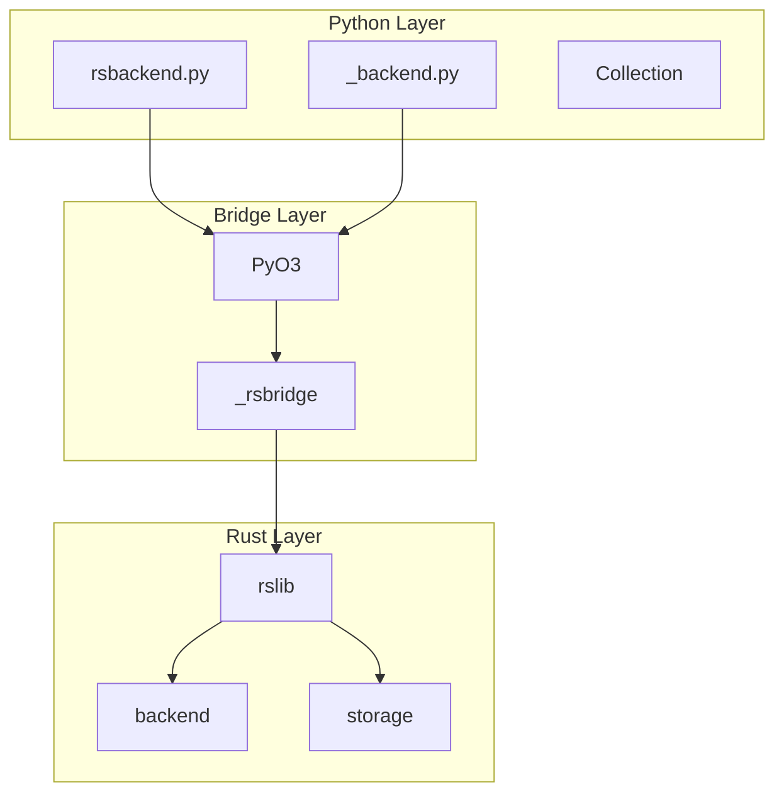
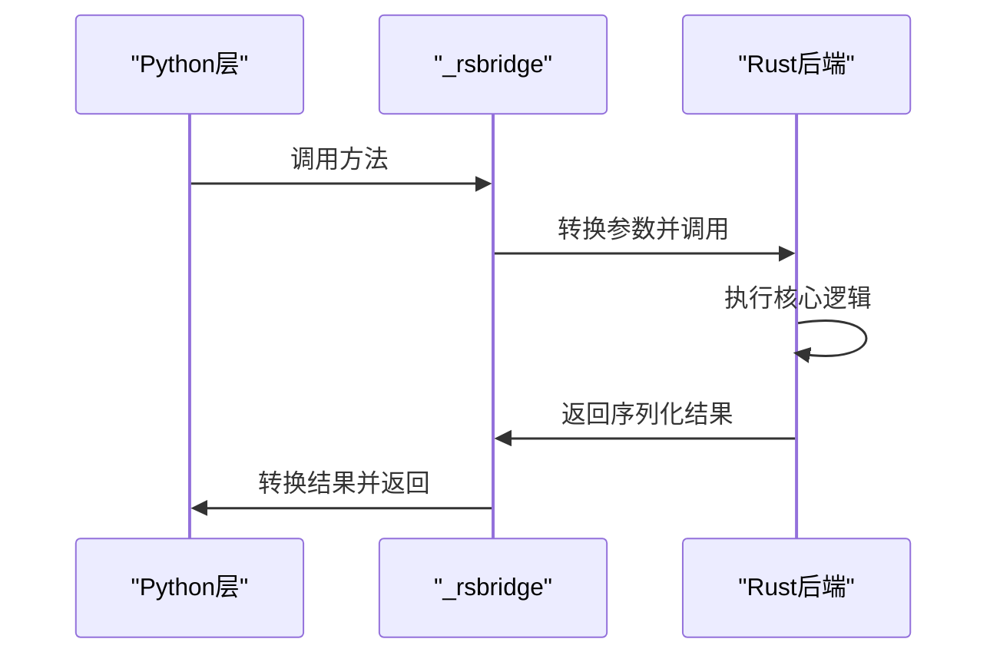
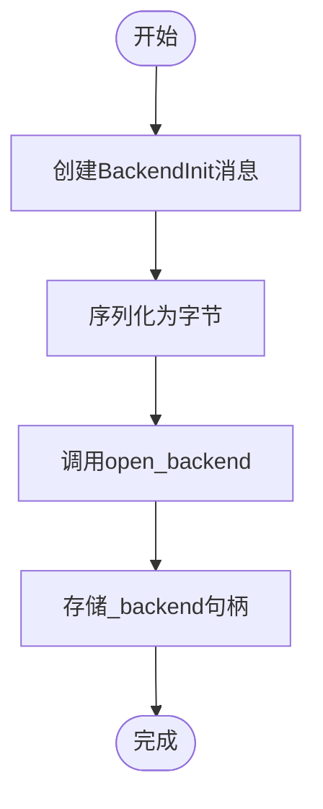
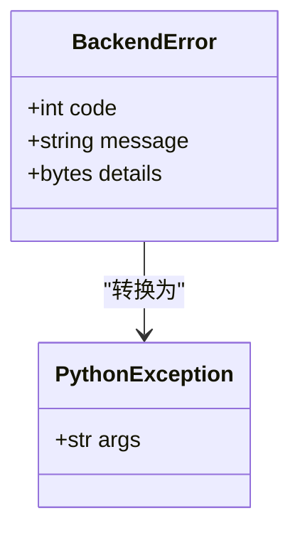
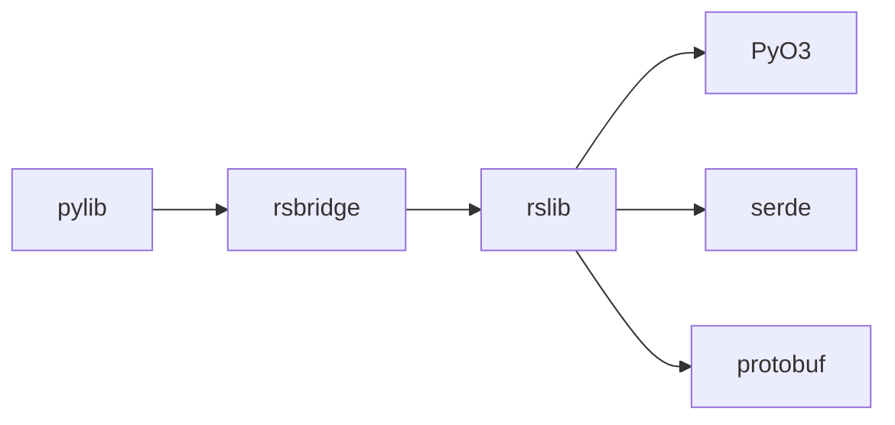

# Python-Rust桥接机制

<cite>
**本文档引用文件**  
- [lib.rs](file://rslib/src/lib.rs)
- [Cargo.toml](file://rslib/Cargo.toml)
- [Cargo.toml](file://pylib/rsbridge/Cargo.toml)
- [build.rs](file://pylib/rsbridge/build.rs)
- [_backend.py](file://pylib/anki/_backend.py)
- [rsbackend.py](file://pylib/anki/rsbackend.py)
</cite>

## 目录
1. [引言](#引言)
2. [项目结构](#项目结构)
3. [核心组件](#核心组件)
4. [架构概述](#架构概述)
5. [详细组件分析](#详细组件分析)
6. [依赖分析](#依赖分析)
7. [性能考虑](#性能考虑)
8. [故障排除指南](#故障排除指南)
9. [结论](#结论)

## 引言
本文档深入探讨Anki中Python与Rust之间的互操作机制，重点介绍通过PyO3实现的桥接架构。文档涵盖数据类型转换规则、内存管理策略、跨语言错误处理机制以及_rslib对象的初始化和生命周期管理。同时分析Python如何调用Rust核心函数并处理返回结果，特别是Protocol Buffers序列化数据的传递方式。

## 项目结构
Anki的代码库采用多语言混合架构，Python作为主要前端接口语言，Rust实现核心逻辑。rslib目录包含Rust实现的核心功能模块，pylib目录包含Python绑定和高层逻辑。

**图示来源**
- [rsbackend.py](file://pylib/anki/rsbackend.py)
- [_backend.py](file://pylib/anki/_backend.py)
- [lib.rs](file://rslib/src/lib.rs)

**本节来源**
- [rslib](file://rslib)
- [pylib](file://pylib)

## 核心组件
Rust后端通过PyO3暴露API给Python层，主要组件包括_rslib库、PyO3桥接模块和Python绑定层。_backend.py中的RustBackend类封装了与Rust后端的交互，提供类型安全的接口。

**本节来源**
- [_backend.py](file://pylib/anki/_backend.py#L55-L170)
- [rsbackend.py](file://pylib/anki/rsbackend.py)

## 架构概述
Anki的Python-Rust互操作架构采用分层设计，Python层通过_rsbridge模块调用Rust实现的核心功能。Protocol Buffers用于序列化跨语言数据交换，确保类型安全和向后兼容性。

**图示来源**
- [_backend.py](file://pylib/anki/_backend.py#L73-L88)
- [lib.rs](file://rslib/src/lib.rs)

## 详细组件分析

### 后端初始化分析
Rust后端的初始化过程通过_backend.py中的__init__方法实现，该方法创建BackendInit消息并序列化为字节数组传递给_rsbridge.open_backend函数。

**图示来源**
- [_backend.py](file://pylib/anki/_backend.py#L73-L88)

**本节来源**
- [_backend.py](file://pylib/anki/_backend.py#L55-L170)

### 错误处理机制
跨语言错误处理通过BackendError protobuf消息实现，Rust端的错误被序列化后传递给Python端，再转换为相应的Python异常。

**图示来源**
- [_backend.py](file://pylib/anki/_backend.py#L55-L170)

**本节来源**
- [_backend.py](file://pylib/anki/_backend.py#L55-L170)

## 依赖分析
Python-Rust桥接依赖PyO3、serde和protobuf等关键crate，这些依赖在Cargo.toml文件中定义。

**图示来源**
- [Cargo.toml](file://rslib/Cargo.toml)
- [Cargo.toml](file://pylib/rsbridge/Cargo.toml)

**本节来源**
- [Cargo.toml](file://rslib/Cargo.toml)
- [Cargo.toml](file://pylib/rsbridge/Cargo.toml)

## 性能考虑
桥接架构通过减少跨语言调用次数、批量操作支持和避免主线程阻塞来优化性能。_run_command方法包含性能监控，当调用耗时超过200ms时会输出警告。

**本节来源**
- [_backend.py](file://pylib/anki/_backend.py#L55-L170)

## 故障排除指南
常见问题包括桥接初始化失败、跨语言类型转换错误和内存管理问题。调试时应检查protobuf消息定义是否匹配，确保Rust和Python端的数据结构一致。

**本节来源**
- [_backend.py](file://pylib/anki/_backend.py#L55-L170)
- [build.rs](file://pylib/rsbridge/build.rs)

## 结论
Anki的Python-Rust桥接机制通过PyO3和Protocol Buffers实现了高效、安全的跨语言互操作。该架构在保持Python易用性的同时，充分利用了Rust的性能和内存安全优势，为应用的核心功能提供了坚实的基础。