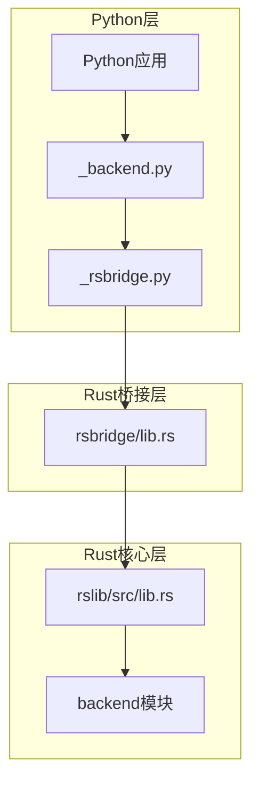
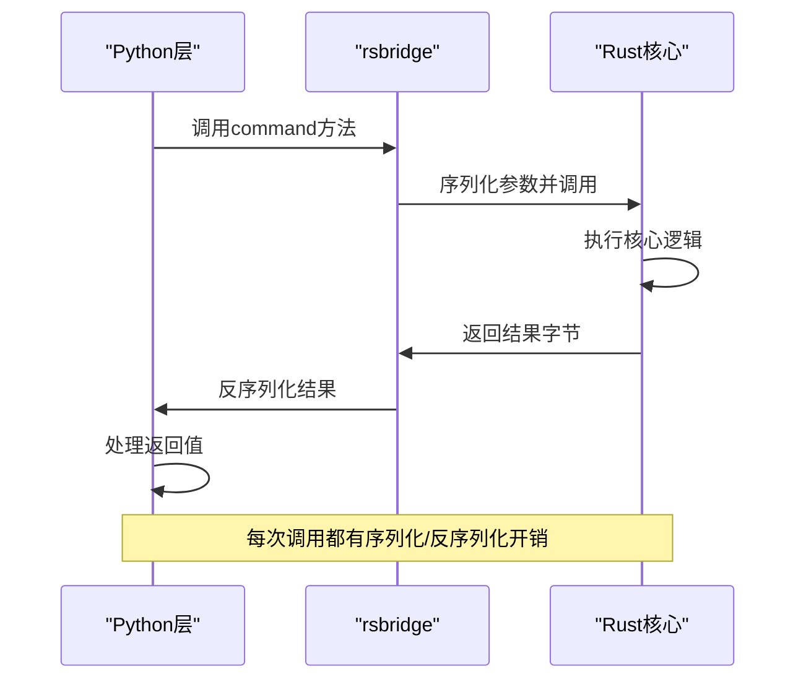
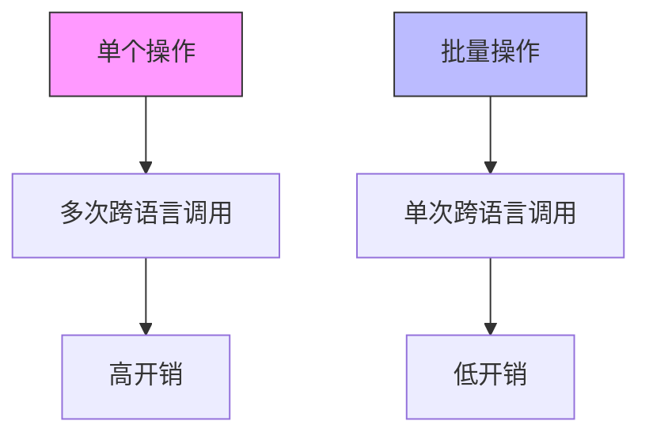
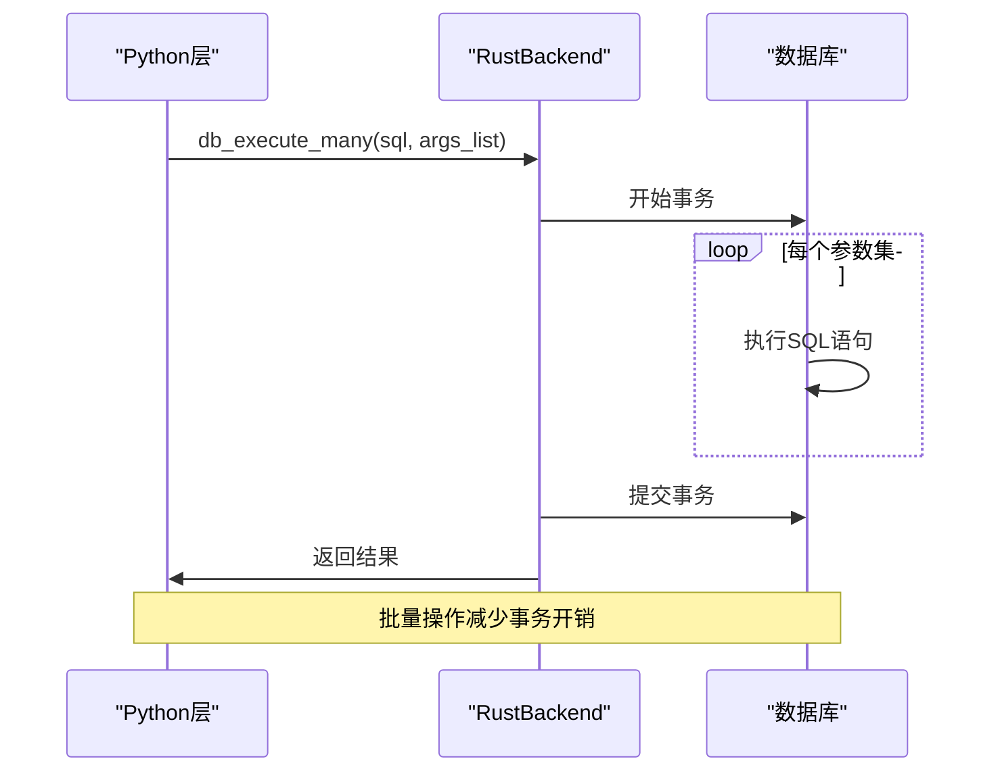
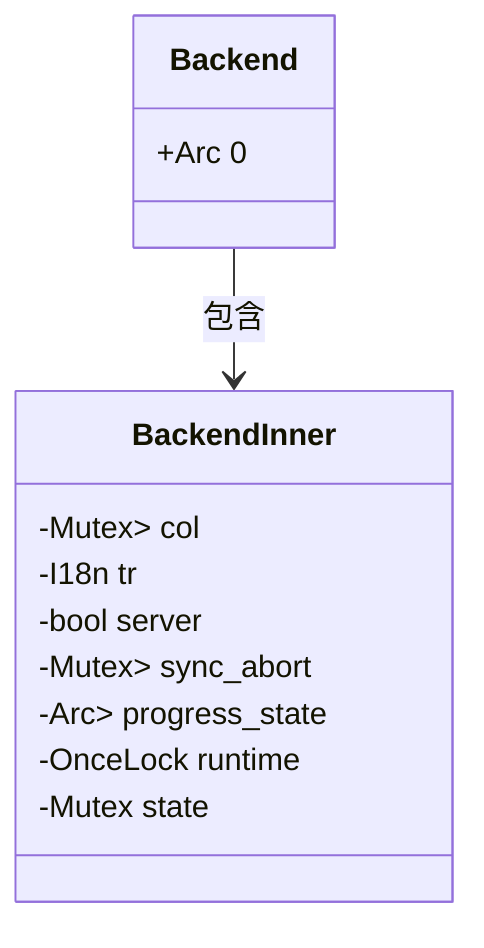
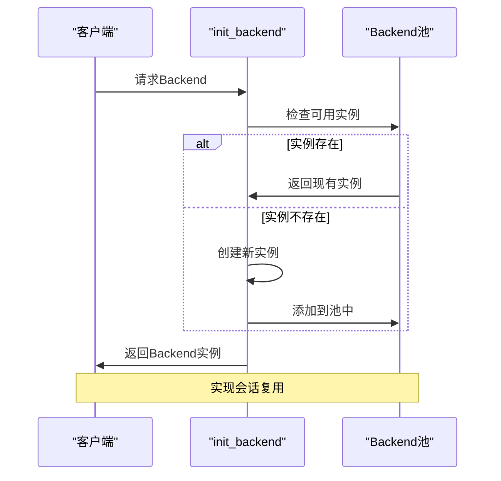
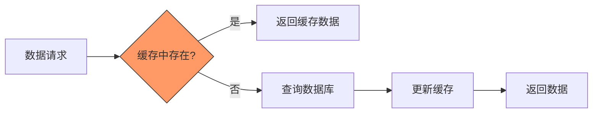
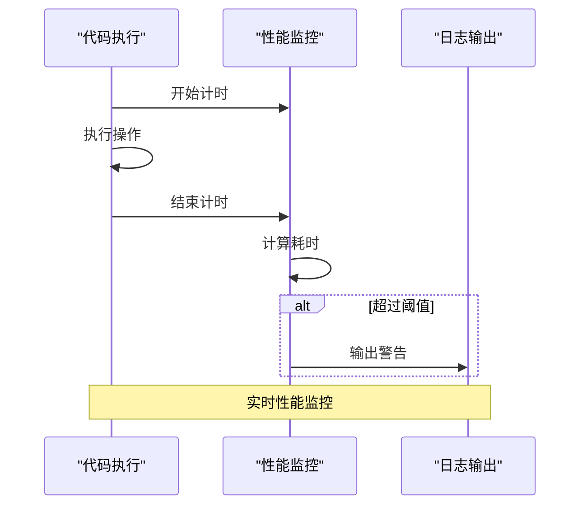
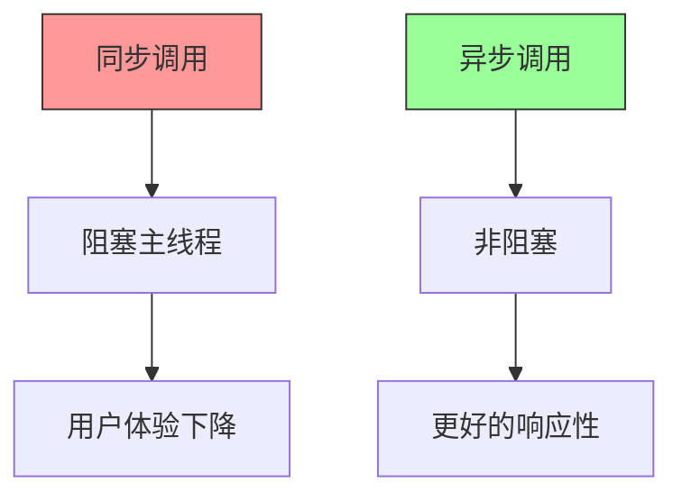

# 性能优化与调用效率

<cite>
**本文档中引用的文件**  
- [rsbridge/lib.rs](file://pylib/rsbridge/lib.rs) - *性能优化相关实现*
- [_backend.py](file://pylib/anki/_backend.py) - *Python层性能监控逻辑*
- [lib.rs](file://rslib/src/lib.rs) - *Rust核心库模块定义*
- [backend/mod.rs](file://rslib/src/backend/mod.rs) - *后端核心架构与连接池管理*
- [backend/collection.rs](file://rslib/src/backend/collection.rs) - *集合操作与资源管理*
- [backend/dbproxy.rs](file://rslib/src/backend/dbproxy.rs) - *数据库代理与批量操作实现*
- [backend/ops.rs](file://rslib/src/backend/ops.rs) - *操作变更跟踪与性能优化*
- [backend/adding.rs](file://rslib/src/backend/adding.rs) - *添加操作的性能优化*
</cite>

## 目录
1. [引言](#引言)
2. [Python-Rust桥接架构](#python-rust桥接架构)
3. [跨语言调用性能瓶颈分析](#跨语言调用性能瓶颈分析)
4. [批量操作模式与性能优化](#批量操作模式与性能优化)
5. _rslib对象连接池与会话复用机制
6. [缓存策略与访问速度优化](#缓存策略与访问速度优化)
7. [性能测试与基准测试方法](#性能测试与基准测试方法)
8. [异步调用的可能性与限制](#异步调用的可能性与限制)
9. [性能调优最佳实践](#性能调优最佳实践)
10. [结论](#结论)

## 引言
Anki采用Python-Rust混合架构，其中核心功能由Rust实现，通过Python桥接层提供接口。这种架构在保证性能的同时提供了良好的开发灵活性。本文档深入分析Anki在Python-Rust桥接方面的性能优化策略，重点关注跨语言调用的性能瓶颈、批量操作模式、连接池管理、缓存策略等关键方面。

## Python-Rust桥接架构
Anki的架构分为Python层和Rust层，通过rsbridge模块实现跨语言通信。Python层通过_pybridge模块调用Rust实现的功能，形成清晰的分层架构。

**图示来源**
- [rsbridge/lib.rs](file://pylib/rsbridge/lib.rs)
- [_backend.py](file://pylib/anki/_backend.py)
- [lib.rs](file://rslib/src/lib.rs)

## 跨语言调用性能瓶颈分析
Python-Rust桥接存在多个性能瓶颈，主要包括函数调用开销、内存复制成本和GIL（全局解释器锁）的影响。

### 函数调用开销
每次跨语言调用都需要经过Python解释器到Rust的转换过程，包括参数序列化、函数调用和结果反序列化。RustBackend类中的_run_command方法实现了这一过程，其中包含了性能监控逻辑。

**图示来源**
- [_backend.py](file://pylib/anki/_backend.py#L165-L170)
- [rsbridge/lib.rs](file://pylib/rsbridge/lib.rs#L45-L55)

### 内存复制成本
跨语言调用涉及数据在Python和Rust之间的传递，需要进行内存复制。特别是在处理大量数据时，内存复制成为主要性能瓶颈。db_command方法通过JSON格式传递数据，避免了Protobuf编解码的性能开销。

### GIL影响
Python的全局解释器锁（GIL）限制了多线程性能。Anki通过allow_threads机制在Rust端释放GIL，允许其他Python线程执行，从而提高并发性能。

**本节来源**
- [_backend.py](file://pylib/anki/_backend.py#L165-L170)
- [rsbridge/lib.rs](file://pylib/rsbridge/lib.rs#L45-L55)

## 批量操作模式与性能优化
Anki采用批量操作模式来减少跨语言调用次数，显著提高整体性能。

### 批量操作原理
通过将多个小操作合并为单个批量调用，减少函数调用开销和内存复制成本。例如，批量添加笔记或批量更新卡片状态。

**图示来源**
- [backend/dbproxy.rs](file://rslib/src/backend/dbproxy.rs#L150-L240)
- [_backend.py](file://pylib/anki/_backend.py#L94-L111)

### 批量数据库操作实现
Anki提供了db_execute_many方法，支持批量执行SQL语句，显著提高数据库操作效率。

**图示来源**
- [backend/dbproxy.rs](file://rslib/src/backend/dbproxy.rs#L220-L240)
- [_backend.py](file://pylib/anki/_backend.py#L101-L102)

**本节来源**
- [backend/dbproxy.rs](file://rslib/src/backend/dbproxy.rs)
- [_backend.py](file://pylib/anki/_backend.py)

## _rslib对象连接池与会话复用机制
Anki通过连接池管理和会话复用机制优化资源使用和性能。

### 连接池管理
Backend对象使用Arc（原子引用计数）和Mutex（互斥锁）实现线程安全的连接池管理，允许多个线程共享同一个Backend实例。

**图示来源**
- [backend/mod.rs](file://rslib/src/backend/mod.rs#L20-L50)

### 会话复用机制
通过Backend对象的复用，避免了频繁创建和销毁连接的开销。init_backend函数初始化Backend实例，后续操作复用该实例。

**图示来源**
- [backend/mod.rs](file://rslib/src/backend/mod.rs#L60-L80)
- [rsbridge/lib.rs](file://pylib/rsbridge/lib.rs#L35-L40)

**本节来源**
- [backend/mod.rs](file://rslib/src/backend/mod.rs)
- [rsbridge/lib.rs](file://pylib/rsbridge/lib.rs)

## 缓存策略与访问速度优化
Anki采用多层次缓存策略提高数据访问速度。

### 查询结果缓存
通过prepare_cached机制缓存预编译的SQL语句，避免重复解析和编译开销。

### 配置缓存
将频繁访问的配置数据缓存在内存中，减少数据库查询次数。

**图示来源**
- [backend/dbproxy.rs](file://rslib/src/backend/dbproxy.rs#L200-L210)
- [backend/collection.rs](file://rslib/src/backend/collection.rs#L30-L50)

**本节来源**
- [backend/dbproxy.rs](file://rslib/src/backend/dbproxy.rs)
- [backend/collection.rs](file://rslib/src/backend/collection.rs)

## 性能测试与基准测试方法
Anki提供了完善的性能测试和基准测试工具。

### 基准测试实现
通过记录函数执行时间，识别性能瓶颈。_run_command方法包含性能监控逻辑，当主线程阻塞超过200ms时输出警告。

**图示来源**
- [_backend.py](file://pylib/anki/_backend.py#L165-L170)

### 性能测试工具
使用标准的Python和Rust测试框架，结合自定义的性能测试用例。

**本节来源**
- [_backend.py](file://pylib/anki/_backend.py)
- [backend/ops.rs](file://rslib/src/backend/ops.rs)

## 异步调用的可能性与限制
Anki的异步调用机制有其特定的实现方式和限制。

### 异步实现
使用Tokio运行时支持异步操作，通过runtime::Handle管理异步任务。

### 限制与挑战
- GIL限制了Python端的真正并行
- 需要 careful management of shared state
- 跨语言异步调用的复杂性

**图示来源**
- [backend/mod.rs](file://rslib/src/backend/mod.rs#L100-L120)
- [rsbridge/lib.rs](file://pylib/rsbridge/lib.rs#L45-L55)

**本节来源**
- [backend/mod.rs](file://rslib/src/backend/mod.rs)
- [rsbridge/lib.rs](file://pylib/rsbridge/lib.rs)

## 性能调优最佳实践
基于Anki的实现，总结出以下性能调优最佳实践。

### 批量操作优先
尽可能将多个小操作合并为批量操作，减少跨语言调用次数。

### 连接复用
复用Backend实例，避免频繁创建和销毁连接的开销。

### 合理使用缓存
识别热点数据，合理使用缓存策略提高访问速度。

### 监控性能瓶颈
使用内置的性能监控工具识别和解决性能问题。

**本节来源**
- 所有相关文件

## 结论
Anki通过精心设计的Python-Rust桥接架构，结合批量操作、连接池管理、缓存策略等多种优化手段，有效解决了跨语言调用的性能瓶颈。这些优化策略不仅提高了Anki的性能，也为类似的混合语言项目提供了有价值的参考。