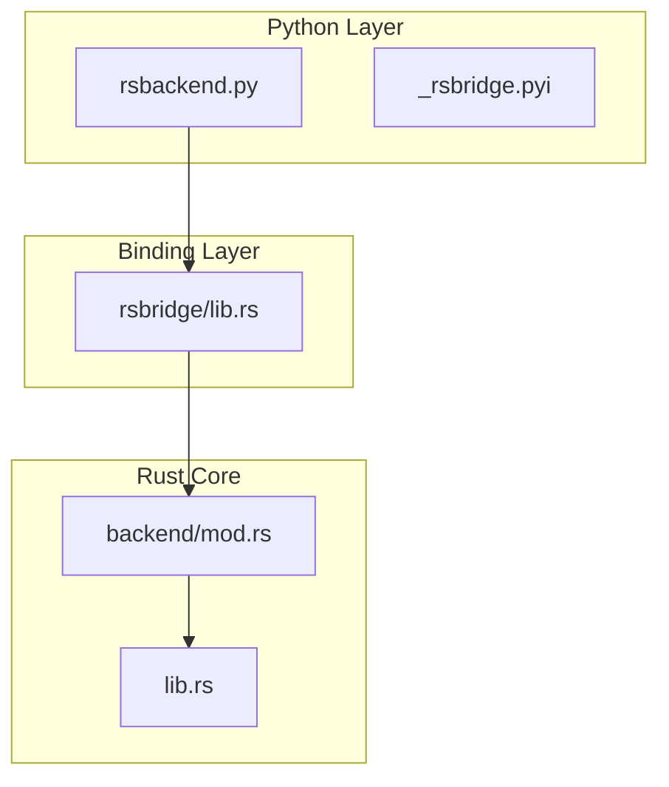
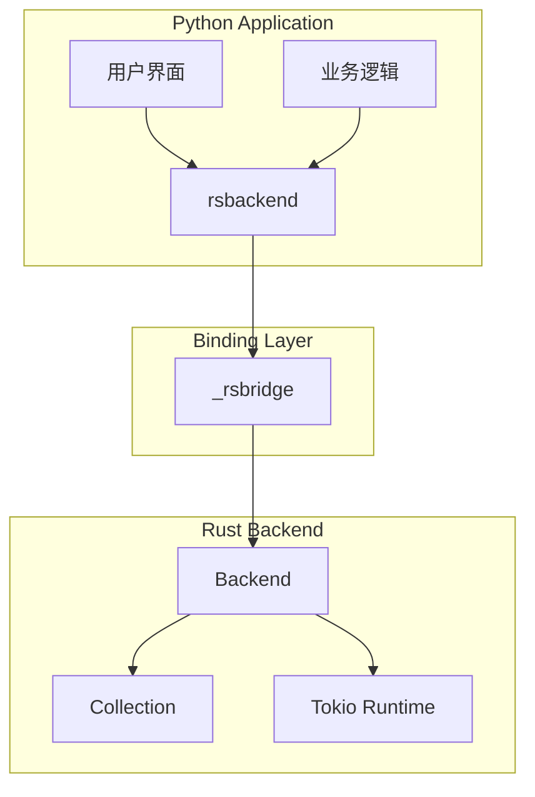
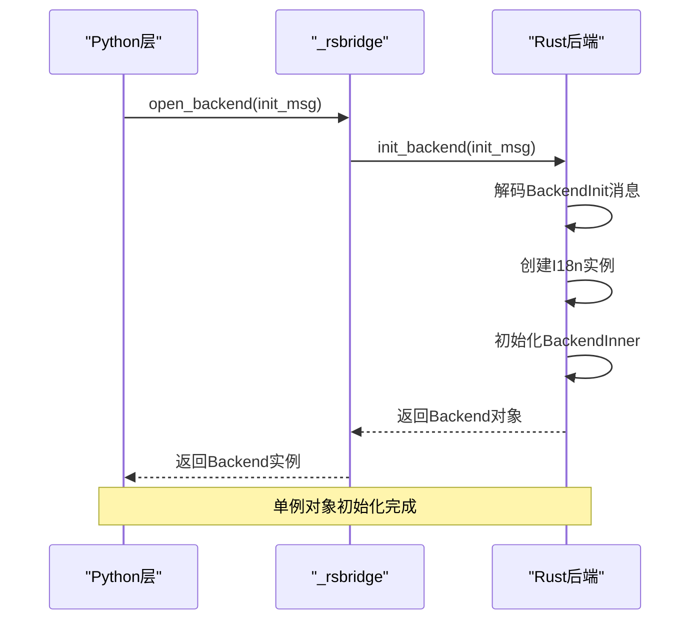
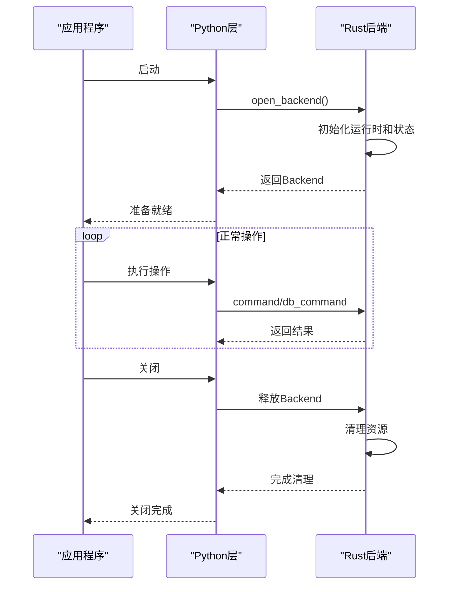
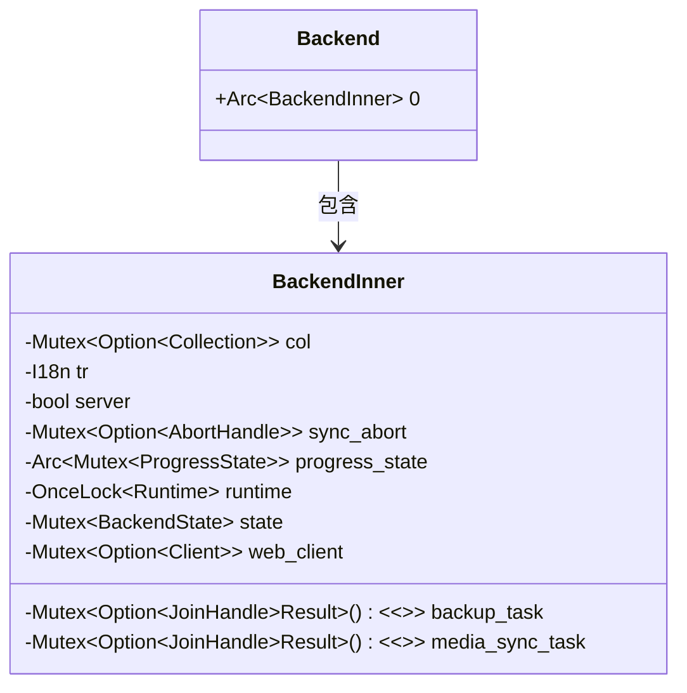
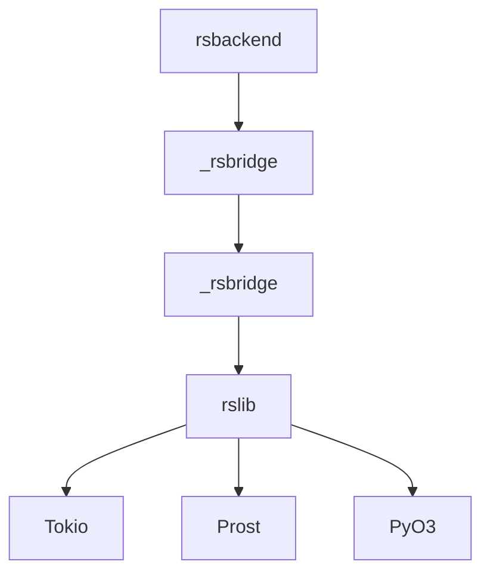

# 接口调用与生命周期管理

<cite>
**本文档引用文件**  
- [lib.rs](file://rslib/src/lib.rs)
- [backend/mod.rs](file://rslib/src/backend/mod.rs)
- [rsbridge/lib.rs](file://pylib/rsbridge/lib.rs)
- [rsbackend.py](file://pylib/anki/rsbackend.py)
- [collection.py](file://pylib/anki/collection.py)
</cite>

## 目录
1. [引言](#引言)
2. [项目结构](#项目结构)
3. 核心组件
4. 架构概述
5. 详细组件分析
6. 依赖分析
7. 性能考虑
8. 故障排除指南
9. 结论
10. 附录（如有必要）

## 引言
本文档详细阐述了Anki项目中Python与Rust之间的接口调用机制和对象生命周期管理策略。重点分析了_rslib单例对象的初始化过程、跨语言调用的线程安全机制以及资源管理最佳实践。

## 项目结构
Anki项目采用多语言混合架构，核心逻辑使用Rust实现，前端界面和胶水代码使用Python。Rust代码位于rslib目录，Python绑定代码位于pylib/rsbridge目录，Python高层封装位于pylib/anki目录。



**图示来源**  
- [rsbackend.py](file://pylib/anki/rsbackend.py)
- [rsbridge/lib.rs](file://pylib/rsbridge/lib.rs)
- [backend/mod.rs](file://rslib/src/backend/mod.rs)
- [lib.rs](file://rslib/src/lib.rs)

**本节来源**  
- [rsbackend.py](file://pylib/anki/rsbackend.py)
- [rsbridge/lib.rs](file://pylib/rsbridge/lib.rs)

## 核心组件
系统的核心是Rust后端通过PyO3绑定暴露给Python层的接口。_rsbridge模块提供了open_backend函数用于初始化后端实例，Backend类封装了command和db_command方法用于跨语言调用。

**本节来源**  
- [rsbridge/lib.rs](file://pylib/rsbridge/lib.rs#L0-L92)
- [backend/mod.rs](file://rslib/src/backend/mod.rs#L62-L109)

## 架构概述
系统采用分层架构，Python层通过protobuf消息与Rust层通信。Rust后端使用Arc和Mutex实现线程安全的状态管理，Tokio运行时处理异步操作。



**图示来源**  
- [rsbridge/lib.rs](file://pylib/rsbridge/lib.rs#L46-L91)
- [backend/mod.rs](file://rslib/src/backend/mod.rs#L62-L109)

## 详细组件分析

### _rslib单例对象初始化
_rslib单例对象的初始化过程包括Rust运行时启动、内存分配和全局状态设置。init_backend函数接收初始化消息，解析首选语言列表，创建I18n实例，并返回Backend对象。



**图示来源**  
- [rsbridge/lib.rs](file://pylib/rsbridge/lib.rs#L82-L90)
- [backend/mod.rs](file://rslib/src/backend/mod.rs#L62-L78)

**本节来源**  
- [rsbridge/lib.rs](file://pylib/rsbridge/lib.rs#L82-L90)
- [backend/mod.rs](file://rslib/src/backend/mod.rs#L62-L78)

### Python层封装机制
Python层通过rsbackend模块封装Rust核心功能，提供更友好的高级API。虽然rsbackend.py文件主要为了兼容旧插件而存在，但实际功能由更底层的模块提供。

**本节来源**  
- [rsbackend.py](file://pylib/anki/rsbackend.py#L1-L13)

### 跨语言调用线程安全
跨语言调用的线程安全机制通过PyO3的allow_threads实现。在Rust代码执行期间释放Python GIL，允许其他Python线程运行，避免阻塞Qt事件循环。

```mermaid
flowchart TD
Start([开始调用]) --> ReleaseGIL["释放Python GIL"]
ReleaseGIL --> ExecuteRust["执行Rust代码"]
ExecuteRust --> ReacquireGIL["重新获取Python GIL"]
ReacquireGIL --> ReturnResult["返回结果"]
ReturnResult --> End([调用结束])
Note: allow_threads确保Qt事件循环不被阻塞
```

**图示来源**  
- [rsbridge/lib.rs](file://pylib/rsbridge/lib.rs#L48-L54)
- [rsbridge/lib.rs](file://pylib/rsbridge/lib.rs#L68-L75)

**本节来源**  
- [rsbridge/lib.rs](file://pylib/rsbridge/lib.rs#L46-L77)

### 生命周期管理
完整的生命周期管理包括应用启动时的后端初始化和应用关闭时的资源清理。Rust对象的引用计数由Arc智能指针自动管理，避免内存泄漏。



**图示来源**  
- [rsbridge/lib.rs](file://pylib/rsbridge/lib.rs#L82-L90)
- [backend/mod.rs](file://rslib/src/backend/mod.rs#L85-L95)

**本节来源**  
- [rsbridge/lib.rs](file://pylib/rsbridge/lib.rs#L82-L90)
- [backend/mod.rs](file://rslib/src/backend/mod.rs#L85-L95)

### 引用计数管理
Rust对象的引用计数通过Arc<T>智能指针自动管理。Backend结构体内部使用Arc包裹BackendInner，确保多线程环境下的安全共享和自动内存回收。



**图示来源**  
- [backend/mod.rs](file://rslib/src/backend/mod.rs#L38-L60)

**本节来源**  
- [backend/mod.rs](file://rslib/src/backend/mod.rs#L38-L60)

## 依赖分析
系统依赖关系清晰分层，Python层依赖绑定层，绑定层依赖Rust核心库。这种分层设计降低了耦合度，提高了可维护性。



**图示来源**  
- [Cargo.toml](file://rslib/Cargo.toml)
- [Cargo.toml](file://pylib/rsbridge/Cargo.toml)

**本节来源**  
- [rsbridge/lib.rs](file://pylib/rsbridge/lib.rs)
- [backend/mod.rs](file://rslib/src/backend/mod.rs)

## 性能考虑
系统性能优化主要体现在三个方面：使用二进制protobuf格式减少序列化开销，通过allow_threads避免阻塞Python GIL，以及使用ThrottlingProgressHandler控制进度更新频率。

## 故障排除指南
常见问题包括后端初始化失败、跨语言调用阻塞和资源泄漏。应确保正确调用initialize_logging，避免在Qt事件循环中执行长时间同步操作，并确保Backend对象被正确释放。

**本节来源**  
- [rsbridge/lib.rs](file://pylib/rsbridge/lib.rs#L38-L42)
- [collection.py](file://pylib/anki/collection.py#L136-L139)

## 结论
Anki的Python-Rust接口设计合理，通过清晰的分层和适当的抽象提供了高效的跨语言调用能力。生命周期管理机制健全，线程安全措施到位，为开发者提供了稳定可靠的开发接口。