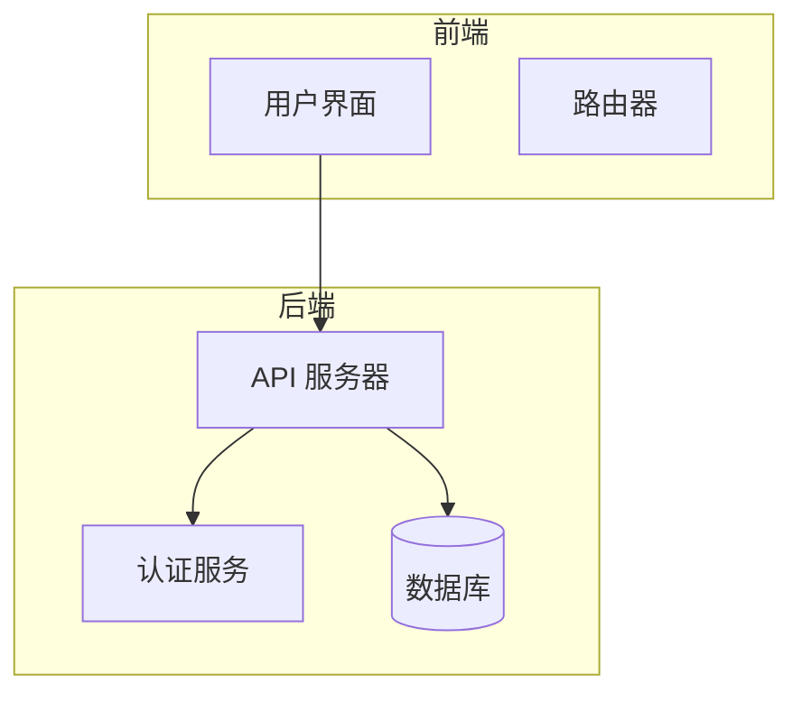
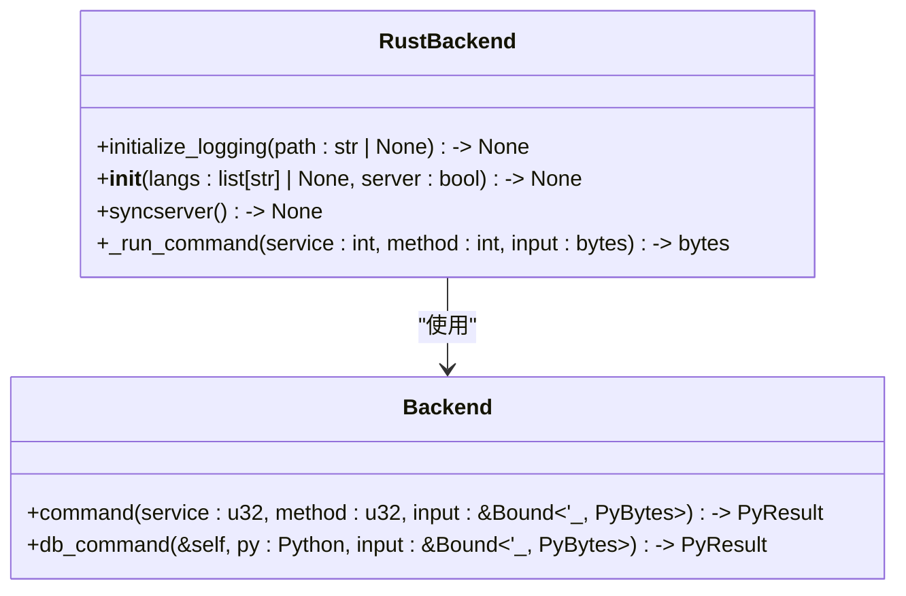
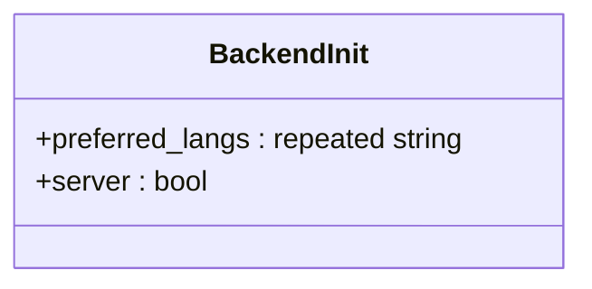
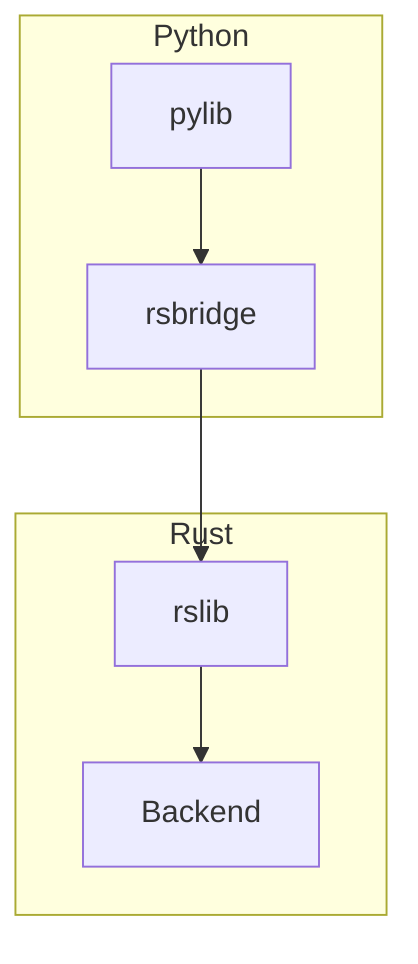

# 数据类型转换与序列化

<cite>
**本文档引用的文件**
- [backend.proto](file://proto/anki/backend.proto)
- [generic.proto](file://proto/anki/generic.proto)
- [lib.rs](file://rslib/src/lib.rs)
- [mod.rs](file://rslib/src/backend/mod.rs)
- [_backend.py](file://pylib/anki/_backend.py)
- [lib.rs](file://pylib/rsbridge/lib.rs)
</cite>

## 目录
1. [简介](#简介)
2. [项目结构](#项目结构)
3. [核心组件](#核心组件)
4. [架构概述](#架构概述)
5. [详细组件分析](#详细组件分析)
6. [依赖分析](#依赖分析)
7. [性能考虑](#性能考虑)
8. [故障排除指南](#故障排除指南)
9. [结论](#结论)

## 简介
Anki 是一个跨语言应用程序，其后端逻辑主要用 Rust 实现，而前端和用户界面使用 Python 和 TypeScript。这种架构设计使得 Python 与 Rust 之间的数据类型转换机制成为系统的核心部分。本文档详细解释了 Protocol Buffers 在跨语言数据交换中的作用，包括消息定义、序列化/反序列化流程和二进制格式优化。此外，文档还深入探讨了基本类型（整数、字符串、布尔值）和复杂类型（枚举、重复字段、嵌套消息）的转换规则，以及如何将 Rust 的 Result 类型转换为 Python 的异常处理机制。

**Section sources**
- [architecture.md](file://docs/architecture.md#L4-L32)

## 项目结构
Anki 的项目结构清晰地分为多个模块，每个模块负责不同的功能。主要的目录包括 `proto`、`rslib`、`pylib` 和 `qt`。`proto` 目录包含所有 Protocol Buffers 消息定义，这些定义用于跨语言通信。`rslib` 目录包含用 Rust 编写的后端逻辑，而 `pylib` 目录包含用 Python 编写的库代码，这些代码通过 `rsbridge` 模块与 Rust 代码交互。`qt` 目录包含用 Python 和 TypeScript 编写的用户界面代码。



**Diagram sources**
- [architecture.md](file://docs/architecture.md#L12-L24)

**Section sources**
- [architecture.md](file://docs/architecture.md#L4-L32)

## 核心组件
Anki 的核心组件包括 `RustBackend`、`Backend` 和 `BackendInit`。`RustBackend` 是 Python 中的类，它提供了与 Rust 后端交互的接口。`Backend` 是 Rust 中的结构体，它管理着整个后端逻辑。`BackendInit` 是 Protocol Buffers 消息，用于初始化后端。

**Section sources**
- [_backend.py](file://pylib/anki/_backend.py#L55-L170)
- [lib.rs](file://rslib/src/lib.rs#L0-L58)
- [mod.rs](file://rslib/src/backend/mod.rs#L0-L195)

## 架构概述
Anki 的架构可以分为三个主要部分：前端、后端和数据库。前端使用 Python 和 TypeScript 编写，负责用户界面和用户交互。后端使用 Rust 编写，负责处理业务逻辑和数据操作。数据库存储所有的卡片、笔记和其他数据。前端通过 `rsbridge` 模块与后端进行通信，后端通过 Protocol Buffers 消息与前端交换数据。


**Diagram sources**
- [architecture.md](file://docs/architecture.md#L12-L24)

## 详细组件分析
### RustBackend 分析
`RustBackend` 是 Python 中的类，它提供了与 Rust 后端交互的接口。该类的主要方法包括 `__init__`、`initialize_logging`、`syncserver` 和 `_run_command`。`__init__` 方法用于初始化后端，`initialize_logging` 方法用于启用日志记录，`syncserver` 方法用于启动同步服务器，`_run_command` 方法用于执行后端命令。

#### 对象导向组件


**Diagram sources**
- [_backend.py](file://pylib/anki/_backend.py#L55-L170)
- [lib.rs](file://pylib/rsbridge/lib.rs#L0-L92)

**Section sources**
- [_backend.py](file://pylib/anki/_backend.py#L55-L170)
- [lib.rs](file://pylib/rsbridge/lib.rs#L0-L92)

### Backend 分析
`Backend` 是 Rust 中的结构体，它管理着整个后端逻辑。该结构体的主要方法包括 `init_backend`、`new`、`run_db_command_bytes` 和 `with_col`。`init_backend` 方法用于初始化后端，`new` 方法用于创建新的 `Backend` 实例，`run_db_command_bytes` 方法用于执行数据库命令，`with_col` 方法用于在持有锁的情况下运行提供的闭包。

#### 对象导向组件
```mermaid
classDiagram
class Backend {
+init_backend(init_msg : &[u8]) -> result : : Result<Backend, String>
+new(tr : I18n, server : bool) -> Backend
+run_db_command_bytes(&self, input : &[u8]) -> result : : Result<Vec<u8>, Vec<u8>>
+with_col<F, T>(&self, func : F) -> Result<T>
}
class BackendInner {
+col : Mutex<Option<Collection>>
+tr : I18n
+server : bool
+sync_abort : Mutex<Option<AbortHandle>>
+progress_state : Arc<Mutex<ProgressState>>
+runtime : OnceLock<Runtime>
+state : Mutex<BackendState>
+backup_task : Mutex<Option<JoinHandle<Result<()>>>>
+media_sync_task : Mutex<Option<JoinHandle<Result<()>>>>
+web_client : Mutex<Option<Client>>
}
Backend --> BackendInner : "包含"
```

**Diagram sources**
- [mod.rs](file://rslib/src/backend/mod.rs#L0-L195)

**Section sources**
- [mod.rs](file://rslib/src/backend/mod.rs#L0-L195)

### BackendInit 分析
`BackendInit` 是 Protocol Buffers 消息，用于初始化后端。该消息包含两个字段：`preferred_langs` 和 `server`。`preferred_langs` 字段是一个字符串列表，表示用户首选的语言。`server` 字段是一个布尔值，表示是否在服务器模式下运行。

#### 对象导向组件


**Diagram sources**
- [backend.proto](file://proto/anki/backend.proto#L0-L62)

**Section sources**
- [backend.proto](file://proto/anki/backend.proto#L0-L62)

## 依赖分析
Anki 的依赖关系主要体现在 `pylib` 和 `rslib` 之间的交互。`pylib` 通过 `rsbridge` 模块与 `rslib` 进行通信。`rsbridge` 模块使用 PyO3 库将 Rust 代码封装成 Python 可调用的模块。`rslib` 中的 `Backend` 结构体通过 Protocol Buffers 消息与 `pylib` 交换数据。



**Diagram sources**
- [lib.rs](file://pylib/rsbridge/lib.rs#L0-L92)
- [mod.rs](file://rslib/src/backend/mod.rs#L0-L195)

**Section sources**
- [lib.rs](file://pylib/rsbridge/lib.rs#L0-L92)
- [mod.rs](file://rslib/src/backend/mod.rs#L0-L195)

## 性能考虑
Anki 的性能优化主要体现在以下几个方面：
1. **零拷贝优化**：通过使用 `PyBytes` 和 `Vec<u8>`，避免了不必要的内存分配和复制。
2. **多线程支持**：使用 `tokio` 运行时和 `runtime::Handle`，支持异步操作和多线程处理。
3. **缓存机制**：通过 `OnceLock` 和 `Mutex`，实现了高效的缓存和同步机制。

## 故障排除指南
### 日志记录
Anki 提供了详细的日志记录功能，可以通过 `RustBackend.initialize_logging` 方法启用。日志记录可以帮助开发者调试数据转换问题和性能瓶颈。

**Section sources**
- [_backend.py](file://pylib/anki/_backend.py#L55-L170)

### 序列化验证
为了确保数据的正确性，Anki 使用 Protocol Buffers 进行序列化和反序列化。开发者可以通过检查 `BackendError` 消息来验证序列化过程是否成功。

**Section sources**
- [backend.proto](file://proto/anki/backend.proto#L0-L62)

## 结论
Anki 的数据类型转换与序列化机制是其跨语言架构的核心部分。通过使用 Protocol Buffers 和 `rsbridge` 模块，Anki 实现了高效、可靠的跨语言通信。本文档详细解释了这一机制的各个方面，包括消息定义、序列化/反序列化流程、类型转换规则和性能优化。希望这些信息能帮助开发者更好地理解和使用 Anki 的后端逻辑。