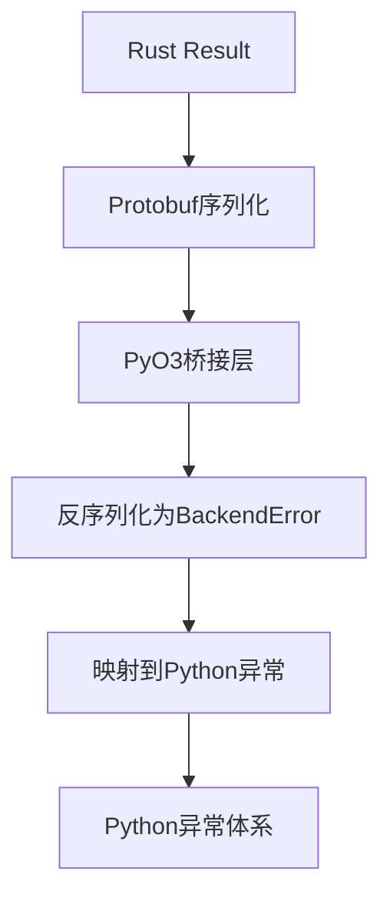
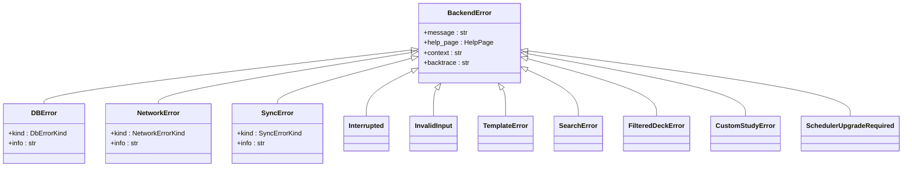
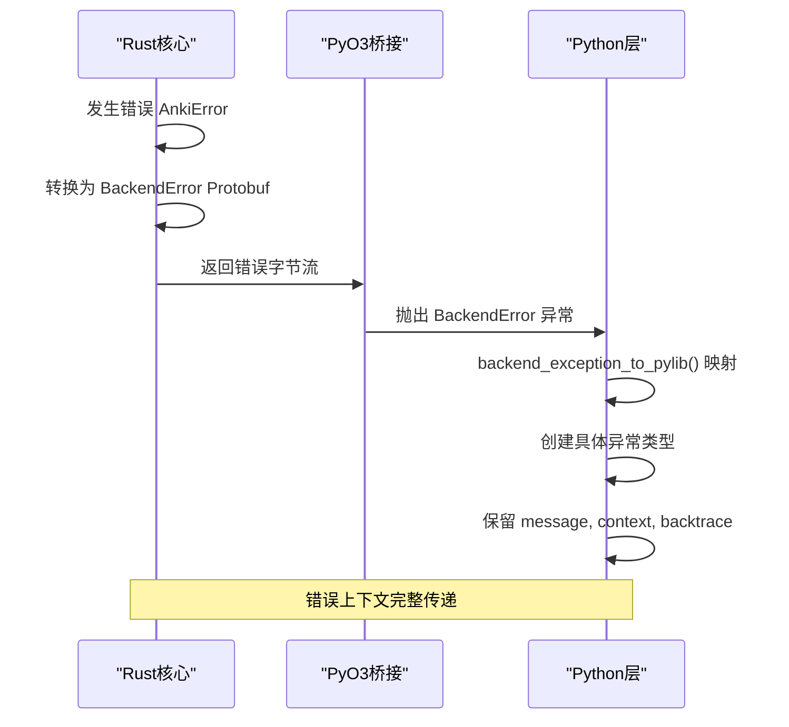
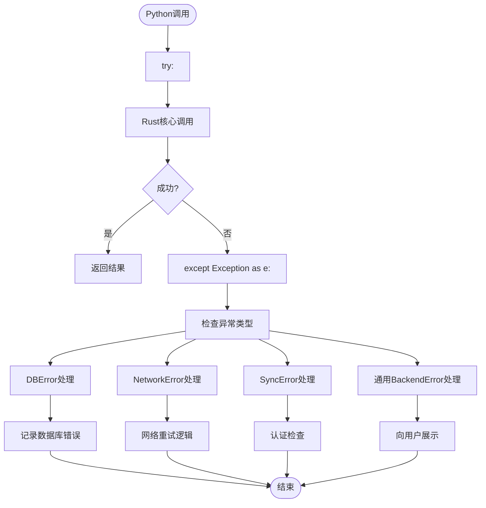
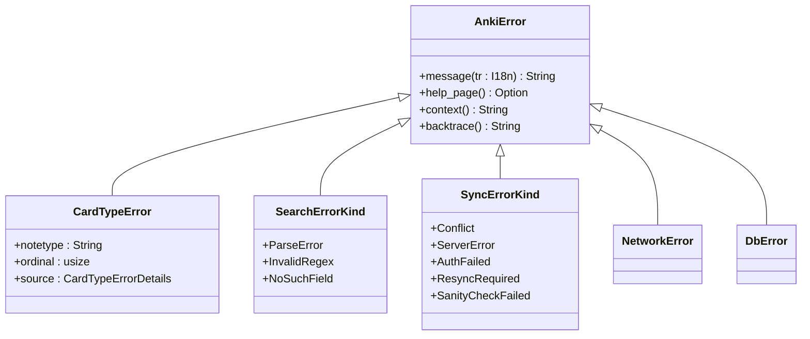
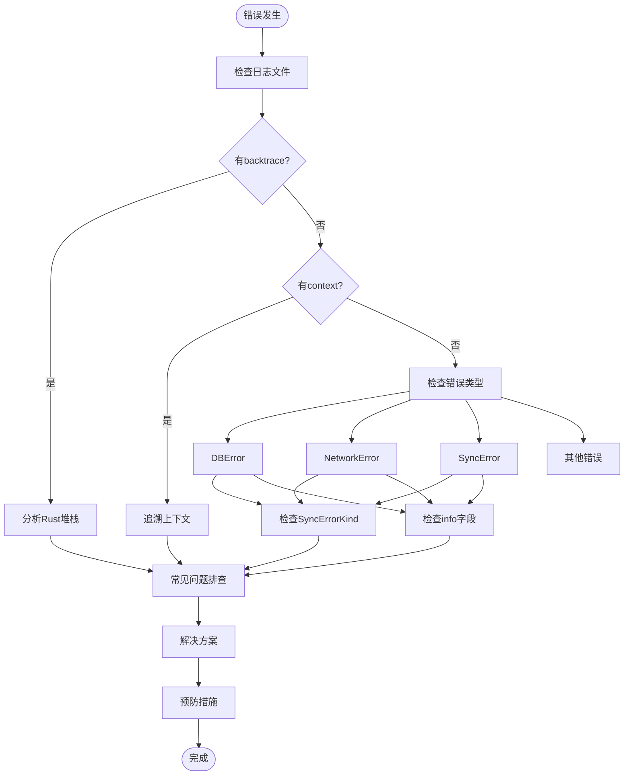
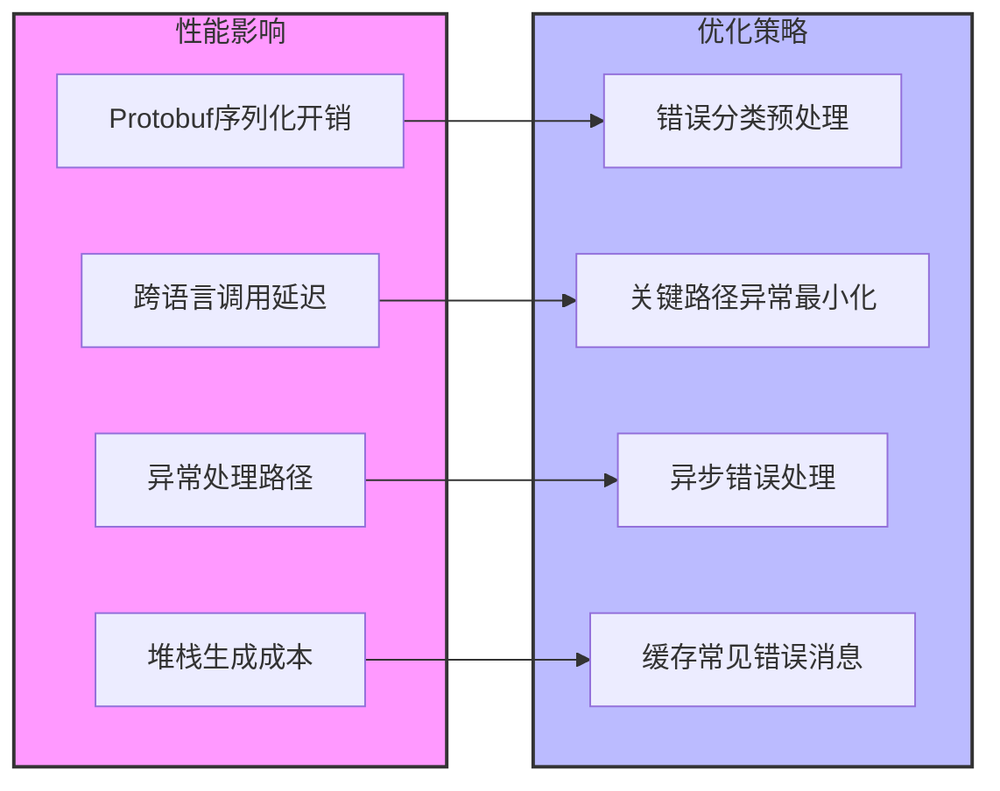

# 错误处理与异常传播

<cite>
**本文档中引用的文件**  
- [backend.proto](file://proto/anki/backend.proto)
- [_backend.py](file://pylib/anki/_backend.py)
- [errors.py](file://pylib/anki/errors.py)
- [lib.rs](file://pylib/rsbridge/lib.rs)
- [mod.rs](file://rslib/src/error/mod.rs)
- [network.rs](file://rslib/src/error/network.rs)
- [db.rs](file://rslib/src/error/db.rs)
- [backend/error.rs](file://rslib/src/backend/error.rs)
</cite>

## 目录
1. [简介](#简介)
2. [错误类型映射机制](#错误类型映射机制)
3. [核心错误分类](#核心错误分类)
4. [错误堆栈与上下文保留](#错误堆栈与上下文保留)
5. [Python层异常捕获](#python层异常捕获)
6. [自定义错误类型实现](#自定义错误类型实现)
7. [错误诊断指南](#错误诊断指南)
8. [性能影响与优化策略](#性能影响与优化策略)

## 简介
Anki采用Rust-Python混合架构，其错误处理机制通过PyO3桥接实现跨语言异常传播。Rust端的`Result<T, E>`类型通过Protobuf序列化转换为Python端的异常体系，确保类型安全的同时提供丰富的错误上下文信息。该机制支持错误分类、上下文追溯和国际化消息展示，为开发者提供了完整的错误诊断能力。

## 错误类型映射机制

**图示来源**
- [backend.proto](file://proto/anki/backend.proto#L1-L62)
- [lib.rs](file://pylib/rsbridge/lib.rs#L46-L91)
- [_backend.py](file://pylib/anki/_backend.py#L168-L207)

**本节来源**
- [backend.proto](file://proto/anki/backend.proto#L1-L62)
- [lib.rs](file://pylib/rsbridge/lib.rs#L46-L91)

## 核心错误分类

**图示来源**
- [errors.py](file://pylib/anki/errors.py#L27-L82)
- [mod.rs](file://rslib/src/error/mod.rs#L1-L324)
- [network.rs](file://rslib/src/error/network.rs#L1-L232)
- [db.rs](file://rslib/src/error/db.rs#L1-L107)

**本节来源**
- [errors.py](file://pylib/anki/errors.py#L27-L82)
- [mod.rs](file://rslib/src/error/mod.rs#L1-L324)

## 错误堆栈与上下文保留

**图示来源**
- [_backend.py](file://pylib/anki/_backend.py#L196-L262)
- [backend/error.rs](file://rslib/src/backend/error.rs#L1-L73)
- [mod.rs](file://rslib/src/error/mod.rs#L1-L324)

**本节来源**
- [_backend.py](file://pylib/anki/_backend.py#L196-L262)
- [backend/error.rs](file://rslib/src/backend/error.rs#L1-L73)

## Python层异常捕获

**图示来源**
- [_backend.py](file://pylib/anki/_backend.py#L196-L262)
- [errors.py](file://pylib/anki/errors.py#L27-L82)

**本节来源**
- [_backend.py](file://pylib/anki/_backend.py#L196-L262)

## 自定义错误类型实现

**图示来源**
- [mod.rs](file://rslib/src/error/mod.rs#L1-L324)
- [network.rs](file://rslib/src/error/network.rs#L1-L232)
- [db.rs](file://rslib/src/error/db.rs#L1-L107)

**本节来源**
- [mod.rs](file://rslib/src/error/mod.rs#L1-L324)

## 错误诊断指南

**图示来源**
- [_backend.py](file://pylib/anki/_backend.py#L196-L262)
- [errors.py](file://pylib/anki/errors.py#L27-L82)
- [mod.rs](file://rslib/src/error/mod.rs#L1-L324)

**本节来源**
- [_backend.py](file://pylib/anki/_backend.py#L196-L262)
- [errors.py](file://pylib/anki/errors.py#L27-L82)

## 性能影响与优化策略

**图示来源**
- [lib.rs](file://pylib/rsbridge/lib.rs#L46-L91)
- [_backend.py](file://pylib/anki/_backend.py#L168-L207)
- [backend/error.rs](file://rslib/src/backend/error.rs#L1-L73)

**本节来源**
- [lib.rs](file://pylib/rsbridge/lib.rs#L46-L91)
- [_backend.py](file://pylib/anki/_backend.py#L168-L207)