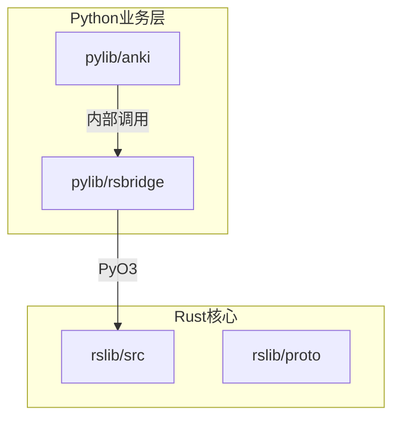
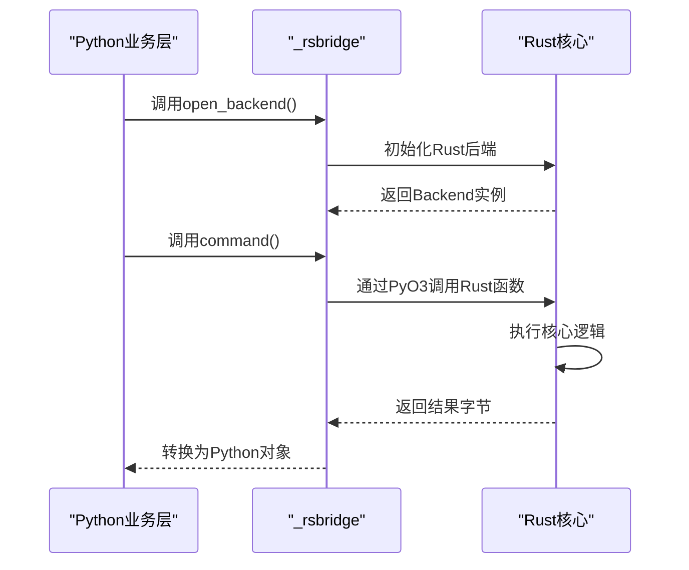
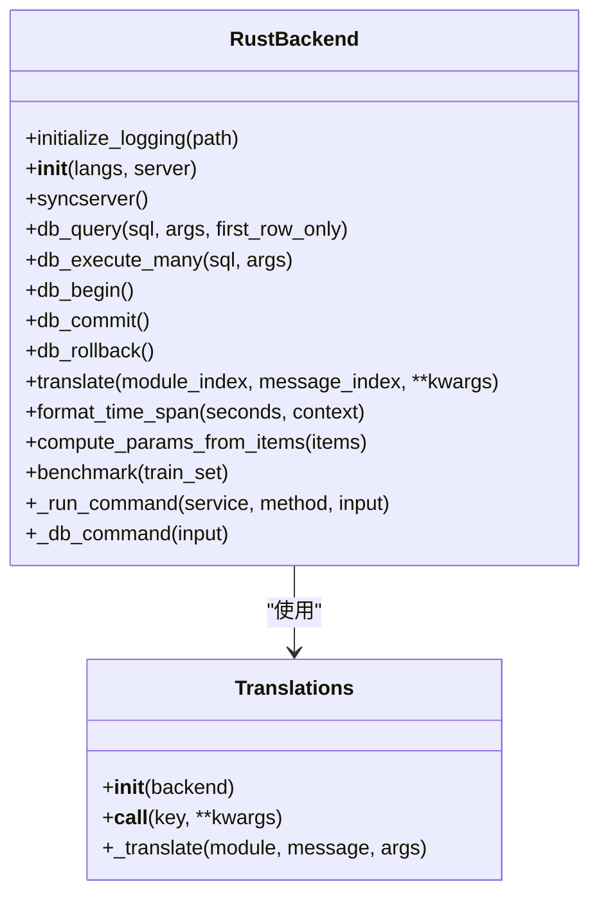
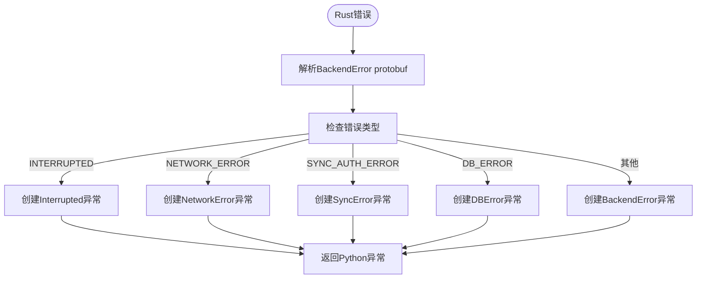
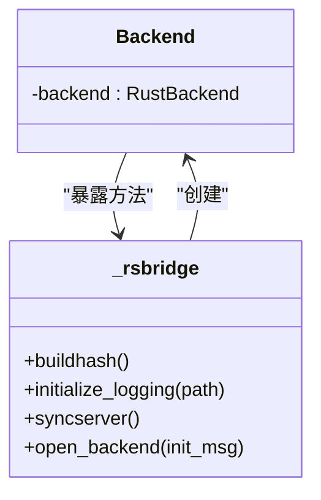
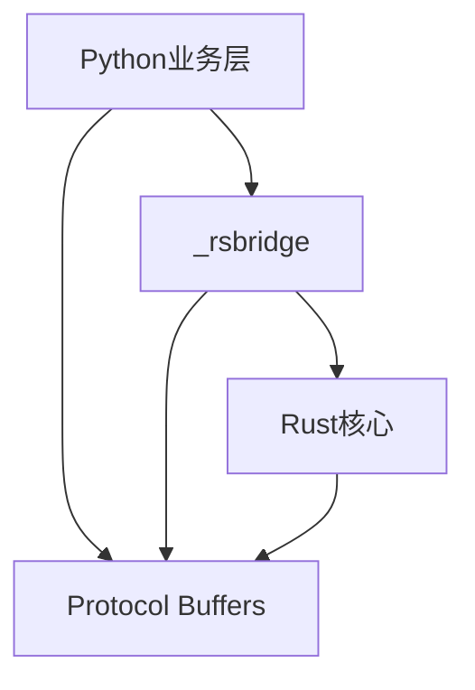

# Python业务层

<cite>
**本文档中引用的文件**  
- [pylib/anki/_backend.py](file://pylib/anki/_backend.py)
- [pylib/anki/rsbackend.py](file://pylib/anki/rsbackend.py)
- [pylib/rsbridge/lib.rs](file://pylib/rsbridge/lib.rs)
- [pylib/rsbridge/Cargo.toml](file://pylib/rsbridge/Cargo.toml)
</cite>

## 目录
1. [简介](#简介)
2. [项目结构](#项目结构)
3. [核心组件](#核心组件)
4. [架构概述](#架构概述)
5. [详细组件分析](#详细组件分析)
6. [依赖分析](#依赖分析)
7. [性能考虑](#性能考虑)
8. [故障排除指南](#故障排除指南)
9. [结论](#结论)

## 简介
Anki采用Rust与Python混合架构，其中Rust负责核心逻辑和性能敏感操作，Python层则提供业务逻辑封装和Qt界面交互。本文件详细说明Python业务层如何通过PyO3桥接机制与Rust核心通信，涵盖数据类型转换、错误处理、性能优化等关键方面。

## 项目结构
Anki的Python业务层主要位于`pylib/anki`目录，通过`_rsbridge`模块与Rust核心交互。Rust-Python桥接实现在`pylib/rsbridge`中，使用PyO3创建Python可调用的原生扩展。

**Diagram sources**
- [pylib/anki/_backend.py](file://pylib/anki/_backend.py)
- [pylib/rsbridge/lib.rs](file://pylib/rsbridge/lib.rs)

**Section sources**
- [pylib/anki/_backend.py](file://pylib/anki/_backend.py)
- [pylib/rsbridge/lib.rs](file://pylib/rsbridge/lib.rs)

## 核心组件
Python业务层的核心是`RustBackend`类，它作为Python与Rust之间的主要接口。该类封装了所有与Rust核心的通信，通过`_rsbridge`模块调用底层Rust函数。`Translations`类处理国际化文本的翻译，而`backend_exception_to_pylib`函数负责将Rust端的错误转换为Python异常。

**Section sources**
- [pylib/anki/_backend.py](file://pylib/anki/_backend.py#L55-L170)
- [pylib/anki/_backend.py](file://pylib/anki/_backend.py#L173-L193)

## 架构概述
Anki的互操作架构采用分层设计，Python层通过生成的绑定调用Rust核心功能。Rust端使用Protocol Buffers进行序列化，通过`_rsbridge`暴露安全的C接口给Python。这种设计既保证了性能，又提供了良好的错误隔离。

**Diagram sources**
- [pylib/anki/_backend.py](file://pylib/anki/_backend.py#L55-L170)
- [pylib/rsbridge/lib.rs](file://pylib/rsbridge/lib.rs)

## 详细组件分析

### RustBackend分析
`RustBackend`类是Python与Rust通信的主要入口，它继承自自动生成的`RustBackendGenerated`类，封装了所有底层通信细节。

**Diagram sources**
- [pylib/anki/_backend.py](file://pylib/anki/_backend.py#L55-L170)

#### 错误处理机制
Anki实现了完善的错误处理和异常传播机制，确保Rust端的错误能正确转换为Python异常。

**Diagram sources**
- [pylib/anki/_backend.py](file://pylib/anki/_backend.py#L196-L262)

**Section sources**
- [pylib/anki/_backend.py](file://pylib/anki/_backend.py#L196-L262)

### rsbridge分析
`rsbridge`是Rust-Python桥接的核心实现，使用PyO3创建Python可调用的原生模块。

**Diagram sources**
- [pylib/rsbridge/lib.rs](file://pylib/rsbridge/lib.rs)

**Section sources**
- [pylib/rsbridge/lib.rs](file://pylib/rsbridge/lib.rs)
- [pylib/rsbridge/Cargo.toml](file://pylib/rsbridge/Cargo.toml)

## 依赖分析
Python业务层依赖于Rust核心通过`_rsbridge`暴露的接口，同时依赖Protocol Buffers进行数据序列化。这种设计实现了清晰的分层和职责分离。

**Diagram sources**
- [pylib/anki/_backend.py](file://pylib/anki/_backend.py)
- [pylib/rsbridge/lib.rs](file://pylib/rsbridge/lib.rs)

**Section sources**
- [pylib/anki/_backend.py](file://pylib/anki/_backend.py)
- [pylib/rsbridge/lib.rs](file://pylib/rsbridge/lib.rs)

## 性能考虑
Anki的互操作机制在性能方面进行了多项优化。首先，数据库操作使用JSON而非Protocol Buffers进行序列化，因为Python的protobuf编解码较慢。其次，长时间运行的操作使用`py.allow_threads()`释放GIL，避免阻塞主线程。最后，错误处理中包含主线程阻塞检测，帮助识别性能瓶颈。

**Section sources**
- [pylib/anki/_backend.py](file://pylib/anki/_backend.py#L150-L165)
- [pylib/rsbridge/lib.rs](file://pylib/rsbridge/lib.rs#L50-L55)

## 故障排除指南
当遇到Rust-Python互操作问题时，应首先检查构建哈希是否匹配，这在模块导入时会自动验证。对于错误处理，应关注`backend_exception_to_pylib`函数的转换逻辑，确保Rust端的错误能正确映射到相应的Python异常类型。性能问题通常与主线程阻塞有关，可通过内置的阻塞检测机制识别。

**Section sources**
- [pylib/anki/_backend.py](file://pylib/anki/_backend.py#L40-L45)
- [pylib/anki/_backend.py](file://pylib/anki/_backend.py#L150-L165)

## 结论
Anki的Python业务层通过精心设计的PyO3桥接机制与Rust核心高效协作。这种架构既利用了Rust的性能优势，又保持了Python的开发灵活性。错误处理、性能优化和清晰的职责分离使得系统既健壮又易于维护。对于开发者而言，理解这一互操作机制是有效贡献代码和开发插件的关键。