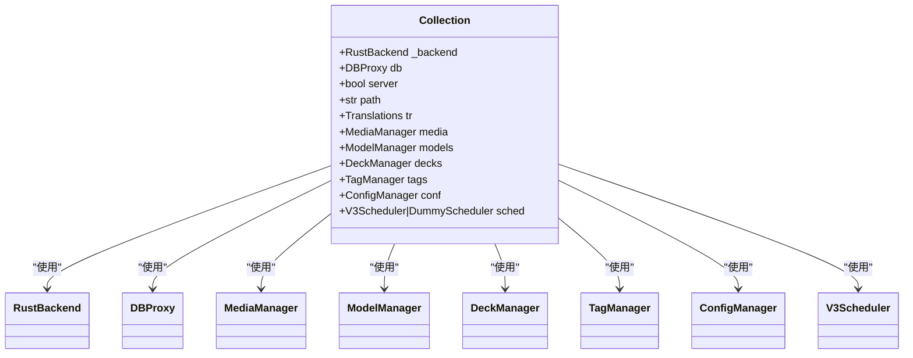
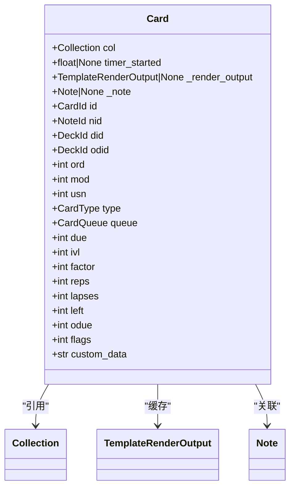
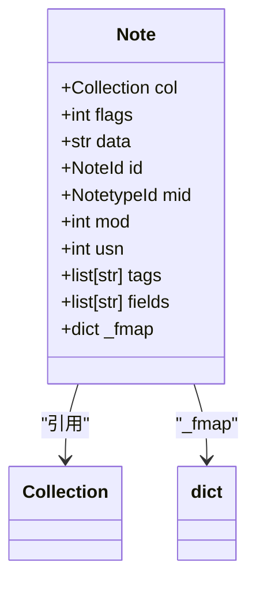
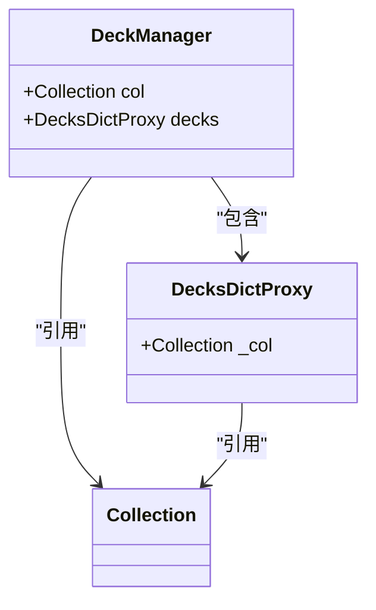
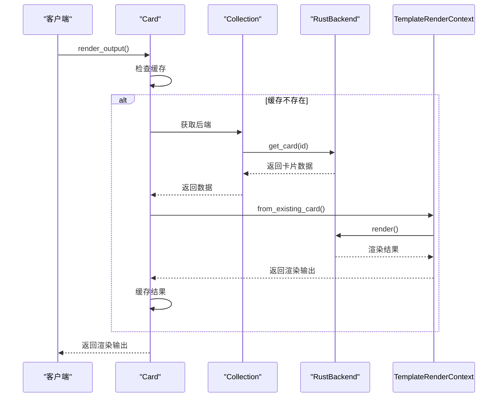
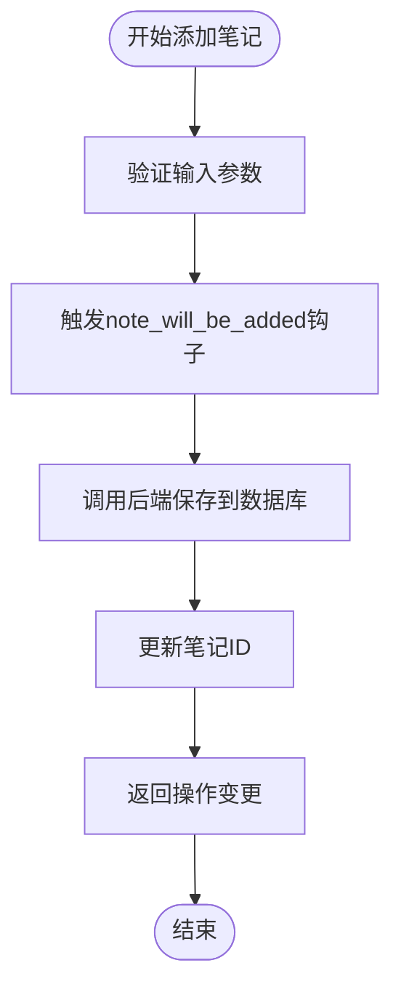
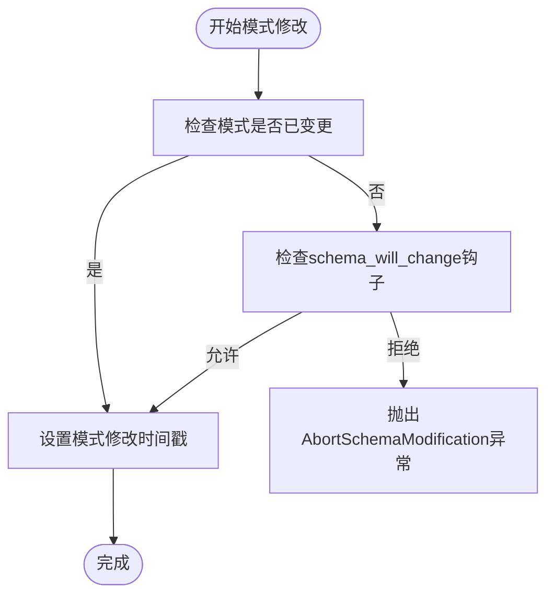

# 业务逻辑封装

<cite>
**本文档中引用的文件**  
- [collection.py](file://pylib/anki/collection.py)
- [cards.py](file://pylib/anki/cards.py)
- [notes.py](file://pylib/anki/notes.py)
- [decks.py](file://pylib/anki/decks.py)
</cite>

## 目录
1. [简介](#简介)
2. [核心对象设计模式](#核心对象设计模式)
3. [模块职责与调用关系](#模块职责与调用关系)
4. [业务流程详解](#业务流程详解)
5. [事务与撤销机制](#事务与撤销机制)
6. [错误处理与边界情况](#错误处理与边界情况)
7. [API使用指南](#api使用指南)
8. [架构设计权衡](#架构设计权衡)

## 简介
Anki的Python层通过Collection类作为核心入口点，将底层Rust核心功能封装为高级API。这种分层架构实现了性能与易用性的平衡，为开发者提供了简洁的接口来操作笔记、卡片、牌组等核心对象。

**Section sources**
- [collection.py](file://pylib/anki/collection.py#L133-L160)

## 核心对象设计模式
### Collection类
Collection类是Anki业务逻辑的中心枢纽，负责协调所有核心操作。它通过弱引用维护对自身实例的引用，避免循环引用问题。初始化时，它创建Rust后端实例并建立数据库连接，同时初始化媒体、模型、牌组和标签等管理器。



**Diagram sources**
- [collection.py](file://pylib/anki/collection.py#L141-L160)

### Card类
Card类代表单个学习卡片，封装了卡片的所有属性和行为。它通过_render_output缓存模板渲染结果，避免重复计算。卡片的初始化支持三种模式：通过ID加载现有卡片、通过后端卡片数据初始化，或创建具有默认值的新卡片。



**Diagram sources**
- [cards.py](file://pylib/anki/cards.py#L53-L70)

### Note类
Note类代表笔记实体，是卡片生成的基础。它通过字段映射(_fmap)实现类似字典的访问接口，允许通过字段名直接获取或设置字段值。笔记的初始化同样支持多种模式：通过ID加载现有笔记，或基于指定的笔记类型创建新笔记。



**Diagram sources**
- [notes.py](file://pylib/anki/notes.py#L35-L52)

### DeckManager类
DeckManager类负责牌组的管理和操作。它通过DecksDictProxy提供字典式访问接口，同时在访问时发出弃用警告，引导开发者使用更安全的方法调用。牌组管理器支持创建、删除、重命名牌组，以及处理牌组的父子关系和折叠状态。



**Diagram sources**
- [decks.py](file://pylib/anki/decks.py#L79-L574)

## 模块职责与调用关系
### cards.py模块
cards.py模块负责协调调度器和数据库操作。当需要渲染卡片内容时，它通过TemplateRenderContext.from_existing_card创建渲染上下文，并调用后端进行模板渲染。卡片的持久化操作通过调用后端的update_cards方法实现，该方法接受卡片序列并批量更新数据库。



**Diagram sources**
- [cards.py](file://pylib/anki/cards.py#L160-L169)

## 业务流程详解
### 模板渲染流程
模板渲染流程从卡片的render_output方法开始。如果缓存不存在，则创建TemplateRenderContext实例，该实例包含卡片、笔记、笔记类型和模板等必要信息。然后调用后端的render方法进行实际渲染，结果包括问题、答案、CSS样式和音视频标签。

### 笔记生成流程
笔记生成流程始于调用Collection的add_note方法。该方法首先触发note_will_be_added钩子，然后调用后端的add_note方法将笔记数据持久化到数据库。成功后，更新笔记对象的ID并返回操作变更信息。



**Diagram sources**
- [collection.py](file://pylib/anki/collection.py#L530-L534)

### 卡片创建流程
卡片创建流程由笔记的字段变化触发。当笔记的字段被修改并保存时，系统会自动重新生成相关卡片。这个过程由后端的card generation机制处理，确保卡片内容与笔记字段保持同步。

## 事务与撤销机制
### 事务管理
事务管理通过mod_schema方法实现。当需要修改数据库模式时，首先检查是否已有未同步的模式变更，然后调用set_schema_modified更新模式修改时间戳。这个机制确保了模式变更的原子性和一致性。



**Diagram sources**
- [collection.py](file://pylib/anki/collection.py#L304-L309)

### 撤销机制
撤销机制通过操作变更(OpChanges)系统实现。每个修改操作都会生成一个OpChanges对象，记录操作的类型和影响范围。这些变更信息被用于实现撤销功能，允许用户回退到之前的状态。

## 错误处理与边界情况
### 数据验证
数据验证通过fields_check方法实现。该方法调用后端的note_fields_check服务，检查笔记字段是否存在重复或为空的情况。返回值表示验证结果的状态，帮助开发者及时发现和处理数据质量问题。

```mermaid
sequenceDiagram
participant Note as "Note"
participant Collection as "Collection"
participant Backend as "RustBackend"
Note->>Collection : 获取后端
Collection->>Backend : note_fields_check(note)
Backend-->>Collection : 返回验证结果
Collection-->>Note : 返回状态
Note-->>Client : 返回验证结果
```

**Diagram sources**
- [notes.py](file://pylib/anki/notes.py#L198-L199)

### 边界情况处理
系统通过多种机制处理边界情况。例如，在删除牌组时，会检查是否有子牌组需要一并处理；在设置用户标记时，会验证标记值是否在有效范围内（0-7）。这些检查确保了系统的健壮性和数据的一致性。

## API使用指南
### 添加笔记
添加笔记的典型流程是先创建Note实例，设置字段值，然后调用Collection的add_note方法。这个过程会自动处理ID分配、时间戳更新和数据库持久化。

### 执行搜索
执行搜索使用find_cards或find_notes方法，传入搜索查询字符串。可以使用build_search_string方法构建复杂的搜索条件，支持AND、OR逻辑操作。

### 生成统计信息
生成统计信息通过stats模块实现。可以获取卡片复习统计、学习进度等信息，用于分析学习效果和调整学习策略。

## 架构设计权衡
### 性能与易用性
通过将核心逻辑放在Rust层，Anki实现了高性能的数据处理能力。同时，Python层提供了简洁易用的API，降低了开发门槛。这种混合架构在性能和易用性之间取得了良好平衡。

### 向后兼容性
系统通过弃用警告(deprecated)机制逐步淘汰旧的API，同时保持向后兼容性。这允许开发者有足够的时间迁移到新的API，而不会立即破坏现有功能。

### 扩展性
通过钩子(hooks)系统，Anki提供了强大的扩展能力。开发者可以在关键操作前后插入自定义逻辑，实现功能扩展而无需修改核心代码。