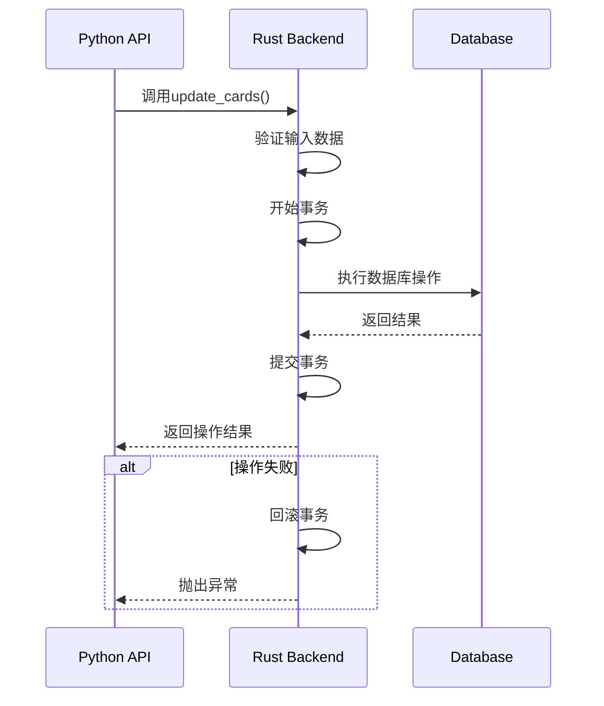
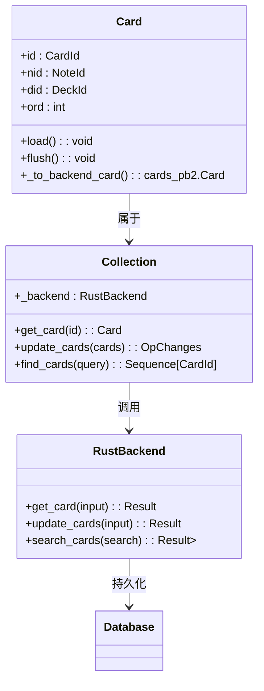
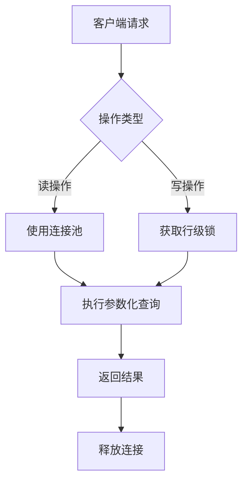

# 卡片操作

<cite>
**本文档引用的文件**   
- [cards.py](file://pylib/anki/cards.py)
- [service.rs](file://rslib/src/card/service.rs)
- [collection.py](file://pylib/anki/collection.py)
</cite>

## 目录
1. [简介](#简介)
2. [卡片操作流程](#卡片操作流程)
3. [事务管理与错误处理](#事务管理与错误处理)
4. [高级API与Rust核心服务交互](#高级api与rust核心服务交互)
5. [权限控制与数据完整性](#权限控制与数据完整性)
6. [性能优化措施](#性能优化措施)
7. [常用操作示例与最佳实践](#常用操作示例与最佳实践)
8. [并发控制与数据库交互](#并发控制与数据库交互)

## 简介
Anki的卡片操作功能是其核心功能之一，提供了完整的卡片创建、查询、更新和删除（CRUD）操作。系统采用分层架构，Python层的高级API通过`pylib/anki/cards.py`文件提供用户友好的接口，而底层的Rust核心服务则在`rslib/src/card/service.rs`中实现高性能的数据处理。这种架构设计既保证了开发的便利性，又确保了运行时的性能效率。

## 卡片操作流程

### 卡片创建
卡片创建流程始于Python层的`Card`类初始化，通过`__init__`方法创建新卡片实例。当调用`flush`方法时，系统会将卡片数据通过`_to_backend_card`方法转换为协议缓冲区格式，并调用Rust后端的`update_cards`服务进行持久化存储。

### 卡片查询
卡片查询功能通过`find_cards`方法实现，该方法接受搜索查询字符串作为参数，调用后端的`search_cards`服务执行数据库查询。查询结果以卡片ID序列的形式返回，支持复杂的搜索语法和排序选项。

### 卡片更新
卡片更新操作通过`update_cards`方法完成，该方法接收一个卡片对象序列，将其转换为后端格式后批量提交。系统会自动处理修改时间戳（mtime）和更新序列号（usn）等元数据，确保数据的一致性和同步性。

### 卡片删除
卡片删除通过`remove_cards`服务实现，支持批量删除操作。系统在删除卡片的同时会检查并清理相关的孤立笔记，维护数据完整性。

**Section sources**
- [cards.py](file://pylib/anki/cards.py#L38-L246)
- [service.rs](file://rslib/src/card/service.rs#L1-L172)
- [collection.py](file://pylib/anki/collection.py#L480-L489)

## 事务管理与错误处理

### 事务管理机制
Anki的卡片操作采用严格的事务管理机制，确保数据操作的原子性和一致性。所有数据库操作都在事务上下文中执行，通过`transact`方法包装操作，确保要么全部成功，要么全部回滚。系统还实现了撤销（undo）功能，通过`Op`操作记录变更历史，支持用户撤销最近的操作。

### 错误处理策略
系统实现了分层的错误处理策略。在Rust层，使用`Result`类型进行错误传播，定义了详细的错误类型如`AnkiError`、`OrInvalid`和`OrNotFound`。Python层通过异常处理机制捕获并处理这些错误，提供清晰的错误信息和恢复建议。对于输入验证错误，系统会在操作前进行检查，防止无效数据进入数据库。



**Diagram sources **
- [service.rs](file://rslib/src/card/service.rs#L1-L172)
- [collection.py](file://pylib/anki/collection.py#L483-L489)

## 高级API与Rust核心服务交互

### API调用流程
Python层的高级API通过`_backend`属性与Rust核心服务进行交互。`Collection`类中的`get_card`、`update_cards`等方法作为桥梁，将Python对象转换为协议缓冲区格式，通过FFI（外部函数接口）调用Rust实现的服务。

### 数据转换机制
数据转换通过`_to_backend_card`和`_load_from_backend_card`方法实现。前者将Python的`Card`对象转换为`cards_pb2.Card`协议缓冲区消息，后者则执行反向转换。这种双向转换机制确保了Python和Rust层之间的数据一致性。



**Diagram sources **
- [cards.py](file://pylib/anki/cards.py#L38-L246)
- [service.rs](file://rslib/src/card/service.rs#L1-L172)

## 权限控制与数据完整性

### 权限控制
系统通过操作级别的权限控制确保数据安全。只有经过身份验证的会话才能执行卡片操作，且某些敏感操作（如批量删除）需要额外的确认。配置管理器（ConfigManager）负责管理用户权限设置，确保操作符合用户的安全策略。

### 数据完整性保障
数据完整性通过多种机制保障：外键约束确保卡片与笔记的关联有效性；自定义数据验证防止非法数据输入；事务机制保证操作的原子性；定期完整性检查（`fix_integrity`）检测并修复潜在的数据损坏问题。

**Section sources**
- [collection.py](file://pylib/anki/collection.py#L616-L617)
- [service.rs](file://rslib/src/card/service.rs#L1-L172)

## 性能优化措施

### 批量操作优化
系统支持批量操作以提高性能。`update_cards`方法可以一次性处理多个卡片，减少数据库连接开销。批量查询通过`find_cards`方法实现，使用高效的SQL查询优化数据检索速度。

### 缓存机制
系统实现了多级缓存机制，包括卡片渲染输出缓存和笔记对象缓存。`_render_output`字段缓存卡片的模板渲染结果，避免重复计算；`_note`字段缓存关联的笔记对象，减少数据库查询次数。

### 查询优化
查询性能通过索引优化和查询计划优化实现。系统为常用查询字段（如卡片ID、笔记ID、牌组ID）建立数据库索引，并使用预编译的SQL语句提高执行效率。复杂的搜索查询通过`search_pb2`协议进行优化，支持高效的全文搜索和条件过滤。

**Section sources**
- [cards.py](file://pylib/anki/cards.py#L160-L169)
- [collection.py](file://pylib/anki/collection.py#L636-L666)

## 常用操作示例与最佳实践

### 批量操作示例
```python
# 批量更新卡片
cards = [col.get_card(cid) for cid in card_ids]
for card in cards:
    card.due += 1
col.update_cards(cards)
```

### 条件查询示例
```python
# 查询特定牌组中的新卡片
query = "deck:MyDeck is:new"
card_ids = col.find_cards(query)
```

### 数据验证示例
```python
# 在更新前验证卡片数据
def validate_card(card):
    if card.due < 0:
        raise ValueError("Due date cannot be negative")
    if card.ivl <= 0:
        raise ValueError("Interval must be positive")
```

**Section sources**
- [collection.py](file://pylib/anki/collection.py#L483-L489)
- [cards.py](file://pylib/anki/cards.py#L112-L136)

## 并发控制与数据库交互

### 并发控制
系统采用悲观锁和乐观锁相结合的并发控制策略。对于关键操作，使用数据库行级锁防止并发修改；对于非关键操作，使用版本号（usn）进行乐观并发控制，检测并处理冲突。

### 数据库交互细节
数据库交互通过`DBProxy`类封装，提供安全的SQL执行接口。所有数据库操作都经过参数化查询防止SQL注入，使用连接池管理数据库连接，确保高并发下的性能和稳定性。事务隔离级别设置为可重复读（REPEATABLE READ），平衡一致性和性能。



**Diagram sources **
- [collection.py](file://pylib/anki/collection.py#L133-L1297)
- [service.rs](file://rslib/src/card/service.rs#L1-L172)