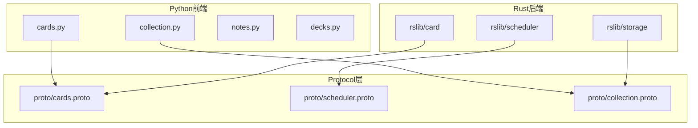
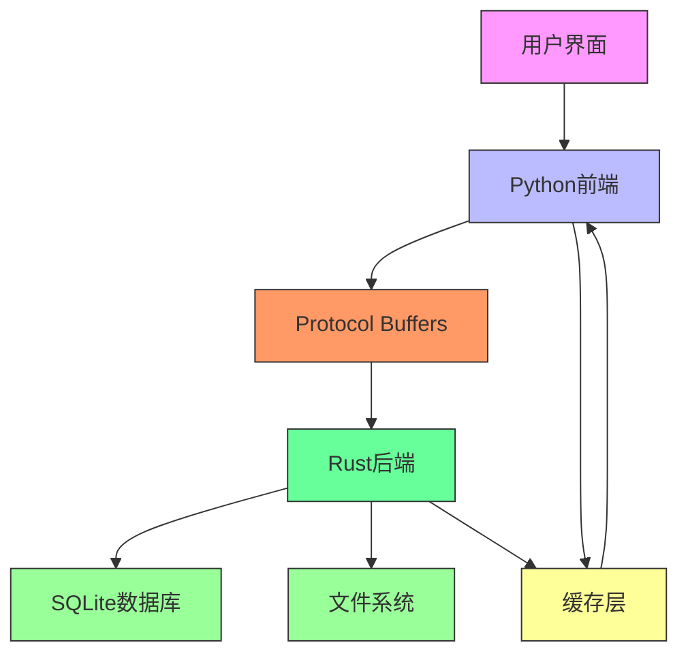

# 卡片管理

<cite>
**本文档中引用的文件**   
- [cards.py](file://pylib/anki/cards.py)
- [collection.py](file://pylib/anki/collection.py)
- [card_rendering.proto](file://proto/anki/card_rendering.proto)
- [cards.proto](file://proto/anki/cards.proto)
- [scheduler.proto](file://proto/anki/scheduler.proto)
</cite>

## 目录
1. [简介](#简介)
2. [项目结构](#项目结构)
3. [核心组件](#核心组件)
4. [架构概述](#架构概述)
5. [详细组件分析](#详细组件分析)
6. [依赖分析](#依赖分析)
7. [性能考虑](#性能考虑)
8. [故障排除指南](#故障排除指南)
9. [结论](#结论)
10. [附录](#附录)（如有必要）

## 简介
Anki卡片管理系统是Anki学习软件的核心组件，负责管理学习卡片的生命周期、状态转换和调度逻辑。该系统采用分层架构设计，将Python前端与Rust后端服务分离，通过Protocol Buffers进行通信。卡片管理模块实现了复杂的记忆算法，支持新卡、学习中和复习三种状态的转换，并与笔记、牌组和调度器等组件紧密交互。系统通过Collection对象作为主要入口点，提供统一的API来操作卡片数据。

## 项目结构
Anki项目采用模块化设计，主要分为Python前端和Rust后端两大部分。卡片管理相关代码主要位于pylib/anki目录下，其中cards.py文件定义了Card类，collection.py文件提供了Collection类作为主要操作接口。后端服务通过proto目录下的Protocol Buffers定义与前端通信，rslib目录包含Rust实现的核心逻辑。这种分层架构使得前端可以专注于用户界面和用户体验，而后端则处理复杂的调度算法和数据持久化。



**图表来源**
- [cards.py](file://pylib/anki/cards.py)
- [collection.py](file://pylib/anki/collection.py)
- [cards.proto](file://proto/anki/cards.proto)
- [scheduler.proto](file://proto/anki/scheduler.proto)
- [rslib/card](file://rslib/src/card)

**章节来源**
- [pylib/anki](file://pylib/anki)
- [proto/anki](file://proto/anki)
- [rslib/src](file://rslib/src)

## 核心组件
卡片管理系统的两个核心组件是Card类和Collection类。Card类封装了单个学习卡片的所有属性和行为，包括卡片状态、调度信息和渲染逻辑。Collection类作为系统的主要入口点，提供了操作卡片集合的高级API。这两个类通过紧密协作，实现了卡片的创建、查询、更新和删除等基本操作。Card类的设计遵循单一职责原则，专注于卡片自身的状态管理，而Collection类则负责协调多个组件之间的交互，确保数据的一致性和完整性。

**章节来源**
- [cards.py](file://pylib/anki/cards.py#L38-L246)
- [collection.py](file://pylib/anki/collection.py#L133-L1297)

## 架构概述
Anki卡片管理系统的架构采用前后端分离的设计模式。前端使用Python实现用户界面和业务逻辑，后端使用Rust实现高性能的调度算法和数据存储。两者通过Protocol Buffers定义的接口进行通信，确保了语言无关性和接口稳定性。系统的核心是Collection对象，它作为所有操作的入口点，封装了与后端服务的交互细节。卡片状态管理采用有限状态机模式，通过queue和type字段的组合来表示卡片的不同状态。这种架构设计既保证了系统的可维护性，又提供了良好的性能表现。



**图表来源**
- [cards.py](file://pylib/anki/cards.py)
- [collection.py](file://pylib/anki/collection.py)
- [rslib](file://rslib)

## 详细组件分析

### Card类设计模式
Card类采用组合设计模式，将数据属性与行为方法封装在一起。类的设计遵循Python的类型提示规范，使用NewType创建类型别名以增强类型安全性。Card类通过弱引用（weakref）持有Collection对象，避免循环引用问题。属性访问采用直接字段访问而非getter/setter方法，以提高性能。类初始化时根据参数的不同采用三种模式：加载现有卡片、从后端数据创建或创建新卡片。这种设计使得Card对象既轻量又功能完整。

```mermaid
classDiagram
    class Card {
        +_note: Note | None
        +lastIvl: int
        +ord: int
        +nid: NoteId
        +id: CardId
        +did: DeckId
        +odid: DeckId
        +queue: CardQueue
        +type: CardType
        +memory_state: FSRSMemoryState | None
        +desired_retention: float | None
        +decay: float | None
        +last_review_time: int | None
        +__init__(col, id, backend_card)
        +load()
        +_load_from_backend_card(card)
        +_to_backend_card()
        +flush()
