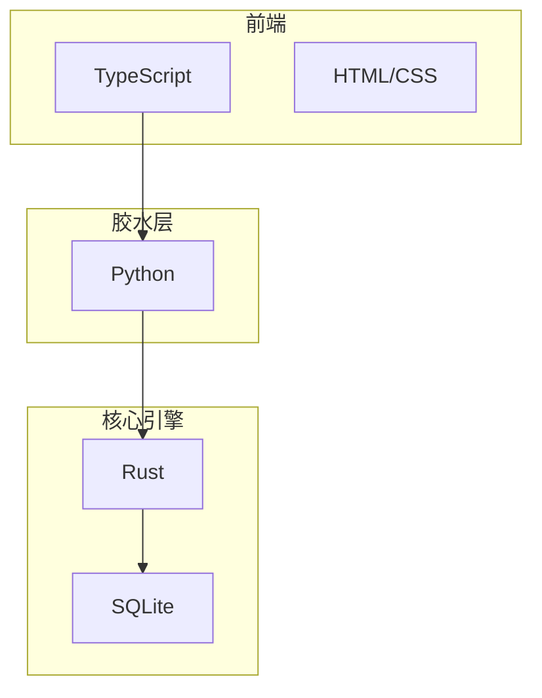
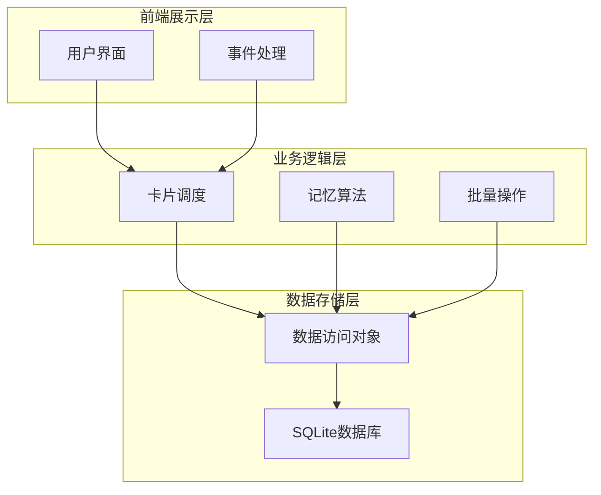
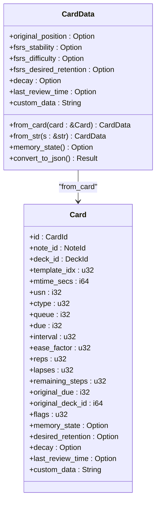
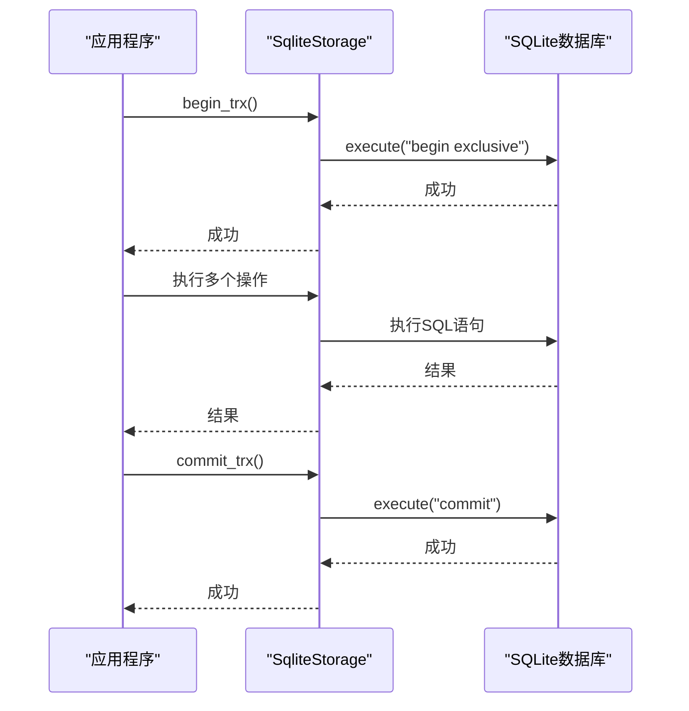
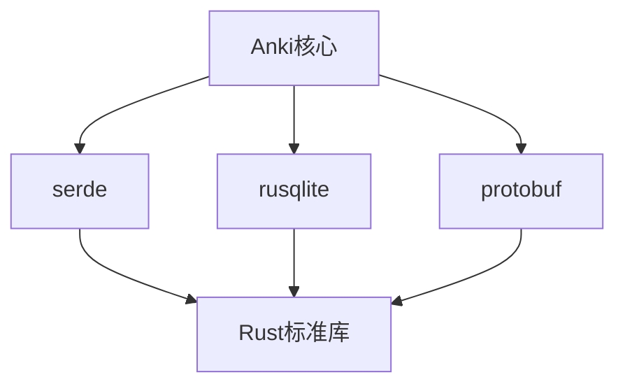

# 性能优化

<cite>
**本文档引用的文件**  
- [data.rs](file://rslib/src/storage/card/data.rs)
- [sqlite.rs](file://rslib/src/storage/sqlite.rs)
- [card.rs](file://rslib/src/card/mod.rs)
- [benchmark.rs](file://rslib/benches/benchmark.rs)
- [cards.proto](file://proto/anki/cards.proto)
</cite>

## 目录
1. [引言](#引言)
2. [项目结构](#项目结构)
3. [核心组件](#核心组件)
4. [架构概述](#架构概述)
5. [详细组件分析](#详细组件分析)
6. [依赖分析](#依赖分析)
7. [性能考虑](#性能考虑)
8. [故障排除指南](#故障排除指南)
9. [结论](#结论)

## 引言
Anki是一款基于间隔重复算法的记忆辅助软件，其性能优化对于用户体验至关重要。随着用户数据量的增长，卡片系统的性能瓶颈逐渐显现。本文档深入探讨Anki卡片系统的性能优化策略，重点分析rslib/src/storage/card/data.rs中定义的数据访问模式如何支持高效操作。文档将详细解释缓存策略、批量操作优化和数据库查询优化技术，包括预加载、连接查询和索引优化等方法。同时，为新手提供性能敏感操作的最佳实践指南，并为资深开发者分析底层存储优化、内存管理和并发访问的调优技巧。

## 项目结构
Anki项目采用多语言混合架构，核心性能敏感代码使用Rust实现，位于rslib目录下。Python代码作为胶水层，通过pylib与Rust后端交互。前端使用TypeScript构建，通过proto定义的协议与后端通信。这种架构设计使得性能关键路径能够充分利用Rust的内存安全和高性能特性。

**Diagram sources**
- [data.rs](file://rslib/src/storage/card/data.rs)
- [sqlite.rs](file://rslib/src/storage/sqlite.rs)

**Section sources**
- [data.rs](file://rslib/src/storage/card/data.rs)
- [sqlite.rs](file://rslib/src/storage/sqlite.rs)

## 核心组件
Anki卡片系统的核心组件包括卡片数据存储、调度算法和数据库访问层。其中，rslib/src/storage/card/data.rs文件定义了卡片数据的序列化和反序列化逻辑，是性能优化的关键所在。该文件通过serde库实现了高效的JSON序列化，同时对浮点数精度进行了优化处理，确保在保证精度的同时减少存储空间占用。

**Section sources**
- [data.rs](file://rslib/src/storage/card/data.rs)

## 架构概述
Anki的架构采用分层设计，从上到下分别为前端展示层、业务逻辑层和数据存储层。数据存储层基于SQLite数据库，通过Rust的rusqlite库提供安全的数据库访问接口。业务逻辑层实现了卡片调度、记忆算法等核心功能，而前端展示层负责用户交互和数据可视化。

**Diagram sources**
- [data.rs](file://rslib/src/storage/card/data.rs)
- [sqlite.rs](file://rslib/src/storage/sqlite.rs)

## 详细组件分析

### 卡片数据存储分析
卡片数据存储组件负责管理卡片的持久化和序列化。在rslib/src/storage/card/data.rs中，CardData结构体通过serde的属性宏实现了高效的JSON序列化。该结构体使用选项类型（Option）来处理可选字段，避免了不必要的存储空间浪费。

**Diagram sources**
- [data.rs](file://rslib/src/storage/card/data.rs)

**Section sources**
- [data.rs](file://rslib/src/storage/card/data.rs)

### 数据库访问优化分析
数据库访问优化是Anki性能提升的关键。rslib/src/storage/sqlite.rs文件实现了数据库连接池和事务管理，通过begin_trx、commit_trx和rollback_trx等方法提供了原子性操作保证。同时，该文件还实现了savepoint机制，为复杂的操作提供了细粒度的回滚能力。

**Diagram sources**
- [sqlite.rs](file://rslib/src/storage/sqlite.rs)

**Section sources**
- [sqlite.rs](file://rslib/src/storage/sqlite.rs)

## 依赖分析
Anki的核心组件之间存在紧密的依赖关系。卡片数据存储依赖于serde和rusqlite库，前者提供高效的序列化能力，后者提供安全的数据库访问接口。同时，整个系统依赖于Protocol Buffers进行跨语言通信，确保了前后端数据的一致性。

**Diagram sources**
- [data.rs](file://rslib/src/storage/card/data.rs)
- [sqlite.rs](file://rslib/src/storage/sqlite.rs)

**Section sources**
- [data.rs](file://rslib/src/storage/card/data.rs)
- [sqlite.rs](file://rslib/src/storage/sqlite.rs)

## 性能考虑
Anki的性能优化主要集中在以下几个方面：首先，通过预加载和缓存策略减少数据库访问次数；其次，利用批量操作减少事务开销；最后，通过索引优化和查询优化提高数据库查询效率。在rslib/src/storage/card/data.rs中，通过round_to_places函数对浮点数进行精度控制，既保证了计算精度，又减少了存储空间占用。

**Section sources**
- [data.rs](file://rslib/src/storage/card/data.rs)
- [sqlite.rs](file://rslib/src/storage/sqlite.rs)

## 故障排除指南
当遇到性能问题时，可以按照以下步骤进行排查：首先检查数据库索引是否完整，其次确认批量操作是否正确使用，最后验证缓存策略是否有效。可以通过分析benchmark.rs中的基准测试结果来评估优化效果。

**Section sources**
- [benchmark.rs](file://rslib/benches/benchmark.rs)

## 结论
Anki卡片系统的性能优化是一个系统工程，需要从数据结构设计、数据库访问模式和算法实现等多个层面综合考虑。通过深入分析rslib/src/storage/card/data.rs中的数据访问模式，我们可以发现Anki在保证功能完整性的同时，充分考虑了性能因素。对于新手开发者，建议从批量操作和缓存策略入手；对于资深开发者，则可以深入研究底层存储优化和并发访问控制。