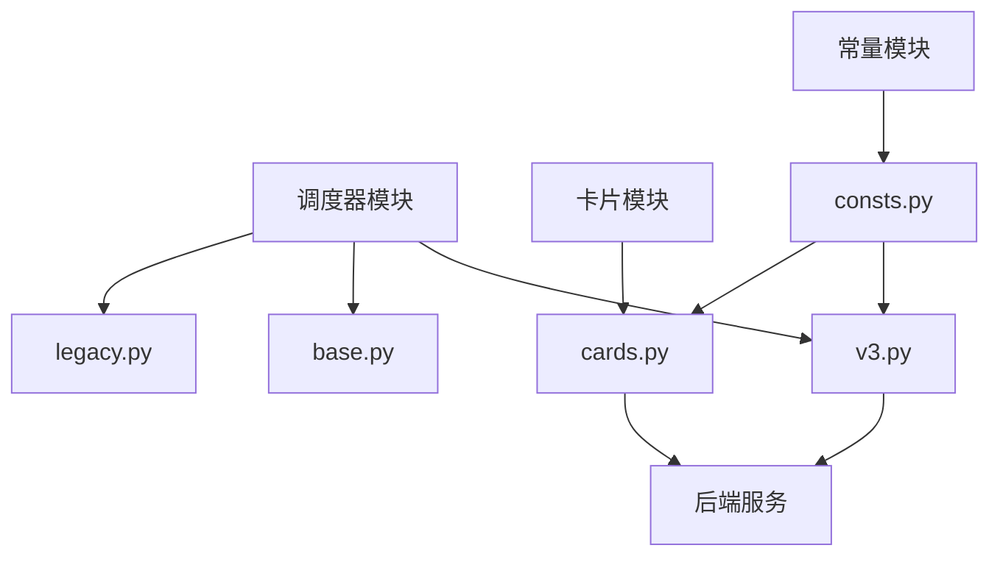
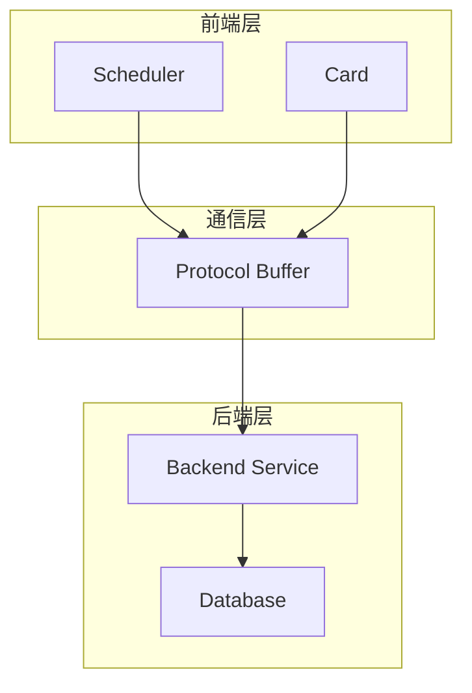
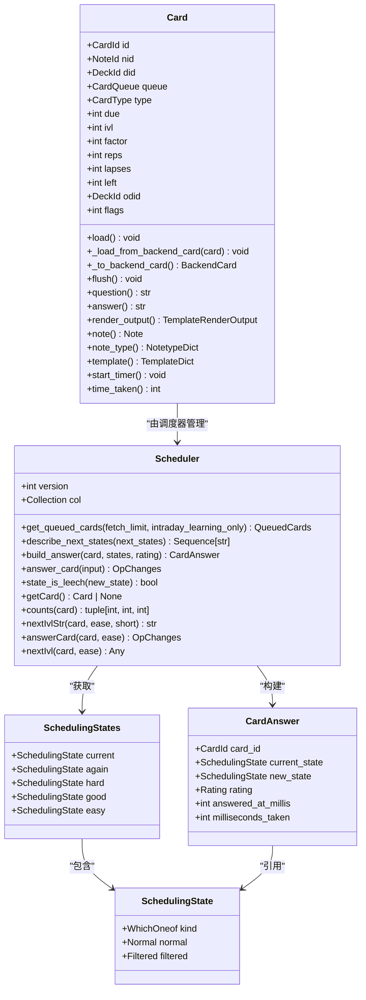
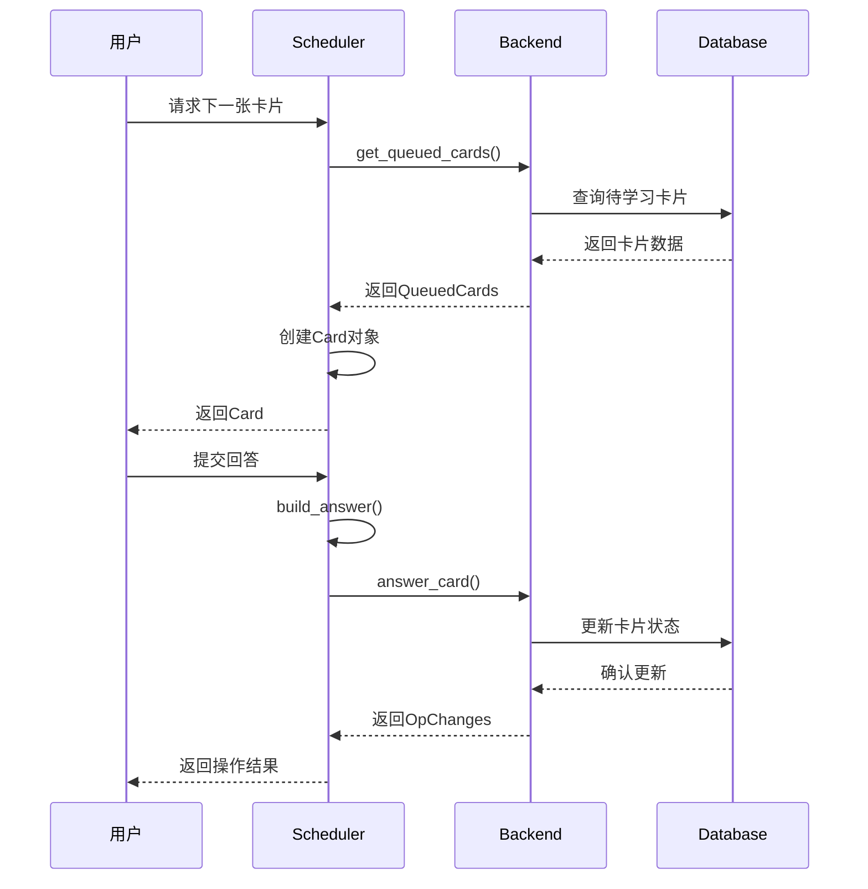
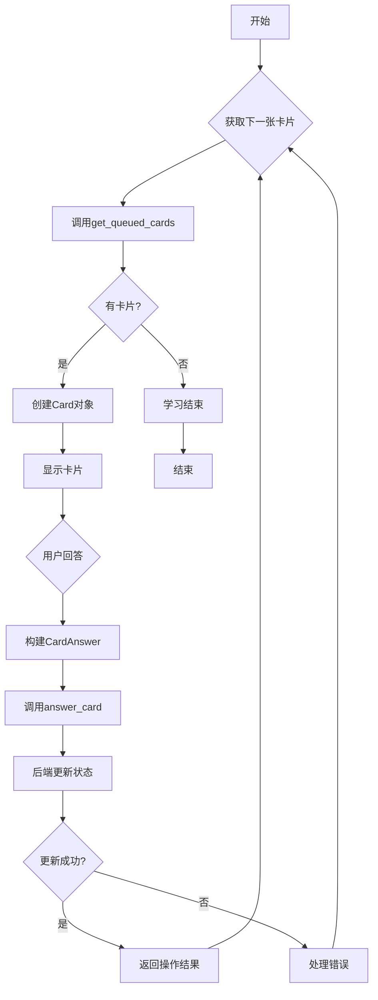
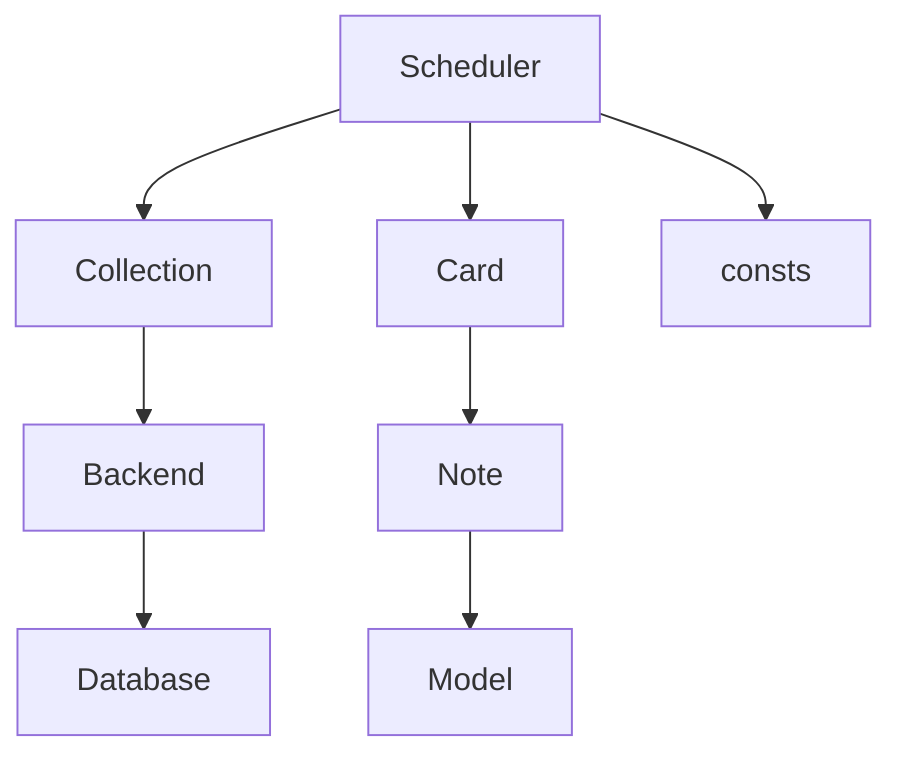

# 状态管理

<cite>
**本文档中引用的文件**  
- [v3.py](file://pylib/anki/scheduler/v3.py)
- [cards.py](file://pylib/anki/cards.py)
- [base.py](file://pylib/anki/scheduler/base.py)
- [legacy.py](file://pylib/anki/scheduler/legacy.py)
- [consts.py](file://pylib/anki/consts.py)
</cite>

## 目录
1. [简介](#简介)
2. [项目结构](#项目结构)
3. [核心组件](#核心组件)
4. [架构概述](#架构概述)
5. [详细组件分析](#详细组件分析)
6. [依赖分析](#依赖分析)
7. [性能考虑](#性能考虑)
8. [故障排除指南](#故障排除指南)
9. [结论](#结论)

## 简介
Anki是一款基于间隔重复算法的记忆辅助软件，其核心功能依赖于精确的卡片状态管理系统。本文档深入探讨Anki中卡片的生命周期管理机制，重点分析2021版调度器（V3调度器）如何管理卡片状态的转换。文档涵盖卡片的各种状态（新卡、学习中、复习、暂停等）、状态转换规则、业务逻辑处理以及调度器与卡片服务的交互方式。通过分析pylib/anki/scheduler.py中的实现，揭示状态管理的一致性保障机制、边界情况处理和性能优化策略，为开发者提供全面的技术参考。

## 项目结构
Anki的卡片状态管理功能主要分布在pylib/anki/scheduler目录下，该目录包含了调度器的核心实现。状态管理相关的数据结构定义在cards.py中，而常量和枚举则定义在consts.py中。调度器通过调用底层后端服务来执行状态变更操作，实现了业务逻辑与数据存储的分离。

**图示来源**  
- [v3.py](file://pylib/anki/scheduler/v3.py)
- [cards.py](file://pylib/anki/cards.py)
- [consts.py](file://pylib/anki/consts.py)

**节来源**  
- [v3.py](file://pylib/anki/scheduler/v3.py)
- [cards.py](file://pylib/anki/cards.py)
- [consts.py](file://pylib/anki/consts.py)

## 核心组件
Anki的卡片状态管理由Scheduler类、Card类和相关常量构成。Scheduler类负责管理卡片的调度逻辑，包括获取待学习卡片、处理用户回答和更新卡片状态。Card类封装了卡片的所有属性和行为，是状态管理的基本单元。consts.py中定义的枚举类型为状态管理提供了类型安全的常量。

**节来源**  
- [v3.py](file://pylib/anki/scheduler/v3.py#L38-L240)
- [cards.py](file://pylib/anki/cards.py#L38-L246)
- [consts.py](file://pylib/anki/consts.py#L20-L31)

## 架构概述
Anki的卡片状态管理采用分层架构，上层的Python代码通过Protocol Buffer与底层的Rust后端进行通信。这种设计使得核心算法可以高效执行，同时保持了前端代码的可读性和可维护性。调度器不直接操作数据库，而是通过后端服务提供的API来查询和更新卡片状态，确保了数据的一致性和安全性。

**图示来源**  
- [v3.py](file://pylib/anki/scheduler/v3.py)
- [cards.py](file://pylib/anki/cards.py)

## 详细组件分析

### 卡片状态分析
Anki中的卡片状态由队列（queue）和类型（type）两个属性共同决定。队列属性决定了卡片在调度队列中的位置，而类型属性则反映了卡片的学习阶段。这种双重状态设计使得系统能够灵活地处理各种学习场景。

#### 卡片状态类图

**图示来源**  
- [cards.py](file://pylib/anki/cards.py#L38-L246)
- [v3.py](file://pylib/anki/scheduler/v3.py#L38-L240)

#### 状态转换序列图

**图示来源**  
- [v3.py](file://pylib/anki/scheduler/v3.py#L47-L97)
- [cards.py](file://pylib/anki/cards.py#L38-L246)

#### 状态管理流程图

**图示来源**  
- [v3.py](file://pylib/anki/scheduler/v3.py)
- [cards.py](file://pylib/anki/cards.py)

**节来源**  
- [v3.py](file://pylib/anki/scheduler/v3.py#L38-L240)
- [cards.py](file://pylib/anki/cards.py#L38-L246)

### 状态常量分析
卡片状态的定义采用了类型安全的NewType模式，确保了状态值的正确性和可读性。队列和类型的状态值分别定义在consts.py中，通过枚举的方式提供了清晰的状态映射。

#### 状态常量表
| 状态类型 | 值 | 说明 |
|---------|----|------|
| CardQueue.NEW | 0 | 新卡片队列 |
| CardQueue.LRN | 1 | 学习中队列 |
| CardQueue.REV | 2 | 复习队列 |
| CardQueue.SUSPENDED | -1 | 暂停队列 |
| CardQueue.SIBLING_BURIED | -2 | 兄弟卡片埋藏 |
| CardQueue.MANUALLY_BURIED | -3 | 手动埋藏 |
| CardType.NEW | 0 | 新卡片类型 |
| CardType.LRN | 1 | 学习中类型 |
| CardType.REV | 2 | 复习类型 |
| CardType.RELEARNING | 3 | 重新学习类型 |

**图示来源**  
- [consts.py](file://pylib/anki/consts.py#L20-L31)

**节来源**  
- [consts.py](file://pylib/anki/consts.py#L20-L31)

## 依赖分析
卡片状态管理模块依赖于多个核心组件，包括后端服务、数据库访问层和笔记系统。调度器通过Collection对象访问后端服务，实现了与数据存储的解耦。这种依赖关系确保了状态管理逻辑的独立性和可测试性。

**图示来源**  
- [v3.py](file://pylib/anki/scheduler/v3.py)
- [cards.py](file://pylib/anki/cards.py)
- [consts.py](file://pylib/anki/consts.py)

**节来源**  
- [v3.py](file://pylib/anki/scheduler/v3.py)
- [cards.py](file://pylib/anki/cards.py)
- [consts.py](file://pylib/anki/consts.py)

## 性能考虑
Anki的卡片状态管理在性能方面进行了多项优化。首先，通过Protocol Buffer进行序列化，提高了数据传输效率。其次，调度器采用了惰性加载机制，只有在需要时才从后端获取完整的卡片数据。此外，状态查询和更新操作都被设计为原子操作，减少了数据库事务的开销。

## 故障排除指南
在进行卡片状态管理开发时，常见的问题包括状态不一致、更新失败和性能瓶颈。建议使用Anki提供的调试工具来监控状态变化，确保每次状态转换都符合预期。对于性能问题，可以通过分析数据库查询日志来识别慢查询，并进行相应的优化。

**节来源**  
- [v3.py](file://pylib/anki/scheduler/v3.py)
- [cards.py](file://pylib/anki/cards.py)

## 结论
Anki的卡片状态管理系统是一个精心设计的分层架构，通过清晰的状态定义、严格的类型安全和高效的后端通信，实现了可靠的记忆辅助功能。V3调度器的引入进一步提升了系统的性能和可维护性，为用户提供了更加流畅的学习体验。对于开发者而言，理解这一系统的工作原理有助于更好地利用Anki的API进行二次开发和定制。