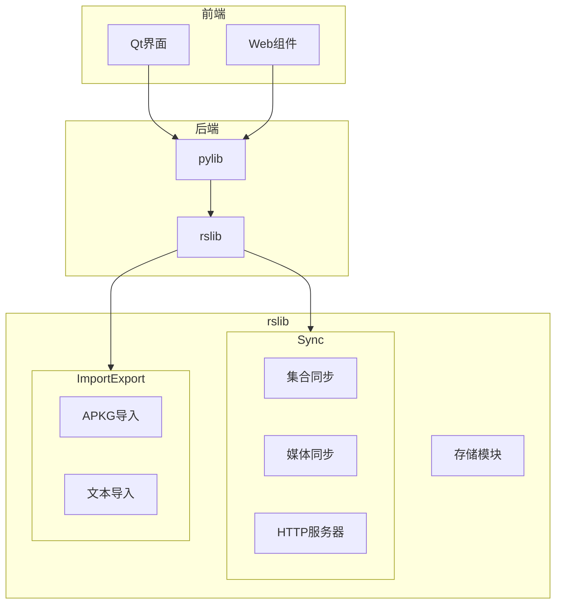
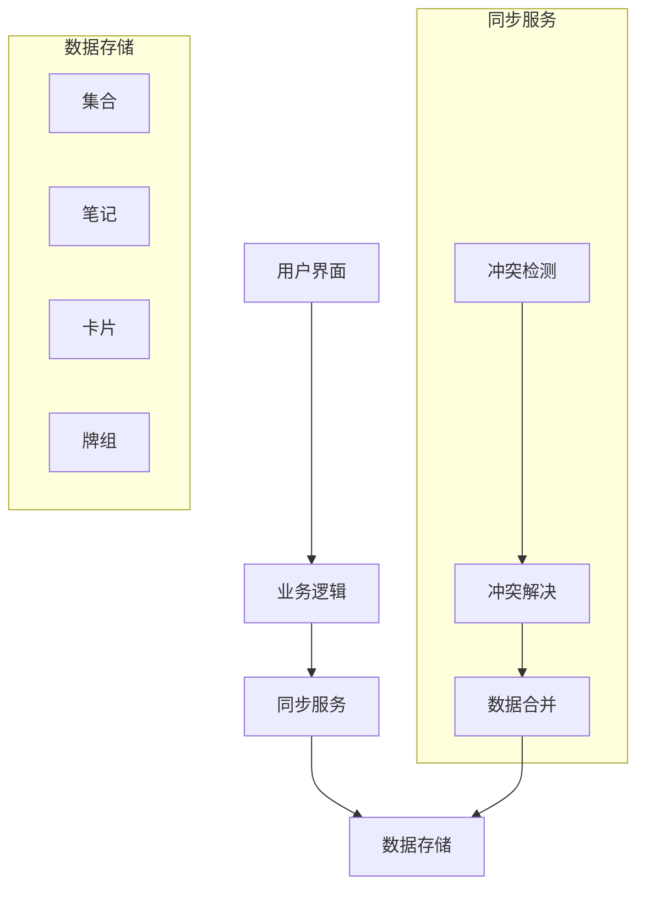
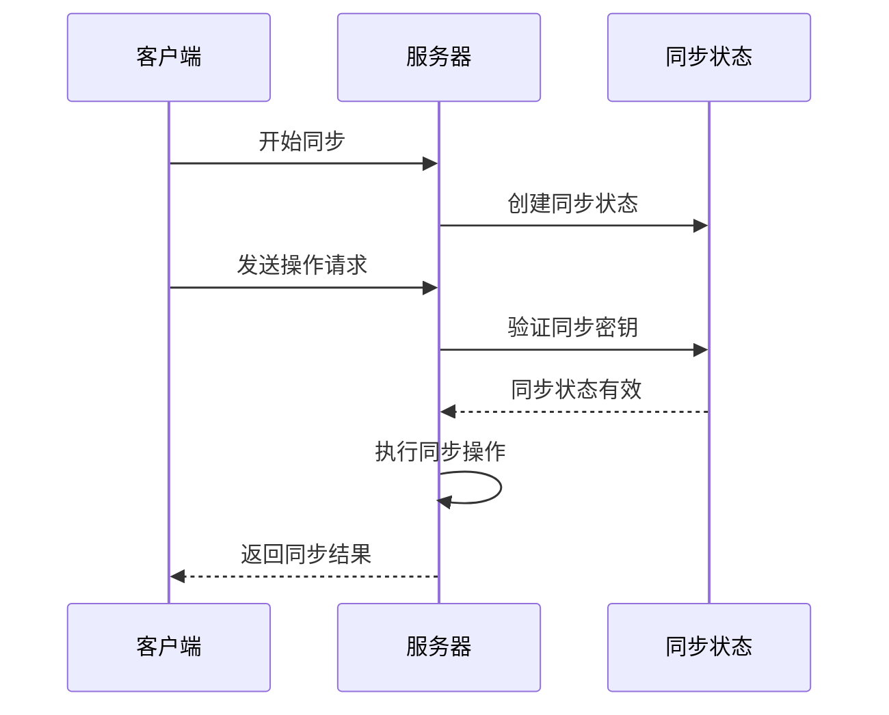
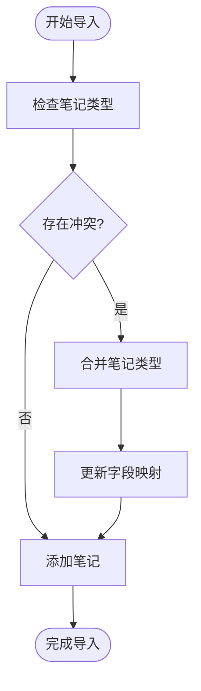
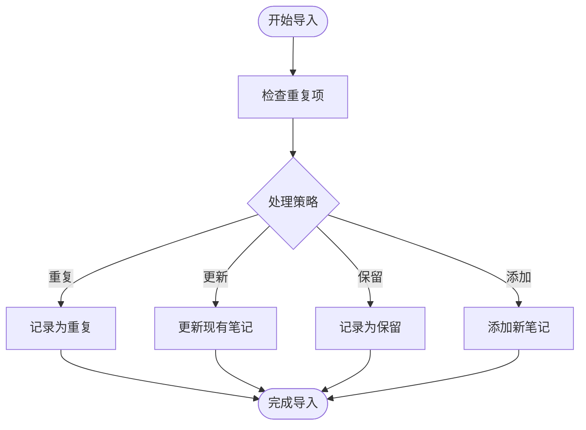
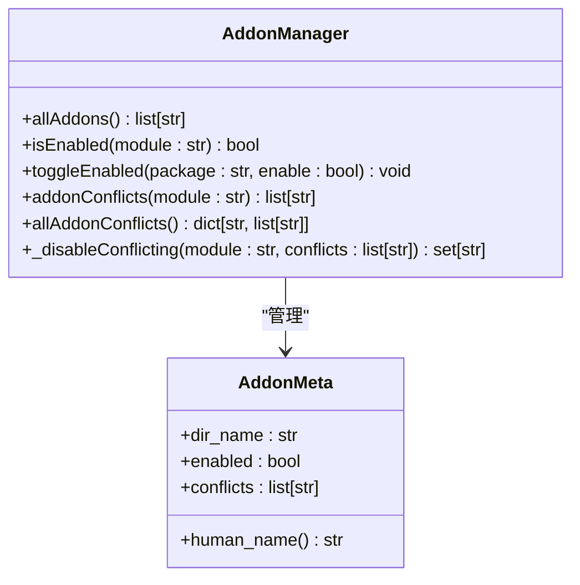
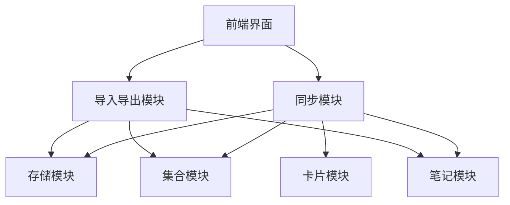

# 冲突解决

<cite>
**本文档中引用的文件**   
- [sync.rs](file://rslib/src/sync/mod.rs)
- [collection.rs](file://rslib/src/sync/collection/mod.rs)
- [user.rs](file://rslib/src/sync/http_server/user.rs)
- [routes.rs](file://rslib/src/sync/http_server/routes.rs)
- [meta.rs](file://rslib/src/sync/collection/meta.rs)
- [notes.rs](file://rslib/src/import_export/package/apkg/import/notes.rs)
- [text/import.rs](file://rslib/src/import_export/text/import.rs)
- [addons.py](file://qt/aqt/addons.py)
</cite>

## 目录
1. [简介](#简介)
2. [项目结构](#项目结构)
3. [核心组件](#核心组件)
4. [架构概述](#架构概述)
5. [详细组件分析](#详细组件分析)
6. [依赖分析](#依赖分析)
7. [性能考虑](#性能考虑)
8. [故障排除指南](#故障排除指南)
9. [结论](#结论)
10. [附录](#附录)（如有必要）

## 简介
Anki是一款流行的间隔重复软件，支持多设备间的双向同步。在多设备同时编辑同一数据时，冲突解决机制是确保数据一致性的关键。本文档深入探讨Anki的冲突解决机制，包括基于时间戳和版本向量的冲突检测算法、不同数据类型的冲突解决规则、合并策略、用户干预机制以及开发者扩展点。

## 项目结构
Anki的代码库采用模块化设计，主要分为Rust后端（rslib）和Python前端（pylib）两大部分。同步和冲突解决的核心逻辑主要位于rslib模块中，特别是sync和import_export子模块。

**图示来源**
- [mod.rs](file://rslib/src/sync/mod.rs#L1-L12)
- [mod.rs](file://rslib/src/import_export/mod.rs#L1-L10)

**本节来源**
- [mod.rs](file://rslib/src/sync/mod.rs#L1-L12)
- [mod.rs](file://rslib/src/import_export/mod.rs#L1-L10)

## 核心组件
Anki的冲突解决机制主要由同步模块和导入导出模块实现。同步模块负责处理设备间的双向同步冲突，而导入导出模块则处理从外部文件导入数据时的冲突。

**本节来源**
- [sync.rs](file://rslib/src/sync/mod.rs#L1-L12)
- [import.rs](file://rslib/src/import_export/text/import.rs#L1-L50)

## 架构概述
Anki的冲突解决架构采用分层设计，从底层的数据存储到上层的用户界面，各层协同工作以确保数据一致性。

**图示来源**
- [collection.rs](file://rslib/src/sync/collection/mod.rs#L1-L17)
- [notes.rs](file://rslib/src/notes/mod.rs#L1-L20)

## 详细组件分析

### 同步冲突检测
Anki使用基于时间戳和版本向量的冲突检测算法来识别双向同步中的数据冲突。

**图示来源**
- [user.rs](file://rslib/src/sync/http_server/user.rs#L35-L64)
- [routes.rs](file://rslib/src/sync/http_server/routes.rs#L1-L31)

**本节来源**
- [user.rs](file://rslib/src/sync/http_server/user.rs#L35-L64)
- [routes.rs](file://rslib/src/sync/http_server/routes.rs#L1-L31)

### 数据类型冲突解决
Anki针对不同数据类型（卡片、笔记、牌组）实现了特定的冲突解决规则。

#### 笔记冲突解决
当导入APKG文件时，Anki会检测并处理笔记类型的冲突。

**图示来源**
- [notes.rs](file://rslib/src/import_export/package/apkg/import/notes.rs#L554-L593)
- [notes.rs](file://rslib/src/import_export/package/apkg/import/notes.rs#L90-L136)

**本节来源**
- [notes.rs](file://rslib/src/import_export/package/apkg/import/notes.rs#L554-L593)
- [notes.rs](file://rslib/src/import_export/package/apkg/import/notes.rs#L90-L136)

#### 文本导入冲突解决
在文本导入过程中，Anki提供了多种重复项处理策略。

**图示来源**
- [import.rs](file://rslib/src/import_export/text/import.rs#L353-L387)
- [import.rs](file://rslib/src/import_export/text/import.rs#L386-L428)

**本节来源**
- [import.rs](file://rslib/src/import_export/text/import.rs#L353-L387)
- [import.rs](file://rslib/src/import_export/text/import.rs#L386-L428)

### 插件冲突解决
Anki的插件系统也实现了冲突解决机制，用于处理插件间的依赖冲突。

**图示来源**
- [addons.py](file://qt/aqt/addons.py#L386-L427)
- [addons.py](file://qt/aqt/addons.py#L113-L113)

**本节来源**
- [addons.py](file://qt/aqt/addons.py#L386-L427)
- [addons.py](file://qt/aqt/addons.py#L113-L113)

## 依赖分析
Anki的冲突解决机制依赖于多个核心模块的协同工作。

**图示来源**
- [mod.rs](file://rslib/src/sync/mod.rs#L1-L12)
- [mod.rs](file://rslib/src/import_export/mod.rs#L1-L10)

**本节来源**
- [mod.rs](file://rslib/src/sync/mod.rs#L1-L12)
- [mod.rs](file://rslib/src/import_export/mod.rs#L1-L10)

## 性能考虑
Anki的冲突解决机制在设计时考虑了性能因素，特别是在处理大量数据同步时。

- 使用高效的哈希表存储现有GUID，实现O(1)的查找性能
- 在导入过程中批量处理操作，减少数据库事务开销
- 采用增量同步策略，只传输变化的数据
- 对大型集合进行分块处理，避免内存溢出

## 故障排除指南
当遇到同步或导入冲突问题时，可以参考以下步骤进行排查：

1. 检查网络连接是否稳定
2. 验证AnkiWeb账户状态
3. 检查设备间的时钟同步
4. 查看同步日志中的错误信息
5. 尝试执行完整同步而非增量同步
6. 检查插件冲突并禁用相关插件

**本节来源**
- [user.rs](file://rslib/src/sync/http_server/user.rs#L35-L64)
- [addons.py](file://qt/aqt/addons.py#L386-L427)

## 结论
Anki的冲突解决机制通过多层次的设计确保了数据在多设备间的最终一致性。该机制不仅处理了同步过程中的冲突，还涵盖了从外部文件导入数据时的各种冲突场景。对于开发者而言，Anki提供了清晰的扩展点，允许自定义冲突解决策略以满足特定需求。

## 附录
### 常见冲突场景及处理方式
- **同时编辑同一笔记**：基于最后修改时间戳决定保留哪个版本
- **不同设备添加同名牌组**：合并为一个牌组并保留所有子牌组
- **导入包含已存在笔记的APKG**：根据用户选择的策略进行更新或跳过
- **插件功能冲突**：自动禁用冲突的插件并通知用户

### 最佳实践建议
- 定期执行完整同步以确保数据一致性
- 在多设备使用时保持系统时间同步
- 谨慎使用可能产生冲突的第三方插件
- 在重要数据修改前创建备份
- 理解不同导入策略的含义并根据需要选择