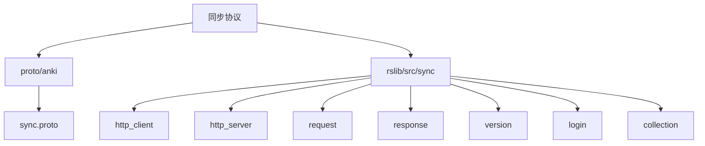
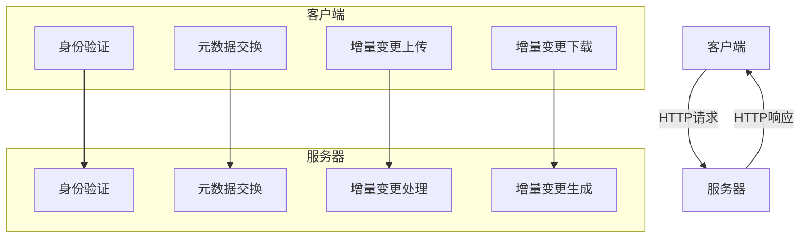
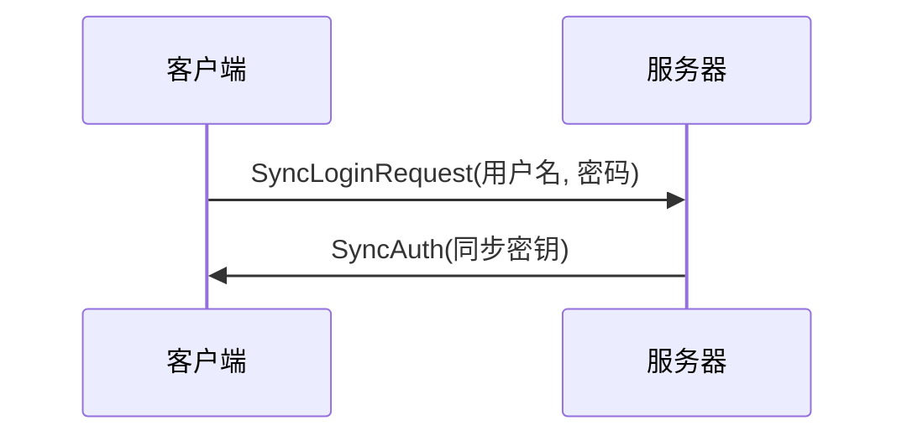
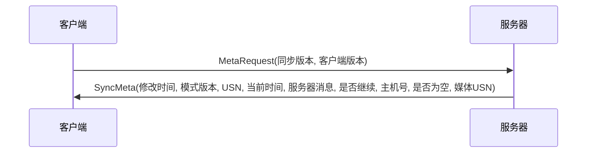
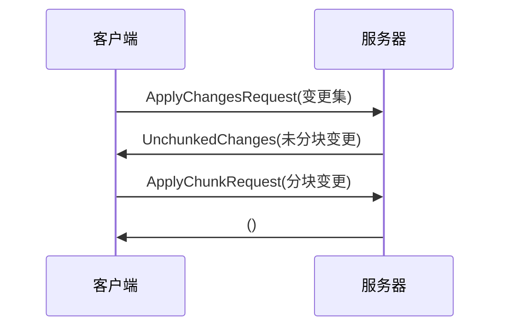
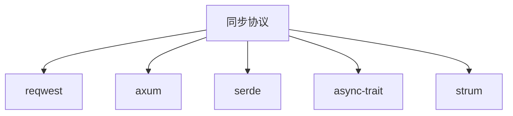

# 同步协议

<cite>
**本文档引用的文件**
- [sync.proto](file://proto/anki/sync.proto)
- [sync.rs](file://rslib/src/sync/mod.rs)
- [http_client/mod.rs](file://rslib/src/sync/http_client/mod.rs)
- [http_server/routes.rs](file://rslib/src/sync/http_server/routes.rs)
- [request/mod.rs](file://rslib/src/sync/request/mod.rs)
- [response.rs](file://rslib/src/sync/response.rs)
- [version.rs](file://rslib/src/sync/version.rs)
- [login.rs](file://rslib/src/sync/login.rs)
- [meta.rs](file://rslib/src/sync/collection/meta.rs)
- [protocol.rs](file://rslib/src/sync/collection/protocol.rs)
</cite>

## 目录
1. [简介](#简介)
2. [项目结构](#项目结构)
3. [核心组件](#核心组件)
4. [架构概述](#架构概述)
5. [详细组件分析](#详细组件分析)
6. [依赖分析](#依赖分析)
7. [性能考虑](#性能考虑)
8. [故障排除指南](#故障排除指南)
9. [结论](#结论)

## 简介
本文档详细描述了Anki同步协议的API，基于Protocol Buffers的通信协议。文档涵盖了身份验证、元数据交换、增量变更上传和下载的完整流程。每个消息类型的结构、字段定义和序列化格式都被详细记录，特别关注变更集（changeset）的压缩算法和分块传输机制。协议版本管理策略和向后兼容性处理也被解释。此外，提供了客户端实现指南，包括连接建立、心跳维持和错误重试机制。分析了协议在高延迟网络环境下的性能表现，并提供了优化建议。包含实际的协议交互时序图和错误码说明。

## 项目结构
Anki同步协议的实现分布在多个目录和文件中，主要集中在`proto/anki`和`rslib/src/sync`目录下。`proto/anki`目录包含所有Protocol Buffers定义，而`rslib/src/sync`目录包含同步协议的Rust实现。

**图示来源**
- [sync.proto](file://proto/anki/sync.proto)
- [sync.rs](file://rslib/src/sync/mod.rs)

**本节来源**
- [sync.rs](file://rslib/src/sync/mod.rs)
- [sync.proto](file://proto/anki/sync.proto)

## 核心组件
同步协议的核心组件包括身份验证、元数据交换、增量变更上传和下载。这些组件通过Protocol Buffers定义的消息类型进行通信，确保数据的一致性和完整性。

**本节来源**
- [sync.proto](file://proto/anki/sync.proto)
- [login.rs](file://rslib/src/sync/login.rs)
- [meta.rs](file://rslib/src/sync/collection/meta.rs)

## 架构概述
Anki同步协议采用客户端-服务器架构，通过HTTP协议进行通信。客户端和服务器之间通过Protocol Buffers定义的消息类型进行数据交换。协议支持多种同步模式，包括全量同步和增量同步。

**图示来源**
- [http_client/mod.rs](file://rslib/src/sync/http_client/mod.rs)
- [http_server/routes.rs](file://rslib/src/sync/http_server/routes.rs)

## 详细组件分析
### 身份验证分析
身份验证是同步协议的第一步，客户端通过发送用户名和密码来获取同步密钥（sync key）。同步密钥用于后续的所有同步请求。

**图示来源**
- [login.rs](file://rslib/src/sync/login.rs)
- [sync.proto](file://proto/anki/sync.proto)

**本节来源**
- [login.rs](file://rslib/src/sync/login.rs)
- [sync.proto](file://proto/anki/sync.proto)

### 元数据交换分析
元数据交换用于确定客户端和服务器之间的同步状态。客户端发送元数据请求，服务器返回当前的元数据，包括修改时间、模式版本、USN（更新序列号）等。

**图示来源**
- [meta.rs](file://rslib/src/sync/collection/meta.rs)
- [sync.proto](file://proto/anki/sync.proto)

**本节来源**
- [meta.rs](file://rslib/src/sync/collection/meta.rs)
- [sync.proto](file://proto/anki/sync.proto)

### 增量变更上传和下载分析
增量变更上传和下载是同步协议的核心功能。客户端和服务器通过分块传输机制交换变更集，确保数据的一致性和完整性。

**图示来源**
- [protocol.rs](file://rslib/src/sync/collection/protocol.rs)
- [sync.proto](file://proto/anki/sync.proto)

**本节来源**
- [protocol.rs](file://rslib/src/sync/collection/protocol.rs)
- [sync.proto](file://proto/anki/sync.proto)

## 依赖分析
同步协议的实现依赖于多个外部库和内部模块。主要依赖包括`reqwest`用于HTTP客户端，`axum`用于HTTP服务器，`serde`用于序列化和反序列化。

**图示来源**
- [http_client/mod.rs](file://rslib/src/sync/http_client/mod.rs)
- [http_server/routes.rs](file://rslib/src/sync/http_server/routes.rs)
- [request/mod.rs](file://rslib/src/sync/request/mod.rs)
- [response.rs](file://rslib/src/sync/response.rs)

**本节来源**
- [http_client/mod.rs](file://rslib/src/sync/http_client/mod.rs)
- [http_server/routes.rs](file://rslib/src/sync/http_server/routes.rs)
- [request/mod.rs](file://rslib/src/sync/request/mod.rs)
- [response.rs](file://rslib/src/sync/response.rs)

## 性能考虑
同步协议在高延迟网络环境下表现良好，通过分块传输机制和压缩算法优化数据传输。客户端和服务器之间的通信采用Zstd压缩算法，有效减少数据传输量。

**本节来源**
- [version.rs](file://rslib/src/sync/version.rs)
- [request/mod.rs](file://rslib/src/sync/request/mod.rs)
- [response.rs](file://rslib/src/sync/response.rs)

## 故障排除指南
### 常见错误码
- `400 Bad Request`: 请求格式错误
- `401 Unauthorized`: 身份验证失败
- `404 Not Found`: 请求的资源不存在
- `500 Internal Server Error`: 服务器内部错误

**本节来源**
- [error.rs](file://rslib/src/sync/error.rs)
- [http_client/mod.rs](file://rslib/src/sync/http_client/mod.rs)
- [http_server/routes.rs](file://rslib/src/sync/http_server/routes.rs)

## 结论
Anki同步协议通过Protocol Buffers定义的消息类型和HTTP协议实现了高效、可靠的数据同步。协议支持多种同步模式，包括全量同步和增量同步，确保数据的一致性和完整性。通过分块传输机制和压缩算法优化数据传输，协议在高延迟网络环境下表现良好。客户端实现指南提供了连接建立、心跳维持和错误重试机制，确保同步过程的稳定性和可靠性。