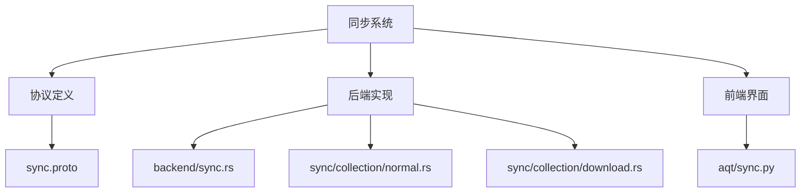
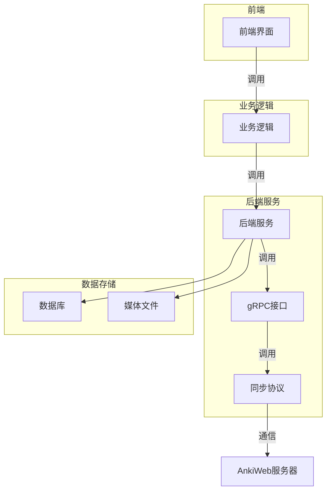
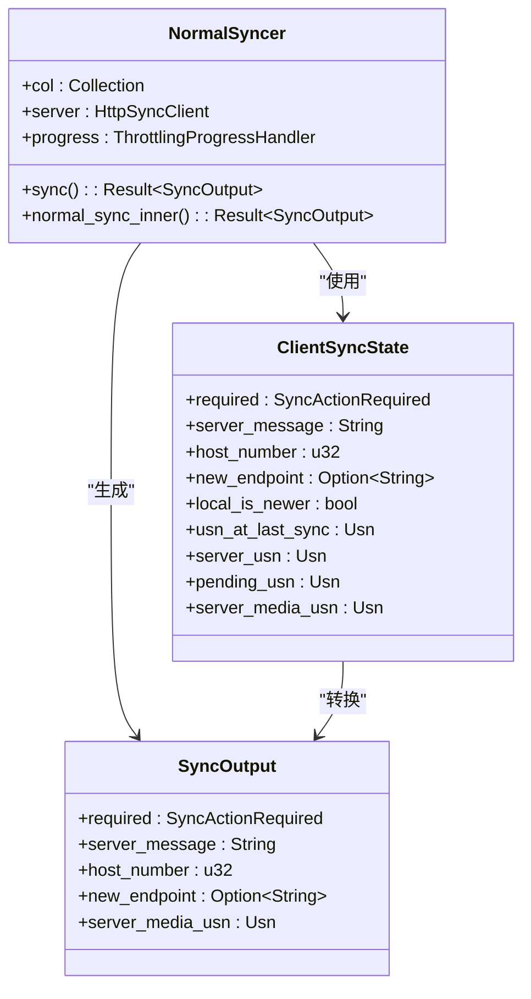
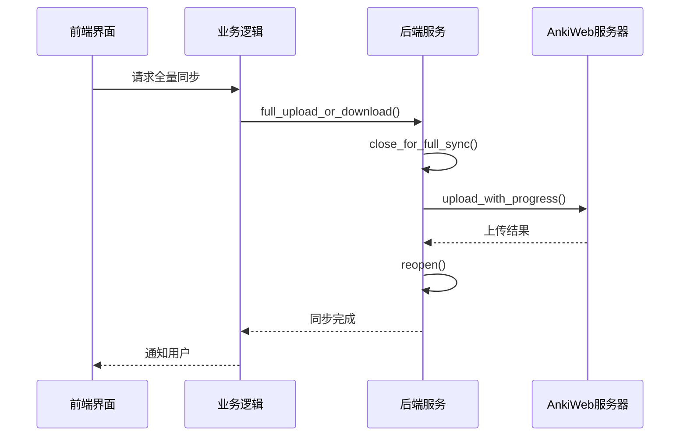
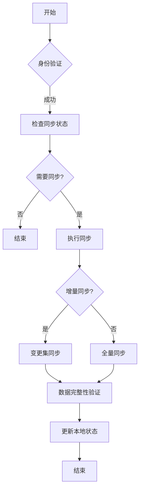
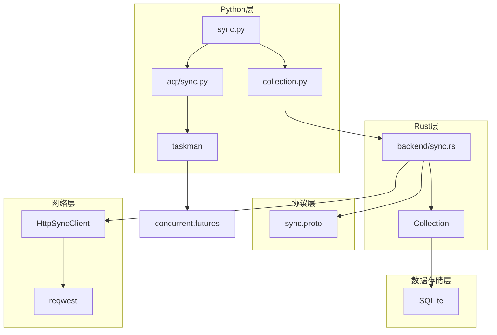

# 同步系统

<cite>
**本文档中引用的文件**  
- [sync.py](file://pylib/anki/sync.py)
- [collection.py](file://pylib/anki/collection.py)
- [sync.proto](file://proto/anki/sync.proto)
- [sync.rs](file://rslib/src/backend/sync.rs)
- [normal.rs](file://rslib/src/sync/collection/normal.rs)
- [download.rs](file://rslib/src/sync/collection/download.rs)
- [sync.py](file://qt/aqt/sync.py)
</cite>

## 目录
1. [简介](#简介)
2. [项目结构](#项目结构)
3. [核心组件](#核心组件)
4. [架构概述](#架构概述)
5. [详细组件分析](#详细组件分析)
6. [依赖分析](#依赖分析)
7. [性能考虑](#性能考虑)
8. [故障排除指南](#故障排除指南)
9. [结论](#结论)

## 简介
Anki同步系统实现了本地与云端数据的双向同步机制，支持增量同步、冲突解决和数据完整性验证。该系统通过gRPC协议与AnkiWeb服务器通信，采用分层架构设计，包含前端界面、业务逻辑和底层数据存储三个主要层次。同步过程分为正常同步和全量同步两种模式，根据本地和远程数据状态自动选择合适的同步策略。

## 项目结构
Anki同步系统分布在多个目录中，主要包括协议定义、后端实现和前端界面三大部分。协议定义位于proto目录，后端实现主要在rslib/src/backend和rslib/src/sync目录，前端界面实现在qt/aqt目录。

**图示来源**  
- [sync.proto](file://proto/anki/sync.proto)
- [sync.rs](file://rslib/src/backend/sync.rs)
- [normal.rs](file://rslib/src/sync/collection/normal.rs)
- [download.rs](file://rslib/src/sync/collection/download.rs)
- [sync.py](file://qt/aqt/sync.py)

**本节来源**  
- [sync.proto](file://proto/anki/sync.proto)
- [sync.rs](file://rslib/src/backend/sync.rs)
- [sync.py](file://qt/aqt/sync.py)

## 核心组件
同步系统的核心组件包括同步认证、状态检查、增量同步和全量同步。系统通过SyncAuth消息进行身份验证，使用SyncStatusResponse检查同步需求，通过SyncCollectionResponse协调同步过程。增量同步采用变更集比较算法，全量同步则直接传输整个数据库文件。

**本节来源**  
- [sync.py](file://pylib/anki/sync.py)
- [sync.proto](file://proto/anki/sync.proto)
- [sync.rs](file://rslib/src/backend/sync.rs)

## 架构概述
Anki同步系统采用分层架构设计，从前端界面到后端服务形成清晰的调用链路。系统通过gRPC接口暴露同步功能，内部实现分为协议层、业务逻辑层和数据访问层。

**图示来源**  
- [sync.py](file://qt/aqt/sync.py)
- [sync.rs](file://rslib/src/backend/sync.rs)
- [collection.py](file://pylib/anki/collection.py)

## 详细组件分析

### 增量同步分析
增量同步是Anki同步系统的核心功能，通过比较本地和远程的数据状态来确定需要同步的变更。系统使用USN（更新序列号）机制跟踪数据变更，确保双向同步的一致性。

**图示来源**  
- [normal.rs](file://rslib/src/sync/collection/normal.rs)
- [sync.rs](file://rslib/src/backend/sync.rs)

**本节来源**  
- [normal.rs](file://rslib/src/sync/collection/normal.rs)
- [sync.rs](file://rslib/src/backend/sync.rs)
- [collection.py](file://pylib/anki/collection.py)

### 全量同步分析
全量同步用于处理本地或远程数据为空的情况，通过直接传输整个数据库文件实现数据同步。系统在执行全量同步前会创建备份，确保数据安全。

**图示来源**  
- [download.rs](file://rslib/src/sync/collection/download.rs)
- [sync.rs](file://rslib/src/backend/sync.rs)
- [sync.py](file://qt/aqt/sync.py)

**本节来源**  
- [download.rs](file://rslib/src/sync/collection/download.rs)
- [sync.rs](file://rslib/src/backend/sync.rs)
- [sync.py](file://qt/aqt/sync.py)

### 同步协议分析
同步协议定义了客户端与服务器之间的通信格式和流程，采用Protocol Buffers进行数据序列化，确保跨平台兼容性。

**图示来源**  
- [sync.proto](file://proto/anki/sync.proto)
- [sync.rs](file://rslib/src/backend/sync.rs)

**本节来源**  
- [sync.proto](file://proto/anki/sync.proto)
- [sync.rs](file://rslib/src/backend/sync.rs)
- [normal.rs](file://rslib/src/sync/collection/normal.rs)

## 依赖分析
同步系统依赖于多个核心组件和外部库，形成复杂的依赖关系网络。

**图示来源**  
- [sync.py](file://pylib/anki/sync.py)
- [collection.py](file://pylib/anki/collection.py)
- [sync.rs](file://rslib/src/backend/sync.rs)
- [sync.proto](file://proto/anki/sync.proto)

**本节来源**  
- [sync.py](file://pylib/anki/sync.py)
- [collection.py](file://pylib/anki/collection.py)
- [sync.rs](file://rslib/src/backend/sync.rs)
- [sync.proto](file://proto/anki/sync.proto)

## 性能考虑
同步系统的性能优化主要体现在以下几个方面：采用增量同步减少数据传输量，使用事务批量处理数据库操作，通过进度监控提供用户反馈，以及实现断点续传避免重复传输。系统还设置了数据大小限制，防止过大的同步请求影响服务稳定性。

## 故障排除指南
当同步出现问题时，可以按照以下步骤进行排查：首先检查网络连接是否正常，然后确认账户认证信息是否正确，接着查看同步日志获取详细错误信息。对于常见的同步冲突，系统会提示用户选择上传或下载。如果问题持续存在，可以尝试执行全量同步或联系技术支持。

**本节来源**  
- [sync.py](file://qt/aqt/sync.py)
- [sync.rs](file://rslib/src/backend/sync.rs)
- [errors.ftl](file://ftl/core/errors.ftl)

## 结论
Anki同步系统通过精心设计的架构和协议，实现了可靠的数据同步功能。系统采用分层设计，分离关注点，提高了代码的可维护性。增量同步和全量同步相结合的策略，既保证了日常使用的效率，又确保了数据恢复的可靠性。未来可以进一步优化同步算法，减少冲突发生的概率，并增强错误处理能力。