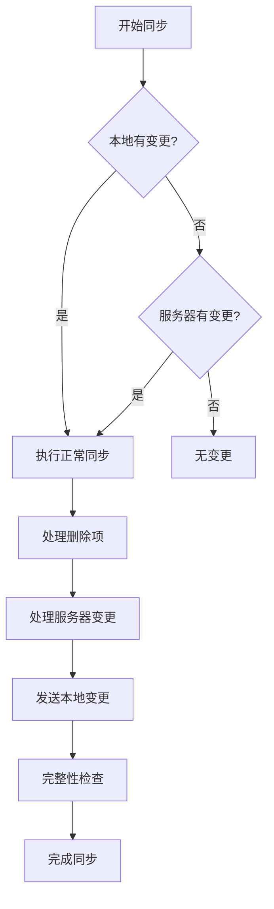
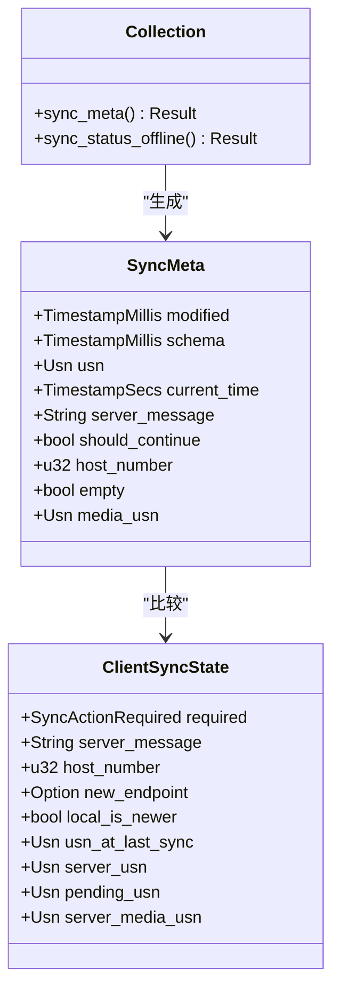
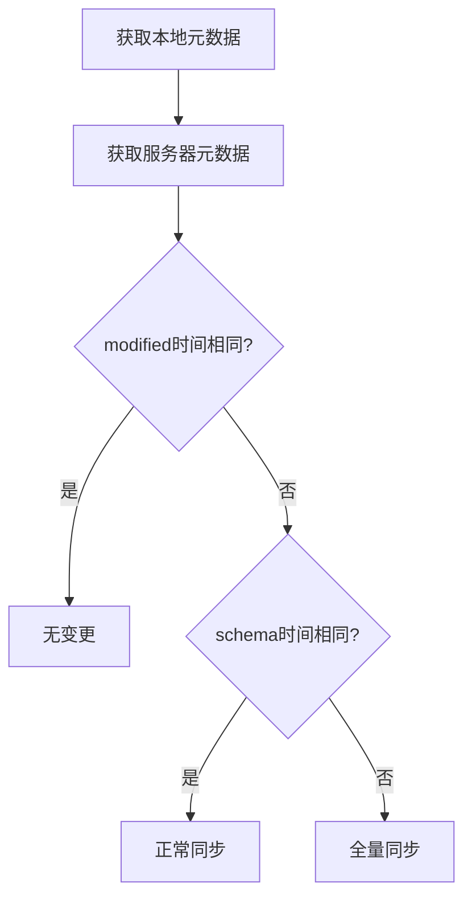
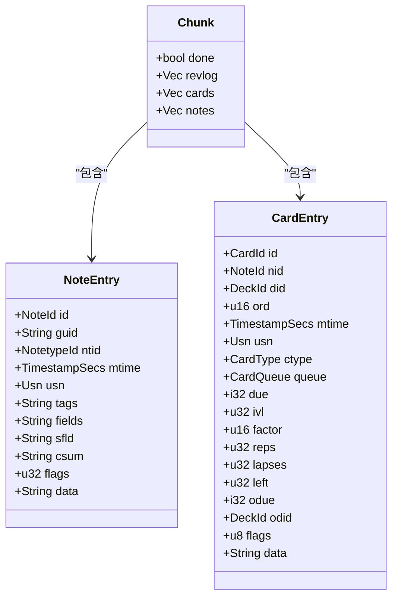
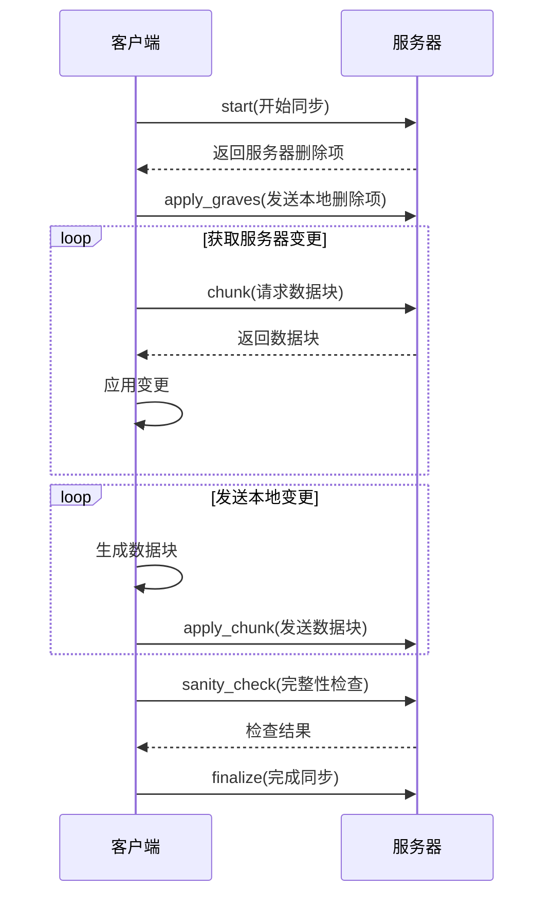
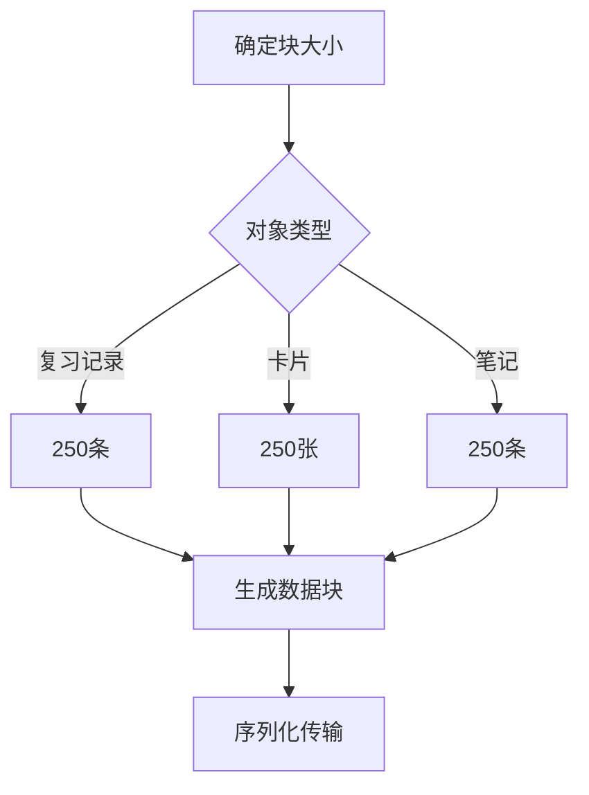
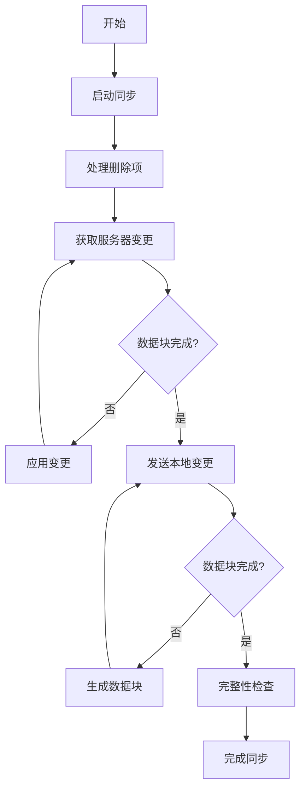
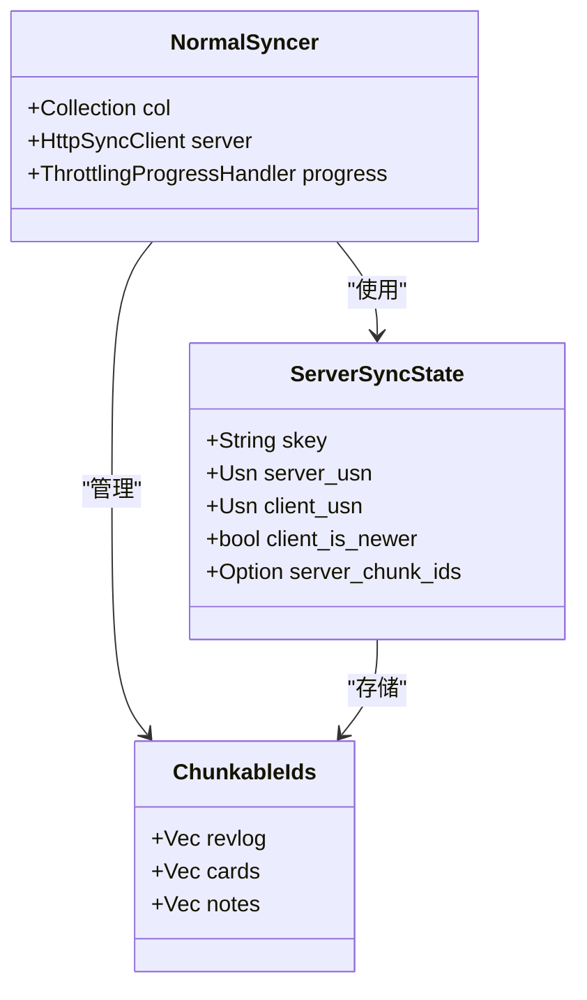

# 性能优化

<cite>
**本文档引用的文件**
- [sync.rs](file://rslib/src/backend/sync.rs)
- [normal.rs](file://rslib/src/sync/collection/normal.rs)
- [meta.rs](file://rslib/src/sync/collection/meta.rs)
- [start.rs](file://rslib/src/sync/collection/start.rs)
- [chunks.rs](file://rslib/src/sync/collection/chunks.rs)
- [status.rs](file://rslib/src/sync/collection/status.rs)
- [progress.rs](file://rslib/src/sync/collection/progress.rs)
- [sanity.rs](file://rslib/src/sync/collection/sanity.rs)
- [sync.py](file://qt/aqt/sync.py)
- [syncer.rs](file://rslib/src/sync/media/syncer.rs)
</cite>

## 目录
1. [引言](#引言)
2. [增量同步算法](#增量同步算法)
3. [分块传输机制](#分块传输机制)
4. [断点续传功能](#断点续传功能)
5. [大文件同步策略](#大文件同步策略)
6. [性能监控与调优](#性能监控与调优)
7. [性能测试结果](#性能测试结果)
8. [优化建议](#优化建议)
9. [结论](#结论)

## 引言
Anki同步系统采用先进的增量同步算法，确保用户在不同设备间高效、可靠地同步学习数据。本文档深入分析Anki同步性能优化的各个方面，包括变更跟踪、差异计算、数据压缩、分块传输和断点续传等核心机制。通过详细的技术分析和性能调优建议，帮助用户在各种网络条件下获得最佳的同步体验。

## 增量同步算法

Anki的增量同步算法基于USN（更新序列号）和时间戳机制，实现高效的变更跟踪和差异计算。系统通过比较本地和服务器端的元数据来确定同步需求，避免了不必要的全量同步。



**图示来源**
- [normal.rs](file://rslib/src/sync/collection/normal.rs#L68-L97)
- [status.rs](file://rslib/src/sync/collection/status.rs#L0-L57)

### 变更跟踪机制
Anki使用USN（更新序列号）和时间戳来跟踪数据变更。每个修改的操作都会增加USN计数器，系统通过比较USN和时间戳来确定数据的新旧状态。



**图示来源**
- [meta.rs](file://rslib/src/sync/collection/meta.rs#L0-L185)
- [normal.rs](file://rslib/src/sync/collection/normal.rs#L0-L178)

### 差异计算策略
差异计算通过比较本地和服务器的元数据来确定同步操作类型。系统支持三种同步类型：无变更、正常同步和全量同步。



**图示来源**
- [meta.rs](file://rslib/src/sync/collection/meta.rs#L0-L185)
- [status.rs](file://rslib/src/sync/collection/status.rs#L0-L57)

### 数据压缩方法
Anki在传输过程中采用多种数据压缩策略，包括字段分隔符优化、数据序列化和批量传输。NoteEntry和CardEntry使用元组序列化格式，减少JSON开销。



**图示来源**
- [chunks.rs](file://rslib/src/sync/collection/chunks.rs#L0-L432)
- [meta.rs](file://rslib/src/sync/collection/meta.rs#L0-L185)

**本节来源**
- [meta.rs](file://rslib/src/sync/collection/meta.rs#L0-L185)
- [chunks.rs](file://rslib/src/sync/collection/chunks.rs#L0-L432)
- [normal.rs](file://rslib/src/sync/collection/normal.rs#L0-L178)

## 分块传输机制

Anki的分块传输机制将大数据集分割成小块进行传输，提高网络效率和可靠性。系统使用固定大小的块（默认250个对象）来平衡传输效率和内存使用。



**图示来源**
- [chunks.rs](file://rslib/src/sync/collection/chunks.rs#L0-L432)
- [start.rs](file://rslib/src/sync/collection/start.rs#L0-L185)
- [normal.rs](file://rslib/src/sync/collection/normal.rs#L0-L178)

### 块大小配置
块大小通过常量CHUNK_SIZE定义，当前设置为250。这个值在内存使用和网络效率之间取得了平衡。



**图示来源**
- [chunks.rs](file://rslib/src/sync/collection/chunks.rs#L0-L432)

### 传输流程
分块传输遵循严格的流程，确保数据一致性和完整性。流程包括开始同步、处理删除项、获取服务器变更、发送本地变更和完整性检查。



**图示来源**
- [normal.rs](file://rslib/src/sync/collection/normal.rs#L0-L178)
- [chunks.rs](file://rslib/src/sync/collection/chunks.rs#L0-L432)

**本节来源**
- [chunks.rs](file://rslib/src/sync/collection/chunks.rs#L0-L432)
- [normal.rs](file://rslib/src/sync/collection/normal.rs#L0-L178)
- [start.rs](file://rslib/src/sync/collection/start.rs#L0-L185)

## 断点续传功能

Anki的断点续传功能通过状态保持和USN跟踪实现，确保在网络中断后能够从中断点继续同步，避免重复传输已同步的数据。



**图示来源**
- [start.rs](file://rslib/src/sync/collection/start.rs#L0-L185)
- [chunks.rs](file://rslib/src/sync/collection/chunks.rs#L0-L432)

### 状态保持机制
系统通过ServerSyncState结构体保持同步状态，包括会话密钥、USN值和块ID列表。这些状态信息在同步过程中持续更新。

```mermaid
sequenceDiagram
    participant 客户端
    participant 服务器
    
    客户端->>服务器: start(开始)
    服务器->>服务器