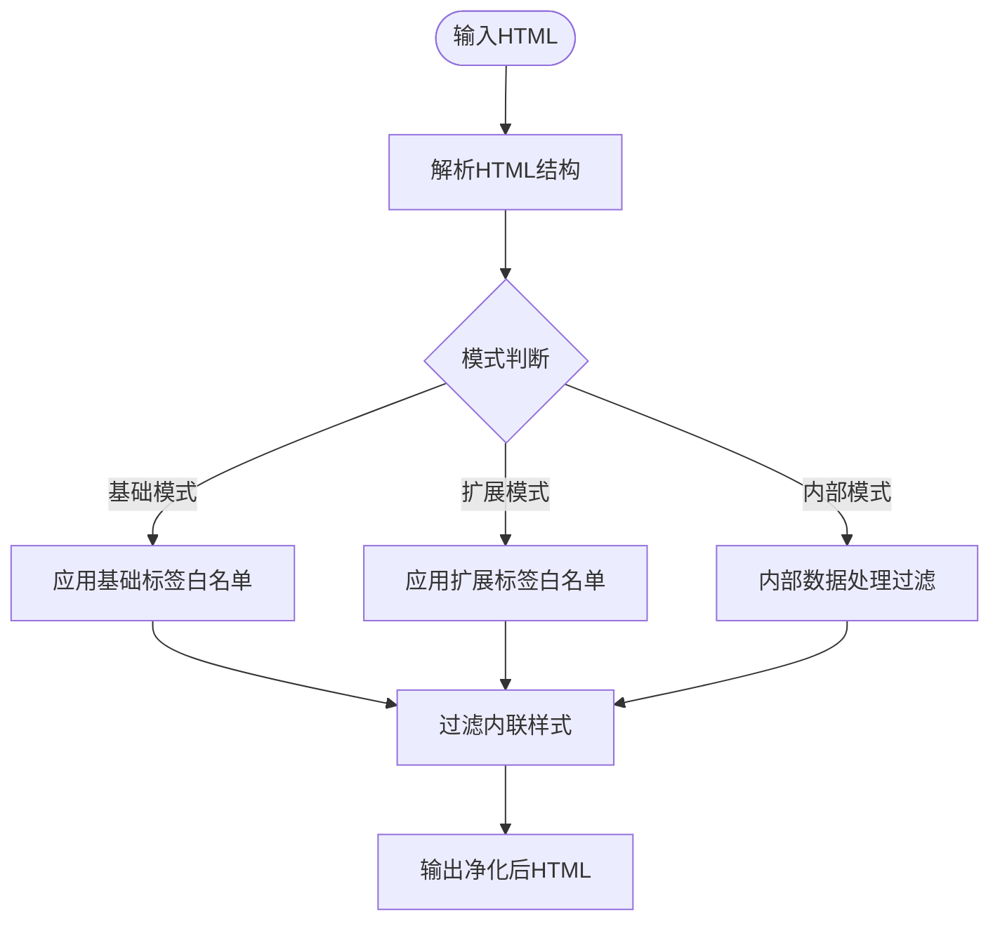
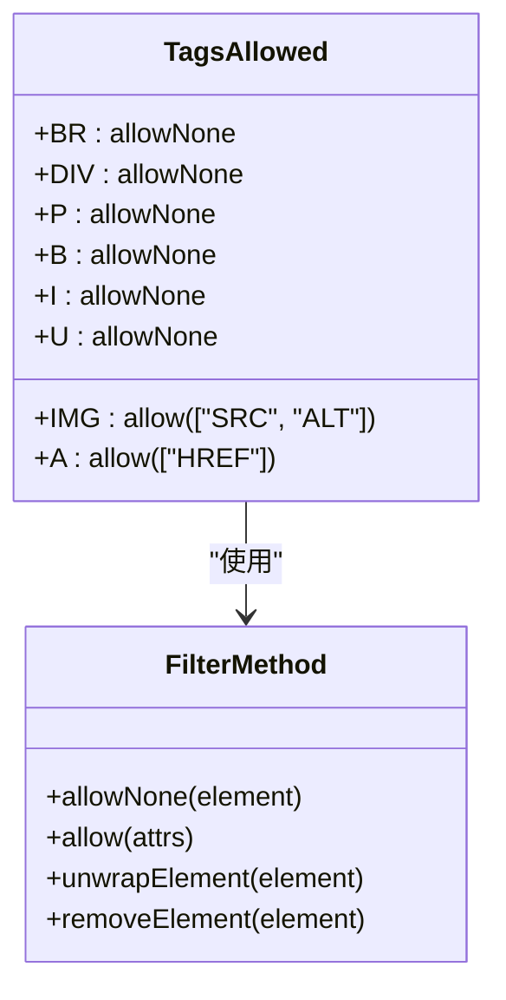
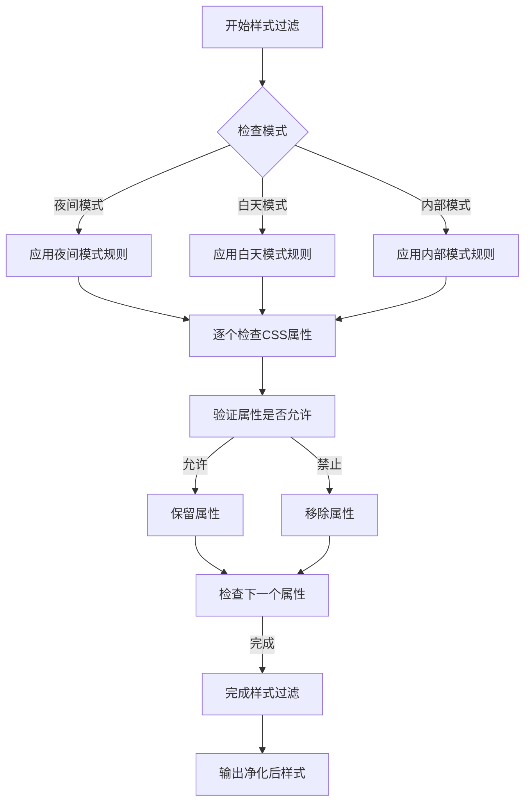
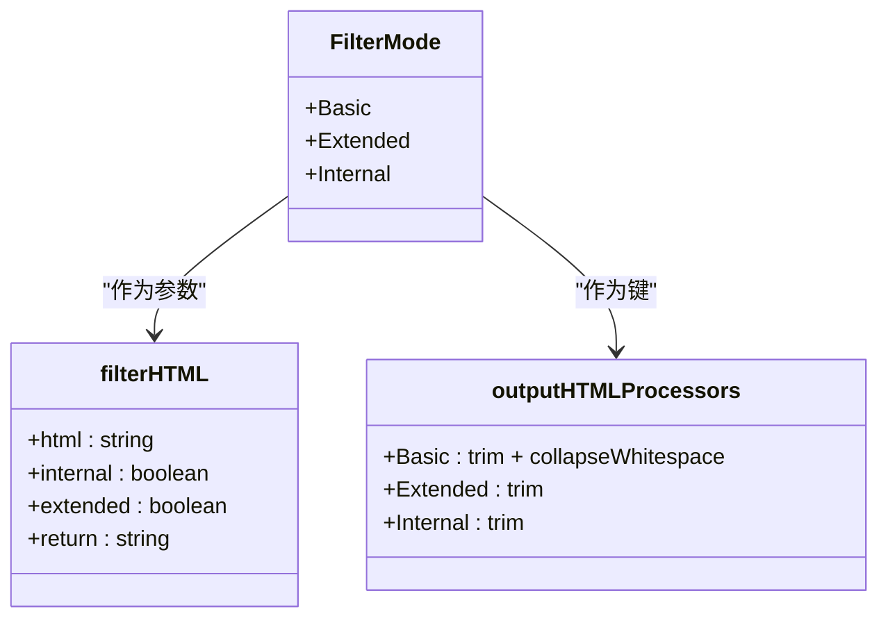

# 模板安全机制

<cite>
**本文档中引用的文件**  
- [element.ts](file://ts/html-filter/element.ts)
- [index.ts](file://ts/html-filter/index.ts)
- [styling.ts](file://ts/html-filter/styling.ts)
- [template_filters.rs](file://rslib/src/template_filters.rs)
- [template.py](file://pylib/anki/template.py)
- [text.rs](file://rslib/src/text.rs)
</cite>

## 目录
1. [引言](#引言)
2. [HTML过滤器实现原理](#html过滤器实现原理)
3. [标签与属性白名单](#标签与属性白名单)
4. [JavaScript执行限制](#javascript执行限制)
5. [CSS样式净化过程](#css样式净化过程)
6. [跨平台一致性保障](#跨平台一致性保障)
7. [安全检查代码示例](#安全检查代码示例)
8. [新手模板设计实践](#新手模板设计实践)
9. [安全机制可扩展性分析](#安全机制可扩展性分析)
10. [结论](#结论)

## 引言
Anki模板系统通过多层次的安全机制来确保用户生成内容的安全性，防止恶意代码注入和跨站脚本攻击（XSS）。该系统采用HTML过滤、CSS净化和JavaScript执行限制等技术手段，在保证功能完整性的同时，最大限度地降低安全风险。核心安全逻辑分布在前端TypeScript代码和后端Rust代码中，通过协同工作实现全面的内容净化。

## HTML过滤器实现原理
Anki的HTML过滤器采用分层处理机制，根据不同的使用场景应用不同级别的过滤策略。过滤器通过解析HTML结构，逐元素检查标签和属性，移除或修改不符合安全规范的内容。系统定义了三种过滤模式：基础模式、扩展模式和内部模式，分别对应不同的安全级别和使用场景。



**图示来源**
- [index.ts](file://ts/html-filter/index.ts#L34-L45)
- [element.ts](file://ts/html-filter/element.ts#L89-L99)

## 标签与属性白名单
系统维护严格的HTML标签和属性白名单，只允许安全的元素通过。基础模式允许最基本的文本格式化标签，而扩展模式在此基础上增加更多布局和语义标签。

### 基础模式允许的标签
- BR：换行标签，无属性
- IMG：图片标签，仅允许SRC和ALT属性
- DIV、P：块级容器，无属性
- SUB、SUP：上下标，无属性
- TITLE：标题标签，无属性

### 扩展模式额外允许的标签
- A：链接标签，仅允许HREF属性
- B、I、U、STRONG、EM：文本强调标签
- H1-H3：标题标签
- TABLE、TR、TD、TH：表格相关标签
- UL、OL、LI：列表标签
- CODE、PRE：代码块标签
- SPAN：内联容器，仅允许STYLE属性



**图示来源**
- [element.ts](file://ts/html-filter/element.ts#L44-L88)
- [element.ts](file://ts/html-filter/element.ts#L101-L102)

## JavaScript执行限制
Anki模板系统通过多种机制严格限制JavaScript的执行，从根本上防止XSS攻击。系统不支持任何内联JavaScript事件处理器，如onclick、onload等属性会被自动移除。同时，javascript:协议的URL也会被过滤器拦截。

安全机制还包括：
- 禁止script标签的使用
- 移除所有事件属性（on*）
- 过滤data:和javascript:协议的URL
- 在CSS样式中禁用expression()函数
- 限制外部资源加载

这些措施确保了即使用户尝试注入恶意脚本，也无法在Anki的渲染环境中执行。

**安全来源**
- [element.ts](file://ts/html-filter/element.ts#L44-L108)
- [text.rs](file://rslib/src/text.rs#L20-L30)

## CSS样式净化过程
CSS样式净化是Anki安全机制的重要组成部分，通过精确控制允许的CSS属性和值来防止样式相关的攻击。系统采用基于规则的过滤策略，对每个CSS属性进行验证。

### 夜间模式样式过滤
- 保留：font-weight, font-style, text-decoration-line
- 移除：所有其他属性

### 白天模式样式过滤
- 保留：color属性
- 保留：非transparent的background-color
- 保留：font-weight, font-style, text-decoration-line
- 移除：所有其他属性

### 内部处理样式过滤
- 保留：所有属性
- 移除：font-size, font-family, width, height, max-width, max-height



**图示来源**
- [styling.ts](file://ts/html-filter/styling.ts#L0-L53)
- [element.ts](file://ts/html-filter/element.ts#L40-L45)

## 跨平台一致性保障
Anki通过统一的安全架构确保在不同平台（桌面端、移动端、Web端）上提供一致的安全保护。核心安全逻辑使用Rust实现，作为后端服务提供统一的过滤接口，而前端TypeScript代码则负责用户界面的即时预览和输入验证。

### 平台间安全机制协调
- **桌面端**：使用Qt WebEngine进行渲染，通过WebChannel与Rust后端通信
- **移动端**：使用原生WebView组件，调用相同的Rust过滤API
- **Web端**：在浏览器中运行TypeScript过滤器，结果与后端保持一致

这种架构设计确保了无论用户在哪个平台创建或查看卡片，都会受到相同级别的安全保护，避免了因平台差异导致的安全漏洞。

**安全来源**
- [index.ts](file://ts/html-filter/index.ts#L0-L55)
- [template.py](file://pylib/anki/template.py#L0-L343)

## 安全检查代码示例
Anki的安全检查实现体现了模块化和可维护的设计理念。以下是关键代码结构的分析：

### 过滤模式枚举
系统定义了三种过滤模式，通过枚举类型进行管理，确保类型安全和代码可读性。



### 性能影响分析
安全过滤机制在设计时充分考虑了性能因素：
- 使用惰性求值减少不必要的计算
- 通过预编译正则表达式提高匹配效率
- 采用增量更新策略避免全量重渲染
- 在Rust后端执行耗时操作，保持前端响应性

这些优化确保了即使在处理复杂模板时，用户也能获得流畅的编辑体验。

**代码来源**
- [index.ts](file://ts/html-filter/index.ts#L34-L45)
- [text.rs](file://rslib/src/text.rs#L100-L120)

## 新手模板设计实践
为帮助新手用户安全地设计模板，Anki提供了以下最佳实践指导：

### 安全设计原则
1. **使用白名单内的HTML标签**：仅使用系统允许的标签进行格式化
2. **避免内联样式**：使用Anki内置的样式系统而非自定义CSS
3. **谨慎使用图片**：确保图片来源可靠，避免外部链接
4. **测试模板安全性**：在不同平台上预览模板效果

### 推荐的模板结构
```html
<div class="card">
  <div class="question">{{Front}}</div>
  <hr>
  <div class="answer">{{Back}}</div>
</div>
```

这种结构既美观又安全，完全在Anki的安全框架内运行。

### 常见错误避免
- ❌ 避免使用script标签
- ❌ 避免使用on*事件处理器
- ❌ 避免使用javascript:协议
- ✅ 推荐使用Anki内置的模板过滤器

**实践来源**
- [template.py](file://pylib/anki/template.py#L0-L343)
- [element.ts](file://ts/html-filter/element.ts#L44-L108)

## 安全机制可扩展性分析
Anki的安全架构设计具有良好的可扩展性，允许开发者在不破坏现有安全模型的前提下进行定制化扩展。

### 扩展点分析
1. **自定义过滤器**：通过Python钩子系统添加新的文本处理功能
2. **白名单调整**：在特定场景下动态调整标签和属性白名单
3. **新过滤模式**：添加新的过滤级别以适应特殊需求

### 定制化可能性
- **教育机构**：可以添加机构特定的安全策略
- **专业领域**：为特定学科（如医学、法律）定制安全规则
- **企业部署**：集成企业级安全标准和合规要求

这种可扩展性设计使得Anki既能满足普通用户的安全需求，又能适应专业场景的特殊要求。

**扩展来源**
- [template_filters.rs](file://rslib/src/template_filters.rs#L0-L303)
- [template.py](file://pylib/anki/template.py#L0-L343)

## 结论
Anki的模板安全机制通过多层次、多组件的协同工作，构建了一个坚固的安全防线。从HTML标签过滤到CSS样式净化，从JavaScript执行限制到跨平台一致性保障，每个环节都经过精心设计和严格测试。该系统不仅有效防止了常见的Web安全威胁，还通过模块化架构保持了良好的可扩展性，为未来的安全增强留下了充足空间。对于用户而言，这意味着可以在享受Anki强大功能的同时，无需担心内容安全问题。