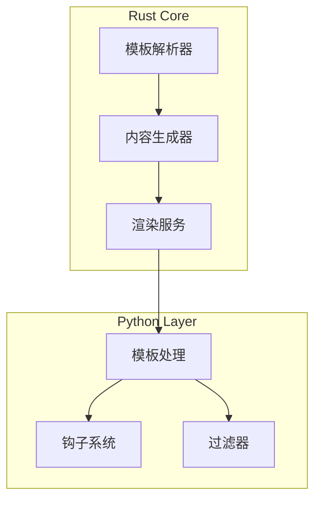
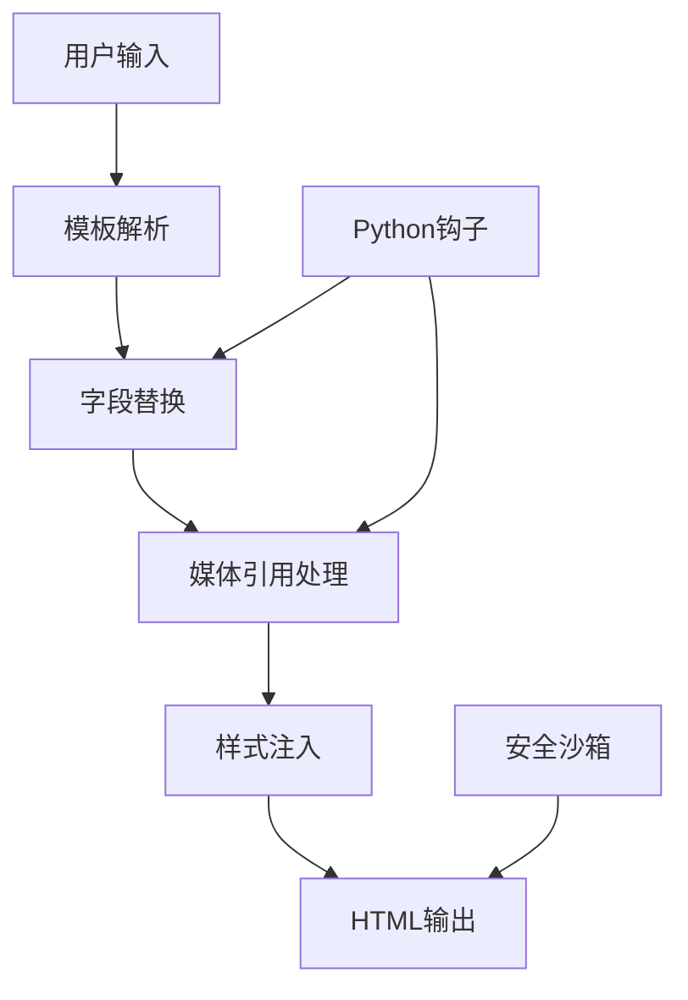
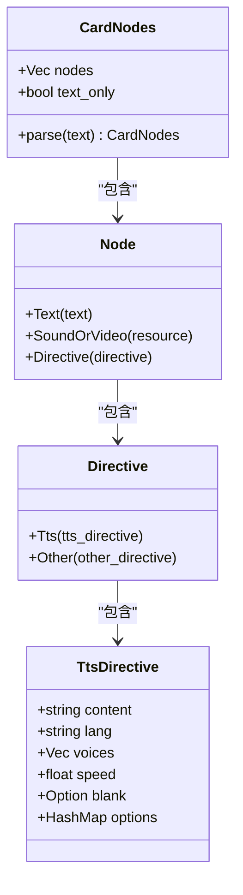
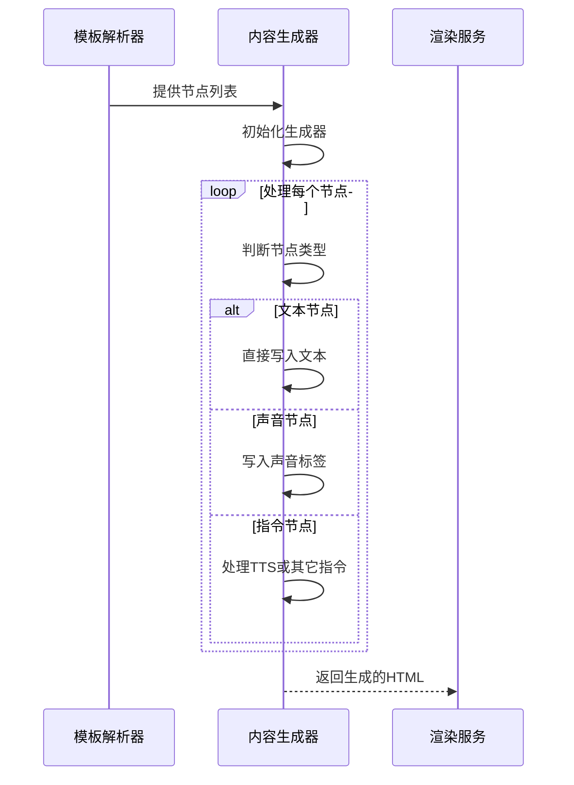
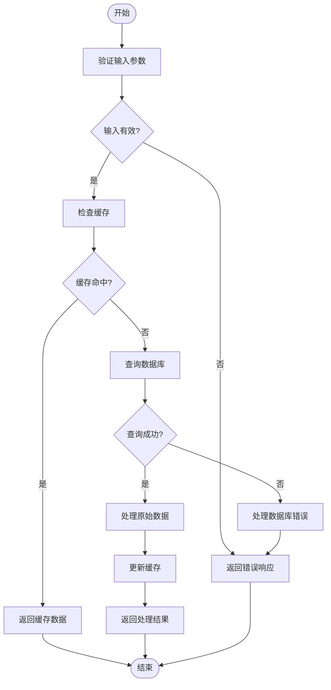
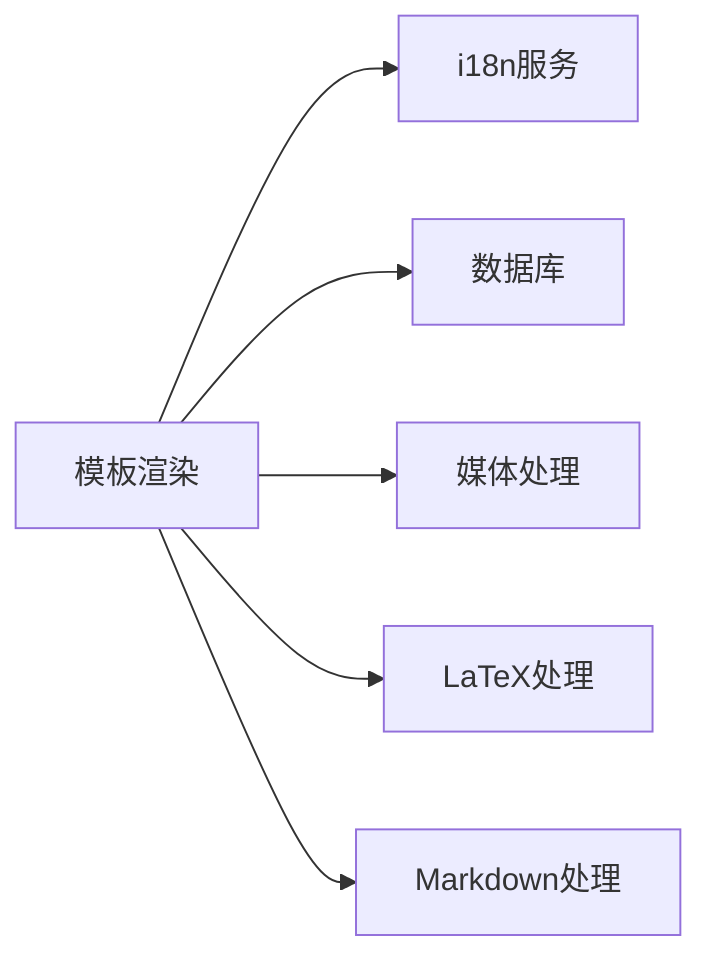

# 模板渲染机制

<cite>
**本文档中引用的文件**  
- [card_rendering.proto](file://proto/anki/card_rendering.proto)
- [service.rs](file://rslib/src/card_rendering/service.rs)
- [parser.rs](file://rslib/src/card_rendering/parser.rs)
- [writer.rs](file://rslib/src/card_rendering/writer.rs)
- [template.py](file://pylib/anki/template.py)
</cite>

## 目录
1. [简介](#简介)
2. [项目结构](#项目结构)
3. [核心组件](#核心组件)
4. [架构概述](#架构概述)
5. [详细组件分析](#详细组件分析)
6. [依赖分析](#依赖分析)
7. [性能考虑](#性能考虑)
8. [故障排除指南](#故障排除指南)
9. [结论](#结论)

## 简介
Anki的模板渲染机制是其核心功能之一，负责将用户定义的卡片模板与笔记数据结合，生成最终呈现给用户的HTML内容。该机制涉及Rust核心层与Python业务层的紧密协作，确保高效、安全地处理动态内容生成。本文档深入探讨模板从定义到最终呈现的完整流程，包括模板解析、字段替换、媒体引用处理和样式注入等关键环节。

## 项目结构
Anki的模板渲染功能主要分布在Rust和Python两个代码库中，其中Rust负责高性能的核心处理，Python则提供灵活的业务逻辑扩展。整体结构清晰，模块化程度高，便于维护和扩展。

**图表来源**  
- [parser.rs](file://rslib/src/card_rendering/parser.rs#L1-L323)
- [writer.rs](file://rslib/src/card_rendering/writer.rs#L1-L251)
- [service.rs](file://rslib/src/card_rendering/service.rs#L1-L239)

**章节来源**  
- [parser.rs](file://rslib/src/card_rendering/parser.rs#L1-L323)
- [writer.rs](file://rslib/src/card_rendering/writer.rs#L1-L251)

## 核心组件
模板渲染机制的核心组件包括模板解析器、内容生成器和渲染服务。这些组件协同工作，确保模板能够正确解析并生成最终的HTML输出。解析器负责将模板字符串分解为可处理的节点，生成器则根据这些节点生成相应的HTML内容，而渲染服务则协调整个过程，并处理与Python层的交互。

**章节来源**  
- [parser.rs](file://rslib/src/card_rendering/parser.rs#L1-L323)
- [writer.rs](file://rslib/src/card_rendering/writer.rs#L1-L251)
- [service.rs](file://rslib/src/card_rendering/service.rs#L1-L239)

## 架构概述
Anki的模板渲染架构采用分层设计，Rust核心层提供高性能的基础服务，Python业务层则通过钩子系统实现灵活的扩展。这种设计既保证了性能，又提供了足够的灵活性，满足不同用户的需求。

**图表来源**  
- [card_rendering.proto](file://proto/anki/card_rendering.proto#L1-L197)
- [service.rs](file://rslib/src/card_rendering/service.rs#L1-L239)

## 详细组件分析

### 模板解析器分析
模板解析器是整个渲染流程的第一步，负责将模板字符串分解为一系列节点。这些节点包括文本、声音标签和自定义指令等，为后续的处理提供基础。

**图表来源**  
- [parser.rs](file://rslib/src/card_rendering/parser.rs#L1-L323)

**章节来源**  
- [parser.rs](file://rslib/src/card_rendering/parser.rs#L1-L323)

### 内容生成器分析
内容生成器负责将解析后的节点转换为最终的HTML内容。它支持多种输出模式，包括去除AV标签、提取AV标签和美化AV标签等，以适应不同的使用场景。

**图表来源**  
- [writer.rs](file://rslib/src/card_rendering/writer.rs#L1-L251)

**章节来源**  
- [writer.rs](file://rslib/src/card_rendering/writer.rs#L1-L251)

### 渲染服务分析
渲染服务是连接Rust核心层与Python业务层的桥梁，通过gRPC接口提供各种渲染功能。它不仅处理模板渲染，还负责提取LaTeX、处理Markdown等任务，确保整个系统的一致性和可靠性。

**图表来源**  
- [service.rs](file://rslib/src/card_rendering/service.rs#L1-L239)

**章节来源**  
- [service.rs](file://rslib/src/card_rendering/service.rs#L1-L239)

## 依赖分析
模板渲染机制依赖于多个外部组件，包括i18n服务、数据库访问层和媒体处理模块。这些依赖关系通过清晰的接口定义，确保了系统的模块化和可维护性。

**图表来源**  
- [service.rs](file://rslib/src/card_rendering/service.rs#L1-L239)
- [card_rendering.proto](file://proto/anki/card_rendering.proto#L1-L197)

**章节来源**  
- [service.rs](file://rslib/src/card_rendering/service.rs#L1-L239)

## 性能考虑
为了提高性能，Anki采用了多种优化策略，包括模板缓存、惰性加载和并行处理。这些策略显著减少了重复计算，提高了系统的响应速度。

## 故障排除指南
在使用模板渲染功能时，可能会遇到一些常见问题，如模板语法错误、媒体文件丢失等。通过检查日志和使用调试工具，可以快速定位和解决问题。

**章节来源**  
- [template.py](file://pylib/anki/template.py#L1-L200)

## 结论
Anki的模板渲染机制是一个复杂而高效的系统，通过Rust和Python的协同工作，实现了高性能和高灵活性的平衡。了解其内部工作原理，有助于更好地利用这一功能，提升学习效率。