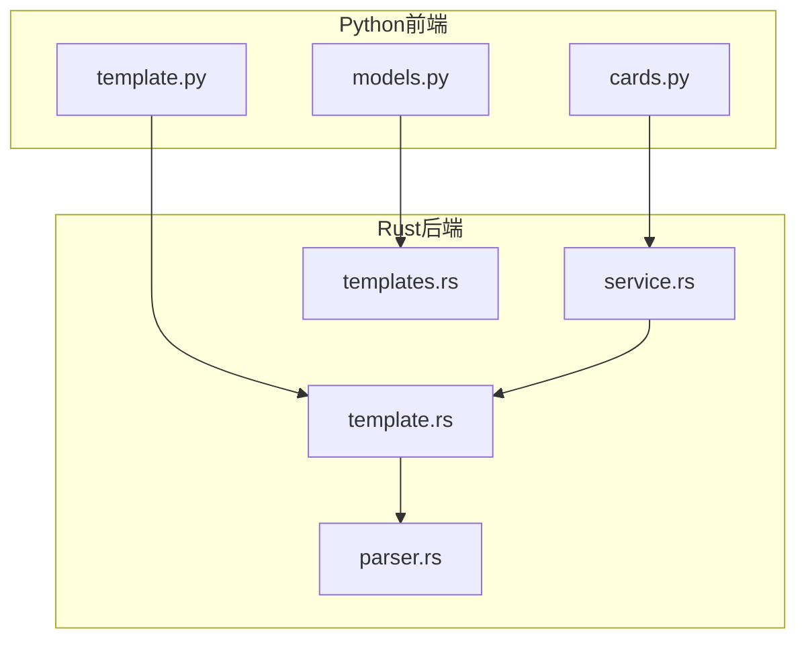
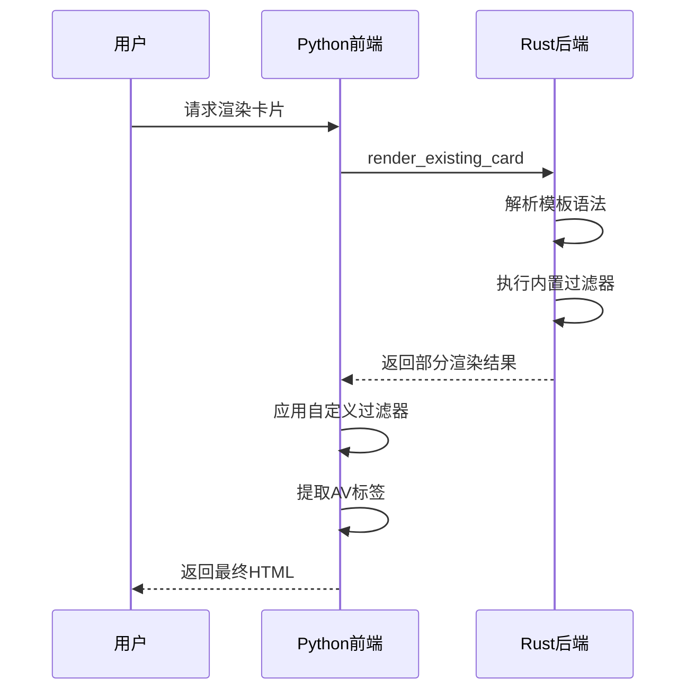
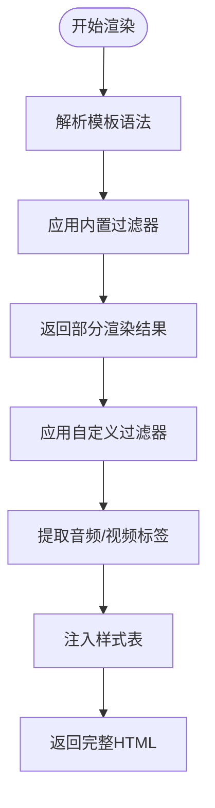
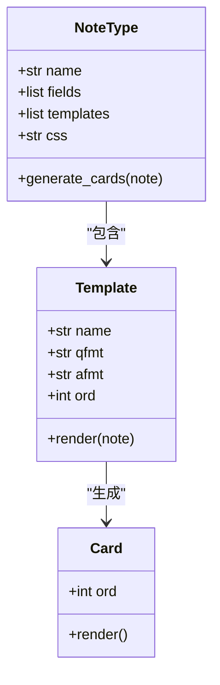
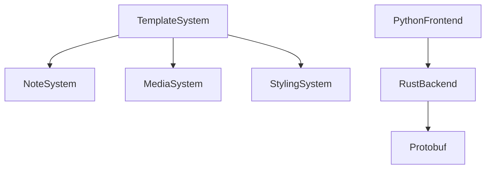

# 模板系统

<cite>
**本文档中引用的文件**
- [template.py](file://pylib/anki/template.py)
- [template.rs](file://rslib/src/template.rs)
- [card_rendering/parser.rs](file://rslib/src/card_rendering/parser.rs)
- [card_rendering/service.rs](file://rslib/src/card_rendering/service.rs)
- [notetype/templates.rs](file://rslib/src/notetype/templates.rs)
- [models.py](file://pylib/anki/models.py)
- [cards.py](file://pylib/anki/cards.py)
- [editor.py](file://qt/aqt/editor.py)
- [card-templates.ftl](file://ftl/core/card-templates.ftl)
- [card-template-rendering.ftl](file://ftl/core/card-template-rendering.ftl)
</cite>

## 目录
1. [简介](#简介)
2. [项目结构](#项目结构)
3. [核心组件](#核心组件)
4. [架构概述](#架构概述)
5. [详细组件分析](#详细组件分析)
6. [依赖分析](#依赖分析)
7. [性能考虑](#性能考虑)
8. [故障排除指南](#故障排除指南)
9. [结论](#结论)

## 简介
Anki的模板系统是其核心功能之一，允许用户通过正面/背面模板设计灵活的卡片布局。该系统支持字段替换、条件逻辑和自定义过滤器，实现了笔记类型（NoteType）与卡片模板的深度协同。模板渲染过程结合了Rust后端的高效解析和Python前端的扩展性，同时通过安全沙箱机制保障JavaScript交互的安全性。本系统为用户提供从简单文本替换到复杂动态生成的完整解决方案。

## 项目结构
Anki的模板系统分布在多个模块中，主要由Python前端和Rust后端共同实现。核心模板逻辑位于pylib/anki/template.py，而高性能解析器则在rslib/src/template.rs中实现。模板与笔记类型的关联管理在notetype/templates.rs中处理，渲染服务由card_rendering模块提供。

**图示来源**
- [template.py](file://pylib/anki/template.py)
- [template.rs](file://rslib/src/template.rs)
- [card_rendering/parser.rs](file://rslib/src/card_rendering/parser.rs)

**章节来源**
- [template.py](file://pylib/anki/template.py)
- [template.rs](file://rslib/src/template.rs)

## 核心组件
模板系统的核心包括模板渲染上下文（TemplateRenderContext）、部分渲染卡片（PartiallyRenderedCard）和模板渲染输出（TemplateRenderOutput）三个主要组件。渲染上下文管理卡片渲染过程中的状态信息，部分渲染卡片存储解析后的模板节点，而渲染输出则封装最终的HTML内容和多媒体标签。

**章节来源**
- [template.py](file://pylib/anki/template.py#L113-L275)
- [template.py](file://pylib/anki/template.py#L307-L342)

## 架构概述
Anki模板系统采用前后端分离架构，Python层负责高层逻辑和扩展性，Rust层处理高性能解析和渲染。当用户查看卡片时，系统首先通过Collection后端获取卡片数据，然后在Rust中进行模板解析和初步渲染，最后在Python中应用自定义过滤器并完成最终渲染。

**图示来源**
- [card_rendering/service.rs](file://rslib/src/card_rendering/service.rs)
- [template.py](file://pylib/anki/template.py)

## 详细组件分析

### 模板渲染机制分析
模板渲染过程分为两个阶段：首先在Rust后端进行语法解析和内置过滤器应用，然后在Python前端处理自定义过滤器。这种设计既保证了性能又提供了扩展性。特殊字段如"FrontSide"、"Tags"等在渲染上下文中自动注入。

**图示来源**
- [card_rendering/parser.rs](file://rslib/src/card_rendering/parser.rs)
- [template.py](file://pylib/anki/template.py)

**章节来源**
- [template.py](file://pylib/anki/template.py#L113-L275)
- [card_rendering/parser.rs](file://rslib/src/card_rendering/parser.rs)

### 模板与笔记类型协同分析
笔记类型（NoteType）定义了字段结构和模板集合，每个模板关联到特定的卡片序号。当笔记类型修改时，系统会重新生成相关卡片。模板缓存策略基于笔记类型和卡片序号的组合，确保修改后的即时生效。

**图示来源**
- [models.py](file://pylib/anki/models.py)
- [notetype/templates.rs](file://rslib/src/notetype/templates.rs)

**章节来源**
- [models.py](file://pylib/anki/models.py#L34-L34)
- [notetype/templates.rs](file://rslib/src/notetype/templates.rs)

## 依赖分析
模板系统依赖于笔记系统提供字段数据，依赖于媒体系统处理音频视频标签，依赖于样式系统注入CSS。Rust后端通过protobuf与Python前端通信，确保类型安全和性能。

**图示来源**
- [template.py](file://pylib/anki/template.py)
- [card_rendering/service.rs](file://rslib/src/card_rendering/service.rs)

**章节来源**
- [template.py](file://pylib/anki/template.py)
- [card_rendering/service.rs](file://rslib/src/card_rendering/service.rs)

## 性能考虑
模板系统采用多级缓存策略，包括解析结果缓存和渲染结果缓存。对于大量卡片的场景，系统支持批量渲染优化。CSS样式表在笔记类型级别缓存，避免重复注入。条件模板的解析经过优化，确保复杂逻辑的高效执行。

## 故障排除指南
常见问题包括模板语法错误、过滤器未注册和JavaScript安全限制。调试时应首先检查模板语法是否符合规范，确认自定义过滤器已正确注册，验证JavaScript代码是否在安全沙箱内运行。浏览器模式下的渲染可能与学习模式有细微差异，需要注意上下文区别。

**章节来源**
- [SECURITY.md](file://SECURITY.md#L12-L27)
- [template.py](file://pylib/anki/template.py)

## 结论
Anki的模板系统通过精心设计的架构实现了灵活性与性能的平衡。Rust后端确保了核心渲染的高效性，Python前端提供了丰富的扩展点。安全沙箱机制允许用户使用JavaScript增强卡片功能，同时防范恶意代码。该系统为从初学者到高级开发者的各类用户提供了完整的模板解决方案。