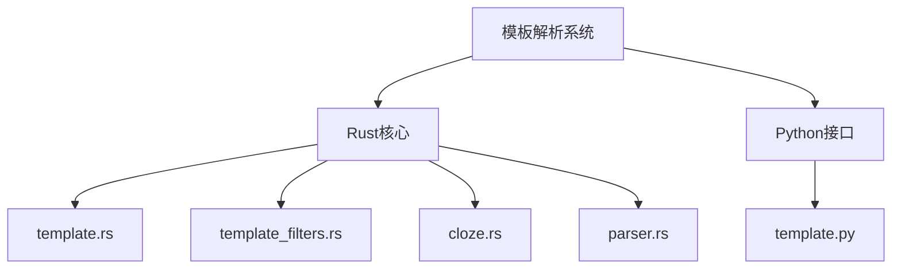
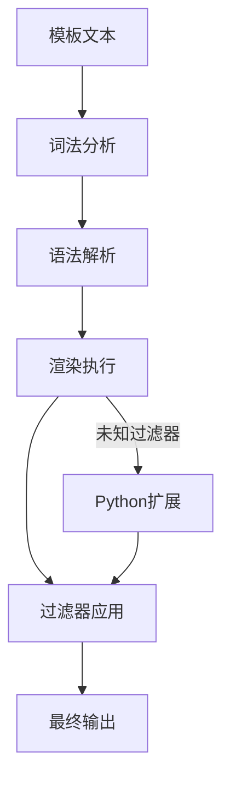
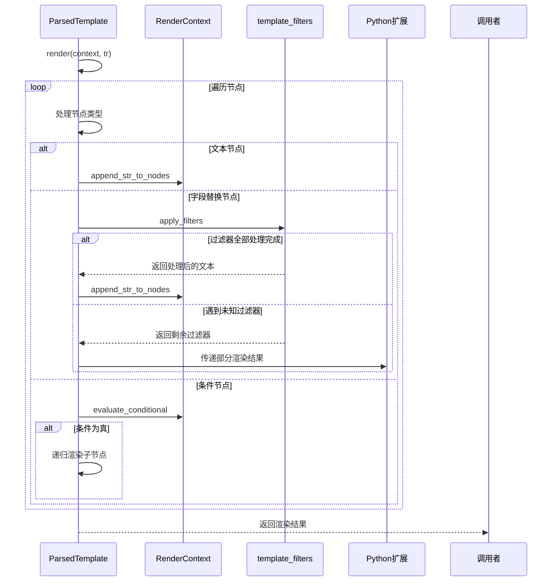
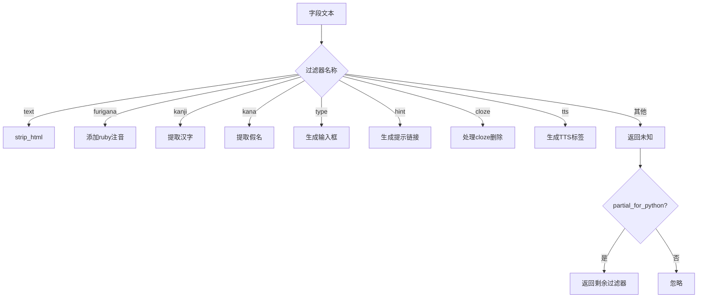
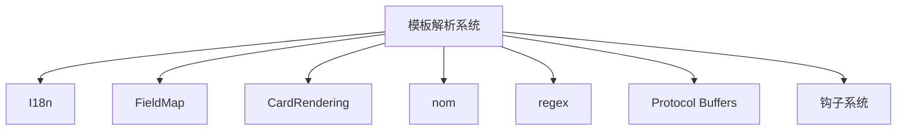

# 模板语法解析

<cite>
**本文档中引用的文件**  
- [template.py](file://pylib/anki/template.py)
- [parser.rs](file://rslib/src/card_rendering/parser.rs)
- [template.rs](file://rslib/src/template.rs)
- [template_filters.rs](file://rslib/src/template_filters.rs)
- [cloze.rs](file://rslib/src/cloze.rs)
</cite>

## 目录
1. [简介](#简介)
2. [项目结构](#项目结构)
3. [核心组件](#核心组件)
4. [架构概述](#架构概述)
5. [详细组件分析](#详细组件分析)
6. [依赖分析](#依赖分析)
7. [性能考量](#性能考量)
8. [故障排除指南](#故障排除指南)
9. [结论](#结论)

## 简介
Anki的模板语法解析系统是其核心功能之一，负责处理卡片模板中的字段引用、条件语句、循环结构和过滤器应用。该系统采用Rust和Python混合实现，其中Rust负责核心解析和内置过滤器处理，Python负责扩展过滤器的调用。解析器能够处理标准的Mustache语法，并支持Anki特有的cloze删除和TTS指令。系统设计注重性能和可扩展性，通过分阶段渲染和错误恢复机制确保用户体验。

## 项目结构
Anki的模板解析功能分布在多个模块中，主要位于rslib和pylib目录下。Rust实现位于rslib/src/template.rs和rslib/src/template_filters.rs，负责核心解析逻辑和内置过滤器。Python接口位于pylib/anki/template.py，负责与前端交互和扩展过滤器调用。相关辅助功能如cloze处理位于rslib/src/cloze.rs，而卡片渲染的AV标签解析位于rslib/src/card_rendering/parser.rs。



**Diagram sources**
- [template.rs](file://rslib/src/template.rs)
- [template_filters.rs](file://rslib/src/template_filters.rs)
- [cloze.rs](file://rslib/src/cloze.rs)
- [template.py](file://pylib/anki/template.py)
- [parser.rs](file://rslib/src/card_rendering/parser.rs)

**Section sources**
- [template.rs](file://rslib/src/template.rs)
- [template_filters.rs](file://rslib/src/template_filters.rs)
- [cloze.rs](file://rslib/src/cloze.rs)
- [template.py](file://pylib/anki/template.py)
- [parser.rs](file://rslib/src/card_rendering/parser.rs)

## 核心组件
Anki模板解析系统的核心组件包括词法分析器、语法解析器、渲染引擎和过滤器系统。词法分析器将模板文本分解为标记流，语法解析器构建抽象语法树，渲染引擎执行模板渲染，过滤器系统处理各种文本转换。系统支持条件语句、字段引用和自定义过滤器，通过Rust实现高性能核心处理，Python实现可扩展的过滤器接口。

**Section sources**
- [template.rs](file://rslib/src/template.rs)
- [template_filters.rs](file://rslib/src/template_filters.rs)

## 架构概述
Anki模板解析系统采用分层架构，分为词法分析、语法解析、渲染执行和过滤器应用四个层次。Rust实现负责前三个层次的高效处理，当遇到未知过滤器时，系统会暂停渲染并将剩余任务交给Python处理。这种设计既保证了核心功能的性能，又提供了良好的可扩展性。系统还实现了错误恢复机制，能够在模板语法错误时提供有意义的错误信息。



**Diagram sources**
- [template.rs](file://rslib/src/template.rs)
- [template_filters.rs](file://rslib/src/template_filters.rs)

## 详细组件分析

### 词法分析器
词法分析器负责将模板文本分解为有意义的标记，包括文本、字段引用、条件语句和注释。分析器支持标准的{{}}语法和可选的<% %>替代语法，能够正确处理嵌套结构和转义序列。

```mermaid
graph TD
A[输入文本] --> B{是否以{{或<%开头?}
B --> |是| C[识别标记类型]
B --> |否| D[文本标记]
C --> E{标记类型}
E --> F[字段引用]
E --> G[条件开始]
E --> H[条件结束]
E --> I[注释]
F --> J[提取字段名和过滤器]
G --> K[提取条件名]
H --> L[提取条件名]
I --> M[提取注释内容]
```

**Diagram sources**
- [template.rs](file://rslib/src/template.rs#L100-L200)

**Section sources**
- [template.rs](file://rslib/src/template.rs#L50-L300)

### 语法解析器
语法解析器将词法分析器产生的标记流构建成抽象语法树(AST)，树节点包括文本节点、字段替换节点、条件节点和注释节点。解析器实现了递归下降算法，能够正确处理嵌套的条件语句和匹配的开闭标签。

```mermaid
classDiagram
class ParsedNode {
+Text(String)
+Comment(String)
+Replacement{key : String, filters : Vec<String>}
+Conditional{key : String, children : Vec<ParsedNode>}
+NegatedConditional{key : String, children : Vec<ParsedNode>}
}
class ParsedTemplate {
+nodes : Vec<ParsedNode>
+from_text(template : &str) TemplateResult<ParsedTemplate>
+render(context : &RenderContext, tr : &I18n) TemplateResult<Vec<RenderedNode>>
+requirements(field_map : &FieldMap) FieldRequirements
}
ParsedTemplate --> ParsedNode : "包含"
```

**Diagram sources**
- [template.rs](file://rslib/src/template.rs#L300-L500)

**Section sources**
- [template.rs](file://rslib/src/template.rs#L300-L600)

### 渲染引擎
渲染引擎负责执行模板渲染，将抽象语法树转换为最终的HTML输出。引擎维护渲染上下文，包含字段值、非空字段集合和卡片序号等信息。渲染过程中会应用内置过滤器，并在遇到未知过滤器时暂停渲染，将任务交给Python处理。



**Diagram sources**
- [template.rs](file://rslib/src/template.rs#L600-L900)
- [template_filters.rs](file://rslib/src/template_filters.rs)

**Section sources**
- [template.rs](file://rslib/src/template.rs#L600-L1000)
- [template_filters.rs](file://rslib/src/template_filters.rs)

### 过滤器系统
过滤器系统是Anki模板功能的核心，支持多种内置过滤器和可扩展的自定义过滤器。内置过滤器如cloze、hint、tts等由Rust实现，确保高性能。自定义过滤器通过Python钩子系统注册，允许插件开发者扩展模板功能。



**Diagram sources**
- [template_filters.rs](file://rslib/src/template_filters.rs)
- [cloze.rs](file://rslib/src/cloze.rs)

**Section sources**
- [template_filters.rs](file://rslib/src/template_filters.rs)
- [cloze.rs](file://rslib/src/cloze.rs)

## 依赖分析
模板解析系统依赖于Anki的国际化系统(I18n)、字段映射系统和卡片渲染系统。系统通过Protocol Buffers与前端通信，使用nom库进行语法解析，regex库进行正则表达式匹配。Python接口依赖于Anki的钩子系统，允许插件注册自定义过滤器。



**Diagram sources**
- [template.rs](file://rslib/src/template.rs)
- [template_filters.rs](file://rslib/src/template_filters.rs)

**Section sources**
- [template.rs](file://rslib/src/template.rs)
- [template_filters.rs](file://rslib/src/template_filters.rs)

## 性能考量
Anki模板解析系统在设计时充分考虑了性能因素。核心解析逻辑使用Rust实现，确保了高性能。系统采用惰性求值策略，只在必要时进行HTML解析和渲染。对于大量卡片的批量操作，系统提供了字段需求缓存，避免重复计算。此外，系统实现了部分渲染机制，当遇到未知过滤器时只解析到该点，避免不必要的处理。

## 故障排除指南
模板解析系统提供了详细的错误报告机制。当模板语法错误时，系统会生成包含错误类型、位置和建议解决方案的详细错误信息。常见问题包括未闭合的标签、不匹配的条件语句和不存在的字段引用。系统还提供了模板调试工具，允许用户查看部分渲染结果和过滤器应用过程。

**Section sources**
- [template.rs](file://rslib/src/template.rs#L1000-L1200)
- [template.py](file://pylib/anki/template.py#L50-L100)

## 结论
Anki的模板语法解析系统是一个高效、可扩展的实现，结合了Rust的性能优势和Python的灵活性。系统通过分层架构和部分渲染机制，在保证核心功能高性能的同时，提供了良好的可扩展性。未来可以进一步优化错误恢复机制，提供更友好的模板调试工具，并增强对复杂嵌套结构的支持。