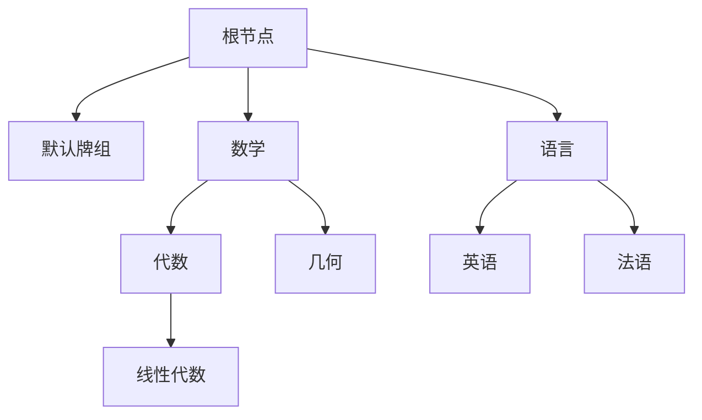
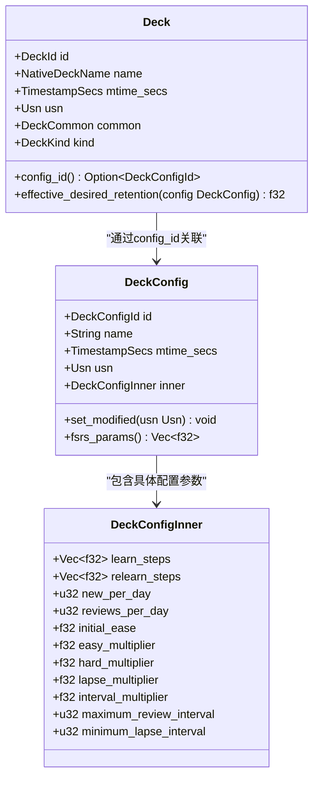
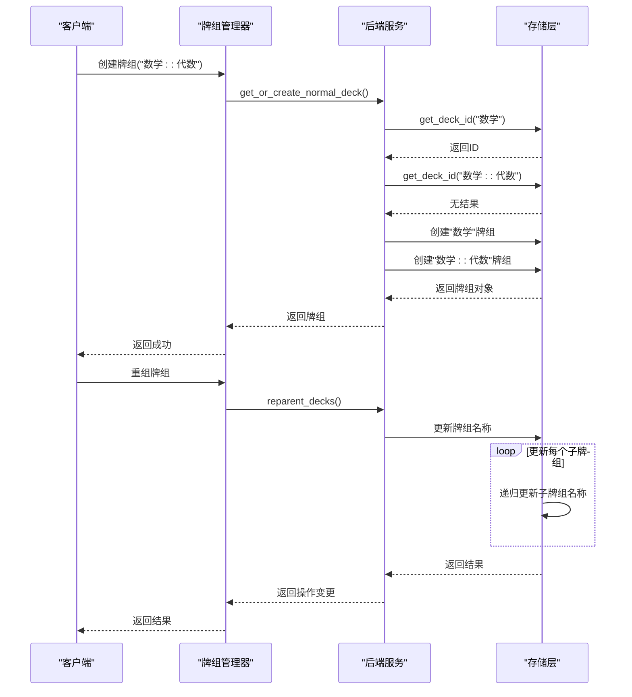
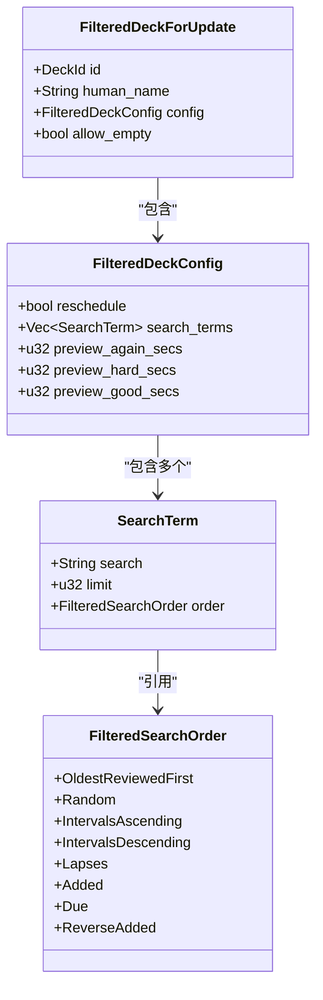
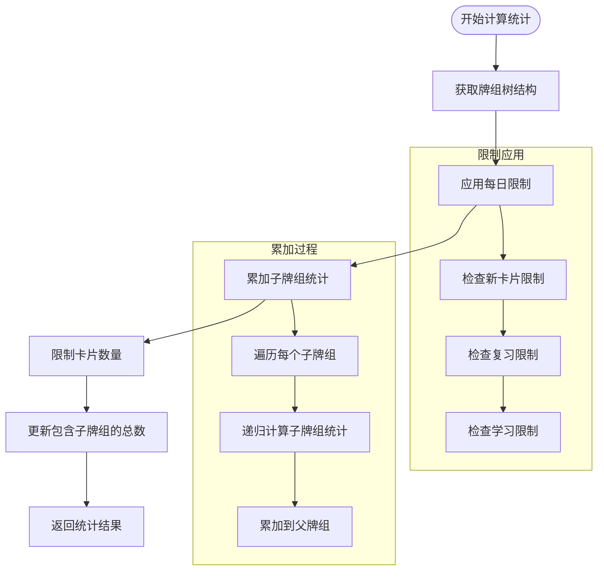

# 牌组管理

<cite>
**本文档中引用的文件**  
- [decks.py](file://pylib/anki/decks.py)
- [mod.rs](file://rslib/src/decks/mod.rs)
- [tree.rs](file://rslib/src/decks/tree.rs)
- [service.rs](file://rslib/src/decks/service.rs)
- [filtered.rs](file://rslib/src/decks/filtered.rs)
- [deckconfig/mod.rs](file://rslib/src/deckconfig/mod.rs)
- [deckconfig/service.rs](file://rslib/src/deckconfig/service.rs)
- [filtered_deck.py](file://qt/aqt/filtered_deck.py)
</cite>

## 目录
1. [简介](#简介)
2. [牌组层次结构设计](#牌组层次结构设计)
3. [牌组配置继承机制](#牌组配置继承机制)
4. [牌组生命周期管理](#牌组生命周期管理)
5. [过滤牌组特殊行为](#过滤牌组特殊行为)
6. [牌组统计与同步](#牌组统计与同步)
7. [性能优化与边界处理](#性能优化与边界处理)
8. [最佳实践与集成细节](#最佳实践与集成细节)

## 简介
Anki牌组管理系统采用树形结构组织学习内容，支持父子牌组关系和灵活的配置继承机制。系统通过Deck类实现牌组的层次化管理，利用DeckConfig类处理配置继承和调度算法集成。牌组创建、重组和删除操作通过事务性处理确保数据一致性，同时提供过滤牌组功能实现动态卡片筛选。本系统为新手用户提供直观的牌组组织方式，为资深开发者提供与调度算法深度集成的配置选项。

## 牌组层次结构设计

Anki牌组系统采用树形结构管理牌组的层次关系，通过双冒号(::)分隔符表示父子关系。每个牌组由Deck类表示，包含唯一ID、名称、修改时间戳和配置信息。系统通过DeckTreeNode结构维护牌组树，支持高效的父子关系查询和遍历操作。

牌组名称解析遵循特定规则：名称中的双冒号表示层级分隔，如"数学::代数::线性代数"表示三层嵌套结构。系统自动维护父牌组的存在性，当创建子牌组时会自动创建缺失的中间父牌组。牌组树的根节点包含所有顶级牌组，每个节点记录其子牌组列表和折叠状态。

**图示来源**
- [mod.rs](file://rslib/src/decks/mod.rs#L1-L337)
- [tree.rs](file://rslib/src/decks/tree.rs#L1-L476)

**本节来源**
- [decks.py](file://pylib/anki/decks.py#L434-L435)
- [mod.rs](file://rslib/src/decks/mod.rs#L1-L337)

## 牌组配置继承机制

牌组配置通过DeckConfig类实现继承机制，支持配置的创建、更新和删除操作。每个正常牌组关联一个DeckConfigId，指向共享的配置对象。当牌组需要自定义设置时，可以创建新的配置实例或继承现有配置进行修改。

配置继承遵循以下规则：子牌组默认继承父牌组的配置ID，但可以独立修改。系统提供add_config方法创建新配置，支持从现有配置克隆。当删除配置时，所有使用该配置的牌组将自动切换到默认配置。

**图示来源**
- [deckconfig/mod.rs](file://rslib/src/deckconfig/mod.rs#L1-L321)
- [mod.rs](file://rslib/src/decks/mod.rs#L1-L337)

**本节来源**
- [decks.py](file://pylib/anki/decks.py#L296-L298)
- [deckconfig/mod.rs](file://rslib/src/deckconfig/mod.rs#L1-L321)

## 牌组生命周期管理

牌组的创建、重组和删除操作通过事务性处理确保数据一致性。创建牌组时，系统首先检查名称是否存在，若存在则返回现有ID，否则创建新牌组。重组操作通过reparent方法实现，支持批量移动牌组到新的父节点。

删除操作采用级联删除策略，移除指定牌组及其所有子牌组。系统在删除前验证操作的合法性，确保不会删除必需的默认牌组。所有修改操作都会更新修改时间戳和USN（更新序列号），用于同步冲突检测。

牌组间卡片移动通过set_deck方法实现，批量更新卡片的牌组ID。操作过程中会同步更新相关统计信息，确保数据一致性。

**图示来源**
- [service.rs](file://rslib/src/decks/service.rs#L1-L321)
- [mod.rs](file://rslib/src/decks/mod.rs#L1-L337)

**本节来源**
- [decks.py](file://pylib/anki/decks.py#L136-L137)
- [decks.py](file://pylib/anki/decks.py#L281-L288)
- [service.rs](file://rslib/src/decks/service.rs#L1-L321)

## 过滤牌组特殊行为

过滤牌组是一种特殊类型的动态牌组，基于搜索条件从其他牌组中筛选卡片。与普通牌组不同，过滤牌组的配置直接嵌入牌组对象中，不通过DeckConfigId引用外部配置。

过滤牌组支持自定义学习选项，包括预览时间设置和重新安排策略。系统允许定义多个搜索条件，每个条件包含搜索查询、卡片限制和排序方式。用户可以设置"再次"、"困难"和"良好"按钮的延迟时间，实现个性化的学习节奏。

当构建过滤牌组时，系统执行搜索查询并临时移动匹配的卡片到过滤牌组。学习完成后，根据"重新安排"选项决定是否将卡片恢复到原始牌组并重置间隔。

**图示来源**
- [filtered.rs](file://rslib/src/decks/filtered.rs#L1-L72)
- [filtered_deck.py](file://qt/aqt/filtered_deck.py#L29-L306)

**本节来源**
- [decks.py](file://pylib/anki/decks.py#L522-L529)
- [filtered.rs](file://rslib/src/decks/filtered.rs#L1-L72)

## 牌组统计与同步

牌组统计计算通过deck_tree方法实现，返回包含牌组层次结构和统计信息的树形结构。统计信息包括新卡片数、复习卡片数、学习中卡片数和总卡片数。系统在计算统计时应用每日限制，确保显示的数字反映实际可学习的卡片数量。

同步处理通过事务机制确保数据一致性。所有牌组修改操作都会更新USN和修改时间戳，用于检测同步冲突。系统在保存牌组或配置时自动处理USN的更新，支持双向同步场景。

**图示来源**
- [tree.rs](file://rslib/src/decks/tree.rs#L1-L476)
- [service.rs](file://rslib/src/decks/service.rs#L1-L321)

**本节来源**
- [decks.py](file://pylib/anki/decks.py#L184-L185)
- [tree.rs](file://rslib/src/decks/tree.rs#L1-L476)

## 性能优化与边界处理

系统采用多种策略优化牌组树的性能和处理边界情况。牌组树缓存机制避免重复计算，提高访问效率。对于大型牌组结构，系统限制嵌套层级不超过99层，防止协议缓冲区解码失败。

边界情况处理包括：当删除父牌组时自动重命名子牌组以避免名称冲突；当重命名牌组导致名称冲突时自动添加"+"后缀；确保默认牌组始终存在，即使被删除也会自动重建。

系统还处理了特殊情况下的统计计算，如当牌组为空时正确显示统计信息，以及在跨天时正确处理学习卡片的解埋操作。

**本节来源**
- [tree.rs](file://rslib/src/decks/tree.rs#L1-L476)
- [mod.rs](file://rslib/src/decks/mod.rs#L1-L337)

## 最佳实践与集成细节

对于新手用户，建议采用清晰的层次结构组织牌组，如"学科::主题::子主题"的命名模式。避免过深的嵌套层级，保持牌组结构易于导航。定期清理不再使用的牌组，保持学习环境整洁。

对于资深开发者，牌组配置与调度算法深度集成。DeckConfig中的参数直接影响FSRS（自由间隔重复系统）算法的行为。通过调整initial_ease、easy_multiplier等参数，可以优化学习曲线。系统支持通过get_retention_workload方法分析不同保留率对工作量的影响，帮助优化配置。

**本节来源**
- [deckconfig/mod.rs](file://rslib/src/deckconfig/mod.rs#L1-L321)
- [decks.py](file://pylib/anki/decks.py#L296-L298)