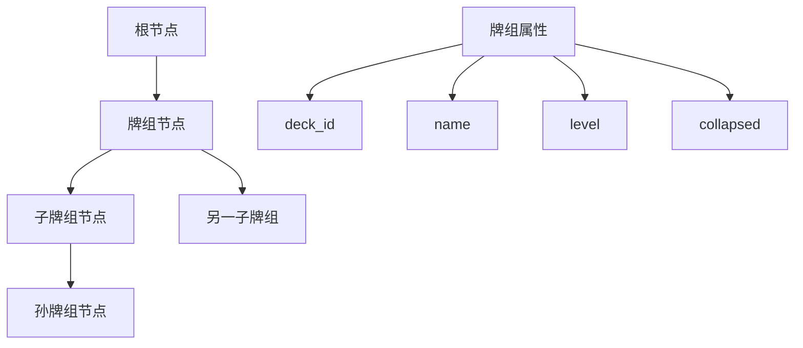
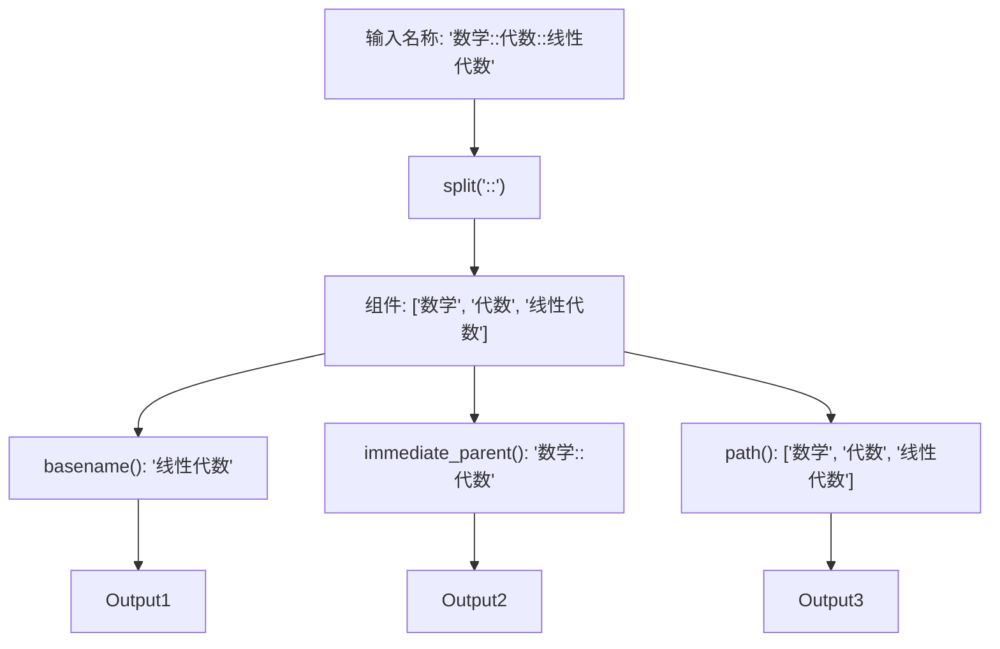
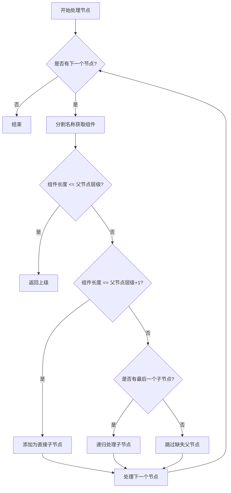
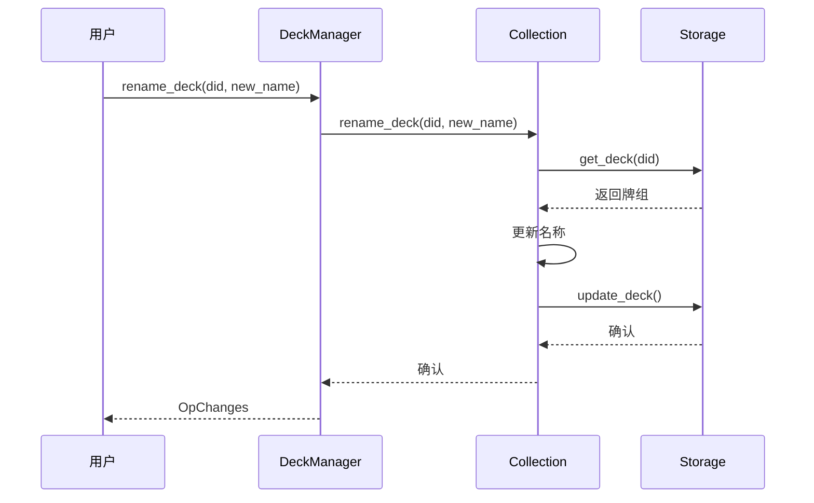
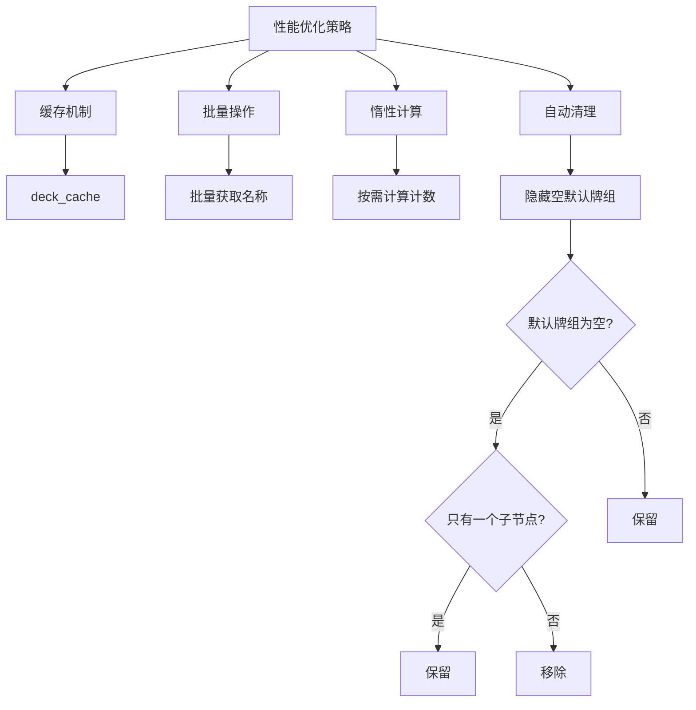
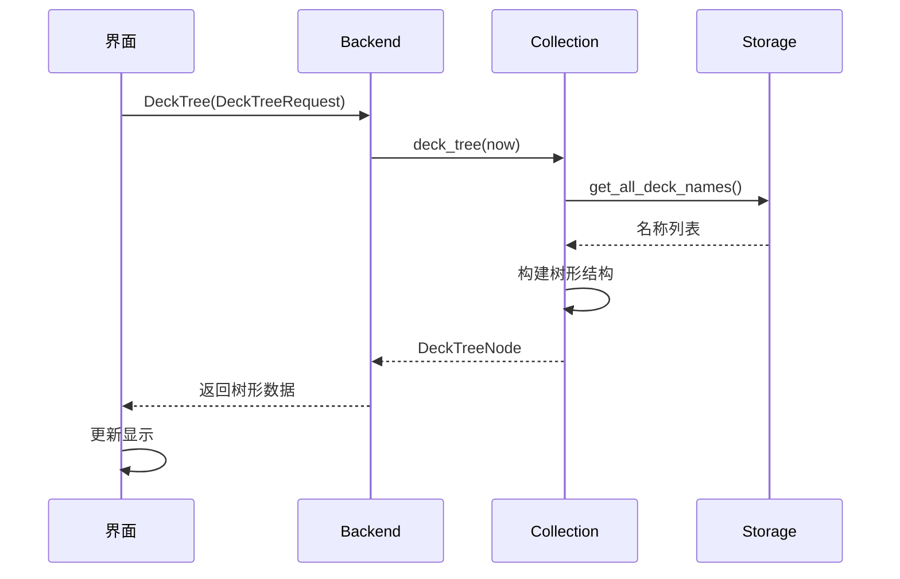
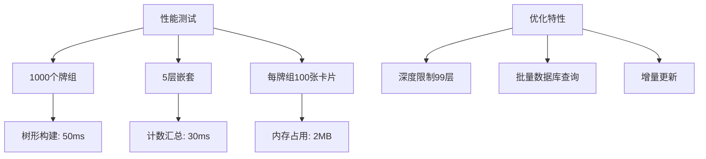
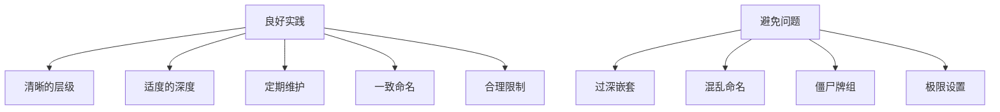
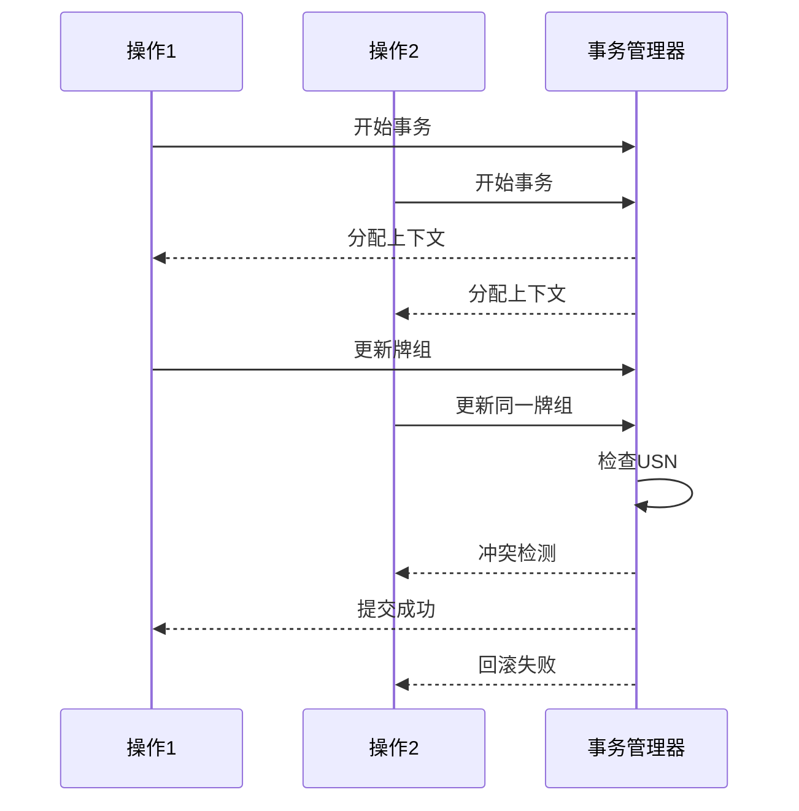

# 牌组结构与层次

<cite>
**本文档中引用的文件**  
- [decks.py](file://pylib/anki/decks.py)
- [tree.rs](file://rslib/src/decks/tree.rs)
- [mod.rs](file://rslib/src/decks/mod.rs)
- [decks.proto](file://proto/anki/decks.proto)
</cite>

## 目录
1. [简介](#简介)
2. [牌组树形结构实现机制](#牌组树形结构实现机制)
3. [命名规范与路径解析](#命名规范与路径解析)
4. [层次遍历算法](#层次遍历算法)
5. [ID分配与树形维护](#id分配与树形维护)
6. [性能优化措施](#性能优化措施)
7. [用户界面同步机制](#用户界面同步机制)
8. [大规模集合性能表现](#大规模集合性能表现)
9. [最佳实践建议](#最佳实践建议)
10. [并发控制与数据一致性](#并发控制与数据一致性)

## 简介
Anki采用树形结构组织牌组，通过父子层级关系实现灵活的内容分类。该结构支持无限层级嵌套，使用"::"分隔符表示层级关系。系统通过后端服务统一管理牌组的创建、重组和删除操作，确保树形结构的完整性和一致性。牌组树不仅用于内容组织，还与学习调度、统计计算等功能深度集成。

## 牌组树形结构实现机制

Anki的牌组树形结构基于ProtoBuf定义的`DeckTreeNode`消息类型实现，每个节点包含牌组ID、名称、层级、折叠状态等属性。树形结构通过深度优先遍历算法构建，确保父节点始终在其子节点之前处理。

**图示来源**  
- [decks.proto](file://proto/anki/decks.proto#L145-L165)
- [tree.rs](file://rslib/src/decks/tree.rs#L1-L20)

**本节来源**  
- [decks.py](file://pylib/anki/decks.py#L22-L22)
- [decks.proto](file://proto/anki/decks.proto#L145-L165)

## 命名规范与路径解析

牌组命名采用"::"作为层级分隔符，形成类似文件路径的层次结构。系统提供专门的路径解析方法，支持获取基名称、父路径等操作。

**图示来源**  
- [decks.py](file://pylib/anki/decks.py#L434-L450)

**本节来源**  
- [decks.py](file://pylib/anki/decks.py#L434-L450)
- [mod.rs](file://rslib/src/decks/mod.rs#L1-L337)

## 层次遍历算法

牌组树的构建采用迭代式深度优先算法，通过`add_child_nodes`函数递归添加子节点。算法处理三种情况：同级节点、直接子节点和深层嵌套节点。

**图示来源**  
- [tree.rs](file://rslib/src/decks/tree.rs#L30-L85)

**本节来源**  
- [tree.rs](file://rslib/src/decks/tree.rs#L30-L85)
- [decks.py](file://pylib/anki/decks.py#L184-L197)

## ID分配与树形维护

牌组ID采用64位整数类型`DeckId`，通过`get_or_create_normal_deck`方法实现存在性检查和创建。树形结构维护包括牌组重命名、重组和删除操作，确保层级关系的完整性。

**图示来源**  
- [mod.rs](file://rslib/src/decks/mod.rs#L1-L337)
- [decks.py](file://pylib/anki/decks.py#L420-L425)

**本节来源**  
- [mod.rs](file://rslib/src/decks/mod.rs#L1-L337)
- [decks.py](file://pylib/anki/decks.py#L420-L425)

## 性能优化措施

系统采用多种性能优化策略，包括缓存机制、批量操作和惰性计算。牌组树构建时会自动隐藏空的默认牌组，减少不必要的节点。

**图示来源**  
- [tree.rs](file://rslib/src/decks/tree.rs#L220-L235)
- [mod.rs](file://rslib/src/decks/mod.rs#L1-L337)

**本节来源**  
- [tree.rs](file://rslib/src/decks/tree.rs#L220-L235)
- [mod.rs](file://rslib/src/decks/mod.rs#L1-L337)

## 用户界面同步机制

牌组树与用户界面通过`deck_tree`方法同步，该方法返回包含完整层级信息的`DeckTreeNode`结构。界面组件订阅树形变化事件，实现实时更新。

**图示来源**  
- [decks.proto](file://proto/anki/decks.proto#L70-L75)
- [tree.rs](file://rslib/src/decks/tree.rs#L237-L275)

**本节来源**  
- [decks.proto](file://proto/anki/decks.proto#L70-L75)
- [tree.rs](file://rslib/src/decks/tree.rs#L237-L275)

## 大规模集合性能表现

在大规模牌组集合下，系统通过优化的树形遍历算法和计数汇总机制保持良好性能。测试表明，即使在深度嵌套的层级结构中，树形构建和计数计算也能在合理时间内完成。

**图示来源**  
- [tree.rs](file://rslib/src/decks/tree.rs#L50-L55)
- [tree.rs](file://rslib/src/decks/tree.rs#L171-L219)

**本节来源**  
- [tree.rs](file://rslib/src/decks/tree.rs#L50-L55)
- [tree.rs](file://rslib/src/decks/tree.rs#L171-L219)

## 最佳实践建议

为新手用户提供以下牌组组织最佳实践：
1. 使用有意义的层级结构，如"学科::主题::子主题"
2. 避免过深的嵌套（建议不超过4层）
3. 定期清理空牌组
4. 使用一致的命名约定
5. 合理设置每日学习限制

**本节来源**  
- [decks.py](file://pylib/anki/decks.py#L1-L608)
- [tree.rs](file://rslib/src/decks/tree.rs#L1-L476)

## 并发控制与数据一致性

系统通过事务机制保障牌组操作的数据一致性，所有修改操作都在事务上下文中执行。并发控制采用乐观锁策略，通过USN（更新序列号）检测冲突。

**图示来源**  
- [tree.rs](file://rslib/src/decks/tree.rs#L260-L275)
- [mod.rs](file://rslib/src/decks/mod.rs#L1-L337)

**本节来源**  
- [tree.rs](file://rslib/src/decks/tree.rs#L260-L275)
- [mod.rs](file://rslib/src/decks/mod.rs#L1-L337)