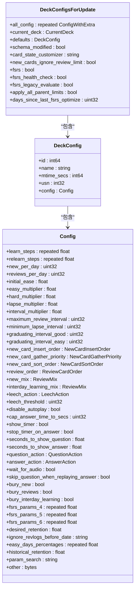
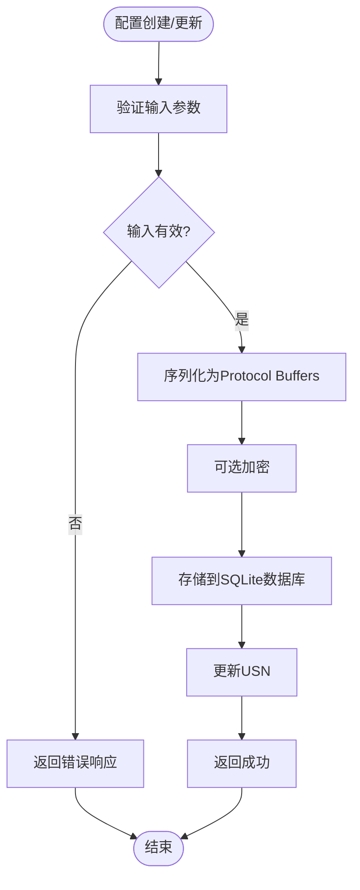
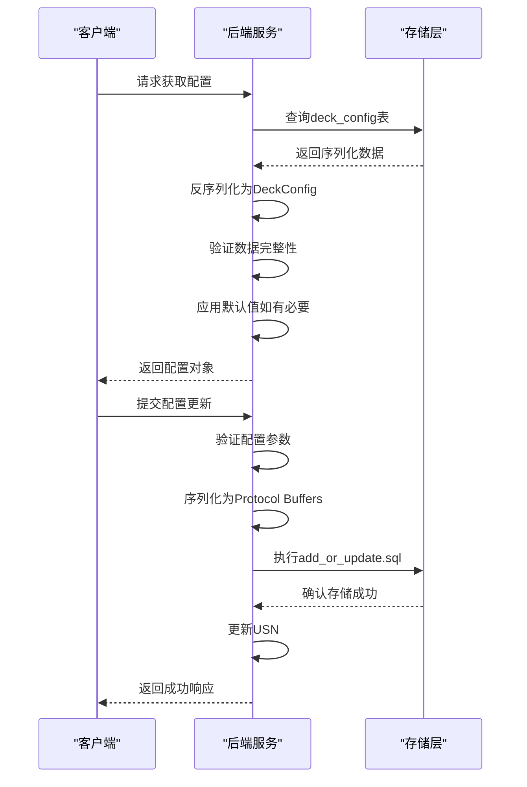
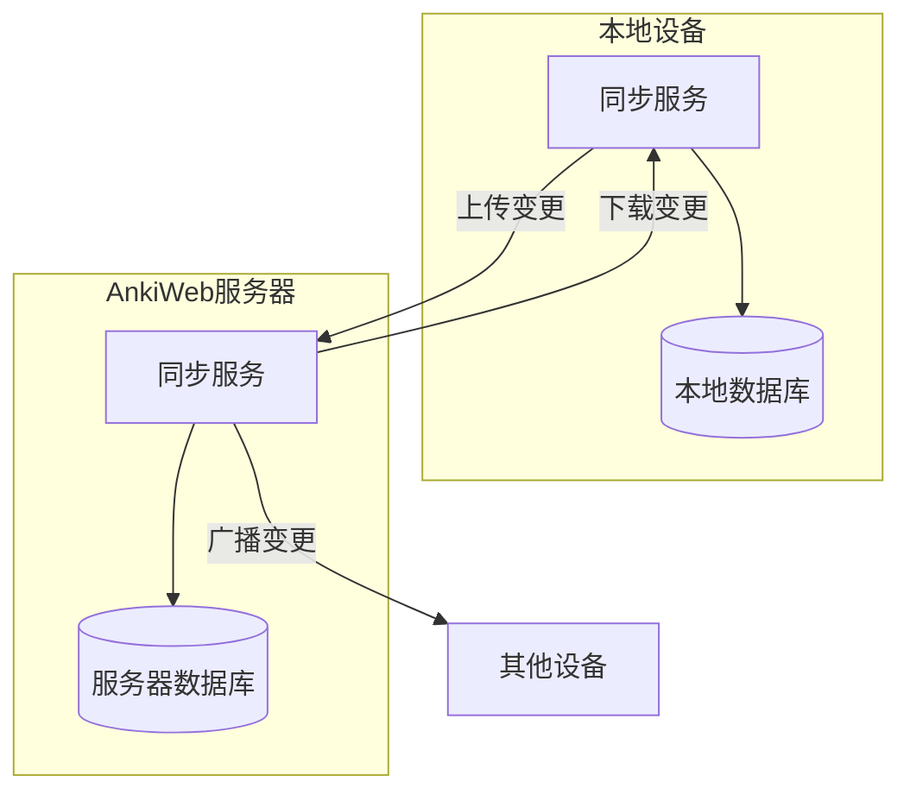
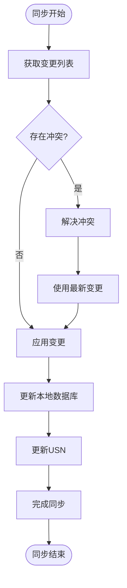
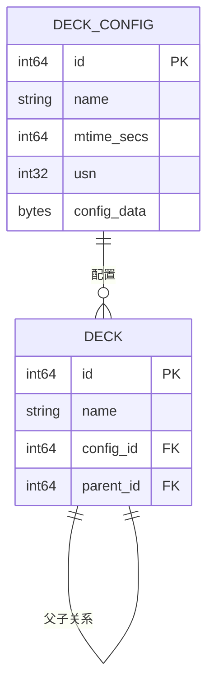
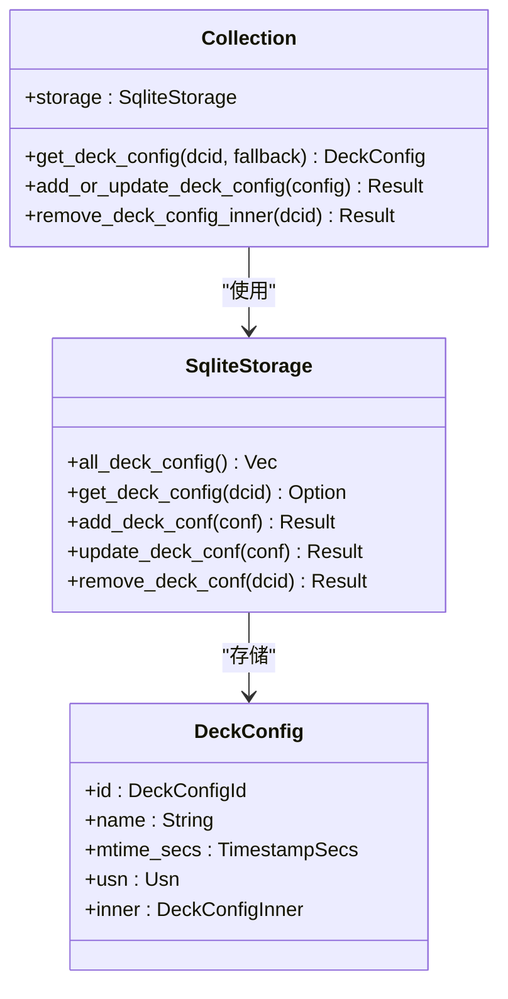

# 牌组配置管理

<cite>
**本文档中引用的文件**  
- [deck_config.proto](file://proto/anki/deck_config.proto)
- [decks.proto](file://proto/anki/decks.proto)
- [deckconfig/mod.rs](file://rslib/src/deckconfig/mod.rs)
- [deckconfig/update.rs](file://rslib/src/deckconfig/update.rs)
- [deckconfig/schema11.rs](file://rslib/src/deckconfig/schema11.rs)
- [storage/deckconfig/mod.rs](file://rslib/src/storage/deckconfig/mod.rs)
- [decks.py](file://pylib/anki/decks.py)
- [filtered_deck.py](file://qt/aqt/filtered_deck.py)
</cite>

## 目录
1. [引言](#引言)
2. [核心组件](#核心组件)
3. [配置继承机制](#配置继承机制)
4. [配置序列化与存储](#配置序列化与存储)
5. [版本迁移策略](#版本迁移策略)
6. [同步机制](#同步机制)
7. [配置变更对调度算法的影响](#配置变更对调度算法的影响)
8. [多设备同步冲突解决](#多设备同步冲突解决)
9. [配置调整最佳实践](#配置调整最佳实践)
10. [缓存策略与性能优化](#缓存策略与性能优化)

## 引言
Anki的牌组配置系统是其核心功能之一，负责管理学习卡片的调度策略、复习间隔、新卡生成等关键参数。该系统采用分层配置架构，支持默认配置、牌组特定配置和模板配置的优先级处理。配置数据通过Protocol Buffers进行序列化存储，并在不同版本间进行平滑迁移。系统还实现了复杂的同步机制，确保多设备间配置的一致性。

## 核心组件

Anki牌组配置系统的核心组件包括DeckConfig类、配置继承机制、序列化存储和同步策略。DeckConfig类定义了所有配置参数，包括学习步骤、复习间隔、难度系数等。配置继承机制允许子牌组继承父牌组的配置，同时支持重写特定参数。序列化存储使用Protocol Buffers格式，确保数据的紧凑性和跨平台兼容性。同步策略通过USN（更新序列号）机制跟踪变更，实现增量同步。

**Section sources**
- [deck_config.proto](file://proto/anki/deck_config.proto#L0-L264)
- [deckconfig/mod.rs](file://rslib/src/deckconfig/mod.rs#L0-L320)

## 配置继承机制

Anki的配置继承机制采用自顶向下的优先级处理策略。当访问某个牌组的配置时，系统首先检查该牌组是否有特定配置，如果没有，则向上查找父牌组的配置，直到找到匹配的配置或返回默认配置。这种机制允许用户在不同层级上定制学习策略，同时保持配置的一致性。



**Diagram sources**
- [deck_config.proto](file://proto/anki/deck_config.proto#L0-L264)

**Section sources**
- [deckconfig/mod.rs](file://rslib/src/deckconfig/mod.rs#L0-L320)
- [deckconfig/update.rs](file://rslib/src/deckconfig/update.rs#L0-L616)

## 配置序列化与存储

Anki使用Protocol Buffers作为配置数据的序列化格式，确保数据的紧凑性和跨平台兼容性。配置数据存储在SQLite数据库的deck_config表中，每个配置项包含ID、名称、修改时间、USN和序列化的配置数据。系统通过add_or_update.sql等SQL语句实现配置的增删改操作。



**Diagram sources**
- [storage/deckconfig/mod.rs](file://rslib/src/storage/deckconfig/mod.rs#L0-L270)

**Section sources**
- [storage/deckconfig/mod.rs](file://rslib/src/storage/deckconfig/mod.rs#L0-L270)
- [deckconfig/schema11.rs](file://rslib/src/deckconfig/schema11.rs#L0-L631)

## 版本迁移策略

Anki的配置系统实现了完善的版本迁移策略，确保不同版本间的数据兼容性。系统通过upgrade_deck_conf_to_schema14、upgrade_deck_conf_to_schema15等方法实现从旧版本到新版本的升级，通过downgrade_deck_conf_from_schema16方法实现从新版本到旧版本的降级。迁移过程中，系统会自动处理字段映射、数据转换和默认值填充。



**Diagram sources**
- [deckconfig/update.rs](file://rslib/src/deckconfig/update.rs#L0-L616)

**Section sources**
- [deckconfig/update.rs](file://rslib/src/deckconfig/update.rs#L0-L616)
- [deckconfig/schema11.rs](file://rslib/src/deckconfig/schema11.rs#L0-L631)

## 同步机制

Anki的同步机制基于USN（更新序列号）系统，确保多设备间配置的一致性。每个配置变更都会增加USN，同步时只传输USN大于上次同步值的变更。系统通过get_deck_configs_for_update方法获取待同步的配置变更，并通过add_or_update_deck_config_legacy等方法应用远程变更。冲突解决策略优先保留最新变更。



**Diagram sources**
- [deckconfig/update.rs](file://rslib/src/deckconfig/update.rs#L0-L616)

**Section sources**
- [deckconfig/update.rs](file://rslib/src/deckconfig/update.rs#L0-L616)
- [decks.py](file://pylib/anki/decks.py#L24-L87)

## 配置变更对调度算法的影响

配置变更直接影响Anki的调度算法，包括新卡生成、复习间隔计算和难度调整。当修改learn_steps、relearn_steps等参数时，系统会重新计算相关卡片的调度计划。FSRS（Free Spaced Repetition Scheduler）参数的变更会触发记忆状态的重新计算，影响未来复习间隔的预测准确性。

```mermaid
stateDiagram-v2
[*] --> Idle
Idle --> ConfigChange : "配置变更"
ConfigChange --> ValidateConfig : "验证配置"
ValidateConfig --> ConfigValid{"配置有效?"}
ConfigValid --> |否| ReturnError : "返回错误"
ConfigValid --> |是| UpdateSchedule : "更新调度计划"
UpdateSchedule --> RecomputeMemory : "重新计算记忆状态"
RecomputeMemory --> UpdateCards : "更新卡片状态"
UpdateCards --> SaveConfig : "保存配置"
SaveConfig --> Idle
ReturnError --> Idle
```

**Diagram sources**
- [deckconfig/update.rs](file://rslib/src/deckconfig/update.rs#L0-L616)

**Section sources**
- [deckconfig/update.rs](file://rslib/src/deckconfig/update.rs#L0-L616)
- [deckconfig/mod.rs](file://rslib/src/deckconfig/mod.rs#L0-L320)

## 多设备同步冲突解决

Anki的多设备同步冲突解决机制基于最后写入获胜（Last Write Wins）原则。当检测到冲突时，系统比较USN值，保留USN较大的变更。对于复杂冲突，系统提供手动解决选项，允许用户选择保留哪个版本的配置。同步过程中，系统会记录冲突日志，便于后续分析和调试。



**Diagram sources**
- [deckconfig/update.rs](file://rslib/src/deckconfig/update.rs#L0-L616)

**Section sources**
- [deckconfig/update.rs](file://rslib/src/deckconfig/update.rs#L0-L616)
- [decks.py](file://pylib/anki/decks.py#L293-L294)

## 配置调整最佳实践

对于新手用户，建议从默认配置开始，逐步调整关键参数如new_per_day、reviews_per_day等。避免同时修改多个参数，以便观察每个变更的影响。定期备份配置，防止意外丢失。使用AnkiWeb同步功能确保配置在多设备间一致。对于高级用户，可以深入调整FSRS参数，优化记忆保持率。



**Diagram sources**
- [deck_config.proto](file://proto/anki/deck_config.proto#L0-L264)

**Section sources**
- [deckconfig/mod.rs](file://rslib/src/deckconfig/mod.rs#L0-L320)
- [filtered_deck.py](file://qt/aqt/filtered_deck.py#L29-L306)

## 缓存策略与性能优化

Anki采用多层缓存策略提升配置管理性能。内存缓存存储常用配置，减少数据库访问。LRU（最近最少使用）算法管理缓存大小，确保热点数据常驻内存。批量操作减少I/O开销，事务处理保证数据一致性。异步加载避免界面卡顿，后台预加载提升响应速度。



**Diagram sources**
- [deckconfig/mod.rs](file://rslib/src/deckconfig/mod.rs#L0-L320)

**Section sources**
- [deckconfig/mod.rs](file://rslib/src/deckconfig/mod.rs#L0-L320)
- [storage/deckconfig/mod.rs](file://rslib/src/storage/deckconfig/mod.rs#L0-L270)