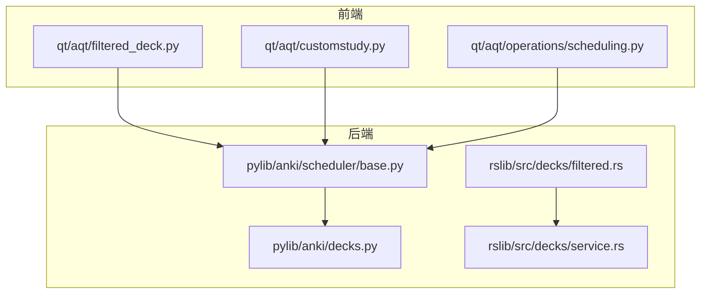
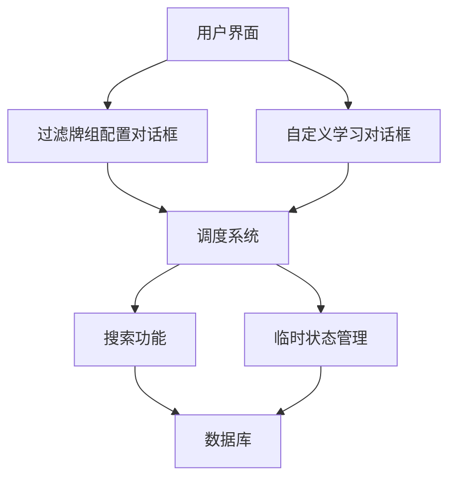
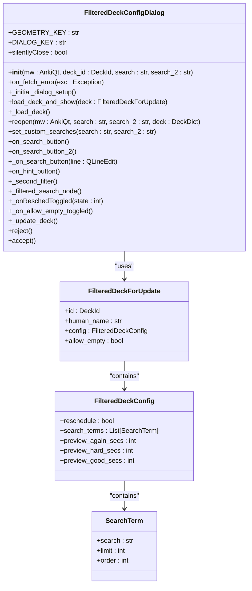
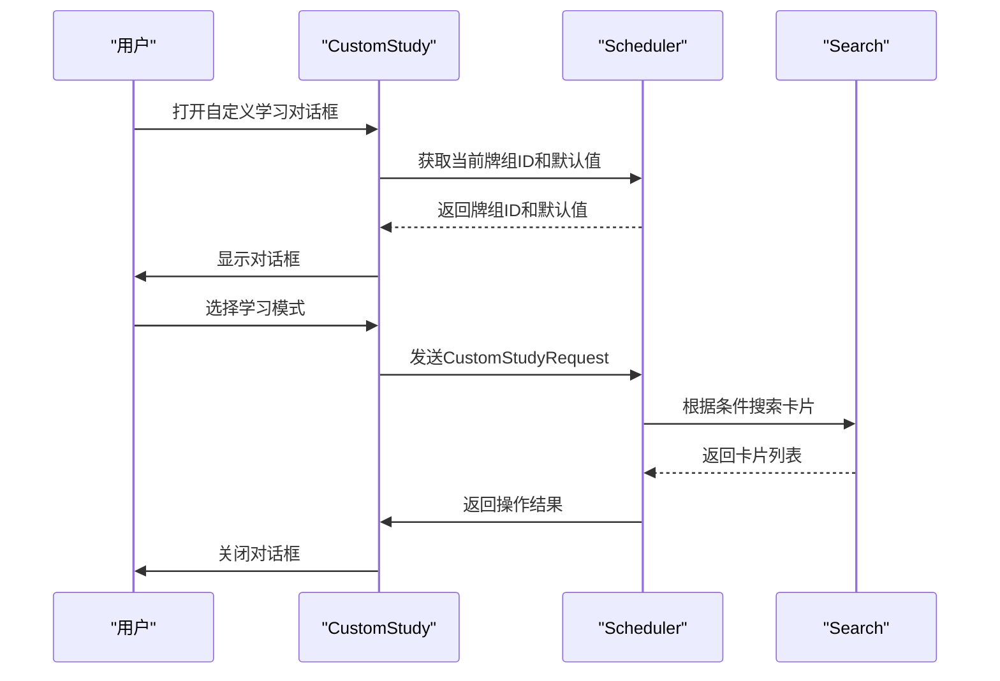
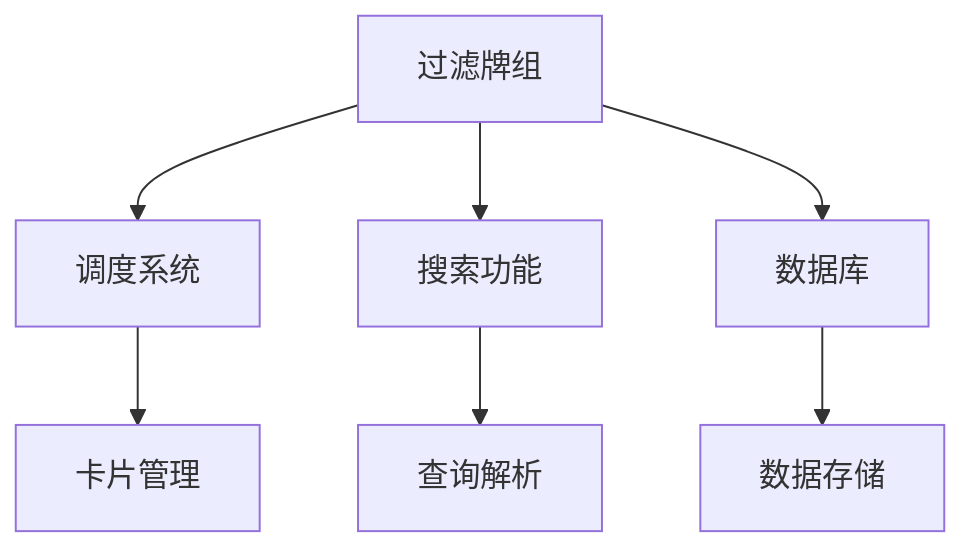

# 特殊牌组类型

<cite>
**本文档中引用的文件**  
- [filtered_deck.py](file://qt/aqt/filtered_deck.py)
- [customstudy.py](file://qt/aqt/customstudy.py)
- [operations/scheduling.py](file://qt/aqt/operations/scheduling.py)
- [scheduler/base.py](file://pylib/anki/scheduler/base.py)
- [decks.py](file://pylib/anki/decks.py)
- [filtered.rs](file://rslib/src/decks/filtered.rs)
- [service.rs](file://rslib/src/decks/service.rs)
</cite>

## 目录
1. [简介](#简介)
2. [项目结构](#项目结构)
3. [核心组件](#核心组件)
4. [架构概述](#架构概述)
5. [详细组件分析](#详细组件分析)
6. [依赖分析](#依赖分析)
7. [性能考量](#性能考量)
8. [故障排除指南](#故障排除指南)
9. [结论](#结论)

## 简介
Anki中的特殊牌组类型为用户提供了一种灵活的学习方式，允许他们根据特定条件动态选择卡片进行学习。这些特殊牌组主要包括过滤牌组（Filtered Deck）和自定义学习选项（Custom Study）。过滤牌组允许用户基于搜索条件创建临时牌组，而自定义学习选项则提供了多种学习模式，如增加新卡片限制、复习遗忘卡片等。这些功能极大地增强了Anki的个性化学习体验。

## 项目结构
Anki的项目结构清晰地划分了前端和后端逻辑。前端逻辑主要位于`qt/aqt`目录下，负责用户界面的展示和交互。后端逻辑则分布在`pylib/anki`和`rslib/src`目录中，处理数据存储、调度和业务逻辑。过滤牌组和自定义学习的相关代码主要集中在`qt/aqt/filtered_deck.py`、`qt/aqt/customstudy.py`以及`rslib/src/decks`和`rslib/src/scheduler`目录中。

**图示来源**
- [filtered_deck.py](file://qt/aqt/filtered_deck.py)
- [customstudy.py](file://qt/aqt/customstudy.py)
- [scheduler/base.py](file://pylib/anki/scheduler/base.py)
- [filtered.rs](file://rslib/src/decks/filtered.rs)
- [service.rs](file://rslib/src/decks/service.rs)

## 核心组件
过滤牌组和自定义学习是Anki中两个核心的特殊牌组类型。过滤牌组通过搜索条件动态选择卡片，而自定义学习则提供了一系列预设的学习模式。这些组件的实现依赖于Anki的调度系统和搜索功能，确保了高效和准确的卡片选择。

**组件来源**
- [filtered_deck.py](file://qt/aqt/filtered_deck.py#L29-L306)
- [customstudy.py](file://qt/aqt/customstudy.py#L32-L196)

## 架构概述
Anki的特殊牌组类型架构分为前端和后端两部分。前端负责用户界面的展示和用户交互，后端负责数据处理和业务逻辑。前端通过调用后端API来实现过滤牌组的创建、执行和清理。后端则通过调度系统和搜索功能来动态选择卡片，并管理临时状态。

**图示来源**
- [filtered_deck.py](file://qt/aqt/filtered_deck.py)
- [customstudy.py](file://qt/aqt/customstudy.py)
- [scheduler/base.py](file://pylib/anki/scheduler/base.py)

## 详细组件分析

### 过滤牌组分析
过滤牌组通过搜索条件解析、动态卡片选择和临时状态管理来实现其功能。用户可以在过滤牌组配置对话框中设置搜索条件、排序方式和卡片数量限制。这些设置会被保存到`FilteredDeckForUpdate`对象中，并通过`add_or_update_filtered_deck`方法传递给后端。

#### 类图

**图示来源**
- [filtered_deck.py](file://qt/aqt/filtered_deck.py#L29-L306)
- [scheduler/base.py](file://pylib/anki/scheduler/base.py#L21-L21)
- [decks.py](file://pylib/anki/decks.py#L24-L24)

### 自定义学习分析
自定义学习通过提供多种预设的学习模式来满足用户的个性化需求。用户可以选择增加新卡片限制、复习遗忘卡片、预览新卡片等模式。这些模式的实现依赖于`CustomStudyRequest`对象，该对象包含了用户选择的模式和相关参数。

#### 序列图

**图示来源**
- [customstudy.py](file://qt/aqt/customstudy.py#L32-L196)
- [scheduler/base.py](file://pylib/anki/scheduler/base.py#L99-L100)

## 依赖分析
特殊牌组类型的实现依赖于Anki的多个核心模块，包括调度系统、搜索功能和数据库管理。这些模块之间的依赖关系确保了过滤牌组和自定义学习的高效运行。

**图示来源**
- [filtered_deck.py](file://qt/aqt/filtered_deck.py)
- [scheduler/base.py](file://pylib/anki/scheduler/base.py)
- [decks.py](file://pylib/anki/decks.py)

## 性能考量
特殊牌组类型在提供灵活性的同时，也带来了性能上的挑战。过滤牌组的搜索条件解析和动态卡片选择需要消耗一定的计算资源，尤其是在处理大量卡片时。为了优化性能，Anki采用了缓存机制和异步处理，确保用户界面的响应速度。

## 故障排除指南
在使用特殊牌组类型时，可能会遇到一些常见问题，如搜索条件无效、卡片选择为空等。这些问题通常可以通过检查搜索条件的正确性和确保牌组中有符合条件的卡片来解决。

**组件来源**
- [filtered_deck.py](file://qt/aqt/filtered_deck.py#L29-L306)
- [customstudy.py](file://qt/aqt/customstudy.py#L32-L196)

## 结论
Anki的特殊牌组类型为用户提供了一种强大的个性化学习工具。通过过滤牌组和自定义学习，用户可以根据自己的需求灵活地选择和管理学习内容。这些功能的实现依赖于Anki的调度系统、搜索功能和数据库管理，确保了高效和准确的卡片选择。未来，可以通过进一步优化性能和增加更多预设模式来提升用户体验。