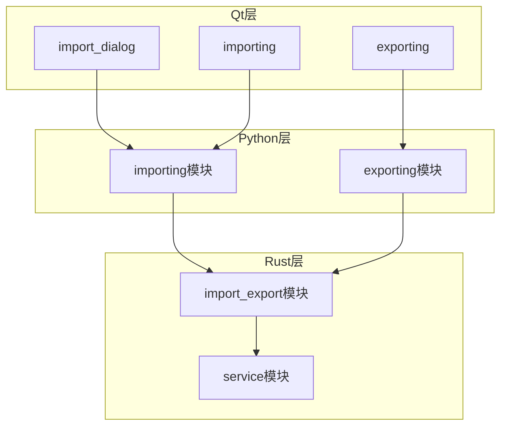
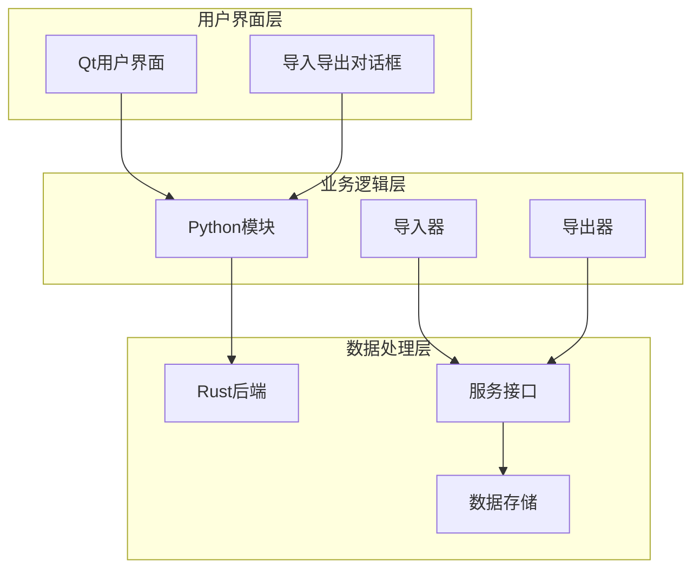
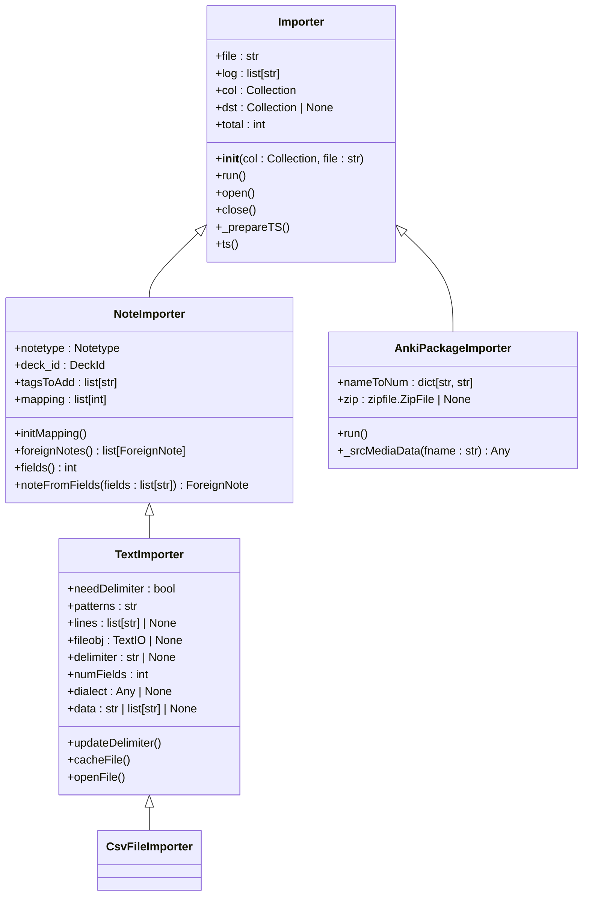
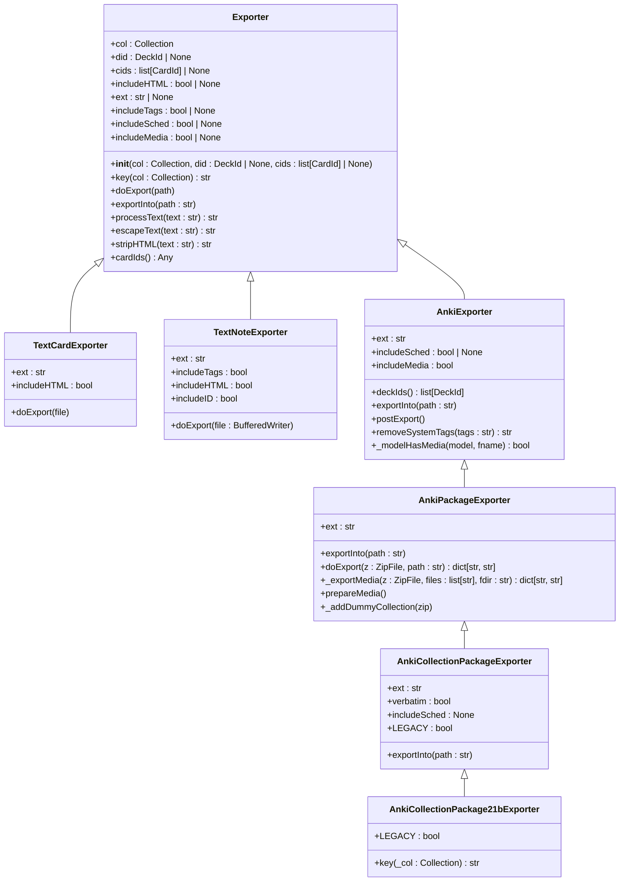
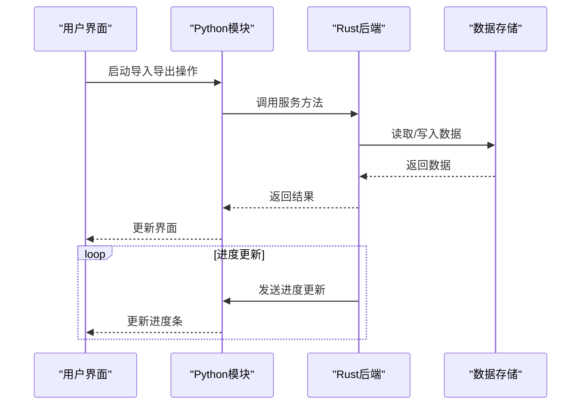
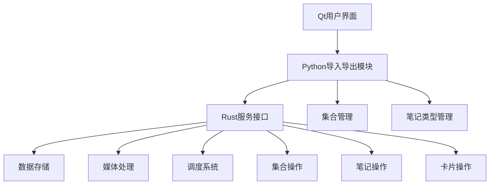

# 笔记导入导出

<cite>
**本文档引用的文件**
- [base.py](file://pylib/anki/importing/base.py)
- [csvfile.py](file://pylib/anki/importing/csvfile.py)
- [apkg.py](file://pylib/anki/importing/apkg.py)
- [noteimp.py](file://pylib/anki/importing/noteimp.py)
- [exporting.py](file://pylib/anki/exporting.py)
- [service.rs](file://rslib/src/import_export/service.rs)
- [mod.rs](file://rslib/src/import_export/mod.rs)
- [importing.py](file://qt/aqt/import_export/importing.py)
- [exporting.py](file://qt/aqt/import_export/exporting.py)
- [import_export.proto](file://proto/anki/import_export.proto)
</cite>

## 目录
1. [简介](#简介)
2. [项目结构](#项目结构)
3. [核心组件](#核心组件)
4. [架构概述](#架构概述)
5. [详细组件分析](#详细组件分析)
6. [依赖分析](#依赖分析)
7. [性能考虑](#性能考虑)
8. [故障排除指南](#故障排除指南)
9. [结论](#结论)

## 简介
Anki的笔记导入导出功能为用户提供了一种灵活的数据迁移和共享机制。该系统支持多种格式，包括APKG、CSV和JSON等，允许用户在不同设备和用户之间无缝传输学习资料。导入导出功能不仅处理文本内容，还管理媒体文件、调度信息和卡片状态，确保数据的完整性和一致性。系统设计注重用户体验，提供了直观的界面和详细的进度反馈，同时通过后台操作避免界面冻结。对于开发者而言，该功能提供了清晰的API和可扩展的架构，支持自定义导入导出流程。

## 项目结构
Anki的导入导出功能分布在多个模块中，形成了一个分层的架构。Python层负责高层逻辑和用户界面交互，Rust层处理核心数据操作和性能关键任务，而Qt层则提供图形用户界面。这种分层设计使得系统既灵活又高效。

**图示来源**
- [importing.py](file://pylib/anki/importing/__init__.py)
- [exporting.py](file://pylib/anki/exporting.py)
- [service.rs](file://rslib/src/import_export/service.rs)

**本节来源**
- [importing.py](file://pylib/anki/importing/__init__.py)
- [exporting.py](file://pylib/anki/exporting.py)

## 核心组件
笔记导入导出功能的核心组件包括导入器、导出器、服务接口和用户界面。导入器负责解析不同格式的输入文件，将数据转换为Anki内部表示；导出器则执行相反的过程，将Anki数据序列化为外部格式。服务接口作为Python和Rust之间的桥梁，确保高效的数据处理。用户界面提供直观的操作流程，引导用户完成导入导出任务。

**本节来源**
- [base.py](file://pylib/anki/importing/base.py)
- [exporting.py](file://pylib/anki/exporting.py)
- [service.rs](file://rslib/src/import_export/service.rs)

## 架构概述
Anki的导入导出架构采用分层设计，将用户界面、业务逻辑和数据处理分离。这种设计提高了系统的可维护性和可扩展性，同时确保了性能和用户体验。

**图示来源**
- [importing.py](file://qt/aqt/import_export/importing.py)
- [exporting.py](file://qt/aqt/import_export/exporting.py)
- [service.rs](file://rslib/src/import_export/service.rs)

## 详细组件分析

### 导入功能分析
Anki的导入功能支持多种文件格式，每种格式都有专门的导入器处理。系统通过统一的接口和抽象基类确保了一致的行为和易于扩展的架构。

#### 导入器类结构

**图示来源**
- [base.py](file://pylib/anki/importing/base.py)
- [csvfile.py](file://pylib/anki/importing/csvfile.py)
- [apkg.py](file://pylib/anki/importing/apkg.py)

**本节来源**
- [base.py](file://pylib/anki/importing/base.py)
- [csvfile.py](file://pylib/anki/importing/csvfile.py)
- [apkg.py](file://pylib/anki/importing/apkg.py)

### 导出功能分析
Anki的导出功能提供了多种格式选项，从简单的文本文件到复杂的APKG包。每个导出器都继承自一个通用的Exporter基类，确保了一致的接口和行为。

#### 导出器类结构

**图示来源**
- [exporting.py](file://pylib/anki/exporting.py)

**本节来源**
- [exporting.py](file://pylib/anki/exporting.py)

### 服务接口分析
导入导出服务接口是Python和Rust之间的桥梁，定义了所有导入导出操作的RPC方法。这个接口确保了前后端之间的清晰分离，同时提供了高性能的数据处理能力。

#### 服务接口序列图

**图示来源**
- [service.rs](file://rslib/src/import_export/service.rs)
- [import_export.proto](file://proto/anki/import_export.proto)

**本节来源**
- [service.rs](file://rslib/src/import_export/service.rs)

## 依赖分析
导入导出功能的依赖关系复杂而有序，形成了一个清晰的调用链。Python层的导入导出模块依赖于Rust层的服务接口，而服务接口又依赖于底层的数据存储和处理模块。

**图示来源**
- [importing.py](file://qt/aqt/import_export/importing.py)
- [exporting.py](file://qt/aqt/import_export/exporting.py)
- [service.rs](file://rslib/src/import_export/service.rs)

**本节来源**
- [importing.py](file://qt/aqt/import_export/importing.py)
- [exporting.py](file://qt/aqt/import_export/exporting.py)
- [service.rs](file://rslib/src/import_export/service.rs)

## 性能考虑
对于大规模数据迁移，Anki的导入导出功能采用了多种性能优化策略。首先，所有耗时操作都在后台线程中执行，避免阻塞用户界面。其次，数据处理尽可能在Rust层完成，利用其高性能特性。此外，系统采用了增量处理和批量操作，减少I/O开销。对于媒体文件，系统会检查文件是否存在，避免重复复制。在导出APKG文件时，SVG文件使用压缩存储，而其他文件则使用无压缩存储，以平衡文件大小和处理速度。

## 故障排除指南
导入导出过程中可能遇到的常见问题包括文件格式不支持、编码错误、媒体文件丢失等。系统提供了详细的日志记录和错误报告机制，帮助用户诊断问题。对于导入操作，系统会记录新创建、更新、重复和冲突的笔记数量。对于导出操作，系统会显示处理进度和最终结果。如果遇到问题，建议首先检查文件格式和编码，然后查看日志信息以获取具体错误详情。

**本节来源**
- [mod.rs](file://rslib/src/import_export/mod.rs)
- [importing.py](file://qt/aqt/import_export/importing.py)
- [exporting.py](file://qt/aqt/import_export/exporting.py)

## 结论
Anki的笔记导入导出功能是一个设计精良、功能丰富的系统，支持多种格式和复杂的使用场景。通过分层架构和清晰的接口定义，系统实现了高性能和高可用性。对于新手用户，系统提供了直观的界面和详细的指导；对于资深开发者，系统提供了可扩展的API和灵活的配置选项。未来的发展方向可能包括更多的导入导出格式支持、更智能的数据映射和更强大的错误恢复机制。