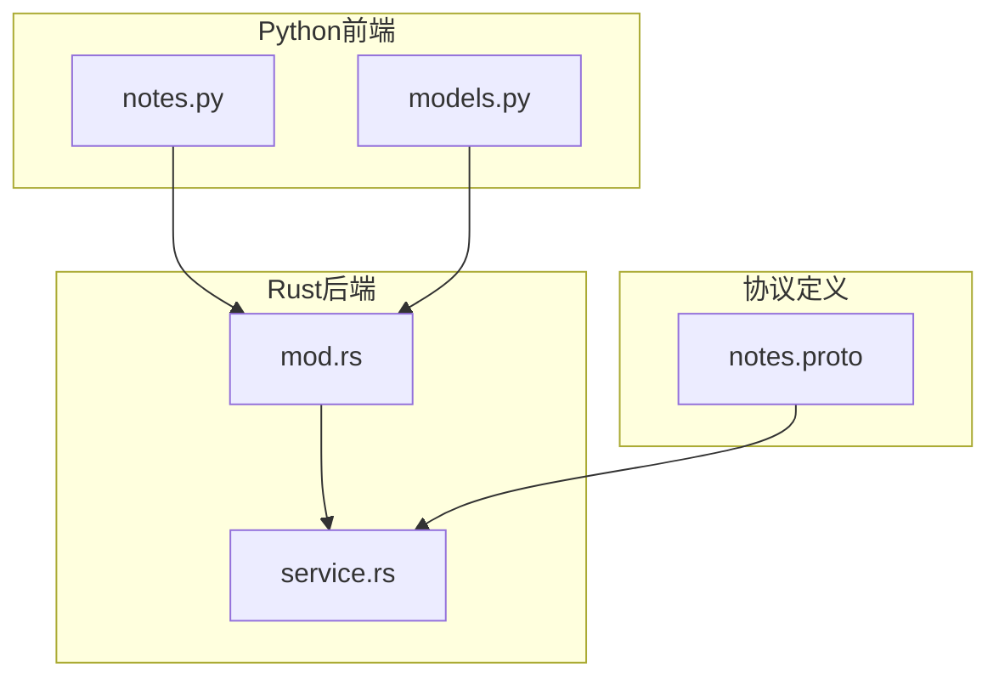
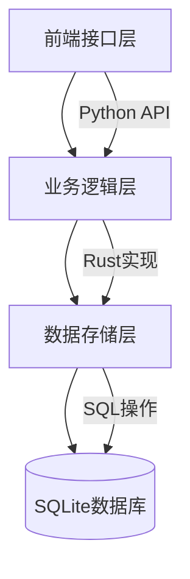
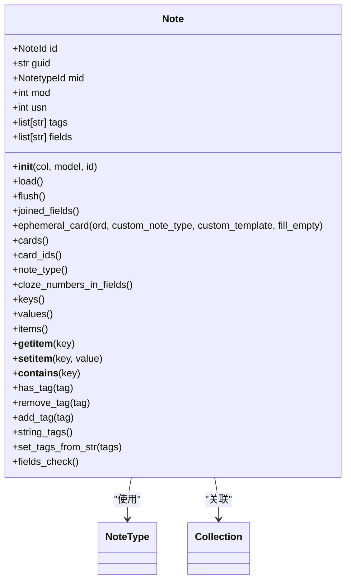
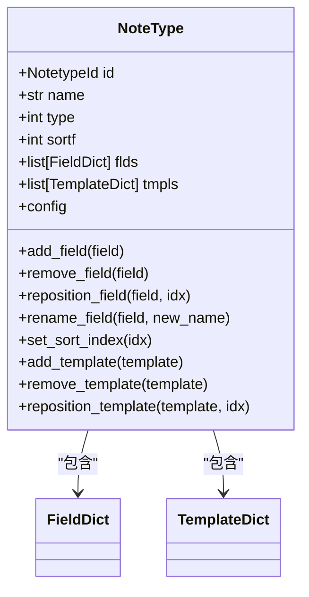
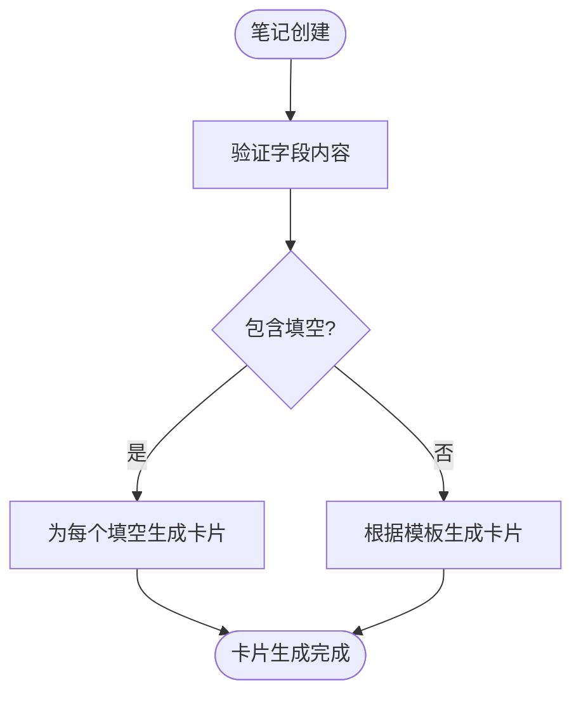
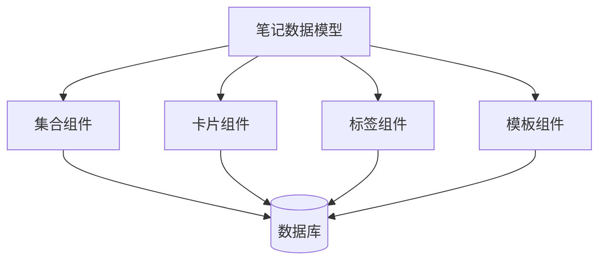

# 笔记数据模型

<cite>
**本文档中引用的文件**  
- [notes.py](file://pylib/anki/notes.py)
- [models.py](file://pylib/anki/models.py)
- [mod.rs](file://rslib/src/notes/mod.rs)
- [service.rs](file://rslib/src/notes/service.rs)
- [notes.proto](file://proto/anki/notes.proto)
</cite>

## 目录
1. [简介](#简介)
2. [项目结构](#项目结构)
3. [核心组件](#核心组件)
4. [架构概述](#架构概述)
5. [详细组件分析](#详细组件分析)
6. [依赖分析](#依赖分析)
7. [性能考虑](#性能考虑)
8. [故障排除指南](#故障排除指南)
9. [结论](#结论)
10. [附录](#附录)（如有必要）

## 简介
Anki的笔记数据模型是其核心功能的基础，负责管理用户创建的学习内容。该模型通过Note类实现，包含字段、标签、笔记类型等关键属性，并与卡片模板系统紧密集成。笔记数据模型的设计确保了数据的一致性、唯一性和高效检索，同时支持复杂的笔记类型和模板系统。本文档将深入分析笔记数据模型的结构设计、存储机制和操作流程，为开发者提供全面的技术参考。

## 项目结构
Anki的笔记数据模型实现分布在多个模块中，主要包括Python前端接口和Rust后端核心逻辑。Python层提供用户友好的API，而Rust层处理高性能的数据操作和存储。这种分层架构既保证了开发效率，又确保了运行性能。

**图表来源**  
- [notes.py](file://pylib/anki/notes.py#L28-L201)
- [models.py](file://pylib/anki/models.py#L34-L34)
- [mod.rs](file://rslib/src/notes/mod.rs#L133-L189)
- [service.rs](file://rslib/src/notes/service.rs#L0-L201)
- [notes.proto](file://proto/anki/notes.proto#L0-L122)

**章节来源**
- [notes.py](file://pylib/anki/notes.py#L1-L207)
- [models.py](file://pylib/anki/models.py#L1-L579)

## 核心组件
笔记数据模型的核心组件包括Note类、NoteType定义、字段管理系统和标签处理机制。Note类作为数据载体，封装了笔记的所有属性和操作方法。NoteType定义了笔记的结构模板，包括字段和卡片模板。字段管理系统负责字段的创建、重命名和排序，而标签处理机制则提供了标签的增删查功能。这些组件协同工作，构成了完整的笔记数据管理框架。

**章节来源**
- [notes.py](file://pylib/anki/notes.py#L28-L201)
- [models.py](file://pylib/anki/models.py#L89-L129)

## 架构概述
Anki的笔记数据模型采用分层架构设计，分为前端接口层、业务逻辑层和数据存储层。前端接口层提供Python API，业务逻辑层用Rust实现核心功能，数据存储层负责与SQLite数据库交互。这种架构分离了关注点，提高了代码的可维护性和性能。

**图表来源**  
- [mod.rs](file://rslib/src/notes/mod.rs#L133-L189)
- [service.rs](file://rslib/src/notes/service.rs#L0-L201)

## 详细组件分析
### Note类分析
Note类是笔记数据模型的核心，封装了笔记的所有属性和操作方法。它提供了字典接口，允许通过字段名直接访问和修改字段内容。Note类还实现了标签管理功能，支持标签的添加、删除和查询。

**图表来源**  
- [notes.py](file://pylib/anki/notes.py#L28-L201)

**章节来源**
- [notes.py](file://pylib/anki/notes.py#L28-L201)

### NoteType分析
NoteType定义了笔记的结构模板，包括字段和卡片模板。每个NoteType包含一个字段列表和一个模板列表，字段定义了笔记的内容结构，模板定义了如何从笔记生成卡片。

**图表来源**  
- [models.py](file://pylib/anki/models.py#L163-L203)

**章节来源**
- [models.py](file://pylib/anki/models.py#L163-L203)

### 字段与模板关联机制
笔记类型通过字段和模板的关联机制生成对应的卡片。标准笔记类型中，每个模板对应一个卡片，模板中的字段引用决定了卡片内容的来源。对于填空笔记类型，系统会自动为每个填空字段生成对应的卡片。

**图表来源**  
- [mod.rs](file://rslib/src/notes/mod.rs#L133-L189)

**章节来源**
- [mod.rs](file://rslib/src/notes/mod.rs#L133-L189)

## 依赖分析
笔记数据模型与其他组件存在紧密的依赖关系。它依赖于集合（Collection）组件进行数据持久化，依赖于卡片（Card）组件生成学习卡片，依赖于标签（Tags）组件管理标签数据。这些依赖关系通过清晰的接口定义，确保了组件间的松耦合。

**图表来源**  
- [notes.py](file://pylib/anki/notes.py#L28-L201)
- [models.py](file://pylib/anki/models.py#L89-L129)

**章节来源**
- [notes.py](file://pylib/anki/notes.py#L1-L207)
- [models.py](file://pylib/anki/models.py#L1-L579)

## 性能考虑
笔记数据模型在设计时充分考虑了性能优化。通过缓存机制减少数据库查询，使用高效的字符串处理算法，以及批量操作支持，确保了大规模数据处理的性能。笔记ID的生成策略和索引优化也显著提升了数据检索速度。

## 故障排除指南
在使用笔记数据模型时，常见的问题包括字段验证失败、标签处理异常和笔记类型转换错误。这些问题通常源于数据格式不正确或操作顺序不当。通过检查字段内容、验证标签格式和确保笔记类型兼容性，可以有效解决这些问题。

**章节来源**
- [notes.py](file://pylib/anki/notes.py#L28-L201)
- [models.py](file://pylib/anki/models.py#L163-L203)

## 结论
Anki的笔记数据模型是一个精心设计的系统，它通过清晰的分层架构和模块化设计，实现了高效、可靠的数据管理。该模型不仅满足了基本的笔记管理需求，还支持复杂的笔记类型和模板系统，为用户提供了强大的学习工具。对于开发者而言，理解这个数据模型的内部机制，有助于更好地利用Anki的API进行二次开发和定制。

## 附录
### 笔记ID生成策略
笔记ID采用64位整数，通过时间戳和随机数结合生成，确保全局唯一性。系统在插入新笔记时会检查ID冲突，并自动分配新的ID。

### 字段数据存储格式
字段数据以文本形式存储，支持HTML格式。系统会对字段内容进行标准化处理，包括NFC规范化和无效字符过滤，确保数据的一致性和兼容性。

### 验证规则
笔记数据在保存前会经过严格的验证，包括字段非空检查、重复检查和填空语法检查。这些验证规则确保了数据的完整性和正确性。

**章节来源**
- [mod.rs](file://rslib/src/notes/mod.rs#L133-L189)
- [service.rs](file://rslib/src/notes/service.rs#L0-L201)