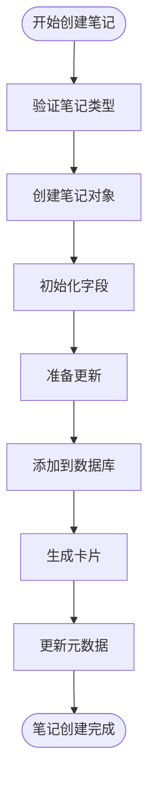
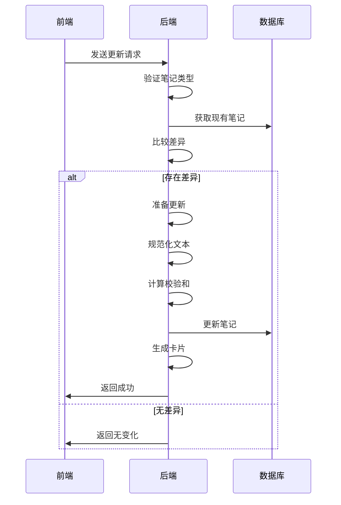
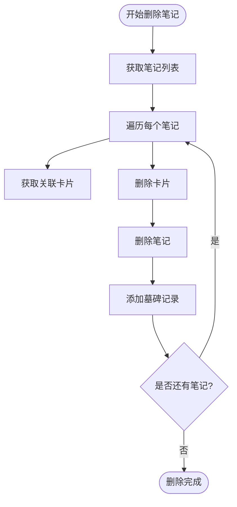
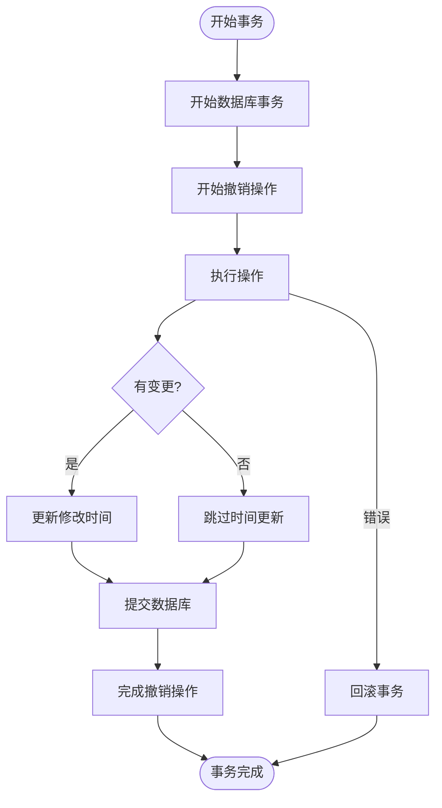
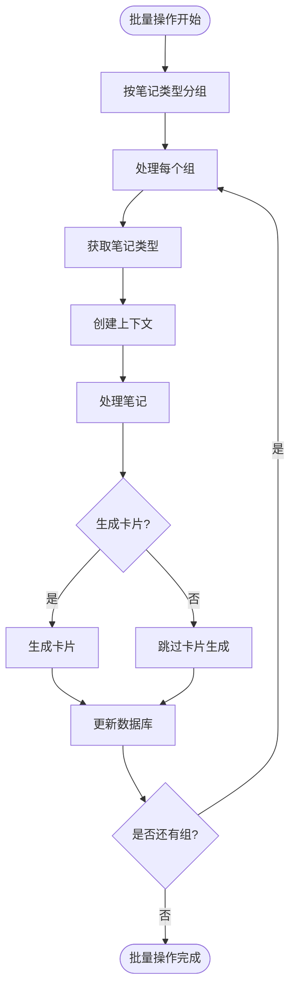
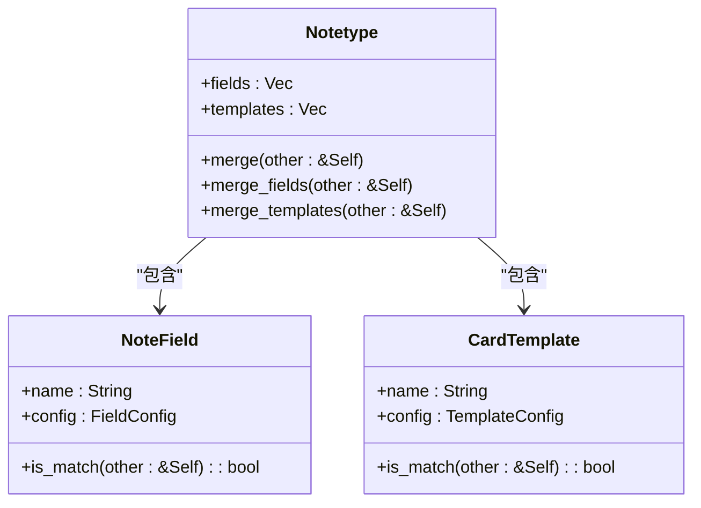
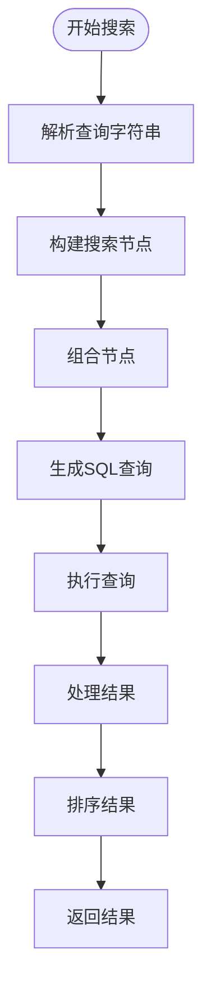
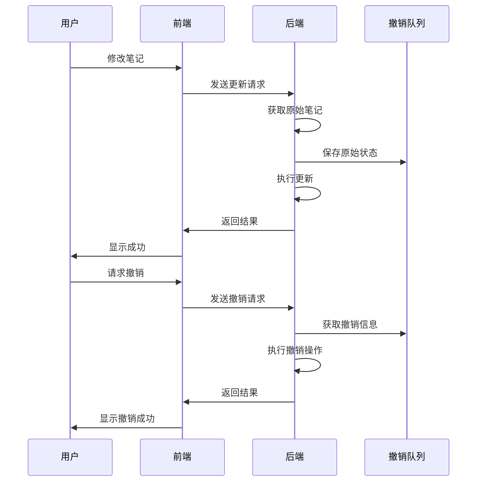

# 笔记生命周期管理

<cite>
**本文档中引用的文件**
- [Note.py](file://pylib/anki/notes.py)
- [collection.py](file://pylib/anki/collection.py)
- [mod.rs](file://rslib/src/notes/mod.rs)
- [service.rs](file://rslib/src/notes/service.rs)
- [undo.rs](file://rslib/src/notes/undo.rs)
- [mod.rs](file://rslib/src/storage/note/mod.rs)
- [transact.rs](file://rslib/src/collection/transact.rs)
- [merge.rs](file://rslib/src/notetype/merge.rs)
</cite>

## 目录
1. [简介](#简介)
2. [笔记创建流程](#笔记创建流程)
3. [笔记更新机制](#笔记更新机制)
4. [笔记删除与恢复](#笔记删除与恢复)
5. [事务管理与数据一致性](#事务管理与数据一致性)
6. [批量笔记操作](#批量笔记操作)
7. [笔记去重与合并](#笔记去重与合并)
8. [复杂查询与过滤](#复杂查询与过滤)
9. [撤销/重做与版本控制](#撤销/重做与版本控制)
10. [最佳实践指南](#最佳实践指南)
11. [性能考量](#性能考量)

## 简介
Anki笔记生命周期管理涵盖了从创建到删除的完整流程，包括事务管理、错误处理和数据一致性保障机制。系统通过Rust后端和Python前端的协同工作，实现了高效可靠的笔记管理功能。笔记作为Anki的核心数据单元，其生命周期涉及创建、更新、删除、恢复等多个阶段，每个阶段都有相应的事务管理和错误处理机制。

## 笔记创建流程
笔记创建是笔记生命周期的起点。当用户创建新笔记时，系统首先根据指定的笔记类型（Notetype）初始化笔记对象。笔记类型决定了笔记的字段数量和结构。创建过程中，系统会生成唯一的笔记ID和GUID，初始化修改时间和USN（更新序列号），并根据笔记类型创建相应数量的空字段。

**Diagram sources**
- [mod.rs](file://rslib/src/notes/mod.rs#L133-L189)
- [mod.rs](file://rslib/src/storage/note/mod.rs#L45-L87)

**Section sources**
- [mod.rs](file://rslib/src/notes/mod.rs#L133-L189)
- [mod.rs](file://rslib/src/storage/note/mod.rs#L45-L87)

## 笔记更新机制
笔记更新涉及内容修改、字段调整和卡片重新生成等操作。系统通过`update_note`方法处理笔记更新请求。更新前，系统会检查笔记是否与数据库中的现有笔记存在差异，避免不必要的更新操作。更新过程中，系统会重新计算校验和和排序字段，并根据需要重新生成关联的卡片。

**Diagram sources**
- [mod.rs](file://rslib/src/notes/mod.rs#L450-L480)
- [mod.rs](file://rslib/src/storage/note/mod.rs#L45-L87)

**Section sources**
- [mod.rs](file://rslib/src/notes/mod.rs#L450-L480)
- [mod.rs](file://rslib/src/storage/note/mod.rs#L45-L87)

## 笔记删除与恢复
笔记删除操作会同时移除笔记及其关联的所有卡片。系统通过`remove_notes`方法处理删除请求，该方法会遍历指定的笔记ID列表，逐个删除笔记和卡片。删除的笔记会被标记为"grave"，以便支持撤销操作和同步冲突解决。笔记恢复通过撤销机制实现，系统会从撤销队列中获取被删除的笔记信息并重新添加到数据库中。

**Diagram sources**
- [mod.rs](file://rslib/src/notes/mod.rs#L300-L320)
- [mod.rs](file://rslib/src/storage/note/mod.rs#L89-L130)

**Section sources**
- [mod.rs](file://rslib/src/notes/mod.rs#L300-L320)
- [mod.rs](file://rslib/src/storage/note/mod.rs#L89-L130)

## 事务管理与数据一致性
Anki系统通过事务管理确保数据一致性。所有笔记操作都在事务上下文中执行，确保操作的原子性。`transact`方法负责管理事务生命周期，包括开始事务、执行操作、提交或回滚。系统还实现了撤销队列，记录操作前的状态，支持撤销和重做功能。USN（更新序列号）用于跟踪修改，确保同步过程中的数据一致性。

**Diagram sources**
- [transact.rs](file://rslib/src/collection/transact.rs#L0-L74)
- [undo.rs](file://rslib/src/notes/undo.rs#L18-L49)

**Section sources**
- [transact.rs](file://rslib/src/collection/transact.rs#L0-L74)
- [undo.rs](file://rslib/src/notes/undo.rs#L18-L49)

## 批量笔记操作
批量笔记操作通过`add_notes`和`update_notes_maybe_undoable`等方法实现。系统支持批量添加、更新和删除笔记，通过单个事务处理多个操作，提高性能。批量操作会根据笔记类型分组处理，优化卡片生成过程。系统还提供了跳过撤销条目的选项，适用于不需要撤销功能的大规模数据导入场景。

**Section sources**
- [mod.rs](file://rslib/src/notes/mod.rs#L200-L220)
- [service.rs](file://rslib/src/notes/service.rs#L50-L70)

## 笔记去重与合并
笔记去重通过校验和机制实现。系统计算笔记第一个字段的SHA1校验和，并检查是否存在具有相同校验和的笔记。如果发现重复，系统会标记为重复状态。笔记合并功能允许将多个笔记类型的字段和模板合并到一个笔记类型中，通过字段名或ID匹配来确定是否为相同字段，确保合并过程的准确性。

**Diagram sources**
- [merge.rs](file://rslib/src/notetype/merge.rs#L0-L172)
- [mod.rs](file://rslib/src/notes/mod.rs#L600-L630)

**Section sources**
- [merge.rs](file://rslib/src/notetype/merge.rs#L0-L172)
- [mod.rs](file://rslib/src/notes/mod.rs#L600-L630)

## 复杂查询与过滤
Anki提供了强大的搜索和过滤功能。系统通过`search`模块实现复杂查询，支持多种搜索节点类型，包括按笔记类型、标签、牌组、状态等条件搜索。搜索构建器允许程序化地构建复杂查询，支持AND、OR、NOT等逻辑操作。查询结果可以按多种方式排序，包括按修改时间、创建时间、间隔等。

**Section sources**
- [mod.rs](file://rslib/src/search/mod.rs#L0-L480)
- [builder.rs](file://rslib/src/search/builder.rs#L0-L285)

## 撤销/重做与版本控制
Anki的撤销/重做机制基于操作队列实现。每个可撤销的操作都会在执行前保存原始状态到撤销队列中。系统通过`save_undo`方法保存撤销信息，支持笔记的添加、更新、删除等操作的撤销。撤销队列还支持合并快速连续的编辑操作，避免产生过多的撤销条目。版本控制通过USN和修改时间戳实现，确保同步过程中的数据一致性。

**Diagram sources**
- [undo.rs](file://rslib/src/notes/undo.rs#L18-L49)
- [mod.rs](file://rslib/src/notes/mod.rs#L500-L520)

**Section sources**
- [undo.rs](file://rslib/src/notes/undo.rs#L18-L49)
- [mod.rs](file://rslib/src/notes/mod.rs#L500-L520)

## 最佳实践指南
对于新手用户，建议遵循以下最佳实践：使用有意义的笔记类型名称，合理组织字段结构，定期备份数据，利用标签进行分类管理。在创建笔记时，确保第一个字段不为空，避免产生重复笔记。对于批量操作，建议先在小范围内测试，确认无误后再进行大规模操作。使用搜索功能时，可以组合多个条件进行精确过滤。

## 性能考量
大规模笔记数据处理需要考虑性能优化。批量操作应尽量减少数据库事务的开销，通过单个事务处理多个操作。查询优化方面，应合理使用索引，避免全表扫描。内存管理方面，应避免一次性加载过多笔记到内存中。同步性能方面，应合理设置USN，减少不必要的数据传输。对于大量笔记的导入导出，建议使用专用的批量处理接口，避免逐个操作带来的性能瓶颈。