# 笔记管理

<cite>
**本文档中引用的文件**  
- [notes.py](file://pylib/anki/notes.py)
- [mod.rs](file://rslib/src/notes/mod.rs)
- [service.rs](file://rslib/src/notes/service.rs)
- [importing.py](file://qt/aqt/importing.py)
- [exporting.py](file://qt/aqt/exporting.py)
</cite>

## 目录
1. [简介](#简介)
2. [项目结构](#项目结构)
3. [核心组件](#核心组件)
4. [架构概述](#架构概述)
5. [详细组件分析](#详细组件分析)
6. [依赖分析](#依赖分析)
7. [性能考虑](#性能考虑)
8. [故障排除指南](#故障排除指南)
9. [结论](#结论)
10. [附录](#附录)（如有必要）

## 简介
Anki笔记管理系统是一个功能强大的学习工具，其核心是笔记（Note）类的设计与实现。本文档全面阐述了Anki中笔记管理的各个方面，包括Note类的设计架构、数据模型、操作流程以及与其他组件的协同工作方式。系统通过Python和Rust的混合架构实现，其中Rust负责核心逻辑和性能关键操作，Python提供用户界面和高级功能。笔记系统与卡片模板、媒体文件、标签系统等紧密集成，形成了一个完整的知识管理生态系统。

## 项目结构
Anki的项目结构清晰地分为多个模块，每个模块负责特定的功能领域。核心笔记管理功能主要分布在pylib和rslib两个目录中，其中pylib包含Python实现的高级接口，rslib包含Rust实现的核心逻辑。

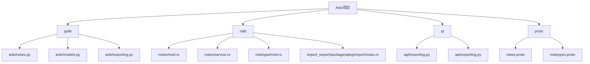
```mermaid
graph TD
A[Anki项目] --> B[pylib]
A --> C[rslib]
A --> D[qt]
A --> E[proto]
B --> F[anki/notes.py]
B --> G[anki/models.py]
B --> H[anki/exporting.py]
C --> I[notes/mod.rs]
C --> J[notes/service.rs]
C --> K[notetype/mod.rs]
C --> L[import_export/package/apkg/import/notes.rs]
D --> M[aqt/importing.py]
D --> N[aqt/exporting.py]
E --> O[notes.proto]
E --> P[notetypes.proto]
```

**Diagram sources**
- [notes.py](file://pylib/anki/notes.py)
- [mod.rs](file://rslib/src/notes/mod.rs)
- [importing.py](file://qt/aqt/importing.py)
- [exporting.py](file://qt/aqt/exporting.py)

**Section sources**
- [notes.py](file://pylib/anki/notes.py#L1-L50)
- [mod.rs](file://rslib/src/notes/mod.rs#L1-L50)

## 核心组件
笔记管理系统的核心组件包括Note类、NoteType（笔记类型）、标签系统、导入导出功能以及事务管理机制。Note类作为系统的基本数据单元，封装了笔记的所有属性和行为，包括字段管理、标签处理和与卡片的关联。NoteType定义了笔记的结构模板，包括字段定义和卡片生成规则。系统通过Rust实现的高性能后端处理数据持久化和复杂计算，通过Python实现的前端提供用户友好的操作界面。

**Section sources**
- [notes.py](file://pylib/anki/notes.py#L28-L201)
- [mod.rs](file://rslib/src/notes/mod.rs#L133-L189)

## 架构概述
Anki笔记管理系统的架构采用分层设计，将数据访问、业务逻辑和用户界面分离。系统通过Protocol Buffers定义的API接口在Python和Rust之间进行通信，确保了跨语言调用的类型安全和性能效率。

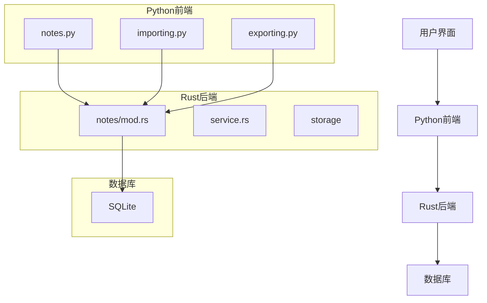
```mermaid
graph TD
A[用户界面] --> B[Python前端]
B --> C[Rust后端]
C --> D[数据库]
subgraph Python前端
B1[notes.py]
B2[importing.py]
B3[exporting.py]
end
subgraph Rust后端
C1[notes/mod.rs]
C2[service.rs]
C3[storage]
end
subgraph 数据库
D1[SQLite]
end
B1 --> C1
B2 --> C1
B3 --> C1
C1 --> D1
```

**Diagram sources**
- [notes.py](file://pylib/anki/notes.py)
- [mod.rs](file://rslib/src/notes/mod.rs)
- [importing.py](file://qt/aqt/importing.py)
- [exporting.py](file://qt/aqt/exporting.py)

## 详细组件分析

### Note类设计分析
Note类是Anki笔记管理系统的核心数据结构，负责管理单个笔记的所有属性和行为。该类的设计体现了面向对象编程的最佳实践，提供了丰富的接口来操作笔记数据。

#### 类结构与数据模型
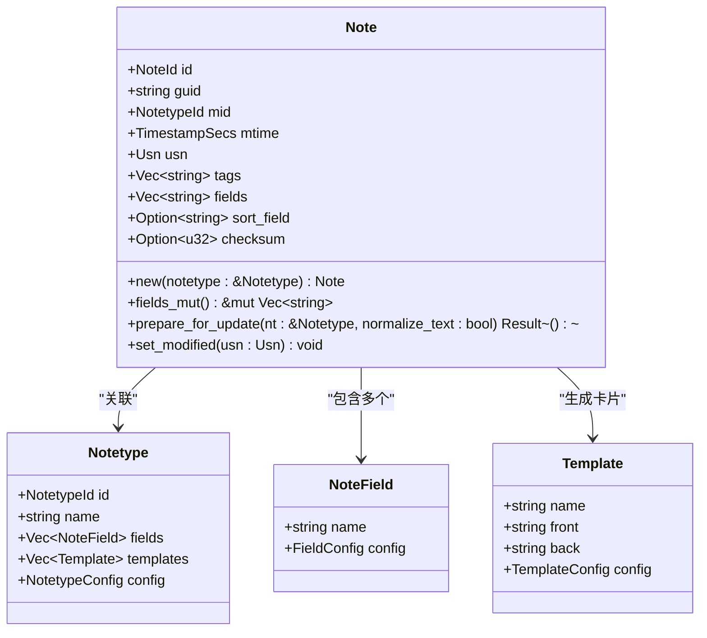
```mermaid
classDiagram
class Note {
+NoteId id
+string guid
+NotetypeId mid
+TimestampSecs mtime
+Usn usn
+Vec~string~ tags
+Vec~string~ fields
+Option~string~ sort_field
+Option~u32~ checksum
+new(notetype : &Notetype) Note
+fields_mut() &mut Vec~string~
+prepare_for_update(nt : &Notetype, normalize_text : bool) Result~()~
+set_modified(usn : Usn) void
}
class Notetype {
+NotetypeId id
+string name
+Vec~NoteField~ fields
+Vec~Template~ templates
+NotetypeConfig config
}
class NoteField {
+string name
+FieldConfig config
}
class Template {
+string name
+string front
+string back
+TemplateConfig config
}
Note --> Notetype : "关联"
Note --> NoteField : "包含多个"
Note --> Template : "生成卡片"
```

**Diagram sources**
- [mod.rs](file://rslib/src/notes/mod.rs#L133-L189)
- [notes.py](file://pylib/anki/notes.py#L28-L201)

#### 字段管理与标签处理
Note类通过字段映射（_fmap）实现字段的字典式访问，允许用户通过字段名称而不是索引来操作数据。标签系统采用列表存储，通过集合操作实现高效的标签管理。

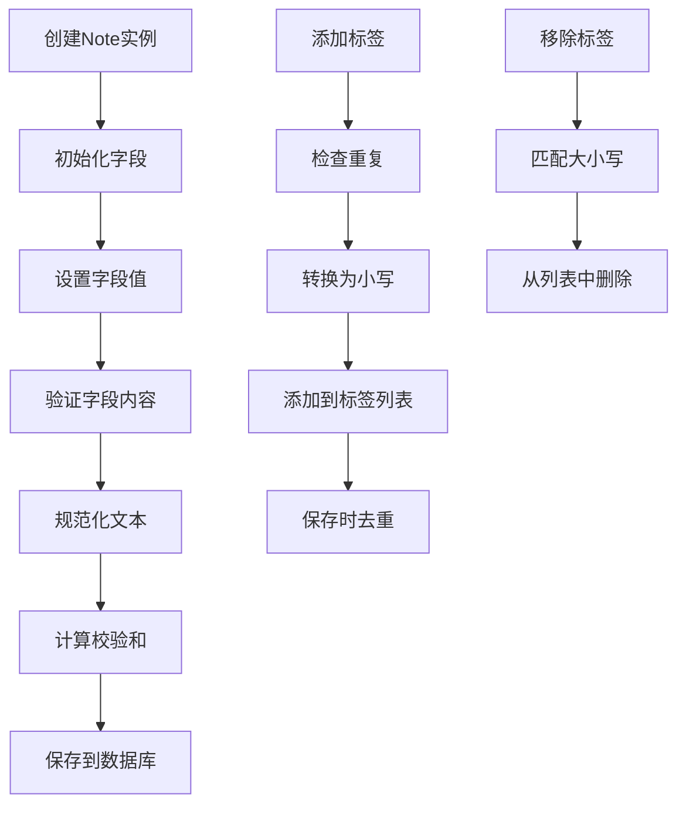
```mermaid
flowchart TD
A[创建Note实例] --> B[初始化字段]
B --> C[设置字段值]
C --> D[验证字段内容]
D --> E[规范化文本]
E --> F[计算校验和]
F --> G[保存到数据库]
H[添加标签] --> I[检查重复]
I --> J[转换为小写]
J --> K[添加到标签列表]
K --> L[保存时去重]
M[移除标签] --> N[匹配大小写]
N --> O[从列表中删除]
```

**Diagram sources**
- [mod.rs](file://rslib/src/notes/mod.rs#L374-L394)
- [notes.py](file://pylib/anki/notes.py#L28-L201)

**Section sources**
- [mod.rs](file://rslib/src/notes/mod.rs#L133-L189)
- [notes.py](file://pylib/anki/notes.py#L28-L201)

### 笔记操作流程分析
笔记的创建、更新和删除操作构成了系统的核心工作流，这些操作通过事务管理确保数据的一致性和完整性。

#### 笔记创建流程
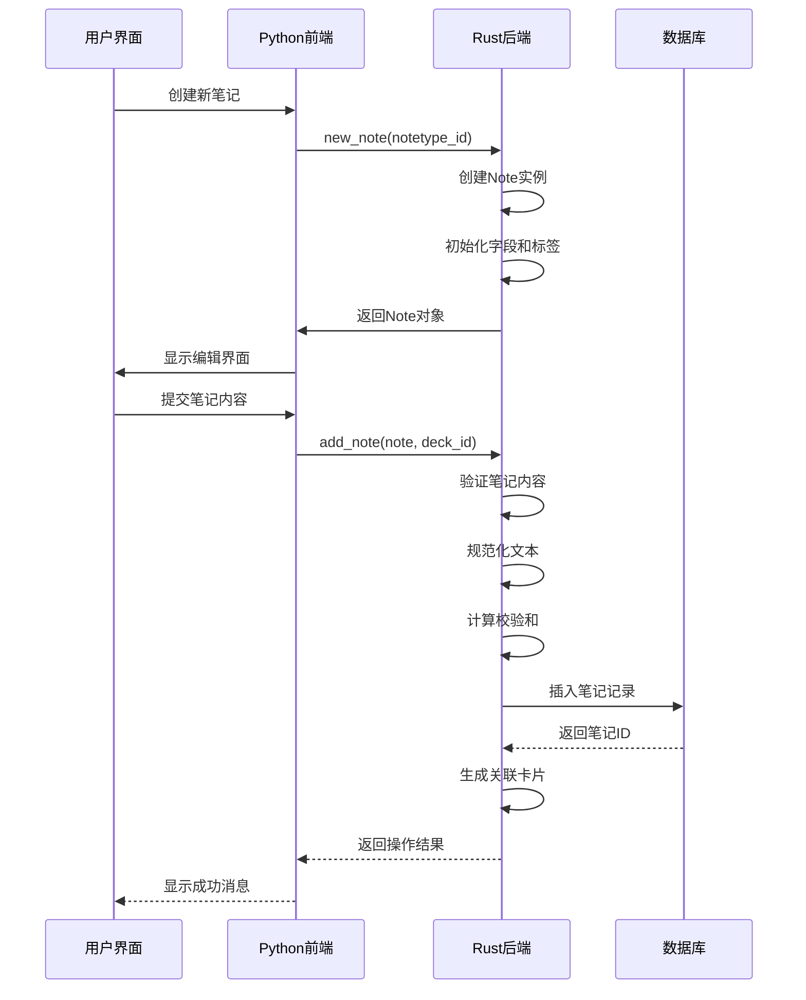
```mermaid
sequenceDiagram
participant UI as 用户界面
participant Py as Python前端
participant Rust as Rust后端
participant DB as 数据库
UI->>Py : 创建新笔记
Py->>Rust : new_note(notetype_id)
Rust->>Rust : 创建Note实例
Rust->>Rust : 初始化字段和标签
Rust->>Py : 返回Note对象
Py->>UI : 显示编辑界面
UI->>Py : 提交笔记内容
Py->>Rust : add_note(note, deck_id)
Rust->>Rust : 验证笔记内容
Rust->>Rust : 规范化文本
Rust->>Rust : 计算校验和
Rust->>DB : 插入笔记记录
DB-->>Rust : 返回笔记ID
Rust->>Rust : 生成关联卡片
Rust-->>Py : 返回操作结果
Py-->>UI : 显示成功消息
```

**Diagram sources**
- [mod.rs](file://rslib/src/notes/mod.rs#L374-L394)
- [service.rs](file://rslib/src/notes/service.rs#L50-L70)

#### 笔记更新流程
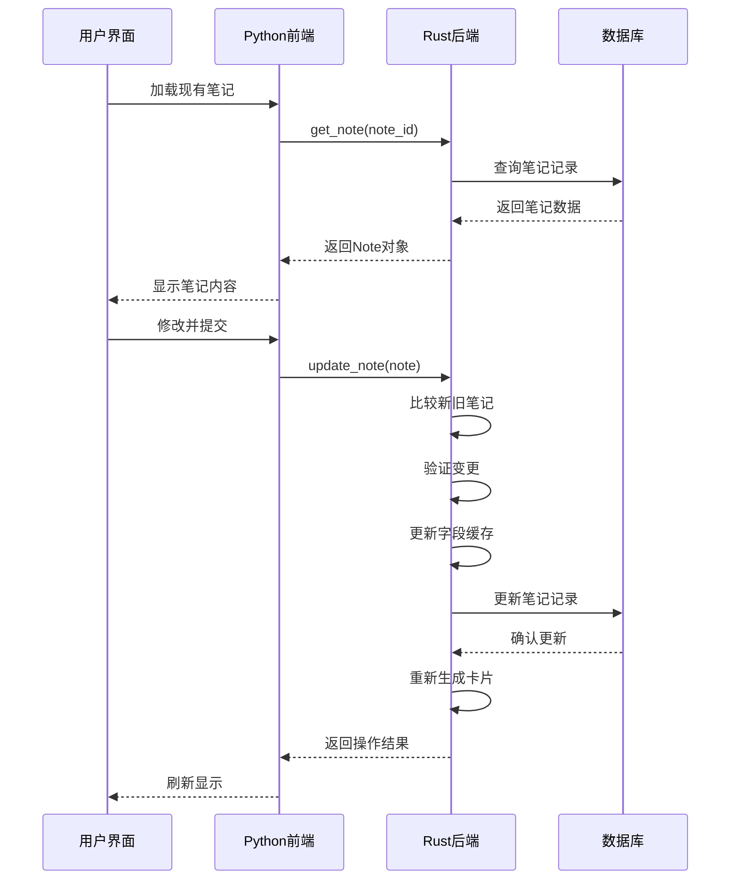
```mermaid
sequenceDiagram
participant UI as 用户界面
participant Py as Python前端
participant Rust as Rust后端
participant DB as 数据库
UI->>Py : 加载现有笔记
Py->>Rust : get_note(note_id)
Rust->>DB : 查询笔记记录
DB-->>Rust : 返回笔记数据
Rust-->>Py : 返回Note对象
Py-->>UI : 显示笔记内容
UI->>Py : 修改并提交
Py->>Rust : update_note(note)
Rust->>Rust : 比较新旧笔记
Rust->>Rust : 验证变更
Rust->>Rust : 更新字段缓存
Rust->>DB : 更新笔记记录
DB-->>Rust : 确认更新
Rust->>Rust : 重新生成卡片
Rust-->>Py : 返回操作结果
Py-->>UI : 刷新显示
```

**Diagram sources**
- [mod.rs](file://rslib/src/notes/mod.rs#L396-L427)
- [service.rs](file://rslib/src/notes/service.rs#L72-L80)

#### 笔记删除流程
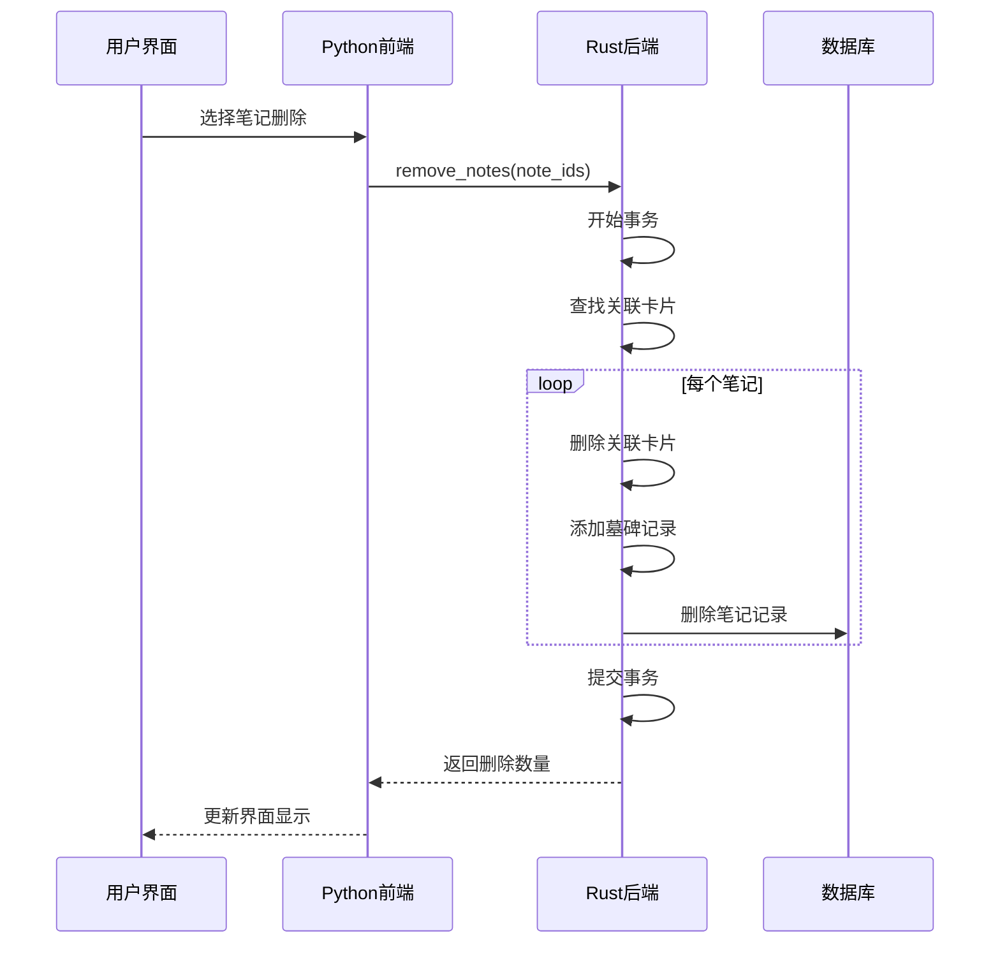
```mermaid
sequenceDiagram
participant UI as 用户界面
participant Py as Python前端
participant Rust as Rust后端
participant DB as 数据库
UI->>Py : 选择笔记删除
Py->>Rust : remove_notes(note_ids)
Rust->>Rust : 开始事务
Rust->>Rust : 查找关联卡片
loop 每个笔记
Rust->>Rust : 删除关联卡片
Rust->>Rust : 添加墓碑记录
Rust->>DB : 删除笔记记录
end
Rust->>Rust : 提交事务
Rust-->>Py : 返回删除数量
Py-->>UI : 更新界面显示
```

**Diagram sources**
- [mod.rs](file://rslib/src/notes/mod.rs#L99-L138)
- [service.rs](file://rslib/src/notes/service.rs#L100-L110)

**Section sources**
- [mod.rs](file://rslib/src/notes/mod.rs#L99-L138)
- [service.rs](file://rslib/src/notes/service.rs#L50-L110)

### 协同工作机制分析
笔记系统与卡片模板的协同工作是Anki的核心功能之一，这种设计实现了内容与表现的分离。

#### 卡片模板协同机制
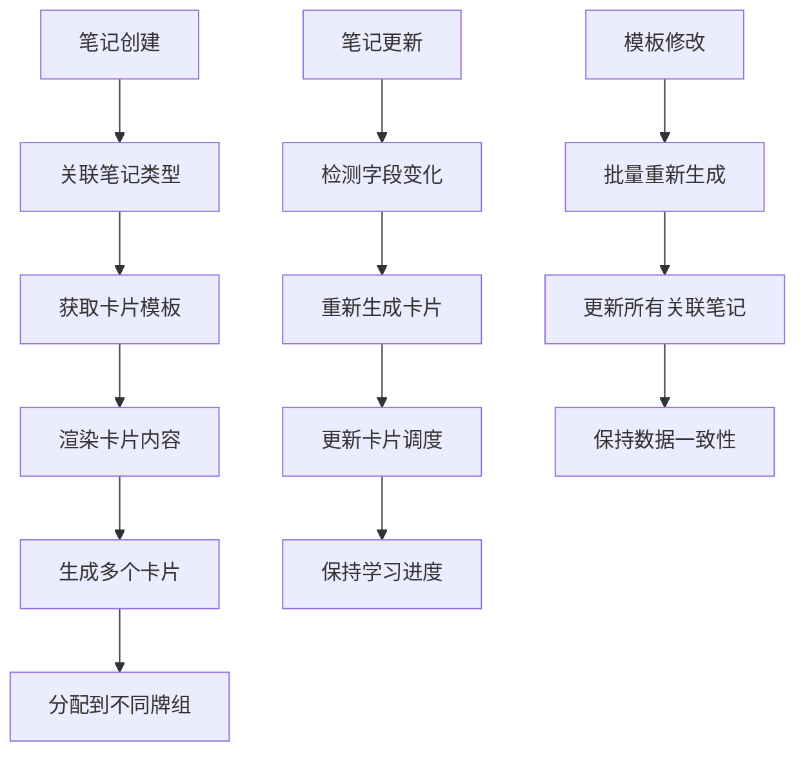
```mermaid
flowchart TD
A[笔记创建] --> B[关联笔记类型]
B --> C[获取卡片模板]
C --> D[渲染卡片内容]
D --> E[生成多个卡片]
E --> F[分配到不同牌组]
G[笔记更新] --> H[检测字段变化]
H --> I[重新生成卡片]
I --> J[更新卡片调度]
J --> K[保持学习进度]
L[模板修改] --> M[批量重新生成]
M --> N[更新所有关联笔记]
N --> O[保持数据一致性]
```

**Diagram sources**
- [mod.rs](file://rslib/src/notes/mod.rs#L374-L394)
- [notetype/mod.rs](file://rslib/src/notetype/mod.rs#L140-L182)

### 导入导出机制分析
Anki的导入导出功能支持多种格式，确保了数据的可移植性和兼容性。

#### 笔记去重与合并
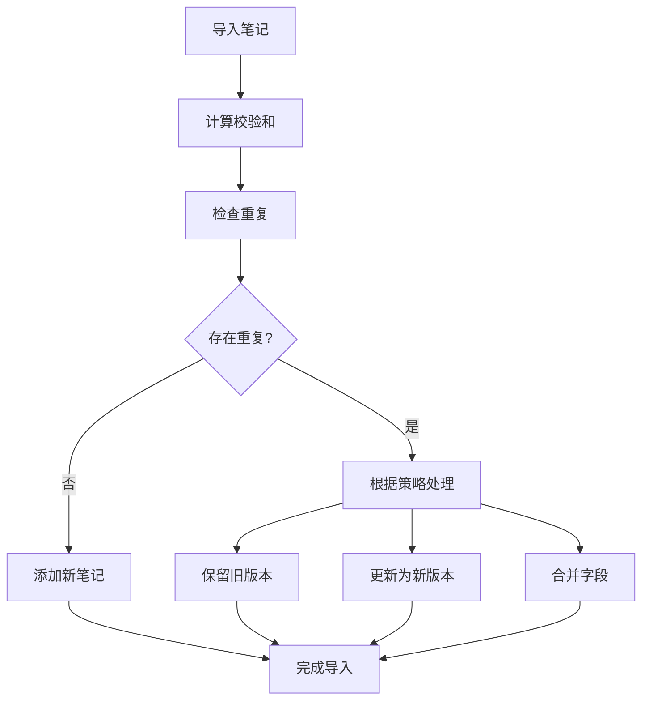
```mermaid
flowchart TD
A[导入笔记] --> B[计算校验和]
B --> C[检查重复]
C --> D{存在重复?}
D --> |是| E[根据策略处理]
D --> |否| F[添加新笔记]
E --> G[保留旧版本]
E --> H[更新为新版本]
E --> I[合并字段]
F --> J[完成导入]
G --> J
H --> J
I --> J
```

**Diagram sources**
- [notes.rs](file://rslib/src/import_export/package/apkg/import/notes.rs#L415-L450)
- [text/import.rs](file://rslib/src/import_export/text/import.rs#L733-L765)

#### 不同格式处理
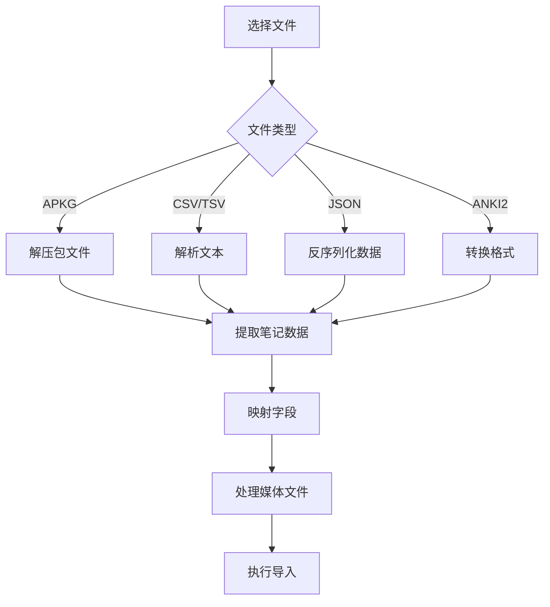
```mermaid
flowchart TD
A[选择文件] --> B{文件类型}
B --> |APKG| C[解压包文件]
B --> |CSV/TSV| D[解析文本]
B --> |JSON| E[反序列化数据]
B --> |ANKI2| F[转换格式]
C --> G[提取笔记数据]
D --> G
E --> G
F --> G
G --> H[映射字段]
H --> I[处理媒体文件]
I --> J[执行导入]
```

**Diagram sources**
- [importing.py](file://qt/aqt/importing.py)
- [import/notes.rs](file://rslib/src/import_export/package/apkg/import/notes.rs)

**Section sources**
- [importing.py](file://qt/aqt/importing.py#L0-L446)
- [notes.rs](file://rslib/src/import_export/package/apkg/import/notes.rs#L415-L450)

### 批量操作与复杂查询
系统提供了强大的批量操作和复杂查询功能，支持高效的数据管理。

#### 批量笔记操作
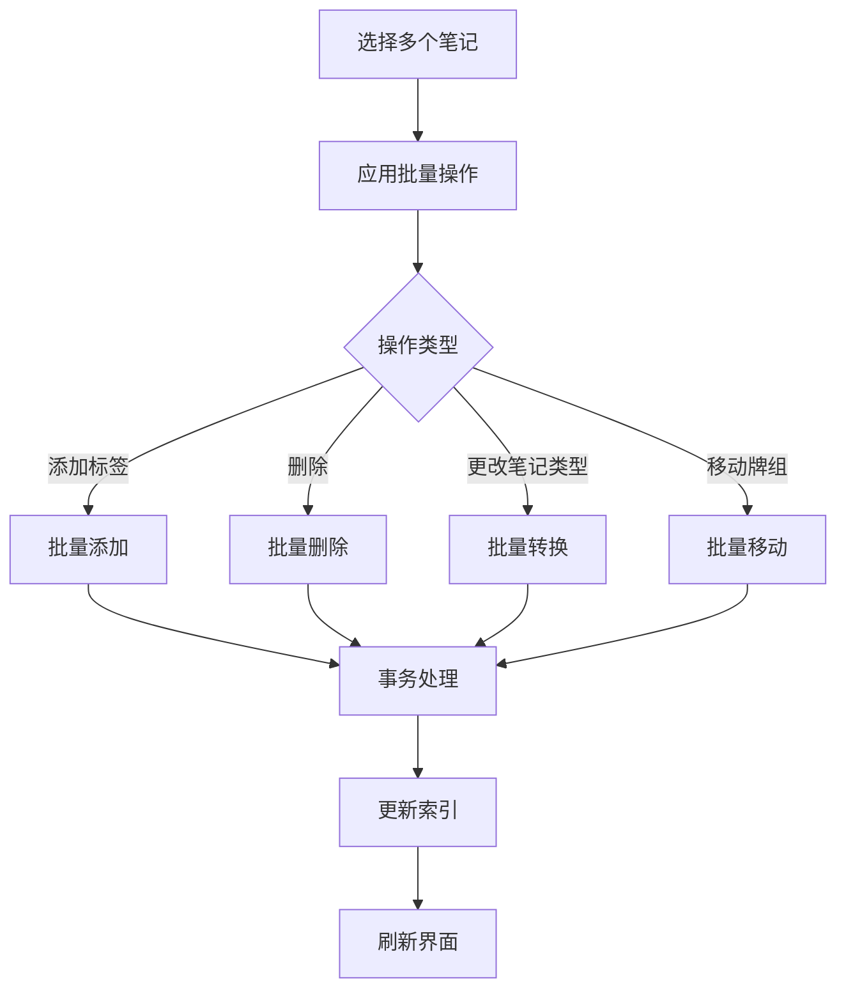
```mermaid
flowchart TD
A[选择多个笔记] --> B[应用批量操作]
B --> C{操作类型}
C --> |添加标签| D[批量添加]
C --> |删除| E[批量删除]
C --> |更改笔记类型| F[批量转换]
C --> |移动牌组| G[批量移动]
D --> H[事务处理]
E --> H
F --> H
G --> H
H --> I[更新索引]
I --> J[刷新界面]
```

**Diagram sources**
- [mod.rs](file://rslib/src/notes/mod.rs#L396-L427)
- [importing.py](file://qt/aqt/importing.py)

#### 复杂查询实现
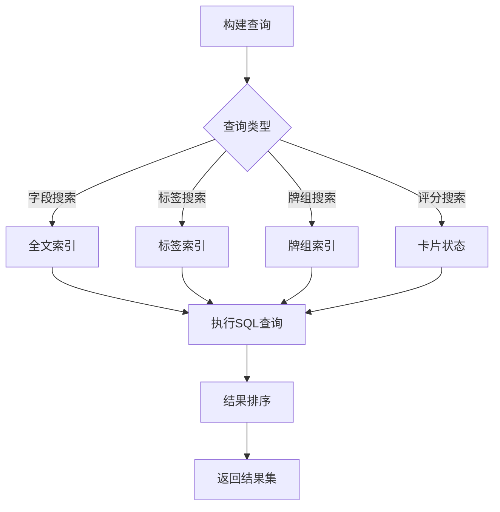
```mermaid
flowchart TD
A[构建查询] --> B{查询类型}
B --> |字段搜索| C[全文索引]
B --> |标签搜索| D[标签索引]
B --> |牌组搜索| E[牌组索引]
B --> |评分搜索| F[卡片状态]
C --> G[执行SQL查询]
D --> G
E --> G
F --> G
G --> H[结果排序]
H --> I[返回结果集]
```

**Diagram sources**
- [mod.rs](file://rslib/src/notes/mod.rs#L396-L427)
- [search.py](file://pylib/anki/search.py)

**Section sources**
- [mod.rs](file://rslib/src/notes/mod.rs#L396-L427)
- [notes.py](file://pylib/anki/notes.py)

### 验证规则与事务管理
系统通过严格的验证规则和事务管理确保数据的完整性和一致性。

#### 笔记验证规则
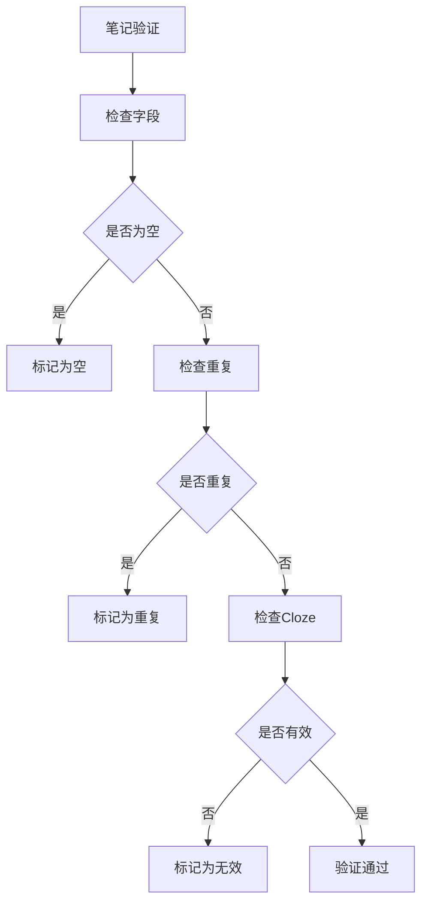
```mermaid
flowchart TD
A[笔记验证] --> B[检查字段]
B --> C{是否为空}
C --> |是| D[标记为空]
C --> |否| E[检查重复]
E --> F{是否重复}
F --> |是| G[标记为重复]
F --> |否| H[检查Cloze]
H --> I{是否有效}
I --> |否| J[标记为无效]
I --> |是| K[验证通过]
```

**Diagram sources**
- [mod.rs](file://rslib/src/notes/mod.rs#L753-L783)
- [notes.py](file://pylib/anki/notes.py#L28-L201)

#### 事务与错误恢复
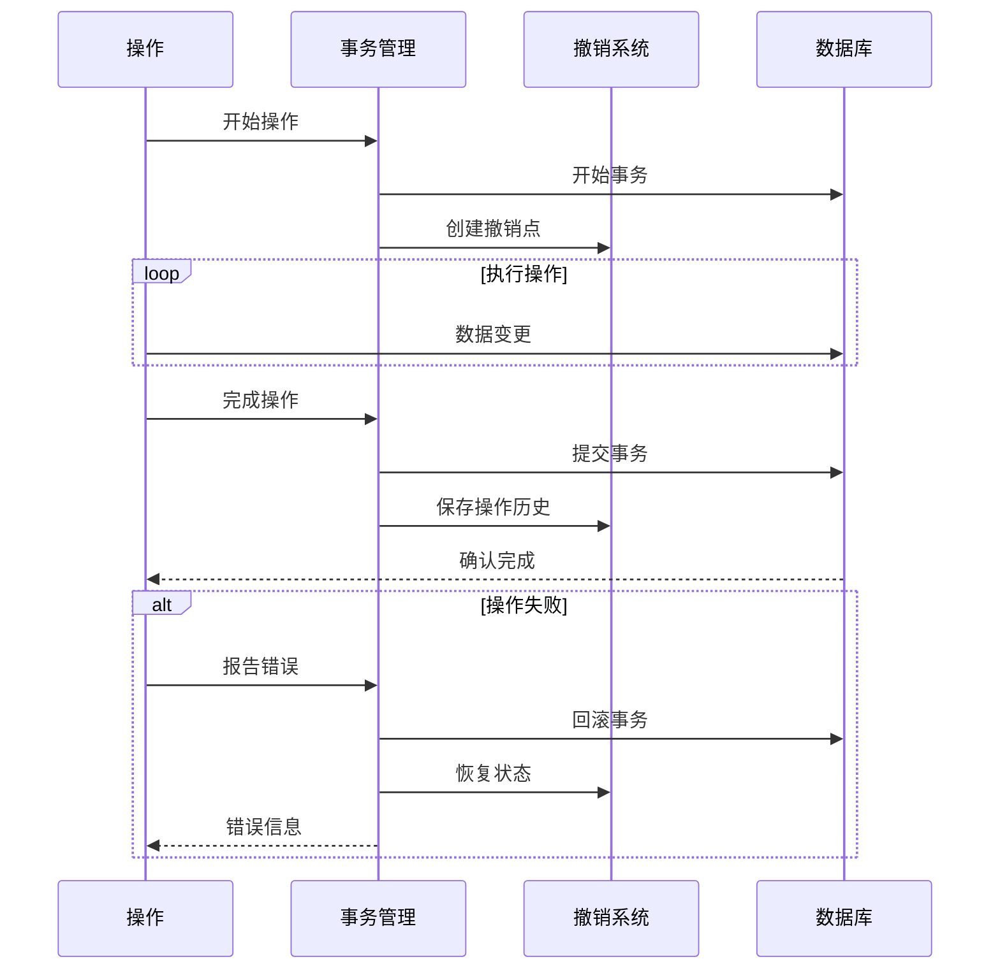
```mermaid
sequenceDiagram
participant Op as 操作
participant Transact as 事务管理
participant Undo as 撤销系统
participant DB as 数据库
Op->>Transact : 开始操作
Transact->>DB : 开始事务
Transact->>Undo : 创建撤销点
loop 执行操作
Op->>DB : 数据变更
end
Op->>Transact : 完成操作
Transact->>DB : 提交事务
Transact->>Undo : 保存操作历史
DB-->>Op : 确认完成
alt 操作失败
Op->>Transact : 报告错误
Transact->>DB : 回滚事务
Transact->>Undo : 恢复状态
Transact-->>Op : 错误信息
end
```

**Diagram sources**
- [mod.rs](file://rslib/src/notes/undo.rs#L18-L49)
- [undo/mod.rs](file://rslib/src/undo/mod.rs#L50-L93)

**Section sources**
- [mod.rs](file://rslib/src/notes/undo.rs#L18-L49)
- [undo/mod.rs](file://rslib/src/undo/mod.rs#L50-L93)

## 依赖分析
笔记管理系统与其他组件存在复杂的依赖关系，这些依赖确保了系统的完整功能。

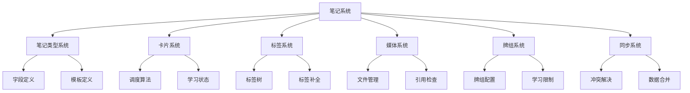
```mermaid
graph TD
A[笔记系统] --> B[笔记类型系统]
A --> C[卡片系统]
A --> D[标签系统]
A --> E[媒体系统]
A --> F[牌组系统]
A --> G[同步系统]
B --> H[字段定义]
B --> I[模板定义]
C --> J[调度算法]
C --> K[学习状态]
D --> L[标签树]
D --> M[标签补全]
E --> N[文件管理]
E --> O[引用检查]
F --> P[牌组配置]
F --> Q[学习限制]
G --> R[冲突解决]
G --> S[数据合并]
```

**Diagram sources**
- [mod.rs](file://rslib/src/notes/mod.rs)
- [notetype/mod.rs](file://rslib/src/notetype/mod.rs)
- [importing.py](file://qt/aqt/importing.py)

**Section sources**
- [mod.rs](file://rslib/src/notes/mod.rs#L1-L50)
- [notetype/mod.rs](file://rslib/src/notetype/mod.rs#L1-L50)

## 性能考虑
笔记管理系统在设计时充分考虑了性能因素，通过多种优化策略确保高效运行。

- **索引优化**：为常用查询字段建立数据库索引，加速搜索操作
- **缓存机制**：使用内存缓存频繁访问的数据，减少数据库查询
- **批量处理**：支持批量操作，减少事务开销和I/O次数
- **惰性加载**：按需加载数据，避免一次性加载大量记录
- **并行处理**：利用多线程处理耗时操作，提高响应速度

## 故障排除指南
当笔记管理系统出现问题时，可以按照以下步骤进行排查和解决。

**Section sources**
- [importing.py](file://qt/aqt/importing.py#L0-L446)
- [exporting.py](file://qt/aqt/exporting.py#L0-L226)

## 结论
Anki笔记管理系统通过精心设计的架构和实现，提供了一个强大而灵活的知识管理平台。系统采用Python和Rust的混合架构，在保证开发效率的同时确保了运行性能。Note类作为核心数据结构，通过丰富的接口和严格的数据验证，确保了笔记数据的完整性和一致性。导入导出功能支持多种格式，便于数据迁移和共享。事务管理和撤销机制提供了可靠的数据保护，而批量操作和复杂查询功能则满足了高级用户的需求。整体设计体现了模块化、可扩展和用户友好的原则，为持续学习和知识积累提供了坚实的基础。