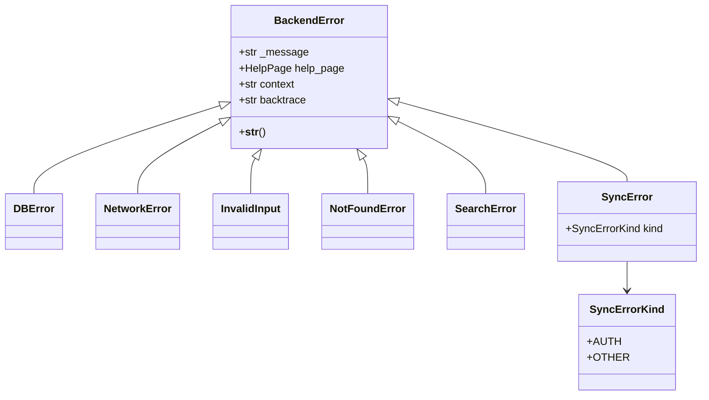
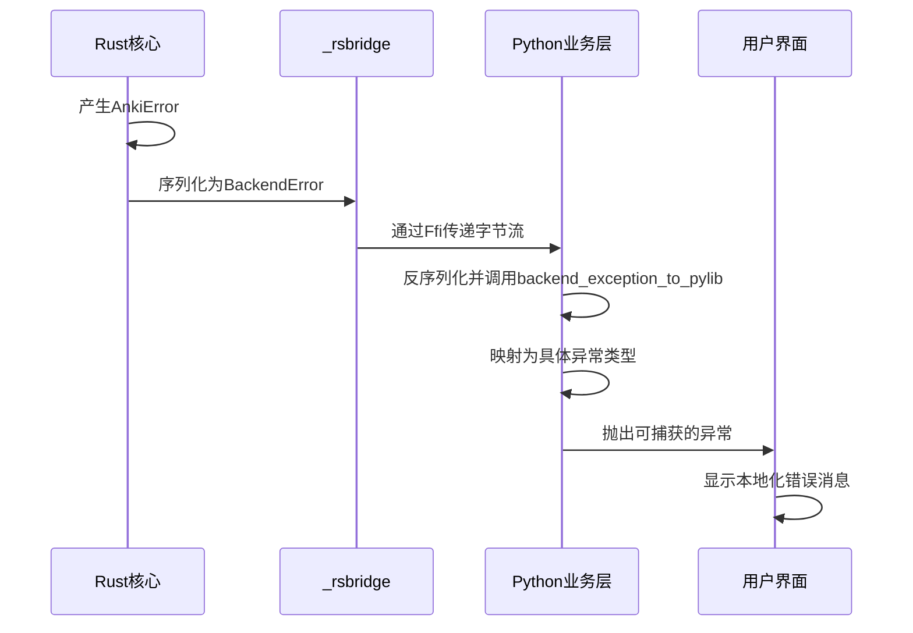
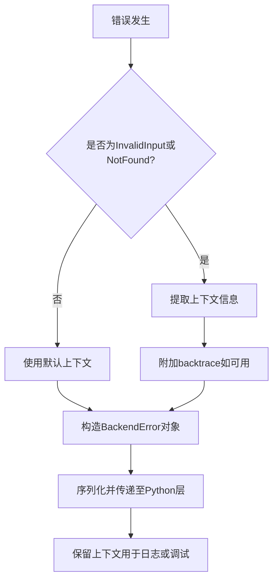
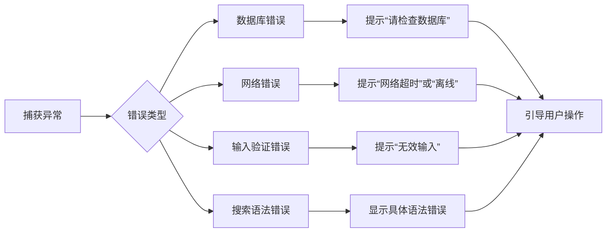

# 错误处理与异常传播

<cite>
**本文档中引用的文件**  
- [errors.py](file://pylib/anki/errors.py)
- [mod.rs](file://rslib/src/error/mod.rs)
- [db.rs](file://rslib/src/error/db.rs)
- [network.rs](file://rslib/src/error/network.rs)
- [invalid_input.rs](file://rslib/src/error/invalid_input.rs)
- [not_found.rs](file://rslib/src/error/not_found.rs)
- [search.rs](file://rslib/src/error/search.rs)
- [_backend.py](file://pylib/anki/_backend.py)
- [errors.ftl](file://ftl/core/errors.ftl)
</cite>

## 目录
1. [简介](#简介)
2. [错误类型与分类](#错误类型与分类)
3. [Rust核心到Python层的异常传播机制](#rust核心到python层的异常传播机制)
4. [错误上下文与调试支持](#错误上下文与调试支持)
5. [错误处理策略与用户反馈](#错误处理策略与用户反馈)
6. [日志记录与错误报告](#日志记录与错误报告)
7. [开发者最佳实践](#开发者最佳实践)

## 简介
Anki采用分层错误处理架构，核心逻辑使用Rust实现，业务层通过Python绑定调用。该架构确保了系统稳定性与用户体验的平衡。错误从Rust底层产生，经过序列化与映射，最终在Python层转换为可捕获的异常。整个过程支持错误分类、上下文传递、本地化消息生成和用户友好的提示。

## 错误类型与分类

Anki的错误体系分为多个类别，涵盖数据库、网络、输入验证等场景。

**图示来源**  
- [errors.py](file://pylib/anki/errors.py#L15-L132)

**本节来源**  
- [errors.py](file://pylib/anki/errors.py#L15-L132)
- [mod.rs](file://rslib/src/error/mod.rs#L1-L325)

## Rust核心到Python层的异常传播机制

错误传播路径始于Rust后端，通过Protobuf序列化为`BackendError`消息，经由`_rsbridge`传递至Python层，最终由`backend_exception_to_pylib`函数映射为具体的Python异常类型。

**图示来源**  
- [mod.rs](file://rslib/src/error/mod.rs#L1-L325)
- [_backend.py](file://pylib/anki/_backend.py#L196-L262)

**本节来源**  
- [mod.rs](file://rslib/src/error/mod.rs#L1-L325)
- [_backend.py](file://pylib/anki/_backend.py#L196-L262)

## 错误上下文与调试支持

Anki在错误处理中包含丰富的上下文信息，便于调试与问题定位。`BackendError`类包含`context`和`backtrace`字段，分别用于存储错误上下文和堆栈跟踪。

**图示来源**  
- [invalid_input.rs](file://rslib/src/error/invalid_input.rs#L1-L102)
- [not_found.rs](file://rslib/src/error/not_found.rs#L1-L81)

**本节来源**  
- [invalid_input.rs](file://rslib/src/error/invalid_input.rs#L1-L102)
- [not_found.rs](file://rslib/src/error/not_found.rs#L1-L81)
- [_backend.py](file://pylib/anki/_backend.py#L196-L262)

## 错误处理策略与用户反馈

Anki根据错误类型采取不同的处理策略，并通过本地化消息向用户呈现有意义的反馈。错误消息存储在`.ftl`文件中，支持多语言环境。

**图示来源**  
- [errors.ftl](file://ftl/core/errors.ftl#L1-L24)
- [network.rs](file://rslib/src/error/network.rs#L1-L232)
- [search.rs](file://rslib/src/error/search.rs#L1-L135)

**本节来源**  
- [errors.ftl](file://ftl/core/errors.ftl#L1-L24)
- [network.rs](file://rslib/src/error/network.rs#L1-L232)
- [search.rs](file://rslib/src/error/search.rs#L1-L135)

## 日志记录与错误报告

Anki通过`initialize_logging`方法初始化日志系统，所有关键错误均会被记录。异常传播过程中保留的上下文和堆栈信息可用于生成错误报告，帮助开发者诊断问题。

**本节来源**  
- [_backend.py](file://pylib/anki/_backend.py#L45-L48)

## 开发者最佳实践

开发者应遵循以下最佳实践编写健壮的错误处理代码：

1. **使用预定义异常类型**：避免抛出原始`Exception`，应使用`InvalidInput`、`NotFoundError`等具体类型。
2. **提供有意义的上下文**：在`invalid_input!`或`require!`宏中提供清晰的错误描述。
3. **测试异常路径**：编写单元测试覆盖各种错误场景，确保恢复机制正常工作。
4. **避免暴露敏感信息**：在错误消息中过滤URL、密钥等敏感数据。
5. **利用本地化支持**：通过`tr`对象生成本地化消息，而非硬编码字符串。

**本节来源**  
- [errors.py](file://pylib/anki/errors.py#L15-L132)
- [mod.rs](file://rslib/src/error/mod.rs#L1-L325)
- [_backend.py](file://pylib/anki/_backend.py#L196-L262)