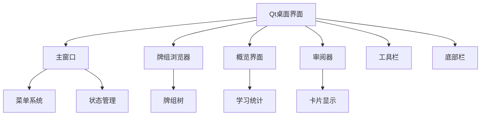
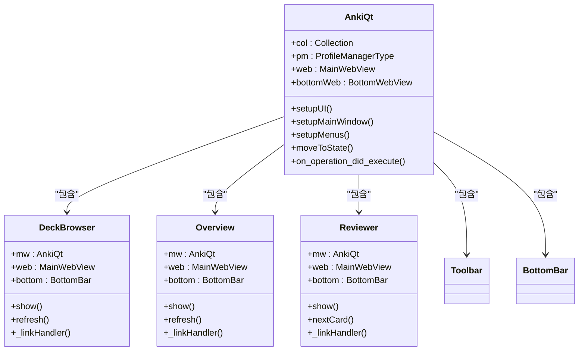
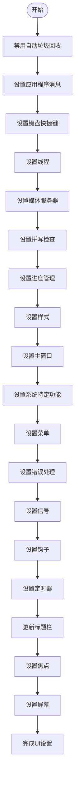
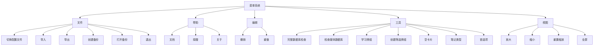
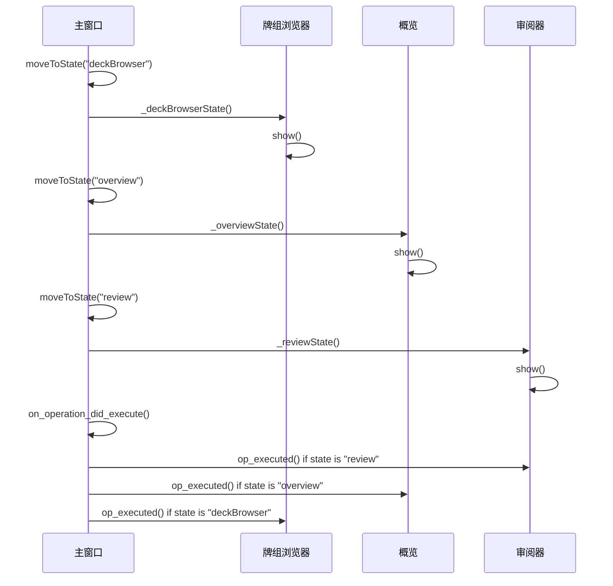
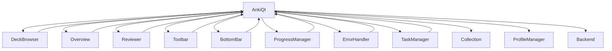

# Qt桌面界面

<cite>
**本文档中引用的文件**
- [main.py](file://qt/aqt/main.py)
- [deckbrowser.py](file://qt/aqt/deckbrowser.py)
- [overview.py](file://qt/aqt/overview.py)
- [reviewer.py](file://qt/aqt/reviewer.py)
- [forms/main.py](file://qt/aqt/forms/main.py)
</cite>

## 目录
1. [简介](#简介)
2. [项目结构](#项目结构)
3. [核心组件](#核心组件)
4. [架构概述](#架构概述)
5. [详细组件分析](#详细组件分析)
6. [依赖分析](#依赖分析)
7. [性能考虑](#性能考虑)
8. [故障排除指南](#故障排除指南)
9. [结论](#结论)

## 简介
Anki的Qt桌面界面是一个基于Python和Qt框架的复杂应用程序，为用户提供了一个功能丰富的学习环境。该界面通过精心设计的架构实现了主窗口、对话框和菜单系统的有效组织。本文档将深入探讨Anki Qt界面的设计原则、用户体验考虑、对话框管理机制以及与Python业务层的信号槽集成。

**Section sources**
- [main.py](file://qt/aqt/main.py#L179-L1882)

## 项目结构
Anki的Qt界面位于`qt/aqt`目录下，采用模块化设计，将不同的功能组件分离到独立的文件中。主要组件包括主窗口（main.py）、牌组浏览器（deckbrowser.py）、概览界面（overview.py）和审阅器（reviewer.py）。这种结构化的组织方式使得代码易于维护和扩展。

**Diagram sources**
- [main.py](file://qt/aqt/main.py#L179-L1882)
- [deckbrowser.py](file://qt/aqt/deckbrowser.py#L65-L437)
- [overview.py](file://qt/aqt/overview.py#L50-L321)
- [reviewer.py](file://qt/aqt/reviewer.py#L148-L1232)

**Section sources**
- [main.py](file://qt/aqt/main.py#L179-L1882)
- [deckbrowser.py](file://qt/aqt/deckbrowser.py#L65-L437)
- [overview.py](file://qt/aqt/overview.py#L50-L321)
- [reviewer.py](file://qt/aqt/reviewer.py#L148-L1232)

## 核心组件
Anki Qt界面的核心组件包括主窗口、牌组浏览器、概览界面和审阅器。这些组件通过精心设计的类结构和方法调用相互协作，为用户提供流畅的学习体验。主窗口作为应用程序的中心枢纽，负责管理其他组件的生命周期和状态转换。

**Section sources**
- [main.py](file://qt/aqt/main.py#L179-L1882)
- [deckbrowser.py](file://qt/aqt/deckbrowser.py#L65-L437)
- [overview.py](file://qt/aqt/overview.py#L50-L321)
- [reviewer.py](file://qt/aqt/reviewer.py#L148-L1232)

## 架构概述
Anki Qt界面采用分层架构设计，将用户界面与业务逻辑分离。主窗口（AnkiQt类）作为顶层容器，管理应用程序的整体状态和组件生命周期。通过信号槽机制，各个组件能够高效地通信和响应用户操作。

**Diagram sources**
- [main.py](file://qt/aqt/main.py#L179-L1882)
- [deckbrowser.py](file://qt/aqt/deckbrowser.py#L65-L437)
- [overview.py](file://qt/aqt/overview.py#L50-L321)
- [reviewer.py](file://qt/aqt/reviewer.py#L148-L1232)

## 详细组件分析

### 主窗口分析
AnkiQt类作为主窗口的实现，负责初始化和管理整个应用程序的UI组件。通过setupUI方法，它按顺序初始化各个子系统，包括应用程序消息、键盘快捷键、线程、媒体服务器、拼写检查、进度管理、样式、主窗口、系统特定设置、菜单、错误处理、信号、钩子和定时器。

#### 主窗口初始化流程

**Diagram sources**
- [main.py](file://qt/aqt/main.py#L235-L257)

**Section sources**
- [main.py](file://qt/aqt/main.py#L179-L1882)

### 菜单系统分析
Anki的菜单系统通过setupMenus方法实现，将各种功能操作与菜单项关联。菜单项包括文件、帮助、编辑、工具和视图等类别，每个类别包含多个具体操作。

#### 菜单操作映射

**Diagram sources**
- [main.py](file://qt/aqt/main.py#L1395-L1447)

**Section sources**
- [main.py](file://qt/aqt/main.py#L1395-L1447)

### 状态管理分析
Anki通过moveToState方法实现应用程序的状态管理，允许在不同界面之间平滑切换。状态包括"deckBrowser"（牌组浏览器）、"overview"（概览）和"review"（审阅）等。

#### 状态转换流程

**Diagram sources**
- [main.py](file://qt/aqt/main.py#L769-L781)
- [main.py](file://qt/aqt/main.py#L851-L872)

**Section sources**
- [main.py](file://qt/aqt/main.py#L769-L781)
- [main.py](file://qt/aqt/main.py#L851-L872)

## 依赖分析
Anki Qt界面的组件之间存在明确的依赖关系。主窗口依赖于各个功能组件，而功能组件又依赖于主窗口提供的服务和资源。

**Diagram sources**
- [main.py](file://qt/aqt/main.py#L179-L1882)

**Section sources**
- [main.py](file://qt/aqt/main.py#L179-L1882)

## 性能考虑
Anki Qt界面在设计时考虑了性能优化。通过延迟加载和后台操作，确保用户界面的响应性。例如，setupProfileAfterWebviewsLoaded方法确保在WebView完全加载后再进行配置文件设置，避免界面卡顿。

## 故障排除指南
当遇到界面问题时，可以检查以下方面：
1. 确认主窗口状态是否正确
2. 检查组件间的信号槽连接是否正常
3. 验证UI更新是否在正确的线程中执行
4. 确认资源加载是否完成

**Section sources**
- [main.py](file://qt/aqt/main.py#L179-L1882)

## 结论
Anki的Qt桌面界面通过精心设计的架构实现了功能丰富且响应迅速的用户界面。主窗口作为中心枢纽，有效地管理着各个组件的生命周期和状态转换。通过信号槽机制，组件间能够高效通信，确保用户操作得到及时响应。这种模块化和分层的设计使得代码易于维护和扩展，为用户提供了一流的学习体验。