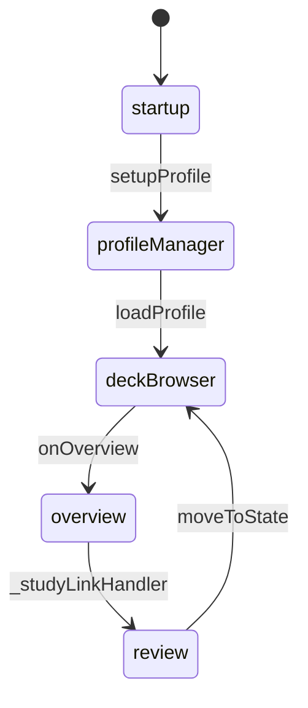
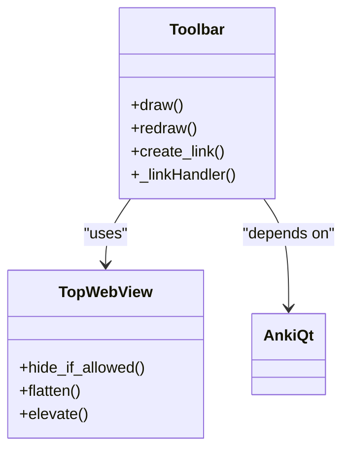
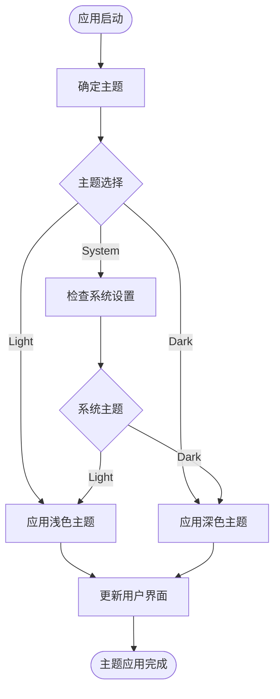
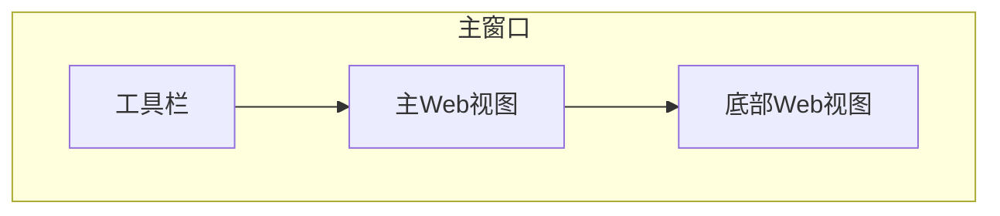

# 主窗口设计

<cite>
**本文档中引用的文件**  
- [main.py](file://qt/aqt/main.py)
- [toolbar.py](file://qt/aqt/toolbar.py)
- [theme.py](file://qt/aqt/theme.py)
</cite>

## 目录
1. [简介](#简介)
2. [主窗口生命周期管理](#主窗口生命周期管理)
3. [事件处理与状态维护](#事件处理与状态维护)
4. [工具栏系统实现](#工具栏系统实现)
5. [主题系统与夜间模式](#主题系统与夜间模式)
6. [主窗口布局结构](#主窗口布局结构)
7. [组件集成与初始化流程](#组件集成与初始化流程)
8. [Qt窗口编程基础](#qt窗口编程基础)
9. [性能优化建议](#性能优化建议)

## 简介
Anki主窗口是应用程序的核心界面，负责管理用户交互、状态转换和组件集成。该窗口基于Qt框架构建，采用模块化设计，包含菜单栏、工具栏和主要内容区域。主窗口通过AnkiQt类实现，该类继承自QMainWindow，负责窗口的初始化、生命周期管理和状态维护。窗口设计注重用户体验，支持主题切换和夜间模式，并通过Web视图组件实现丰富的用户界面。

## 主窗口生命周期管理
主窗口的生命周期由AnkiQt类管理，从初始化到关闭的整个过程都经过精心设计。窗口初始化时，首先创建主应用程序实例，然后依次设置用户界面、加载插件、完成UI设置。窗口的关闭过程包括卸载配置文件、清理资源和退出应用程序。在窗口生命周期中，还包含了配置文件管理功能，允许用户切换和管理不同的用户配置文件。

**Section sources**
- [main.py](file://qt/aqt/main.py#L185-L257)
- [main.py](file://qt/aqt/main.py#L1395-L1447)

## 事件处理与状态维护
主窗口通过事件处理机制响应用户操作和系统事件。事件处理包括键盘事件、鼠标事件和窗口事件的处理。状态维护功能通过moveToState方法实现，该方法负责在不同窗口状态之间进行切换，如从牌组浏览器到学习界面的转换。状态切换时，会执行相应的清理和初始化操作，确保界面状态的一致性。

**Diagram sources**
- [main.py](file://qt/aqt/main.py#L769-L781)

## 工具栏系统实现
工具栏系统由Toolbar类实现，提供用户与应用程序交互的主要界面。工具栏包含多个功能链接，如牌组、添加、浏览和统计等。每个链接都注册了相应的处理函数，当用户点击链接时，会触发相应的操作。工具栏支持动态更新，可以根据应用程序状态调整显示内容。工具栏还集成了同步状态显示功能，实时反映数据同步状态。

**Diagram sources**
- [toolbar.py](file://qt/aqt/toolbar.py#L278-L298)

## 主题系统与夜间模式
主题系统由ThemeManager类实现，支持多种主题和夜间模式。主题管理器根据用户设置和系统环境自动选择合适的主题。夜间模式支持通过系统设置或用户偏好进行切换。主题系统不仅改变界面颜色，还影响图标显示和字体样式。主题切换时，会更新应用程序的样式表和调色板，确保界面元素的一致性。

**Diagram sources**
- [theme.py](file://qt/aqt/theme.py#L222-L242)

## 主窗口布局结构
主窗口采用垂直布局管理器组织界面元素，从上到下依次为工具栏、主Web视图和底部Web视图。工具栏位于窗口顶部，包含主要功能链接。主Web视图占据大部分空间，用于显示主要内容。底部Web视图用于显示状态信息和辅助功能。布局结构通过setupMainWindow方法实现，确保各组件正确排列和显示。

**Diagram sources**
- [main.py](file://qt/aqt/main.py#L957-L984)

## 组件集成与初始化流程
主窗口的组件集成通过setupUI方法实现，该方法按特定顺序初始化各个组件。初始化流程包括：禁用自动垃圾回收、设置应用程序消息、设置键盘快捷键、设置线程、设置媒体服务器、设置拼写检查、设置进度管理器、设置样式、设置主窗口、设置系统特定功能、设置菜单、设置错误处理器、设置信号、设置钩子、设置定时器、更新标题栏和设置焦点。组件集成确保了应用程序的稳定性和一致性。

**Section sources**
- [main.py](file://qt/aqt/main.py#L235-L257)

## Qt窗口编程基础
Anki主窗口的实现基于Qt框架，利用了Qt的许多核心功能。窗口继承自QMainWindow，利用其提供的菜单栏、工具栏和状态栏功能。使用Web视图组件显示动态内容，通过JavaScript桥接实现Python和JavaScript之间的通信。事件处理通过信号和槽机制实现，确保了事件处理的灵活性和可扩展性。布局管理器用于组织界面元素，确保界面在不同分辨率下的适应性。

## 性能优化建议
为了提高主窗口的性能，可以采取以下优化措施：延迟加载非关键组件，减少启动时的资源消耗；使用异步操作处理耗时任务，避免阻塞UI线程；优化Web视图的渲染性能，减少重绘次数；合理管理内存，及时释放不再使用的资源；使用缓存机制存储频繁访问的数据，减少重复计算。这些优化措施可以显著提升应用程序的响应速度和用户体验。