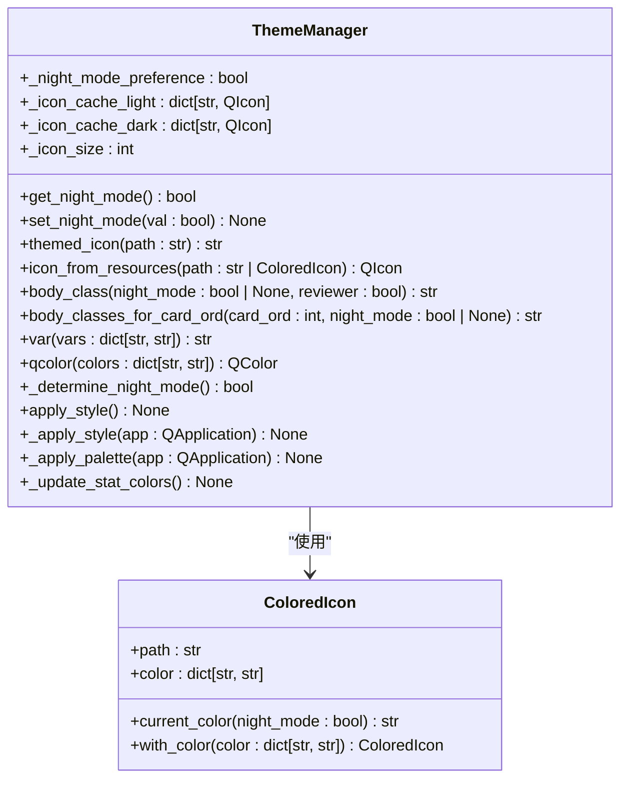
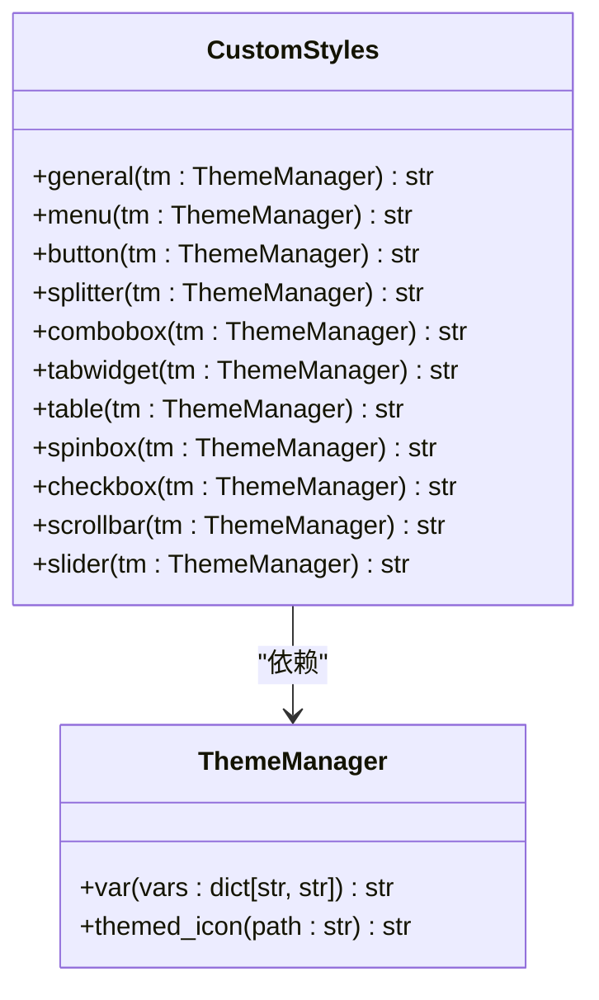
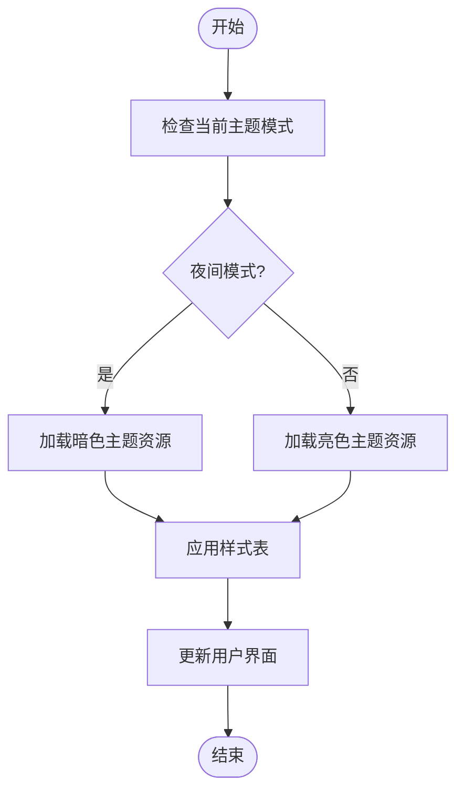

# 主题与外观

<cite>
**本文档中引用的文件**   
- [theme.py](file://qt/aqt/theme.py)
- [colors.py](file://qt/aqt/colors.py)
- [stylesheets.py](file://qt/aqt/stylesheets.py)
</cite>

## 目录
1. [简介](#简介)
2. [主题管理系统](#主题管理系统)
3. [颜色系统](#颜色系统)
4. [样式表管理系统](#样式表管理系统)
5. [夜间模式实现](#夜间模式实现)
6. [自定义主题创建](#自定义主题创建)
7. [性能优化策略](#性能优化策略)
8. [结论](#结论)

## 简介
Anki的主题系统为用户提供了一套完整的外观定制解决方案，包括主题管理、颜色系统和样式表管理三大核心组件。该系统支持多种配色方案，能够根据用户的操作系统设置自动切换日间和夜间模式，并提供了丰富的API供开发者创建自定义主题。主题系统通过Qt框架的样式表功能实现界面元素的视觉呈现，确保了跨平台的一致性体验。

**Section sources**
- [theme.py](file://qt/aqt/theme.py#L1-L50)
- [colors.py](file://qt/aqt/colors.py#L1-L5)
- [stylesheets.py](file://qt/aqt/stylesheets.py#L1-L20)

## 主题管理系统

Anki的主题管理系统由`ThemeManager`类实现，负责主题的加载、切换和状态维护。系统支持三种主题模式：跟随系统、日间模式和夜间模式。`ThemeManager`通过`apply_style`方法应用当前配置的样式，该方法会根据用户设置或系统环境自动确定是否启用夜间模式。

主题管理器提供了`body_class`方法，用于生成包含平台、主题和全局设置的CSS类列表。这些类被应用于HTML文档的body元素，使得前端可以根据不同的环境条件应用相应的样式。例如，当启用夜间模式时，会添加`nightMode`和`night_mode`类，前端样式表可以基于这些类定义不同的视觉效果。

**Section sources**
- [theme.py](file://qt/aqt/theme.py#L57-L333)
- [theme.py](file://qt/aqt/theme.py#L222-L242)

## 颜色系统

Anki的颜色系统通过`colors`模块实现，支持多种配色方案和动态颜色计算。系统定义了一系列颜色变量，如`FG`（前景色）、`CANVAS`（画布色）和`HIGHLIGHT_BG`（高亮背景色），每个变量都包含日间和夜间两种模式的颜色值。

`ThemeManager`的`var`方法用于根据当前主题选择正确的颜色值。当夜间模式启用时，返回"dark"键对应的颜色；否则返回"light"键对应的颜色。`qcolor`方法则将CSS颜色字符串转换为Qt的QColor对象，支持标准颜色名称、十六进制值和rgba格式。

**Diagram sources **
- [theme.py](file://qt/aqt/theme.py#L57-L333)

## 样式表管理系统

Anki的样式表管理系统由`stylesheets.py`文件中的`CustomStyles`类实现，负责处理CSS样式注入和更新。系统为各种Qt控件生成样式表，包括按钮、复选框、组合框、表格等。每个控件类型都有对应的样式生成方法，如`button`、`checkbox`、`combobox`等。

样式表生成器使用`ThemeManager`的`var`方法获取当前主题的颜色值，并将其插入到CSS规则中。例如，按钮的背景色通过`tm.var(colors.BUTTON_BG)`获取，边框色通过`tm.var(colors.SHADOW)`获取。系统还定义了`button_gradient`和`button_pressed_gradient`函数，用于生成按钮的渐变效果。

**Diagram sources **
- [stylesheets.py](file://qt/aqt/stylesheets.py#L43-L657)

## 夜间模式实现

Anki的夜间模式实现基于操作系统的暗色模式设置。系统通过`get_windows_dark_mode`、`get_macos_dark_mode`和`get_linux_dark_mode`函数检测不同操作系统的暗色模式状态。在Windows上，通过读取注册表项`AppsUseLightTheme`的值来判断；在macOS上，通过`macos_helper`模块的`system_is_dark`方法；在Linux上，通过D-Bus或GNOME主题名称检测。

`_determine_night_mode`方法综合用户设置和系统环境决定是否启用夜间模式。如果用户明确选择了日间或夜间模式，则遵循用户选择；否则根据操作系统设置自动确定。`apply_style`方法在应用样式时，会先调用`_determine_night_mode`获取最新的主题状态，然后更新`night_mode`属性并重新应用样式表。

**Section sources**
- [theme.py](file://qt/aqt/theme.py#L209-L220)
- [theme.py](file://qt/aqt/theme.py#L336-L429)

## 自定义主题创建

创建自定义主题需要理解Anki的样式表结构和颜色系统。开发者可以通过修改`CustomStyles`类中的样式生成方法来自定义控件外观。例如，要创建一个圆角按钮主题，可以修改`button`方法中的`border-radius`值。

样式表注入技巧包括使用`gui_hooks.style_did_init`钩子在样式表应用前进行修改，以及使用`themed_icon`方法为SVG图标提供主题化版本。`themed_icon`方法会根据当前主题选择`name-light.svg`或`name-dark.svg`文件，使得图标能够自动适应不同的背景色。

**Diagram sources **
- [theme.py](file://qt/aqt/theme.py#L102-L118)
- [stylesheets.py](file://qt/aqt/stylesheets.py#L8-L27)

## 性能优化策略

Anki主题系统的性能优化策略主要包括样式缓存和增量更新。`ThemeManager`使用`_icon_cache_light`和`_icon_cache_dark`字典缓存已处理的图标，避免重复创建。`icon_from_resources`方法在获取图标时会先检查缓存，如果存在则直接返回，否则创建新图标并存入缓存。

增量更新策略体现在`apply_style`方法中，该方法会检查主题和控件样式是否发生变化，只有在确实需要更新时才会重新应用样式表。这避免了不必要的样式重绘，提高了性能。此外，系统还通过`gui_hooks.theme_did_change`钩子通知其他组件主题已更改，允许它们进行必要的更新。

**Section sources**
- [theme.py](file://qt/aqt/theme.py#L120-L159)
- [theme.py](file://qt/aqt/theme.py#L244-L274)

## 结论
Anki的主题系统是一个功能完整、结构清晰的外观管理解决方案。通过`ThemeManager`、`colors`和`stylesheets`三个核心组件的协同工作，系统实现了主题的动态切换、颜色的智能计算和样式的精确控制。夜间模式的实现充分考虑了不同操作系统的特性，确保了用户体验的一致性。对于开发者而言，系统提供了丰富的扩展点和清晰的API，使得创建自定义主题变得简单而高效。