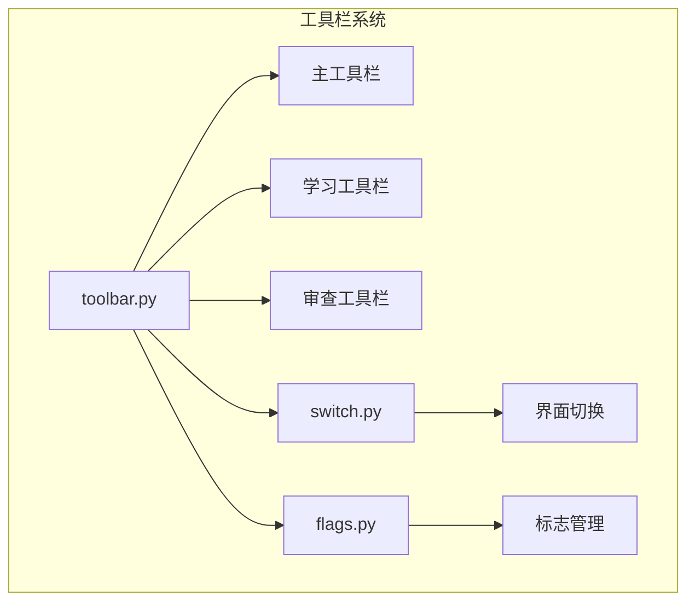
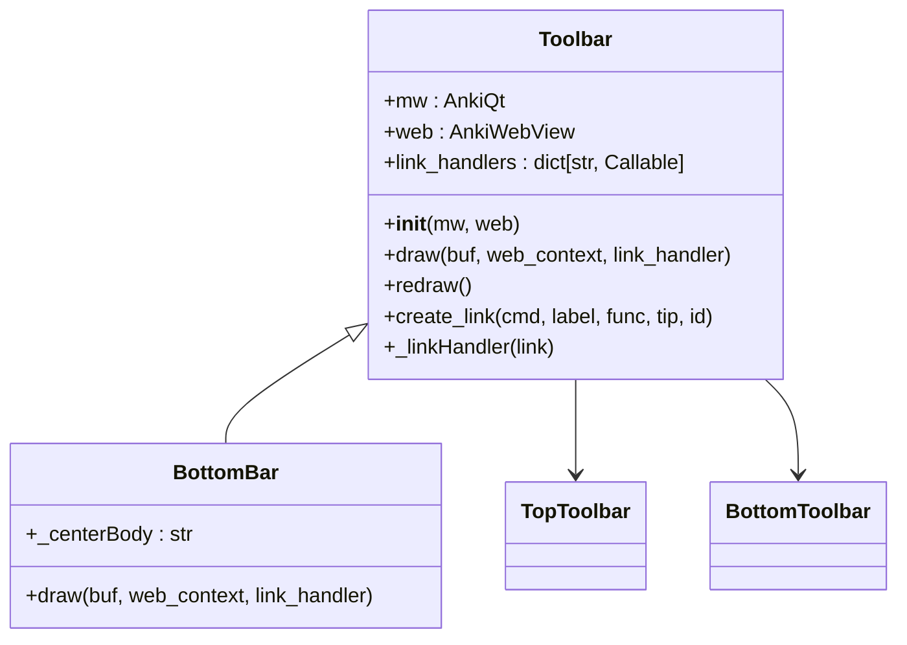
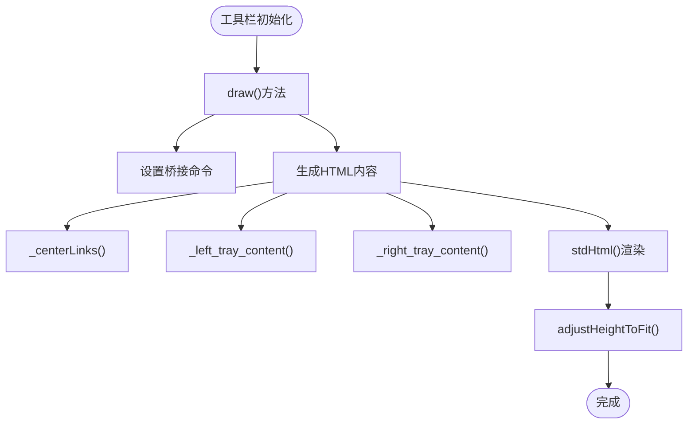
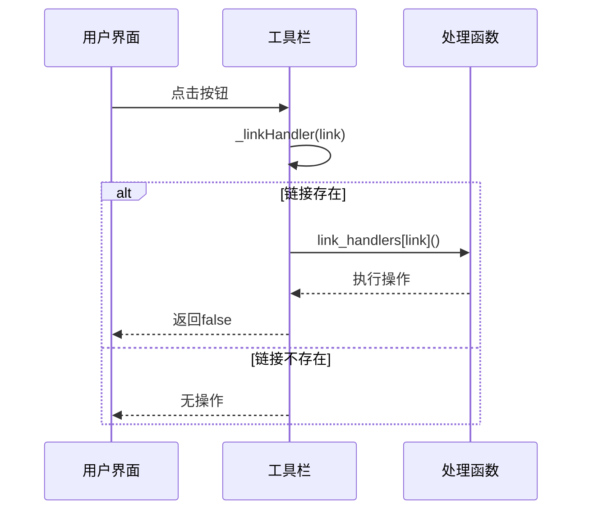
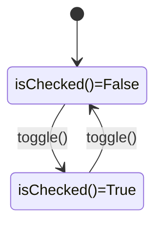
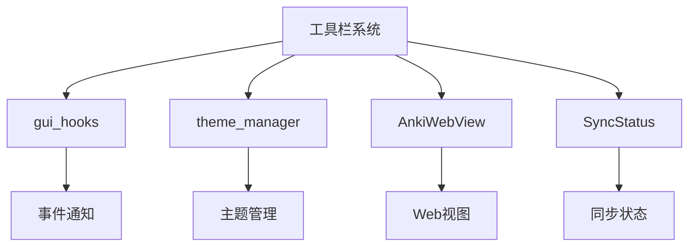

# 工具栏系统

<cite>
**本文档中引用的文件**  
- [toolbar.py](file://qt/aqt/toolbar.py)
- [switch.py](file://qt/aqt/switch.py)
- [flags.py](file://qt/aqt/flags.py)
</cite>

## 目录
1. [简介](#简介)
2. [项目结构](#项目结构)
3. [核心组件](#核心组件)
4. [架构概述](#架构概述)
5. [详细组件分析](#详细组件分析)
6. [依赖分析](#依赖分析)
7. [性能考虑](#性能考虑)
8. [故障排除指南](#故障排除指南)
9. [结论](#结论)

## 简介
Anki的工具栏系统是用户界面的核心组成部分，提供主要功能的快速访问。该系统由主工具栏、学习工具栏和审查工具栏组成，通过动态更新机制和状态同步确保用户界面的一致性。工具栏系统与界面切换逻辑和标志系统紧密集成，实现复杂的交互行为。

## 项目结构
Anki的工具栏系统主要由三个核心模块组成：`toolbar.py`负责工具栏的布局和功能实现，`switch.py`提供界面切换逻辑，`flags.py`管理标志系统。这些模块协同工作，构建了一个灵活且可扩展的用户界面框架。

**图示来源**  
- [toolbar.py](file://qt/aqt/toolbar.py)
- [switch.py](file://qt/aqt/switch.py)
- [flags.py](file://qt/aqt/flags.py)

**本节来源**  
- [toolbar.py](file://qt/aqt/toolbar.py)
- [switch.py](file://qt/aqt/switch.py)
- [flags.py](file://qt/aqt/flags.py)

## 核心组件
工具栏系统的核心是`Toolbar`类，它管理工具栏的布局、按钮注册和状态更新。该类通过`create_link`方法实现按钮的动态注册，使用`_linkHandler`处理用户交互。系统还包含`BottomBar`子类，用于管理底部工具栏的特殊行为。

**本节来源**  
- [toolbar.py](file://qt/aqt/toolbar.py#L269-L464)

## 架构概述
Anki的工具栏系统采用分层架构，将UI渲染、事件处理和状态管理分离。主工具栏和底部工具栏共享相同的基类，但具有不同的渲染策略。系统通过JavaScript桥接与Python后端通信，实现高效的双向数据流。

**图示来源**  
- [toolbar.py](file://qt/aqt/toolbar.py#L269-L464)

## 详细组件分析

### 主工具栏分析
主工具栏是Anki用户界面的核心导航组件，包含"牌组"、"添加"、"浏览"、"统计"和"同步"等主要功能按钮。工具栏采用三栏布局：左侧托盘、中心工具栏和右侧托盘，通过`_body`模板进行渲染。

**图示来源**  
- [toolbar.py](file://qt/aqt/toolbar.py#L269-L464)

**本节来源**  
- [toolbar.py](file://qt/aqt/toolbar.py#L269-L464)

### 学习工具栏分析
学习工具栏在用户进行卡片复习时显示，提供答案选择按钮。该工具栏通过`ReviewerBottomBar`上下文进行管理，其显示状态与审查状态同步。工具栏的动态更新通过`_linkHandler`方法实现，处理"ans"、"ease"等操作指令。

**本节来源**  
- [reviewer.py](file://qt/aqt/reviewer.py#L674-L702)

### 审查工具栏分析
审查工具栏是学习工具栏的扩展，包含更复杂的交互逻辑。当用户点击答案按钮时，系统通过JavaScript桥接调用Python后端的`_answerCard`方法。工具栏还支持音频播放、编辑当前卡片等高级功能。

**本节来源**  
- [reviewer.py](file://qt/aqt/reviewer.py#L674-L702)

### 按钮注册机制
工具栏系统通过`create_link`方法实现按钮的动态注册。该方法生成HTML链接元素并注册相应的处理函数，使用命令名称作为JavaScript到Python桥接的标识符。按钮可以包含标签、提示文本和唯一ID。

**图示来源**  
- [toolbar.py](file://qt/aqt/toolbar.py#L269-L464)

**本节来源**  
- [toolbar.py](file://qt/aqt/toolbar.py#L269-L464)

### 动态更新策略
工具栏系统采用事件驱动的更新策略。当同步状态改变时，`update_sync_status`方法通过`get_sync_status`异步获取最新状态，并调用`set_sync_status`更新UI。同步活动状态通过`set_sync_active`方法控制旋转动画。

**本节来源**  
- [toolbar.py](file://qt/aqt/toolbar.py#L269-L464)

### 界面切换逻辑
`switch.py`模块实现了一个水平滑动开关组件，用于在两个状态之间切换。该组件支持动画过渡，通过`QPropertyAnimation`实现平滑的位置变化。开关的状态与工具栏的显示模式同步，确保用户界面的一致性。

**图示来源**  
- [switch.py](file://qt/aqt/switch.py#L0-L194)

**本节来源**  
- [switch.py](file://qt/aqt/switch.py#L0-L194)

### 标志系统影响
`flags.py`模块管理Anki的标志系统，包含7种颜色的标志。每个标志由`Flag`数据类表示，包含索引、标签、图标和搜索节点等属性。标志系统的状态变化通过`gui_hooks.flag_label_did_change()`通知工具栏更新。

**本节来源**  
- [flags.py](file://qt/aqt/flags.py#L0-L125)

## 依赖分析
工具栏系统与其他模块存在紧密的依赖关系。它依赖`gui_hooks`进行事件通知，使用`theme_manager`处理主题相关功能，并通过`AnkiWebView`与JavaScript前端通信。这些依赖关系确保了系统的可扩展性和一致性。

**图示来源**  
- [toolbar.py](file://qt/aqt/toolbar.py#L269-L464)
- [switch.py](file://qt/aqt/switch.py#L0-L194)
- [flags.py](file://qt/aqt/flags.py#L0-L125)

**本节来源**  
- [toolbar.py](file://qt/aqt/toolbar.py#L269-L464)
- [switch.py](file://qt/aqt/switch.py#L0-L194)
- [flags.py](file://qt/aqt/flags.py#L0-L125)

## 性能考虑
为优化工具栏性能，建议采用按钮状态缓存和按需渲染策略。避免频繁的DOM操作，使用批量更新减少重绘次数。对于复杂的工具栏，考虑实现虚拟滚动以提高渲染效率。

**本节来源**  
- [toolbar.py](file://qt/aqt/toolbar.py#L269-L464)

## 故障排除指南
当工具栏功能异常时，首先检查JavaScript桥接是否正常工作。验证`link_handlers`字典是否正确注册了处理函数，确认`pycmd`调用能够正确触发Python后端。对于显示问题，检查CSS类和HTML结构是否符合预期。

**本节来源**  
- [toolbar.py](file://qt/aqt/toolbar.py#L269-L464)
- [switch.py](file://qt/aqt/switch.py#L0-L194)
- [flags.py](file://qt/aqt/flags.py#L0-L125)

## 结论
Anki的工具栏系统是一个精心设计的用户界面组件，通过模块化架构和清晰的职责分离实现了高度的可维护性和扩展性。系统的核心设计原则包括事件驱动的更新机制、清晰的依赖管理以及高效的性能优化策略。