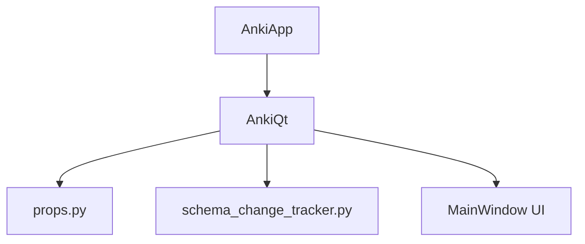
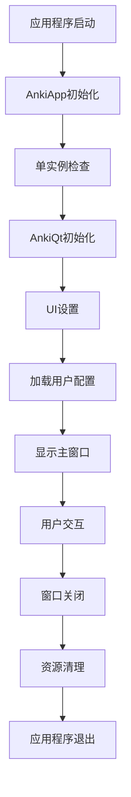
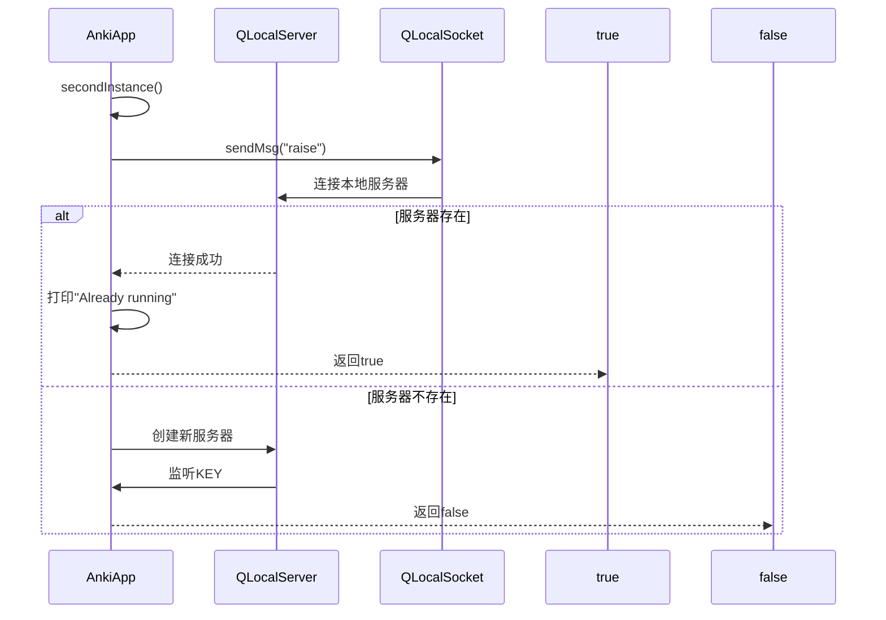
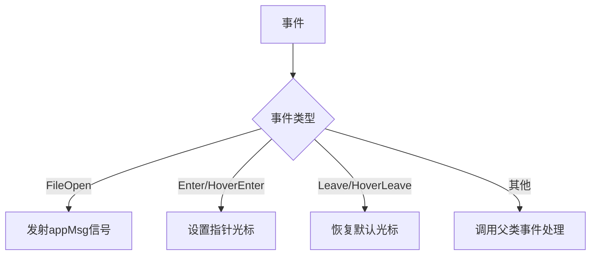
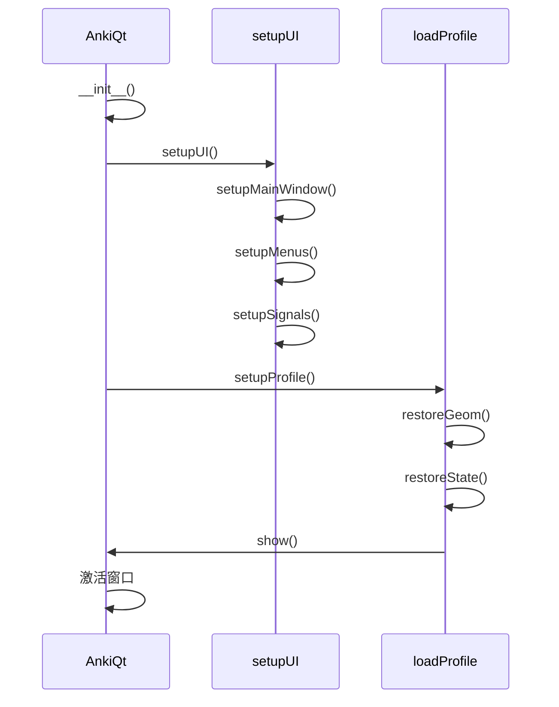
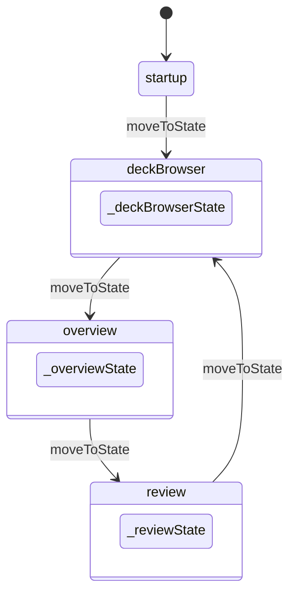
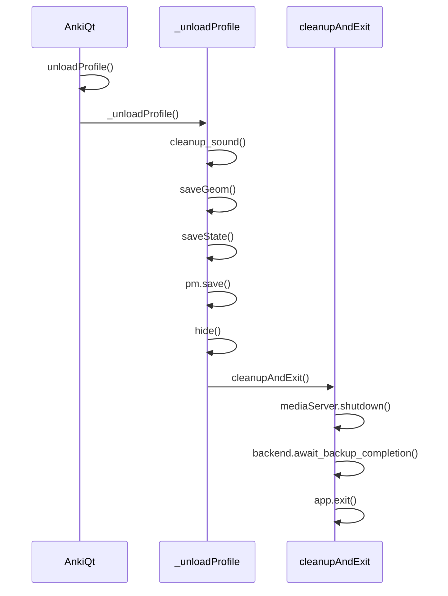
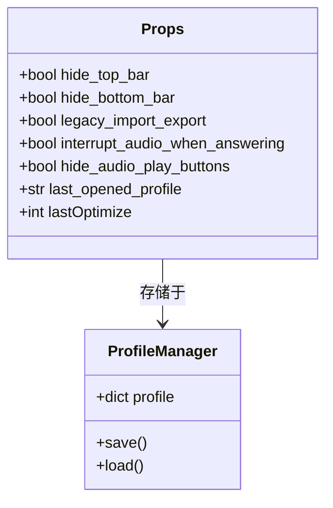
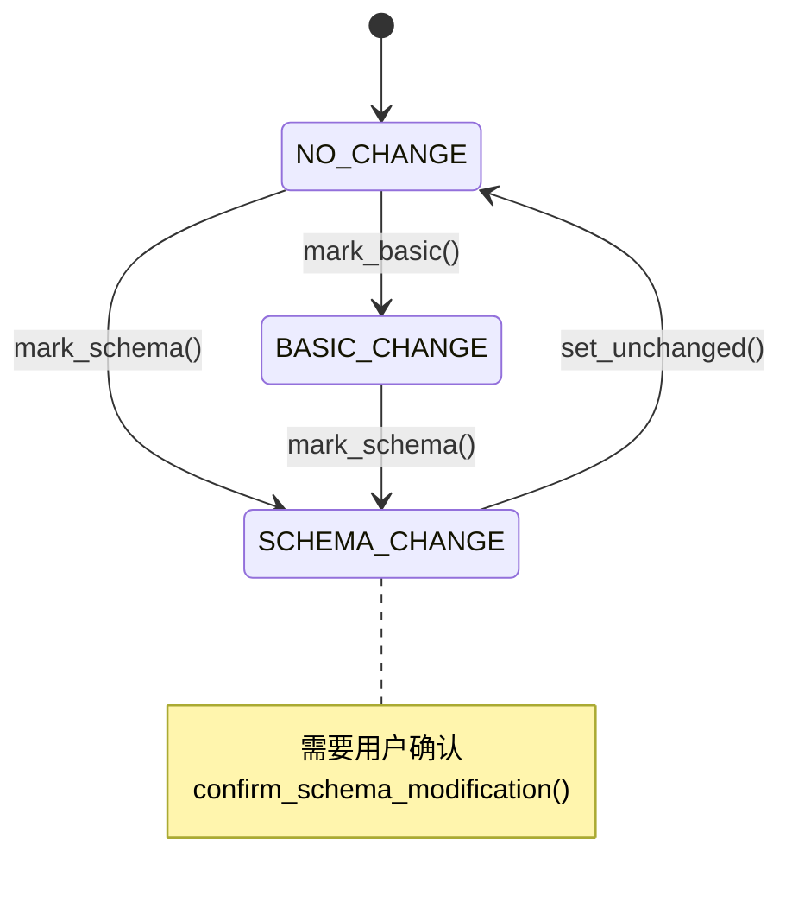
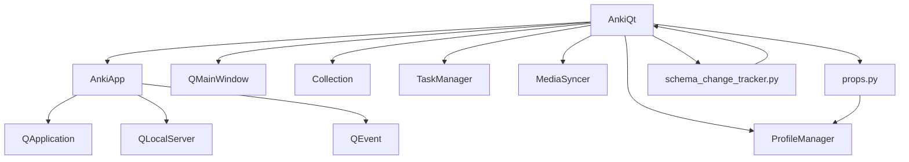

# 窗口生命周期管理

<cite>
**本文档中引用的文件**  
- [main.py](file://qt/aqt/main.py)
- [__init__.py](file://qt/aqt/__init__.py)
- [props.py](file://qt/aqt/props.py)
- [schema_change_tracker.py](file://qt/aqt/schema_change_tracker.py)
</cite>

## 目录
1. [简介](#简介)
2. [项目结构](#项目结构)
3. [核心组件](#核心组件)
4. [架构概述](#架构概述)
5. [详细组件分析](#详细组件分析)
6. [依赖分析](#依赖分析)
7. [性能考虑](#性能考虑)
8. [故障排除指南](#故障排除指南)
9. [结论](#结论)

## 简介
本文档深入分析Anki主窗口的生命周期管理机制，重点研究应用程序启动时的初始化流程、窗口状态恢复、界面构建以及关闭时的清理与数据保存逻辑。文档涵盖AnkiApp类和MainWindow类（即AnkiQt）的完整生命周期，解释props.py中的窗口属性管理系统和schema_change_tracker.py中的数据库模式变更处理机制。同时为初学者介绍Qt事件循环机制，并为高级开发者提供性能优化建议。

## 项目结构
Anki的Qt前端代码主要位于`qt/aqt/`目录下，其中主窗口相关的核心文件包括`main.py`（主窗口实现）、`__init__.py`（应用程序类）、`props.py`（属性系统）和`schema_change_tracker.py`（模式变更跟踪）。这些文件共同构成了Anki主窗口的生命周期管理框架。

**Diagram sources**
- [__init__.py](file://qt/aqt/__init__.py#L306-L433)
- [main.py](file://qt/aqt/main.py#L185-L233)

**Section sources**
- [main.py](file://qt/aqt/main.py#L0-L1901)
- [__init__.py](file://qt/aqt/__init__.py#L306-L433)

## 核心组件
Anki主窗口生命周期由AnkiApp（应用程序级）和AnkiQt（窗口级）两个核心类协同管理。AnkiApp负责应用程序的单实例控制和全局事件处理，而AnkiQt管理主窗口的具体状态、界面组件和用户交互。props.py提供属性管理系统，schema_change_tracker.py处理数据库模式变更时的窗口适配。

**Section sources**
- [main.py](file://qt/aqt/main.py#L185-L233)
- [__init__.py](file://qt/aqt/__init__.py#L306-L433)
- [props.py](file://qt/aqt/props.py#L0-L11)
- [schema_change_tracker.py](file://qt/aqt/schema_change_tracker.py#L0-L39)

## 架构概述
Anki主窗口的生命周期管理采用分层架构，从应用程序启动到窗口关闭形成完整的闭环。架构包括应用程序初始化、单实例控制、配置加载、窗口状态恢复、界面构建、事件处理和资源清理等关键环节。

**Diagram sources**
- [__init__.py](file://qt/aqt/__init__.py#L306-L433)
- [main.py](file://qt/aqt/main.py#L185-L233)

## 详细组件分析

### AnkiApp类分析
AnkiApp类继承自QApplication，负责管理整个应用程序的生命周期和全局行为。

#### 单实例控制机制

**Diagram sources**
- [__init__.py](file://qt/aqt/__init__.py#L343-L360)
- [__init__.py](file://qt/aqt/__init__.py#L370-L380)

#### 应用程序事件处理

**Diagram sources**
- [__init__.py](file://qt/aqt/__init__.py#L395-L401)
- [__init__.py](file://qt/aqt/__init__.py#L403-L433)

**Section sources**
- [__init__.py](file://qt/aqt/__init__.py#L306-L433)

### AnkiQt类分析
AnkiQt类继承自QMainWindow，代表Anki的主窗口，管理窗口的完整生命周期。

#### 窗口初始化流程

**Diagram sources**
- [main.py](file://qt/aqt/main.py#L185-L233)
- [main.py](file://qt/aqt/main.py#L235-L257)
- [main.py](file://qt/aqt/main.py#L510-L568)

#### 窗口状态管理

**Diagram sources**
- [main.py](file://qt/aqt/main.py#L799-L815)
- [main.py](file://qt/aqt/main.py#L817-L825)
- [main.py](file://qt/aqt/main.py#L827-L835)

#### 窗口关闭与清理

**Diagram sources**
- [main.py](file://qt/aqt/main.py#L570-L576)
- [main.py](file://qt/aqt/main.py#L578-L604)
- [main.py](file://qt/aqt/main.py#L606-L621)

**Section sources**
- [main.py](file://qt/aqt/main.py#L185-L621)

### 属性管理系统分析
props.py文件提供了窗口属性管理系统，通过自动生成的属性定义来管理界面状态。

**Diagram sources**
- [props.py](file://qt/aqt/props.py#L0-L11)
- [main.py](file://qt/aqt/main.py#L510-L568)

### 模式变更跟踪器分析
schema_change_tracker.py实现了数据库模式变更的跟踪和处理机制。

**Diagram sources**
- [schema_change_tracker.py](file://qt/aqt/schema_change_tracker.py#L16-L38)
- [schema_change_tracker.py](file://qt/aqt/schema_change_tracker.py#L26-L32)

**Section sources**
- [schema_change_tracker.py](file://qt/aqt/schema_change_tracker.py#L0-L39)

## 依赖分析
Anki主窗口的生命周期管理涉及多个组件的协同工作，形成了复杂的依赖关系网络。

**Diagram sources**
- [__init__.py](file://qt/aqt/__init__.py#L306-L433)
- [main.py](file://qt/aqt/main.py#L185-L233)
- [props.py](file://qt/aqt/props.py#L0-L11)
- [schema_change_tracker.py](file://qt/aqt/schema_change_tracker.py#L0-L39)

**Section sources**
- [main.py](file://qt/aqt/main.py#L0-L1901)

## 性能考虑
Anki主窗口的生命周期管理中包含多项性能优化措施：

1. **延迟初始化**：使用`single_shot`定时器延迟加载配置文件，确保窗口界面先完成初始化
2. **资源预加载**：在Windows平台上强制加载WebEngine进程，避免后续操作中的延迟
3. **垃圾回收控制**：禁用自动垃圾回收，手动控制内存管理时机
4. **备份优化**：仅在满足条件时才执行数据库优化操作，避免频繁的I/O操作
5. **事件过滤**：使用事件过滤器优化光标显示性能，减少不必要的重绘

这些优化措施确保了Anki在各种操作场景下都能保持流畅的用户体验。

## 故障排除指南
当遇到Anki主窗口生命周期相关的问题时，可以参考以下排查步骤：

1. **启动问题**：检查是否已有Anki实例在运行，单实例机制可能导致新实例无法启动
2. **配置加载失败**：验证用户配置文件是否存在且可读，检查权限设置
3. **界面显示异常**：确认几何信息和状态信息是否正确恢复，检查`restoreGeom`和`restoreState`调用
4. **资源清理不彻底**：检查`_checkForUnclosedWidgets`方法的输出，确保所有顶层窗口都已正确关闭
5. **数据库备份失败**：查看日志中的错误信息，确认备份目录是否有写入权限

**Section sources**
- [main.py](file://qt/aqt/main.py#L591-L598)
- [main.py](file://qt/aqt/main.py#L578-L604)

## 结论
Anki主窗口的生命周期管理是一个精心设计的系统，通过AnkiApp和AnkiQt两个核心类的协作，实现了从应用程序启动到关闭的完整生命周期管理。系统采用了单实例控制、延迟初始化、状态持久化等关键技术，确保了应用程序的稳定性和用户体验。props.py和schema_change_tracker.py模块提供了灵活的属性管理和模式变更处理机制，使系统能够适应不同的使用场景和数据结构变化。整体架构清晰，职责分明，为类似桌面应用程序的开发提供了优秀的参考范例。