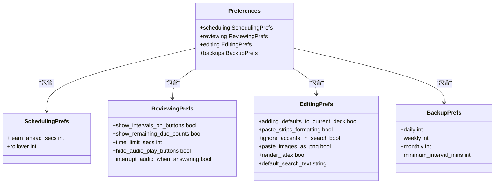

# 偏好设置对话框

<cite>
**本文档中引用的文件**   
- [preferences.py](file://qt/aqt/preferences.py)
- [config.py](file://pylib/anki/config.py)
</cite>

## 目录
1. [简介](#简介)
2. [UI布局设计与控件组织](#ui布局设计与控件组织)
3. [配置选项分组逻辑](#配置选项分组逻辑)
4. [配置数据持久化机制](#配置数据持久化机制)
5. [数据验证与错误提示](#数据验证与错误提示)
6. [实时预览功能实现](#实时预览功能实现)
7. [新增配置选项示例](#新增配置选项示例)
8. [向后兼容性处理](#向后兼容性处理)
9. [布局优化建议](#布局优化建议)
10. [用户体验改进方案](#用户体验改进方案)

## 简介
Anki的偏好设置对话框为用户提供了一个集中管理应用程序配置的界面。该对话框通过Qt框架实现，包含多个配置类别，允许用户自定义学习调度、界面外观、网络同步等各个方面。对话框的设计遵循模块化原则，将不同类型的设置分组展示，便于用户查找和修改。

**Section sources**
- [preferences.py](file://qt/aqt/preferences.py#L37-L453)

## UI布局设计与控件组织
偏好设置对话框采用标签页式布局，将相关配置选项分组展示。每个标签页包含特定类别的设置控件，如复选框、下拉列表、数值输入框等。对话框的UI结构由Qt Designer生成的`.ui`文件定义，通过`Ui_Preferences`类加载。

对话框的主要控件组织如下：
- **学习调度**：包含学习截止时间、每日开始时间等设置
- **界面**：控制界面元素的显示和行为
- **网络**：管理同步和更新相关设置
- **语言**：选择界面语言
- **视频驱动**：配置图形渲染选项

控件的初始化和事件连接在`Preferences`类的`__init__`方法中完成，确保对话框启动时正确加载当前设置并建立事件处理机制。

**Section sources**
- [preferences.py](file://qt/aqt/preferences.py#L38-L70)
- [preferences.py](file://qt/aqt/preferences.py#L42-L42)

## 配置选项分组逻辑
偏好设置对话框的配置选项按照功能和作用范围进行分组，主要分为三类：

### 集合级别设置
存储在用户集合中的设置，影响学习和复习行为：
- 学习调度参数
- 复习显示选项
- 编辑行为设置
- 备份策略

### 用户配置文件设置
存储在用户配置文件中的设置，影响同步和网络行为：
- 自动同步选项
- 媒体同步设置
- 自定义同步URL
- 网络超时时间

### 全局设置
影响所有用户配置文件的全局选项：
- 界面缩放比例
- 主题选择
- 顶部/底部栏隐藏模式
- 视频驱动选择

这种分组逻辑确保了设置的合理组织，使用户能够轻松找到相关配置项。

**Section sources**
- [preferences.py](file://qt/aqt/preferences.py#L124-L160)
- [preferences.py](file://qt/aqt/preferences.py#L212-L230)
- [preferences.py](file://qt/aqt/preferences.py#L307-L376)

## 配置数据持久化机制
Anki使用分层的配置持久化机制，将不同类型的设置存储在不同的位置。

### 配置管理器
`ConfigManager`类负责管理配置数据的读取和写入操作。它提供了以下主要方法：
- `get_immutable(key)`: 获取不可变的配置值
- `set(key, val)`: 设置配置值
- `remove(key)`: 移除配置项

配置数据以JSON格式存储，通过`to_json_bytes`和`from_json_bytes`函数进行序列化和反序列化。

### 集合偏好设置
集合级别的偏好设置通过`Collection`类的`get_preferences`和`set_preferences`方法进行管理。这些设置存储在集合数据库中，影响学习算法和用户界面行为。

**Diagram sources**
- [preferences.py](file://qt/aqt/preferences.py#L124-L160)
- [preferences.py](file://qt/aqt/preferences.py#