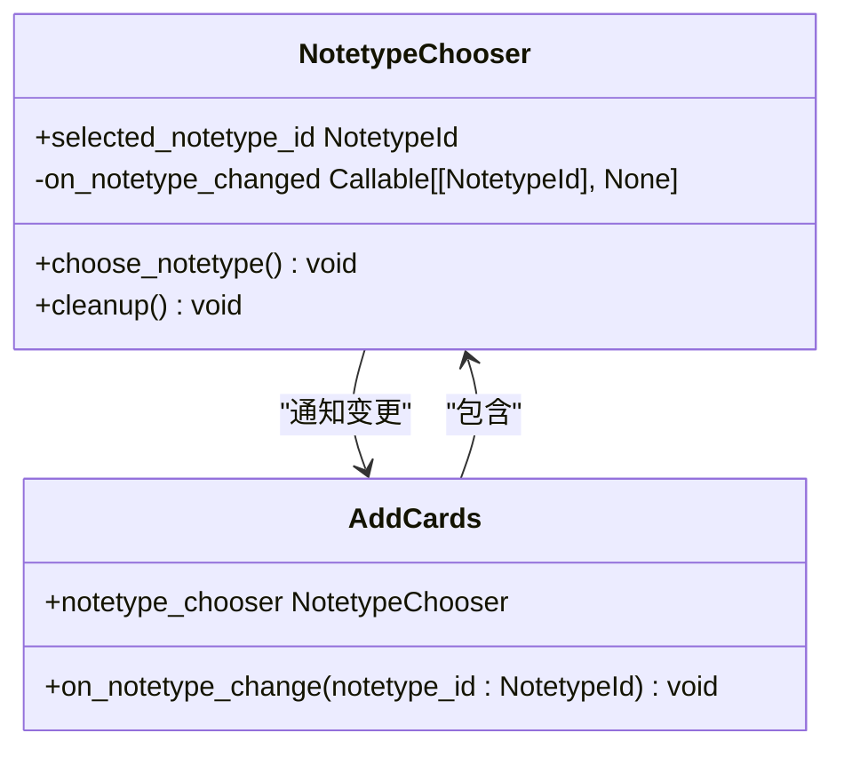
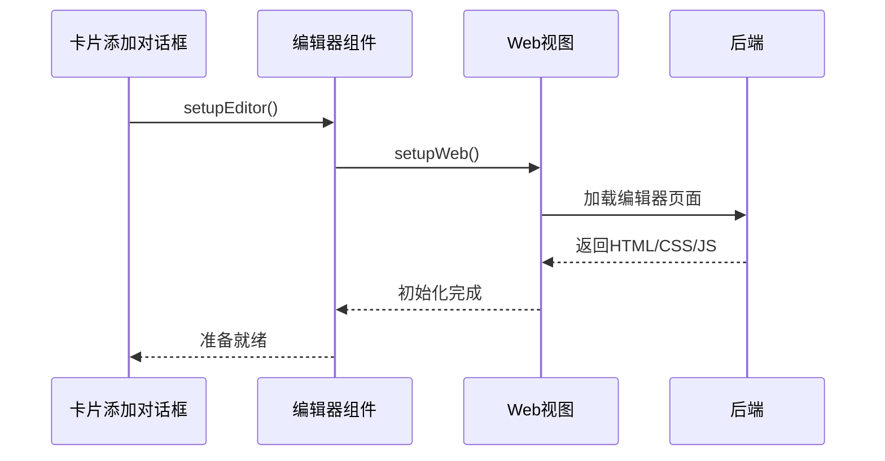
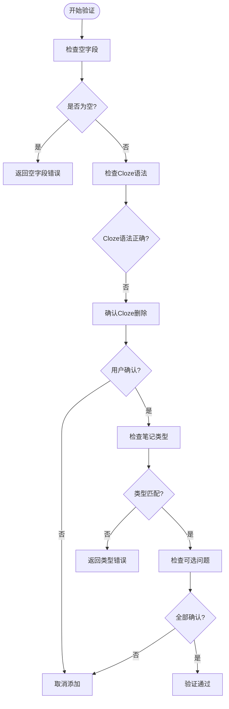
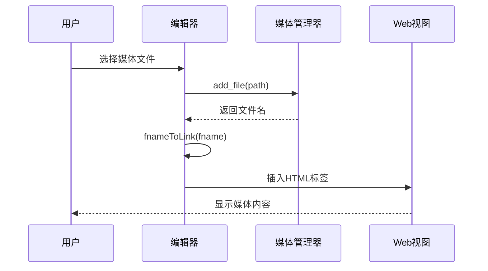
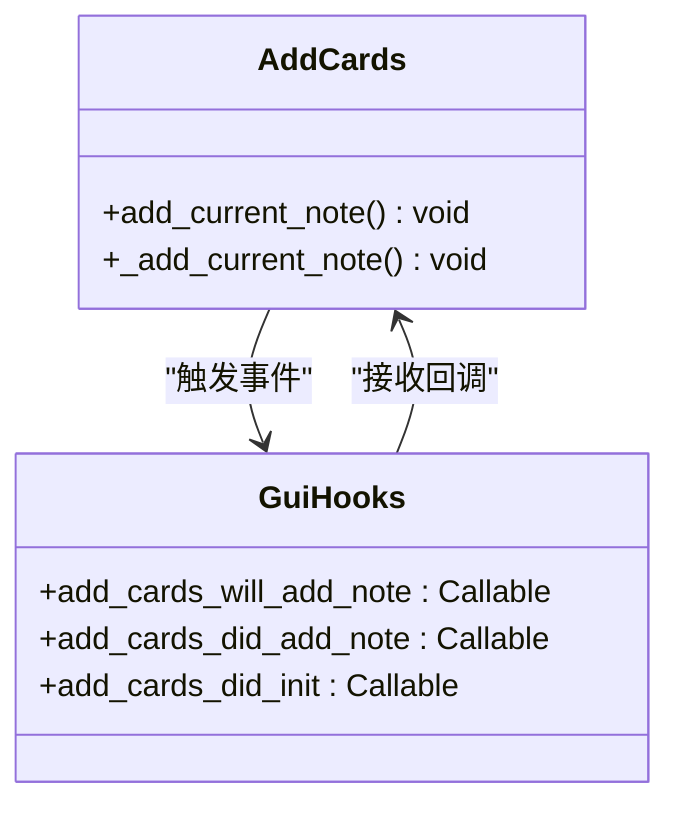

# 卡片添加对话框

<cite>
**本文档中引用的文件**  
- [addcards.py](file://qt/aqt/forms/addcards.py)
- [addcards.py](file://qt/aqt/addcards.py)
- [editor.py](file://qt/aqt/editor.py)
- [notetypechooser.py](file://qt/aqt/notetypechooser.py)
- [deckchooser.py](file://qt/aqt/deckchooser.py)
</cite>

## 目录
1. [简介](#简介)
2. [表单布局设计原理](#表单布局设计原理)
3. [笔记类型与模板选择机制](#笔记类型与模板选择机制)
4. [实时预览功能实现](#实时预览功能实现)
5. [数据验证与错误反馈](#数据验证与错误反馈)
6. [多媒体内容处理](#多媒体内容处理)
7. [自定义添加流程](#自定义添加流程)
8. [最佳实践与界面定制](#最佳实践与界面定制)

## 简介
Anki的卡片添加对话框是用户创建新学习卡片的核心界面。该对话框提供了完整的笔记创建功能，包括字段编辑、笔记类型选择、目标牌组设置等。对话框通过Qt框架实现，采用模块化设计，将不同功能组件分离，确保代码的可维护性和扩展性。用户可以通过该界面高效地添加学习内容，系统会实时验证输入数据并提供即时反馈。

## 表单布局设计原理

卡片添加对话框的表单布局采用模块化设计，将不同功能区域分离。主界面由多个组件构成：顶部为操作按钮区，中部为字段编辑区，底部为控制按钮区。字段编辑区通过`Editor`组件实现，支持富文本编辑和实时预览。笔记类型选择器和牌组选择器分别位于界面的指定区域，通过独立的`NotetypeChooser`和`DeckChooser`类管理。

布局设计遵循用户操作流程，将最常用的字段编辑放在中心位置，辅助功能如笔记类型和牌组选择放在侧边。这种布局优化了用户的工作流，使添加卡片的过程更加直观高效。界面状态通过`EditorState`枚举管理，确保不同操作模式下的正确行为。

**Section sources**
- [addcards.py](file://qt/aqt/addcards.py#L37-L413)
- [editor.py](file://qt/aqt/editor.py#L109-L1468)

## 笔记类型与模板选择机制

### 笔记类型选择器
笔记类型选择机制通过`NotetypeChooser`类实现。该组件允许用户在不同笔记类型间切换，每个笔记类型对应特定的字段结构和卡片模板。当用户选择不同的笔记类型时，系统会自动调整字段布局，保持用户输入的连续性。

**Diagram sources**
- [notetypechooser.py](file://qt/aqt/notetypechooser.py#L31-L55)
- [addcards.py](file://qt/aqt/addcards.py#L37-L413)

### 模板动态切换
当笔记类型变更时，`on_notetype_change`方法会处理字段映射逻辑。系统会尝试将原笔记的字段内容智能地迁移到新笔记类型中，优先匹配相同名称的字段。对于没有匹配的字段，按顺序进行迁移，确保用户输入的内容尽可能保留。

这种机制支持两种迁移策略：精确匹配和顺序匹配。精确匹配优先处理同名字段，确保关键信息的准确迁移；顺序匹配则处理剩余字段，保持内容的完整性。同时，系统会保留"sticky"字段的值，这些字段在笔记类型切换时保持不变。

**Section sources**
- [addcards.py](file://qt/aqt/addcards.py#L159-L197)

## 实时预览功能实现

### 编辑器集成
实时预览功能通过`Editor`组件与卡片添加对话框的深度集成实现。`Editor`类作为核心编辑组件，被嵌入到`AddCards`对话框的字段区域中。这种集成通过`setupEditor`方法完成，创建`Editor`实例并将其绑定到指定的UI区域。

**Diagram sources**
- [addcards.py](file://qt/aqt/addcards.py#L84-L90)
- [editor.py](file://qt/aqt/editor.py#L119-L154)

### 实时更新机制
实时预览依赖于双向数据绑定机制。当用户在编辑器中输入内容时，通过JavaScript桥接将变更通知发送到Python后端。`onBridgeCmd`方法处理这些命令，更新内存中的笔记对象。同时，系统会定期检查字段的有效性，通过`_check_and_update_duplicate_display_async`方法实现异步验证。

错误状态通过CSS类动态更新，例如当检测到重复笔记时，第一个字段的背景会变为"dupe"样式。这种实时反馈机制帮助用户立即发现并修正问题，提高输入效率。

**Section sources**
- [editor.py](file://qt/aqt/editor.py#L401-L523)
- [editor.py](file://qt/aqt/editor.py#L661-L675)

## 数据验证与错误反馈

### 验证规则体系
卡片添加对话框实现了多层次的数据验证机制。核心验证由`_note_can_be_added`方法驱动，该方法检查笔记字段的完整性、重复性以及Cloze删除语法的正确性。验证结果分为多种类型：空字段、缺少Cloze、非Cloze笔记类型使用Cloze等。

**Diagram sources**
- [addcards.py](file://qt/aqt/addcards.py#L291-L309)

### 错误反馈机制
错误反馈采用分层处理策略。严重错误如空字段或类型不匹配会直接阻止卡片添加，并通过`showWarning`显示明确的错误信息。对于Cloze删除等可确认的特殊情况，系统会弹出确认对话框，让用户决定是否继续。

反馈信息通过GUI钩子系统扩展，允许插件修改或增强默认的错误消息。这种设计确保了核心功能的稳定性，同时提供了足够的灵活性供第三方扩展。

**Section sources**
- [addcards.py](file://qt/aqt/addcards.py#L291-L309)

## 多媒体内容处理

### 媒体插入流程
多媒体内容的插入通过`_addMedia`方法实现。当用户选择媒体文件时，系统首先将文件复制到媒体文件夹，然后生成相应的HTML标签。图片文件生成``标签，音频文件生成`[sound:]`标签。

**Diagram sources**
- [editor.py](file://qt/aqt/editor.py#L842-L847)
- [editor.py](file://qt/aqt/editor.py#L875-L882)

### 引用管理
媒体引用采用相对路径和文件名哈希机制。系统为每个媒体文件生成唯一的文件名，避免命名冲突。引用时使用URL编码确保特殊字符的正确处理。音频文件的引用还会触发播放预览，增强用户体验。

对于内联图片，系统支持Base64编码的图片数据，可以将剪贴板中的图片直接转换为媒体文件。这种设计简化了图片添加流程，提高了操作效率。

**Section sources**
- [editor.py](file://qt/aqt/editor.py#L829-L840)

## 自定义添加流程

### 扩展点设计
卡片添加流程提供了多个扩展点，支持通过插件系统进行定制。核心扩展机制基于GUI钩子（gui_hooks），允许插件在关键操作点注入自定义逻辑。例如，`add_cards_will_add_note`钩子可以在添加前修改或验证笔记内容。

**Diagram sources**
- [addcards.py](file://qt/aqt/addcards.py#L280-L286)

### 流程定制
自定义流程主要通过重写或扩展现有方法实现。开发者可以创建新的操作按钮，通过`addButton`方法集成到编辑器工具栏。每个按钮可以绑定自定义命令，执行特定的处理逻辑。

添加流程的异步特性通过`call_after_note_saved`方法支持，确保在笔记保存完成后执行后续操作。这种设计避免了数据竞争，保证了操作的原子性。

**Section sources**
- [editor.py](file://qt/aqt/editor.py#L235-L289)

## 最佳实践与界面定制

### 用户最佳实践
为了高效使用卡片添加功能，建议用户遵循以下实践：首先设置常用的笔记类型和目标牌组作为默认值；利用"sticky"字段功能保持常用信息；及时使用历史功能快速访问最近添加的卡片；合理使用快捷键提高输入效率。

对于Cloze笔记，建议在添加前确认笔记类型和字段设置，避免语法错误。多媒体内容应预先整理，确保文件名清晰且易于识别。

### 开发者界面定制
开发者可以通过多种方式定制添加对话框界面。最直接的方法是使用GUI钩子系统，在现有界面中添加自定义元素。通过`editor_did_init_buttons`钩子，可以在编辑器工具栏添加新的操作按钮。

更复杂的定制可以通过创建新的对话框类实现，继承`AddCards`并重写特定方法。界面布局可以通过修改Qt样式表进行调整，但需注意保持与整体主题的一致性。

**Section sources**
- [addcards.py](file://qt/aqt/addcards.py#L37-L413)
- [editor.py](file://qt/aqt/editor.py#L109-L1468)