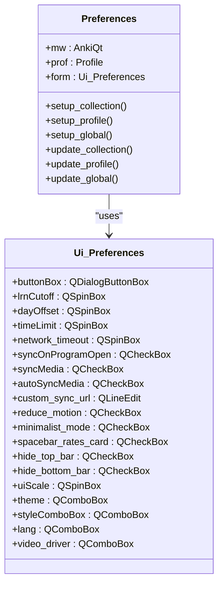
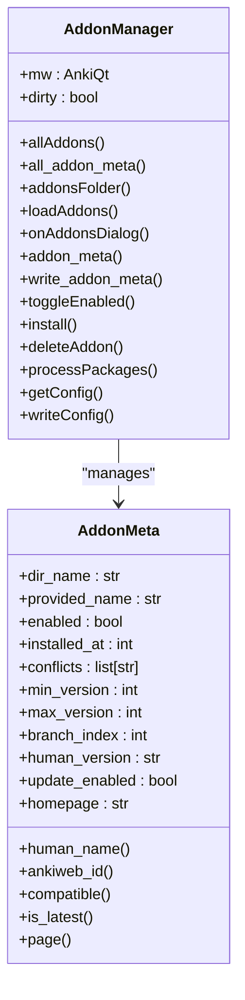
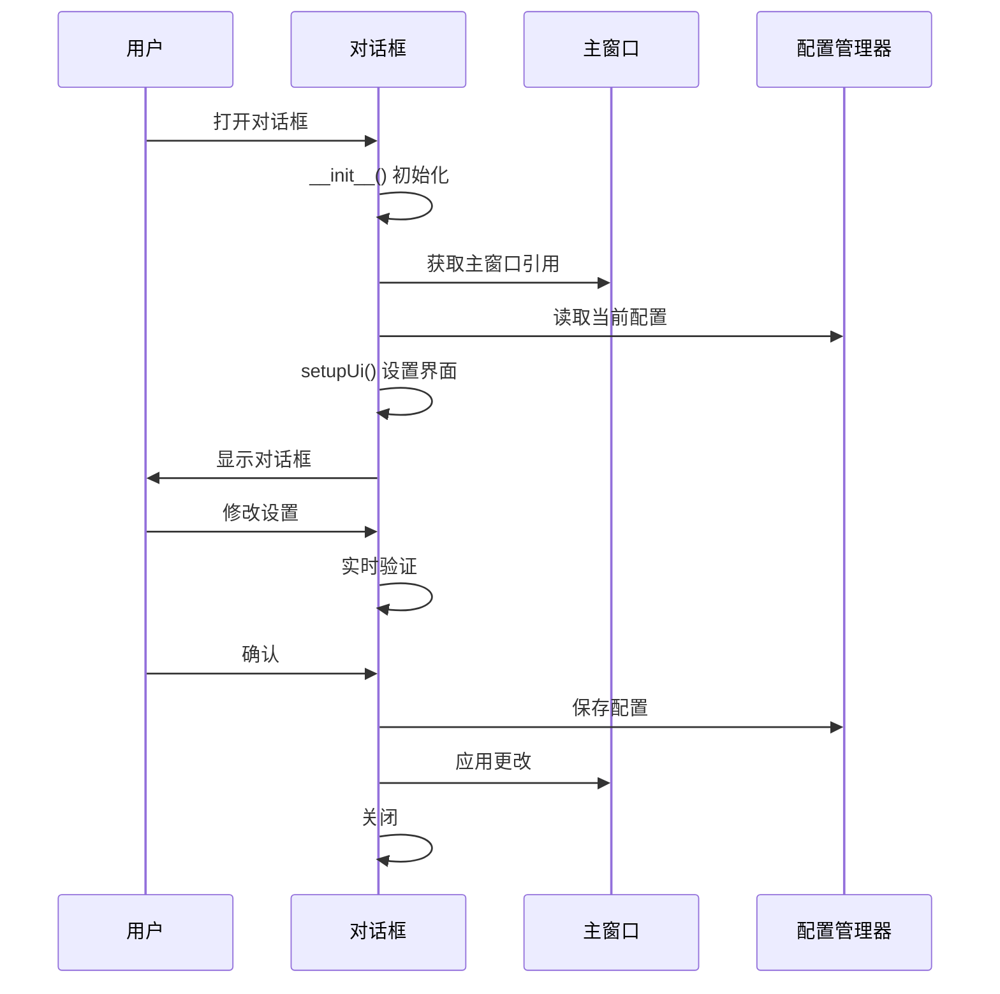
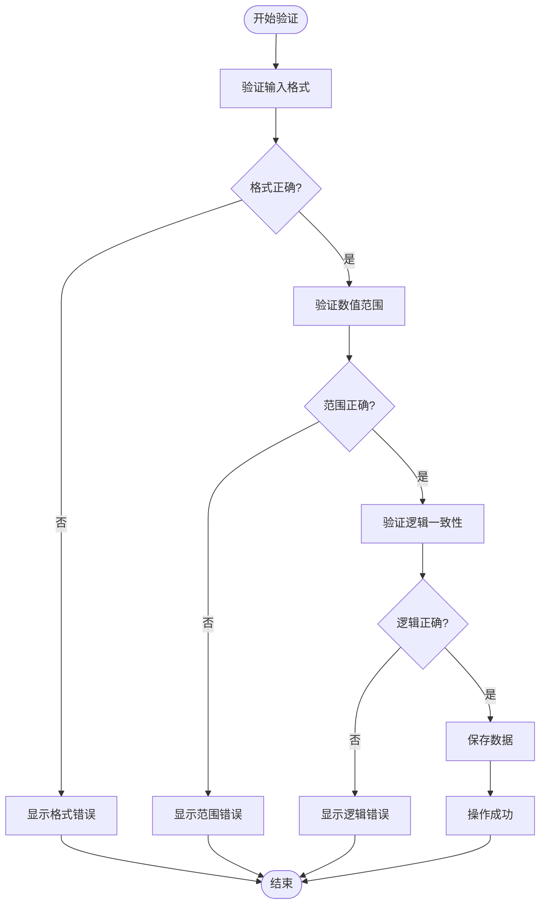
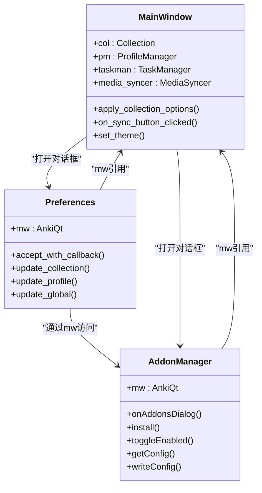

# 对话框管理

<cite>
**本文档中引用的文件**  
- [preferences.py](file://qt/aqt/preferences.py)
- [addons.py](file://qt/aqt/addons.py)
- [forms/preferences.py](file://qt/aqt/forms/preferences.py)
- [forms/addons.py](file://qt/aqt/forms/addons.py)
</cite>

## 目录
1. [简介](#简介)
2. [对话框表单实现机制](#对话框表单实现机制)
3. [偏好设置对话框](#偏好设置对话框)
4. [插件管理对话框](#插件管理对话框)
5. [对话框生命周期管理](#对话框生命周期管理)
6. [数据验证与错误处理](#数据验证与错误处理)
7. [对话框通信机制](#对话框通信机制)
8. [Qt对话框编程指南](#qt对话框编程指南)
9. [最佳实践建议](#最佳实践建议)
10. [结论](#结论)

## 简介
Anki的对话框管理系统基于Qt框架构建，为用户提供了一系列功能丰富的配置和管理界面。系统通过forms目录中的表单定义和对应的Python类实现，提供了偏好设置、插件管理、卡片添加等核心功能。对话框系统采用模态和非模态两种模式，确保用户交互的流畅性和数据的一致性。

**Section sources**
- [preferences.py](file://qt/aqt/preferences.py#L37-L453)
- [addons.py](file://qt/aqt/addons.py#L179-L796)

## 对话框表单实现机制
Anki的对话框表单实现采用分层架构，将UI定义与业务逻辑分离。forms目录包含所有对话框的UI定义文件，这些文件通过Qt Designer生成，以Python模块的形式存在。每个表单文件导入对应的Qt6 UI类，如preferences.py导入Ui_Preferences类。

对话框的业务逻辑在aqt目录下的对应Python文件中实现，通过继承QDialog并组合UI类来构建完整的对话框。这种分离设计使得UI修改和业务逻辑开发可以并行进行，提高了开发效率和代码可维护性。

**Section sources**
- [forms/preferences.py](file://qt/aqt/forms/preferences.py#L0-L1)
- [forms/addons.py](file://qt/aqt/forms/addons.py#L0-L1)

## 偏好设置对话框
偏好设置对话框（Preferences）是Anki中最重要的配置界面之一，负责管理用户的各项设置。该对话框实现了多层级的配置管理，包括集合级别、用户档案级别和全局级别的设置。

**Diagram sources**
- [preferences.py](file://qt/aqt/preferences.py#L37-L453)
- [forms/preferences.py](file://qt/aqt/forms/preferences.py#L0-L1)

### 配置管理与持久化
偏好设置对话框的配置管理分为三个层次：集合级别、用户档案级别和全局级别。集合级别的设置存储在集合中，影响学习和复习行为；用户档案级别的设置存储在用户档案中，管理同步和网络相关配置；全局级别的设置对所有用户档案生效，包括UI缩放、主题和语言等。

持久化机制通过三个主要方法实现：setup_collection、setup_profile和setup_global用于初始化界面，分别从集合、用户档案和全局配置中读取当前值；update_collection、update_profile和update_global用于保存修改，将界面值写回对应的存储位置。

**Section sources**
- [preferences.py](file://qt/aqt/preferences.py#L37-L453)

## 插件管理对话框
插件管理对话框（AddonsDialog）是Anki扩展系统的核心界面，负责插件的安装、启用、禁用和更新管理。该对话框通过AddonManager类实现核心功能，提供了一套完整的插件生命周期管理机制。

**Diagram sources**
- [addons.py](file://qt/aqt/addons.py#L179-L796)
- [addons.py](file://qt/aqt/addons.py#L108-L162)

### 功能特性与用户交互流程
插件管理对话框提供了丰富的功能特性，包括插件安装、启用/禁用、配置管理和更新检查。用户交互流程设计简洁直观，通过列表视图展示所有已安装的插件，并提供搜索和过滤功能。

插件安装支持从本地文件或AnkiWeb下载安装，安装过程包含完整的验证机制，确保插件的完整性和兼容性。冲突检测功能在安装时自动检查并禁用冲突的插件，避免系统稳定性问题。配置管理允许用户查看和修改插件的特定设置，支持JSON格式的配置文件和Markdown格式的帮助文档。

**Section sources**
- [addons.py](file://qt/aqt/addons.py#L179-L796)

## 对话框生命周期管理
Anki的对话框生命周期管理遵循Qt的标准模式，通过继承QDialog类并重写关键方法来控制对话框的创建、显示和销毁过程。对话框的生命周期包括初始化、显示、用户交互、数据验证和关闭等阶段。

**Diagram sources**
- [preferences.py](file://qt/aqt/preferences.py#L37-L453)
- [addons.py](file://qt/aqt/addons.py#L179-L796)

### 初始化与销毁
对话框的初始化过程在__init__方法中完成，包括创建UI、连接信号与槽、设置初始值等步骤。销毁过程通过accept和reject方法控制，accept方法在用户确认时调用，执行保存操作后关闭对话框；reject方法在用户取消时调用，直接关闭对话框而不保存更改。

对话框管理器（DialogManager）负责跟踪所有打开的对话框实例，确保同一类型的对话框在同一时间只有一个实例存在。当主窗口关闭时，对话框管理器会协调所有对话框的关闭过程，确保数据的完整性和一致性。

**Section sources**
- [preferences.py](file://qt/aqt/preferences.py#L37-L453)
- [addons.py](file://qt/aqt/addons.py#L304-L305)

## 数据验证与错误处理
Anki的对话框系统实现了多层次的数据验证和错误处理机制，确保用户输入的正确性和系统的稳定性。验证机制包括输入格式验证、范围验证和逻辑验证，错误处理采用用户友好的提示方式。

**Diagram sources**
- [preferences.py](file://qt/aqt/preferences.py#L37-L453)
- [addons.py](file://qt/aqt/addons.py#L445-L491)

### 验证策略
数据验证采用即时验证和提交验证相结合的策略。即时验证在用户输入时实时检查，提供即时反馈；提交验证在用户确认时进行最终检查，确保所有验证规则都得到满足。对于复杂的验证逻辑，系统采用分步验证的方式，先验证简单规则，再验证复杂规则。

错误处理机制包括错误提示、日志记录和恢复操作。错误提示采用对话框或状态栏消息的形式，清晰地告知用户错误原因和解决方案。日志记录帮助开发者诊断问题，恢复操作确保系统在错误发生后能够回到稳定状态。

**Section sources**
- [preferences.py](file://qt/aqt/preferences.py#L37-L453)
- [addons.py](file://qt/aqt/addons.py#L445-L491)

## 对话框通信机制
Anki的对话框系统通过多种机制与主窗口和其他组件通信，确保数据的一致性和操作的协调性。主要通信方式包括直接引用、信号与槽机制和全局事件系统。

**Diagram sources**
- [preferences.py](file://qt/aqt/preferences.py#L37-L453)
- [addons.py](file://qt/aqt/addons.py#L179-L796)

### 模态与非模态对话框
Anki系统中同时使用模态和非模态对话框，根据使用场景选择合适的模式。模态对话框阻止用户与主窗口的交互，用于关键配置和数据输入，如偏好设置对话框；非模态对话框允许用户在对话框和其他界面之间切换，用于监控和辅助功能，如媒体同步日志对话框。

模态对话框通过exec()方法显示，阻塞调用线程直到对话框关闭；非模态对话框通过show()方法显示，立即返回，允许用户继续与其他界面交互。系统根据对话框的重要性和使用频率决定其显示模式，确保用户体验的流畅性。

**Section sources**
- [preferences.py](file://qt/aqt/preferences.py#L37-L453)
- [addons.py](file://qt/aqt/addons.py#L179-L796)

## Qt对话框编程指南
对于初学者，Anki的对话框实现提供了良好的Qt编程实践范例。创建对话框的基本步骤包括：继承QDialog类、导入UI类、在__init__方法中初始化UI、连接信号与槽、实现业务逻辑。

关键要点包括：使用setWindowModality设置对话框模式，通过disable_help_button移除帮助按钮，使用add_close_shortcut添加关闭快捷键。信号与槽的连接应使用qconnect函数，确保类型安全。

对于复杂对话框，建议采用分层设计，将UI定义与业务逻辑分离。配置管理应遵循单一职责原则，将不同类型的设置分组管理。数据验证应在用户输入时即时反馈，提高用户体验。

**Section sources**
- [preferences.py](file://qt/aqt/preferences.py#L37-L453)
- [addons.py](file://qt/aqt/addons.py#L179-L796)

## 最佳实践建议
对于经验丰富的开发者，Anki的对话框系统提供了多个最佳实践参考。首先，采用配置分层管理，将不同作用域的设置分开存储和处理。其次，实现渐进式保存，将大块配置分解为小的更新操作，提高响应速度。

性能优化方面，建议延迟加载复杂组件，使用后台线程执行耗时操作。内存管理上，注意及时释放不再使用的资源，避免内存泄漏。国际化支持应贯穿整个开发过程，使用tr函数包装所有用户可见的文本。

错误处理应采用防御性编程，对所有外部输入进行验证。日志记录要详细但不过度，帮助诊断问题而不影响性能。测试策略应包括单元测试、集成测试和用户界面测试，确保代码质量。

**Section sources**
- [preferences.py](file://qt/aqt/preferences.py#L37-L453)
- [addons.py](file://qt/aqt/addons.py#L179-L796)

## 结论
Anki的对话框管理系统是一个功能完善、结构清晰的Qt应用范例。通过合理的架构设计和严谨的实现，系统提供了稳定可靠的用户界面，支持复杂的配置管理和扩展功能。对话框的实现遵循了Qt的最佳实践，为开发者提供了良好的学习和参考价值。

系统的分层设计、模块化结构和清晰的通信机制，使其易于维护和扩展。数据验证和错误处理的完善实现，确保了用户体验的流畅性和数据的安全性。这些设计原则和实现技术，对于开发类似的桌面应用程序具有重要的参考意义。