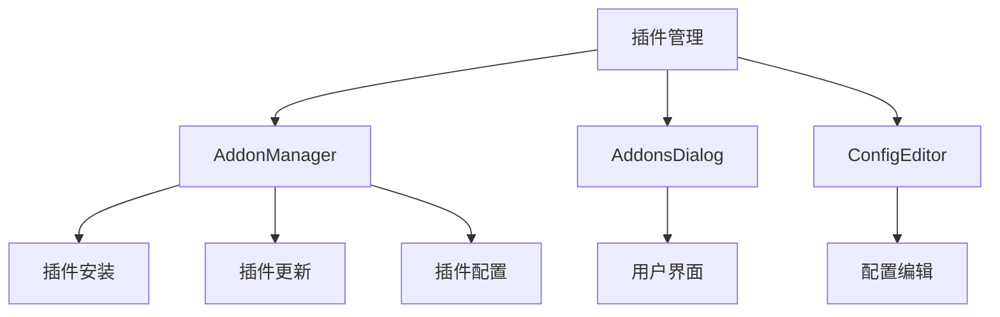
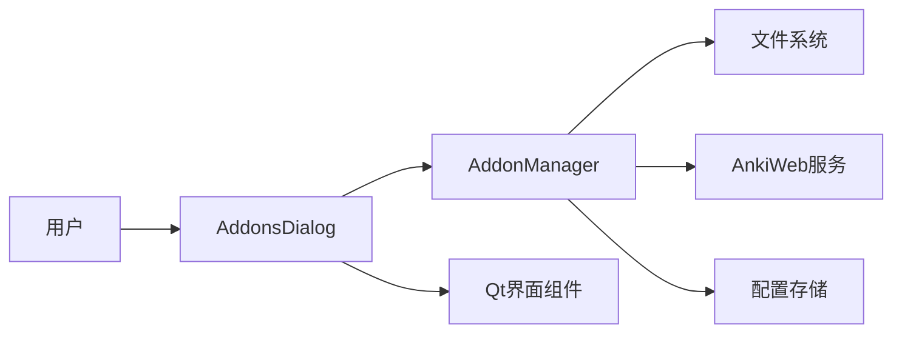
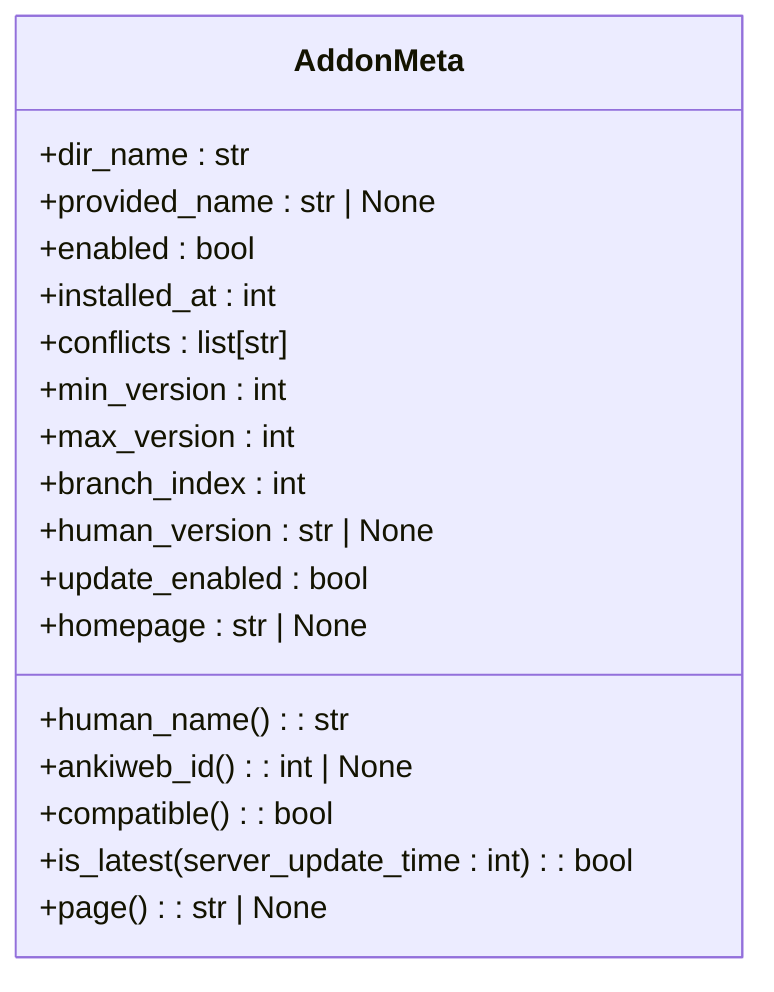
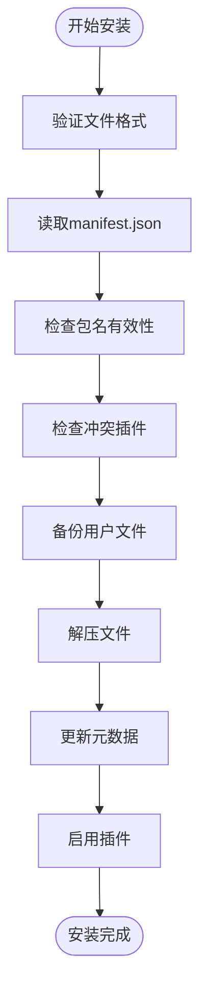
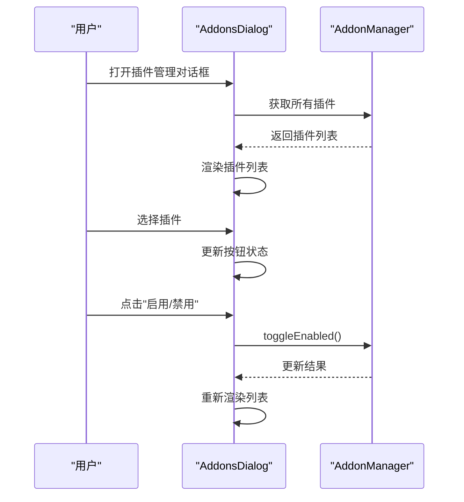
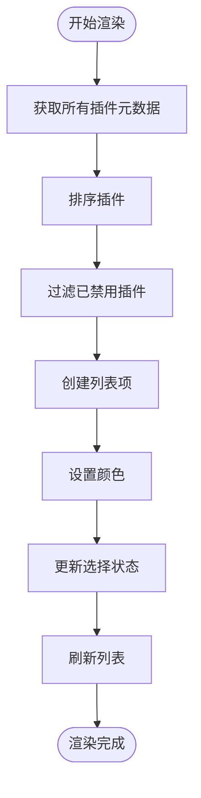
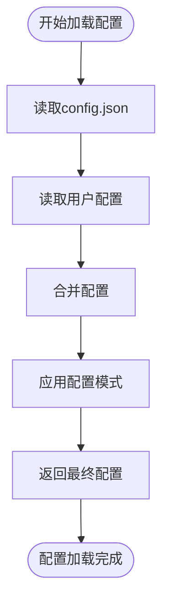
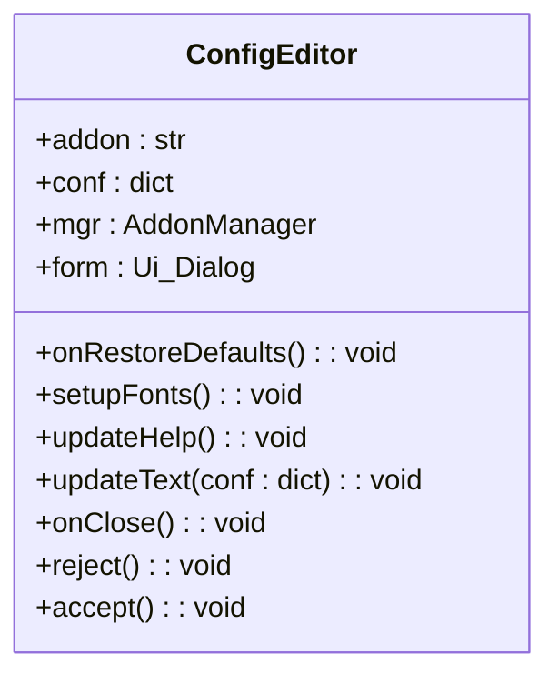
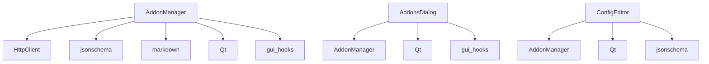

# 插件管理对话框

<cite>
**本文档中引用的文件**  
- [addons.py](file://qt/aqt/addons.py)
- [hooks.py](file://pylib/anki/hooks.py)
- [gui_hooks.py](file://qt/aqt/gui_hooks.py)
- [addonconf.py](file://qt/aqt/forms/addonconf.py)
- [addons.py](file://qt/aqt/forms/addons.py)
</cite>

## 目录
1. [简介](#简介)
2. [项目结构](#项目结构)
3. [核心组件](#核心组件)
4. [架构概述](#架构概述)
5. [详细组件分析](#详细组件分析)
6. [依赖分析](#依赖分析)
7. [性能考虑](#性能考虑)
8. [故障排除指南](#故障排除指南)
9. [结论](#结论)

## 简介
本文档全面解析Anki插件管理对话框的实现机制。详细说明插件列表的渲染逻辑、用户交互设计以及插件状态管理。深入探讨插件安装、更新和卸载功能的实现流程，包括与AnkiWeb服务的通信机制。描述插件配置界面的动态加载方式和安全性考虑，并展示如何通过hooks.py实现插件与核心功能的集成。

## 项目结构
Anki的插件管理系统主要位于qt/aqt目录下，包含插件管理器、对话框界面和相关工具类。系统采用模块化设计，将插件管理功能与用户界面分离，便于维护和扩展。

**Diagram sources**
- [addons.py](file://qt/aqt/addons.py#L0-L1790)

**Section sources**
- [addons.py](file://qt/aqt/addons.py#L0-L1790)

## 核心组件
插件管理系统的两个核心组件是AddonManager和AddonsDialog。AddonManager负责插件的底层管理操作，包括安装、更新、删除和配置管理。AddonsDialog则提供用户界面，让用户能够直观地管理插件。

**Section sources**
- [addons.py](file://qt/aqt/addons.py#L0-L1790)

## 架构概述
插件管理系统采用MVC（Model-View-Controller）架构模式。AddonManager作为模型和控制器，处理所有插件相关的业务逻辑。AddonsDialog作为视图，负责展示插件列表和处理用户交互。这种分离设计使得系统具有良好的可维护性和可扩展性。

**Diagram sources**
- [addons.py](file://qt/aqt/addons.py#L0-L1790)

## 详细组件分析

### AddonManager分析
AddonManager是插件管理系统的核心类，负责所有插件的管理操作。它提供了插件安装、更新、删除和配置管理的API。

#### 插件元数据管理

**Diagram sources**
- [addons.py](file://qt/aqt/addons.py#L131-L175)

#### 插件安装流程

**Diagram sources**
- [addons.py](file://qt/aqt/addons.py#L459-L491)

**Section sources**
- [addons.py](file://qt/aqt/addons.py#L459-L491)

### AddonsDialog分析
AddonsDialog是插件管理的用户界面，提供直观的插件管理功能。

#### 用户交互流程

**Diagram sources**
- [addons.py](file://qt/aqt/addons.py#L793-L834)

#### 插件列表渲染机制

**Diagram sources**
- [addons.py](file://qt/aqt/addons.py#L872-L912)

### 配置管理分析
插件配置管理提供了灵活的配置机制，支持默认配置、用户配置和配置验证。

#### 配置加载流程

**Diagram sources**
- [addons.py](file://qt/aqt/addons.py#L645-L679)

#### 配置编辑器

**Diagram sources**
- [addons.py](file://qt/aqt/addons.py#L1716-L1760)

**Section sources**
- [addons.py](file://qt/aqt/addons.py#L1716-L1760)

## 依赖分析
插件管理系统与其他组件有紧密的依赖关系，确保了系统的完整性和功能性。

**Diagram sources**
- [addons.py](file://qt/aqt/addons.py#L0-L1790)

**Section sources**
- [addons.py](file://qt/aqt/addons.py#L0-L1790)

## 性能考虑
插件管理系统在设计时考虑了性能优化，特别是在处理大量插件和网络请求时。

1. **异步操作**: 所有网络请求和耗时操作都在后台线程执行，避免阻塞UI线程。
2. **批量处理**: 插件更新检查采用批量请求，减少网络开销。
3. **缓存机制**: 插件元数据缓存在内存中，减少文件系统访问。
4. **延迟加载**: 配置帮助文档采用按需加载，减少初始加载时间。

## 故障排除指南
以下是一些常见插件问题的解决方案：

1. **插件无法安装**: 检查插件包是否为有效的.zip文件，确保manifest.json格式正确。
2. **插件无法启用**: 检查插件是否与当前Anki版本兼容，查看是否有冲突插件。
3. **配置无法保存**: 确保配置JSON格式正确，符合config.schema.json定义的模式。
4. **更新失败**: 检查网络连接，确认AnkiWeb服务是否可用。

**Section sources**
- [addons.py](file://qt/aqt/addons.py#L533-L570)
- [addons.py](file://qt/aqt/addons.py#L1232-L1271)

## 结论
Anki的插件管理系统设计精良，提供了完整的插件管理功能。通过清晰的架构分离和丰富的API，系统既满足了用户的需求，又为开发者提供了良好的扩展性。未来可以考虑增加插件依赖管理、版本兼容性检查等高级功能，进一步提升用户体验。