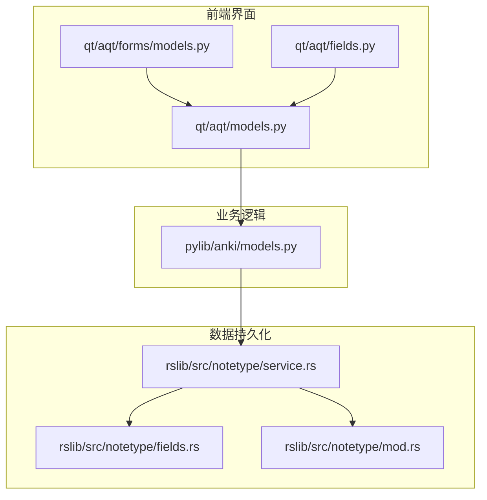
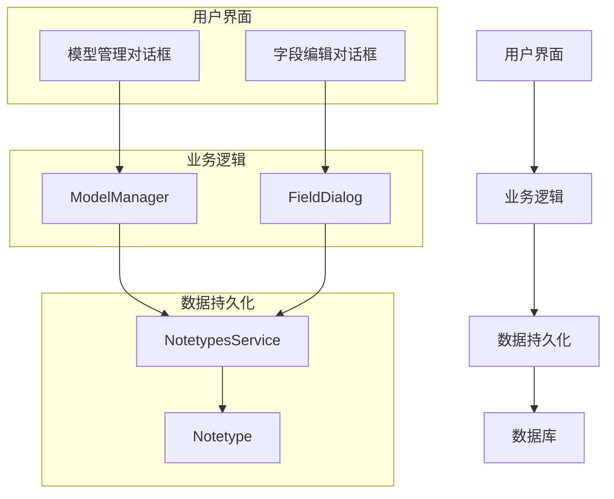
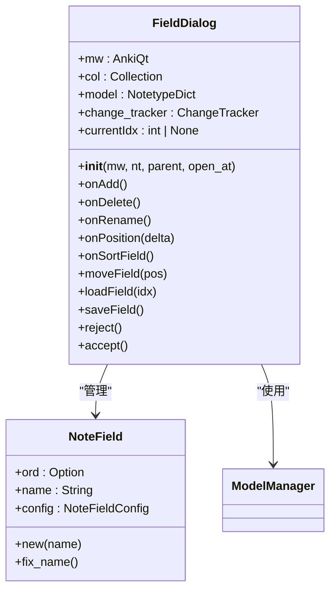
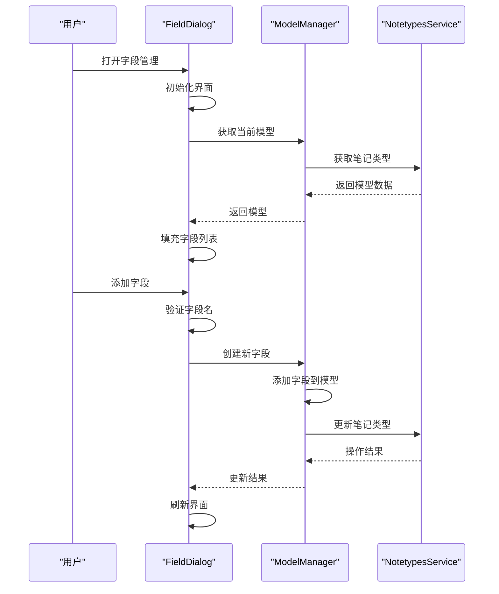
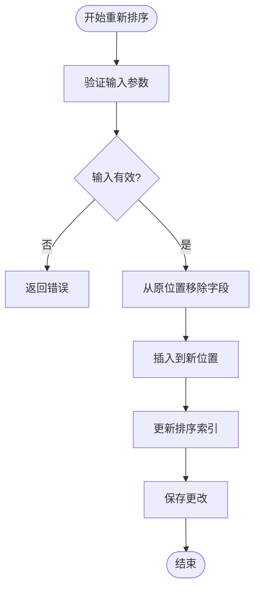
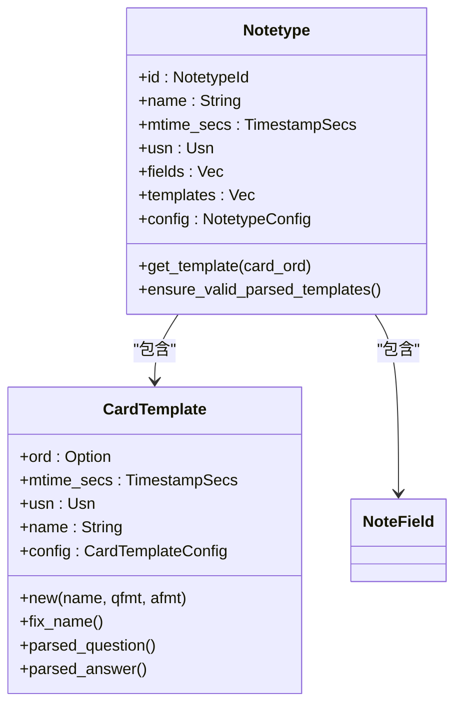
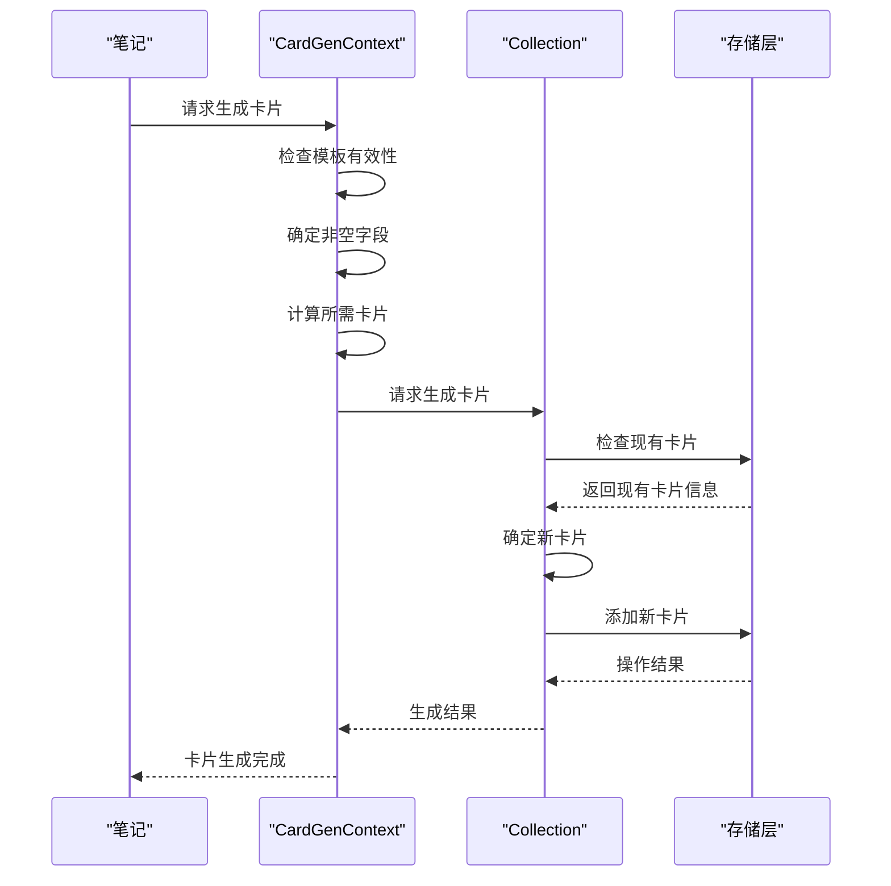
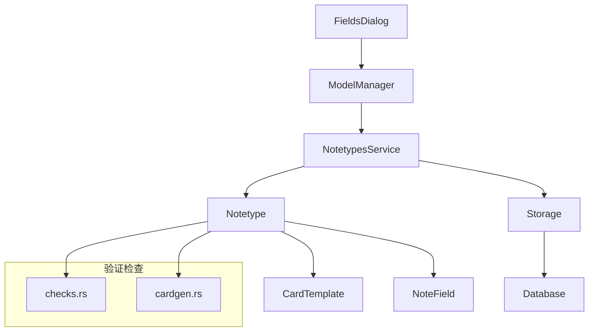

# 模型与字段管理对话框

<cite>
**本文档中引用的文件**  
- [models.py](file://pylib/anki/models.py)
- [fields.py](file://qt/aqt/fields.py)
- [service.rs](file://rslib/src/notetype/service.rs)
- [fields.rs](file://rslib/src/notetype/fields.rs)
- [mod.rs](file://rslib/src/notetype/mod.rs)
- [templates.rs](file://rslib/src/notetype/templates.rs)
- [cardgen.rs](file://rslib/src/notetype/cardgen.rs)
- [checks.rs](file://rslib/src/notetype/checks.rs)
</cite>

## 目录
1. [简介](#简介)
2. [项目结构](#项目结构)
3. [核心组件](#核心组件)
4. [架构概述](#架构概述)
5. [详细组件分析](#详细组件分析)
6. [依赖分析](#依赖分析)
7. [性能考虑](#性能考虑)
8. [故障排除指南](#故障排除指南)
9. [结论](#结论)

## 简介
本文档全面解析Anki中笔记类型与字段管理的实现机制。重点分析笔记类型编辑界面的实现方式，详细说明字段属性配置、重新排序、添加/删除等操作流程，以及模型模板管理与卡片生成逻辑。文档还涵盖数据持久化机制、最佳实践和常见陷阱规避指南。

## 项目结构
Anki的模型与字段管理功能分布在多个模块中，主要涉及Python前端界面和Rust后端服务的交互。核心功能分布在pylib、qt和rslib三个主要目录中。

**图示来源**
- [models.py](file://pylib/anki/models.py)
- [fields.py](file://qt/aqt/fields.py)
- [service.rs](file://rslib/src/notetype/service.rs)

**本节来源**
- [models.py](file://pylib/anki/models.py)
- [fields.py](file://qt/aqt/fields.py)
- [service.rs](file://rslib/src/notetype/service.rs)

## 核心组件
模型与字段管理的核心组件包括字段属性配置、排序管理、模板关联等。系统通过Python前端收集用户输入，经由操作服务层调用Rust后端实现数据持久化。

**本节来源**
- [models.py](file://pylib/anki/models.py#L1-L100)
- [fields.py](file://qt/aqt/fields.py#L1-L50)

## 架构概述
系统采用分层架构，前端界面负责用户交互，业务逻辑层处理数据验证和转换，持久化层负责数据存储和检索。各层之间通过明确定义的接口进行通信。

**图示来源**
- [models.py](file://pylib/anki/models.py)
- [fields.py](file://qt/aqt/fields.py)
- [service.rs](file://rslib/src/notetype/service.rs)

## 详细组件分析

### 字段管理分析
字段管理功能允许用户配置字段属性、重新排序、添加和删除字段。系统通过字段对话框提供完整的管理界面。

#### 字段属性配置

**图示来源**
- [fields.py](file://qt/aqt/fields.py#L28-L309)
- [fields.rs](file://rslib/src/notetype/fields.rs#L1-L85)

#### 字段操作流程

**图示来源**
- [fields.py](file://qt/aqt/fields.py#L172-L184)
- [models.py](file://pylib/anki/models.py#L200-L220)
- [service.rs](file://rslib/src/notetype/service.rs#L50-L70)

#### 字段重新排序逻辑

**图示来源**
- [fields.py](file://qt/aqt/fields.py#L228-L235)
- [models.py](file://pylib/anki/models.py#L180-L190)
- [mod.rs](file://rslib/src/notetype/mod.rs#L500-L520)

**本节来源**
- [fields.py](file://qt/aqt/fields.py#L28-L309)
- [models.py](file://pylib/anki/models.py#L150-L250)
- [fields.rs](file://rslib/src/notetype/fields.rs#L1-L85)

### 模板管理分析
模板管理功能负责卡片模板的创建、编辑和关联，确保卡片能够正确生成。

#### 模板数据结构

**图示来源**
- [templates.rs](file://rslib/src/notetype/templates.rs#L1-L121)
- [mod.rs](file://rslib/src/notetype/mod.rs#L100-L150)

#### 卡片生成逻辑

**图示来源**
- [cardgen.rs](file://rslib/src/notetype/cardgen.rs#L1-L100)
- [mod.rs](file://rslib/src/notetype/mod.rs#L300-L350)

**本节来源**
- [templates.rs](file://rslib/src/notetype/templates.rs#L1-L121)
- [cardgen.rs](file://rslib/src/notetype/cardgen.rs#L1-L371)
- [mod.rs](file://rslib/src/notetype/mod.rs#L100-L200)

## 依赖分析
系统各组件之间存在明确的依赖关系，从前端界面到后端服务形成完整的调用链。

**图示来源**
- [fields.py](file://qt/aqt/fields.py)
- [models.py](file://pylib/anki/models.py)
- [service.rs](file://rslib/src/notetype/service.rs)
- [mod.rs](file://rslib/src/notetype/mod.rs)

**本节来源**
- [models.py](file://pylib/anki/models.py)
- [service.rs](file://rslib/src/notetype/service.rs)
- [mod.rs](file://rslib/src/notetype/mod.rs)

## 性能考虑
在进行模型和字段管理操作时，需要考虑以下性能因素：

1. **缓存机制**：系统使用缓存来提高频繁访问的笔记类型数据的访问速度
2. **批量操作**：对于大量笔记的模型变更，应使用批量处理以提高效率
3. **验证开销**：模板和字段的验证操作可能消耗较多资源，应合理使用
4. **数据库事务**：复杂的模型变更操作应使用事务确保数据一致性

**本节来源**
- [models.py](file://pylib/anki/models.py#L50-L80)
- [mod.rs](file://rslib/src/notetype/mod.rs#L200-L250)

## 故障排除指南
在使用模型与字段管理功能时，可能会遇到以下常见问题：

1. **字段名冲突**：确保字段名唯一且符合命名规范
2. **模板解析失败**：检查模板语法是否正确，引用的字段是否存在
3. **数据丢失风险**：删除字段前确认没有重要数据
4. **性能问题**：大量笔记的模型变更可能导致操作延迟

**本节来源**
- [fields.py](file://qt/aqt/fields.py#L132-L151)
- [checks.rs](file://rslib/src/notetype/checks.rs#L1-L50)
- [models.py](file://pylib/anki/models.py#L300-L350)

## 结论
Anki的模型与字段管理功能通过清晰的分层架构和模块化设计，提供了强大而灵活的笔记类型管理能力。系统从前端界面到后端服务的完整调用链确保了数据的一致性和操作的可靠性。通过理解各组件的交互机制和最佳实践，用户可以更有效地管理和优化笔记类型结构。