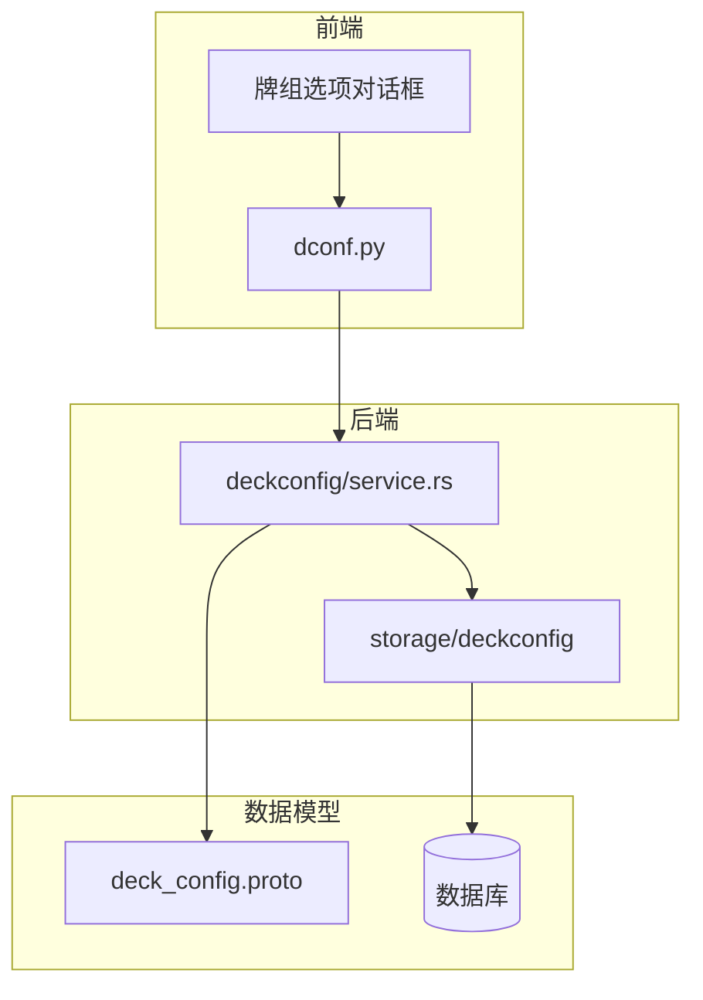
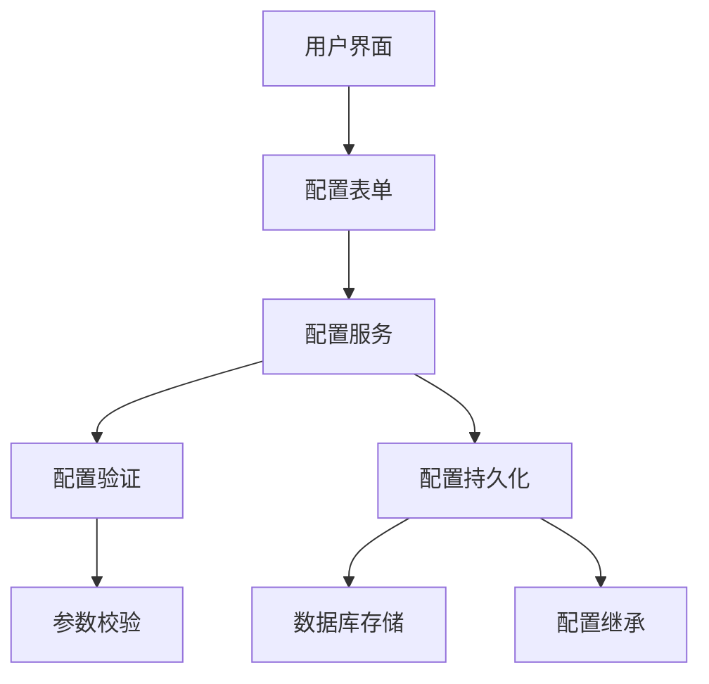
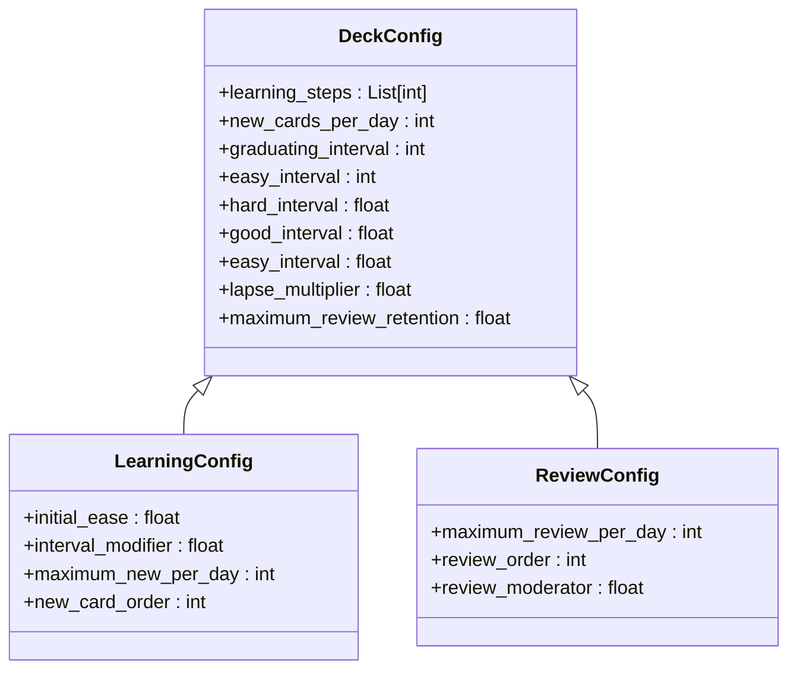
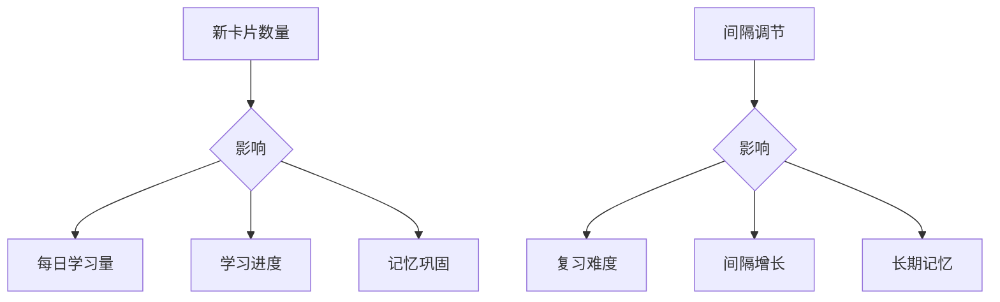
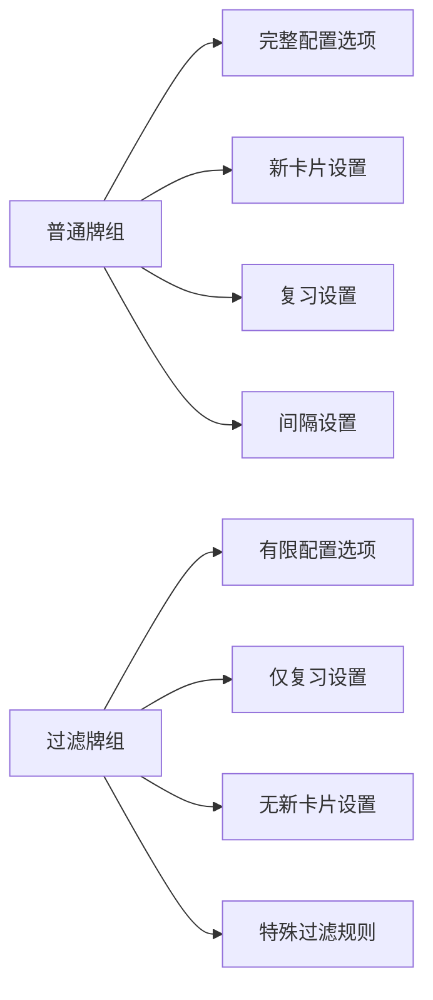
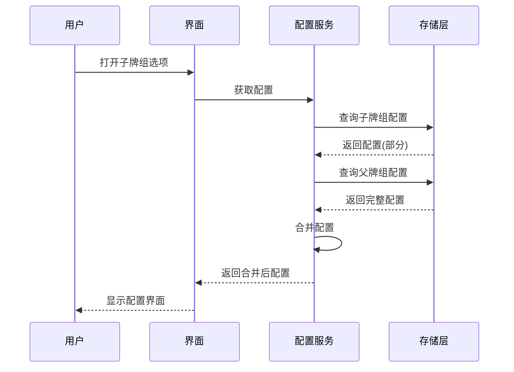
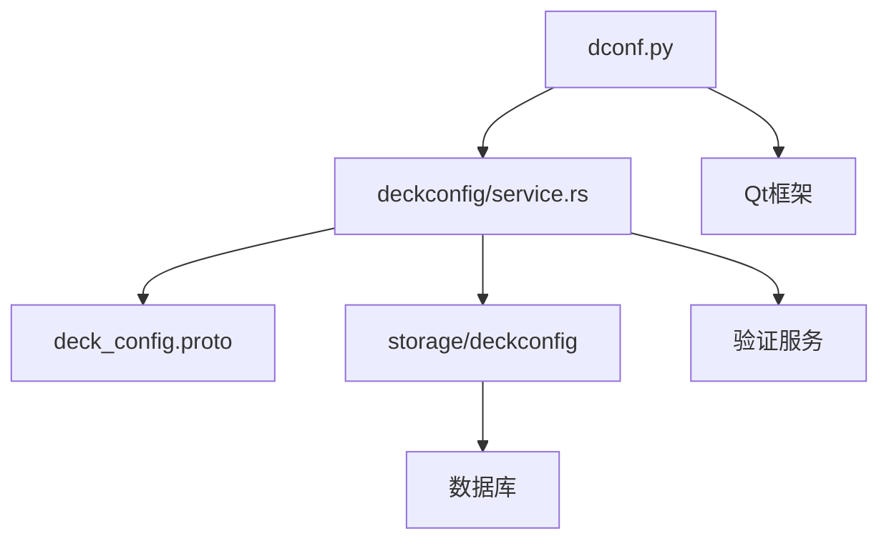

# 牌组选项对话框

<cite>
**本文档中引用的文件**  
- [dconf.py](file://qt/aqt/forms/dconf.py)
- [deckconfig/service.rs](file://rslib/src/deckconfig/service.rs)
- [decks.py](file://pylib/anki/decks.py)
- [deck_config.proto](file://proto/anki/deck_config.proto)
</cite>

## 目录
1. [简介](#简介)
2. [项目结构](#项目结构)
3. [核心组件](#核心组件)
4. [架构概述](#架构概述)
5. [详细组件分析](#详细组件分析)
6. [依赖分析](#依赖分析)
7. [性能考虑](#性能考虑)
8. [故障排除指南](#故障排除指南)
9. [结论](#结论)

## 简介
本文档详细分析Anki中牌组选项对话框的设计与实现，重点研究牌组配置参数的组织结构、用户界面设计、配置继承机制以及持久化处理。文档将解释学习参数的含义和影响，说明不同类型牌组的配置差异，并提供优化学习参数设置的指导原则。

## 项目结构
Anki的牌组配置功能分布在多个模块中，主要包括前端界面、后端服务和数据模型。前端界面由Qt框架实现，后端逻辑使用Rust编写，数据模型通过Protocol Buffers定义。

**图示来源**
- [dconf.py](file://qt/aqt/forms/dconf.py)
- [deckconfig/service.rs](file://rslib/src/deckconfig/service.rs)
- [deck_config.proto](file://proto/anki/deck_config.proto)

**章节来源**
- [dconf.py](file://qt/aqt/forms/dconf.py)
- [deckconfig/service.rs](file://rslib/src/deckconfig/service.rs)

## 核心组件
牌组选项对话框的核心组件包括配置参数的组织结构、学习算法参数、用户界面元素和配置继承机制。这些组件共同实现了灵活而强大的牌组管理功能。

**章节来源**
- [dconf.py](file://qt/aqt/forms/dconf.py#L1)
- [deckconfig/service.rs](file://rslib/src/deckconfig/service.rs)

## 架构概述
Anki的牌组配置系统采用分层架构，前端负责用户交互，后端服务处理业务逻辑，数据层负责持久化存储。这种架构实现了关注点分离，提高了系统的可维护性和可扩展性。

**图示来源**
- [dconf.py](file://qt/aqt/forms/dconf.py)
- [deckconfig/service.rs](file://rslib/src/deckconfig/service.rs)

## 详细组件分析

### 配置参数组织结构分析
牌组配置参数按照功能分为多个类别，包括学习参数、复习参数、间隔调节和高级选项。这种组织结构使用户能够方便地找到和调整相关设置。

**图示来源**
- [deck_config.proto](file://proto/anki/deck_config.proto)
- [deckconfig/service.rs](file://rslib/src/deckconfig/service.rs)

### 学习参数影响分析
学习参数直接影响Anki的间隔重复算法，决定了新卡片的学习进度和复习间隔。正确设置这些参数对于优化学习效果至关重要。

**图示来源**
- [deckconfig/service.rs](file://rslib/src/deckconfig/service.rs)
- [decks.py](file://pylib/anki/decks.py)

### 牌组类型配置差异
普通牌组和过滤牌组在配置选项上存在显著差异，反映了它们不同的使用场景和功能需求。

**图示来源**
- [dconf.py](file://qt/aqt/forms/dconf.py)
- [decks.py](file://pylib/anki/decks.py)

### 配置继承机制
牌组配置支持继承机制，子牌组可以继承父牌组的配置，同时允许进行个性化调整。这种机制提高了配置管理的效率。

**图示来源**
- [deckconfig/service.rs](file://rslib/src/deckconfig/service.rs)
- [decks.py](file://pylib/anki/decks.py)

**章节来源**
- [deckconfig/service.rs](file://rslib/src/deckconfig/service.rs#L1-L100)
- [decks.py](file://pylib/anki/decks.py#L50-L150)

## 依赖分析
牌组配置系统依赖于多个核心组件，包括配置服务、数据存储和用户界面框架。这些依赖关系确保了系统的完整性和一致性。

**图示来源**
- [dconf.py](file://qt/aqt/forms/dconf.py)
- [deckconfig/service.rs](file://rslib/src/deckconfig/service.rs)
- [deck_config.proto](file://proto/anki/deck_config.proto)

**章节来源**
- [dconf.py](file://qt/aqt/forms/dconf.py)
- [deckconfig/service.rs](file://rslib/src/deckconfig/service.rs)

## 性能考虑
牌组配置系统的性能主要体现在配置加载速度、验证效率和继承计算的复杂度上。合理的实现可以确保即使在大型牌组集合中也能快速响应。

## 故障排除指南
当牌组配置出现问题时，可以从以下几个方面进行排查：配置继承是否正确应用、参数验证是否通过、持久化是否成功。

**章节来源**
- [deckconfig/service.rs](file://rslib/src/deckconfig/service.rs#L200-L300)
- [decks.py](file://pylib/anki/decks.py#L200-L250)

## 结论
Anki的牌组选项对话框设计精良，通过合理的架构和清晰的参数组织，为用户提供了强大而灵活的配置能力。理解这些设计原理有助于更好地利用Anki进行高效学习。