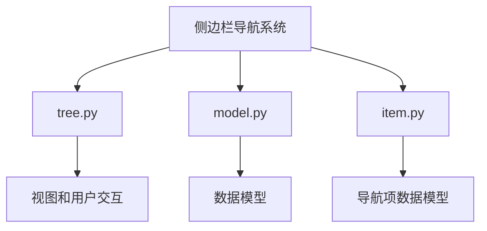
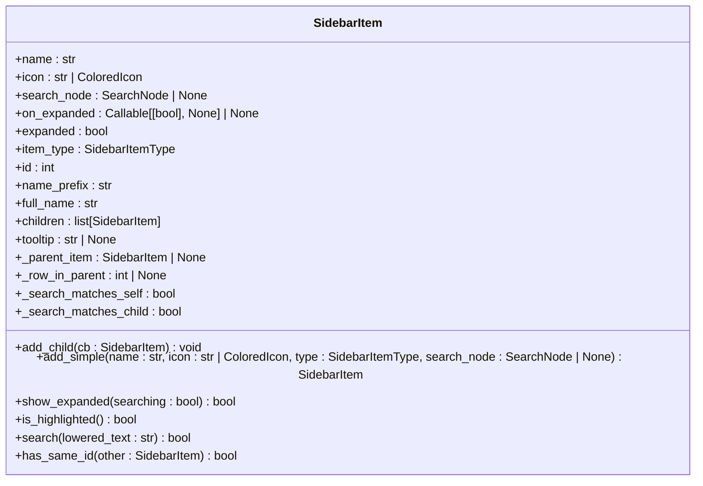
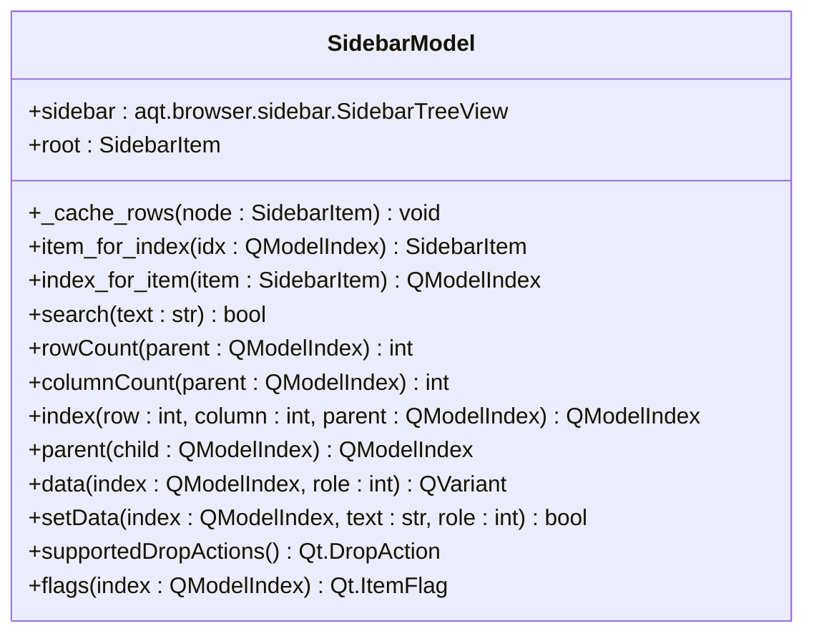
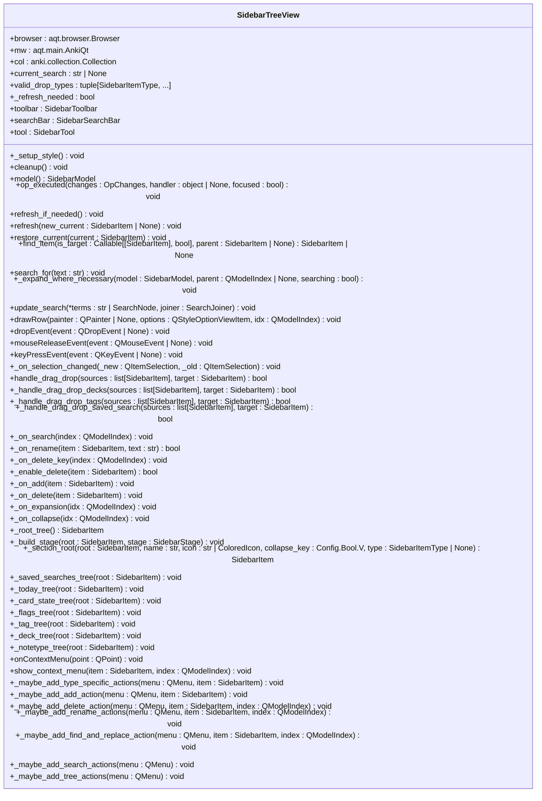

# 侧边栏导航系统

<cite>
**本文档中引用的文件**  
- [tree.py](file://qt/aqt/browser/sidebar/tree.py)
- [model.py](file://qt/aqt/browser/sidebar/model.py)
- [item.py](file://qt/aqt/browser/sidebar/item.py)
</cite>

## 目录
1. [简介](#简介)
2. [项目结构](#项目结构)
3. [核心组件](#核心组件)
4. [架构概述](#架构概述)
5. [详细组件分析](#详细组件分析)
6. [依赖分析](#依赖分析)
7. [性能考虑](#性能考虑)
8. [故障排除指南](#故障排除指南)
9. [结论](#结论)

## 简介
Anki浏览器侧边栏导航系统为用户提供了一个直观的界面，用于组织和访问牌组、标签、搜索项和其他内容。该系统基于Qt的树形视图组件构建，实现了复杂的层次结构展示、动态数据更新和用户交互功能。侧边栏支持多种导航项类型，包括牌组、标签、今日统计、卡片状态和笔记类型，并提供了搜索、过滤和上下文菜单等高级功能。

**Section sources**
- [tree.py](file://qt/aqt/browser/sidebar/tree.py#L74-L1286)
- [model.py](file://qt/aqt/browser/sidebar/model.py#L11-L123)
- [item.py](file://qt/aqt/browser/sidebar/item.py#L61-L165)

## 项目结构
侧边栏导航系统的实现主要位于`qt/aqt/browser/sidebar/`目录下，包含三个核心文件：`tree.py`、`model.py`和`item.py`。这些文件共同构成了一个完整的树形视图系统，其中`item.py`定义了导航项的数据模型，`model.py`实现了树形结构的数据模型，而`tree.py`则负责视图的呈现和用户交互。

**Diagram sources**
- [tree.py](file://qt/aqt/browser/sidebar/tree.py#L74-L1286)
- [model.py](file://qt/aqt/browser/sidebar/model.py#L11-L123)
- [item.py](file://qt/aqt/browser/sidebar/item.py#L61-L165)

**Section sources**
- [tree.py](file://qt/aqt/browser/sidebar/tree.py#L74-L1286)
- [model.py](file://qt/aqt/browser/sidebar/model.py#L11-L123)
- [item.py](file://qt/aqt/browser/sidebar/item.py#L61-L165)

## 核心组件
侧边栏导航系统的核心组件包括`SidebarTreeView`、`SidebarModel`和`SidebarItem`。`SidebarTreeView`是继承自`QTreeView`的视图组件，负责处理用户交互和视图呈现。`SidebarModel`是继承自`QAbstractItemModel`的数据模型，管理树形结构的数据。`SidebarItem`是导航项的数据模型，包含名称、图标、搜索节点等属性。

**Section sources**
- [tree.py](file://qt/aqt/browser/sidebar/tree.py#L74-L1286)
- [model.py](file://qt/aqt/browser/sidebar/model.py#L11-L123)
- [item.py](file://qt/aqt/browser/sidebar/item.py#L61-L165)

## 架构概述
侧边栏导航系统的架构基于MVC（Model-View-Controller）模式，其中`SidebarItem`作为数据模型的基础单元，`SidebarModel`作为整体数据模型，`SidebarTreeView`作为视图组件。系统通过`gui_hooks`机制响应数据变更通知，实现了数据的动态更新。

```mermaid
classDiagram
class SidebarItem {
+name : str
+icon : str | ColoredIcon
+search_node : SearchNode | None
+on_expanded : Callable[[bool], None] | None
+expanded : bool
+item_type : SidebarItemType
+id : int
+name_prefix : str
+full_name : str
+children : list[SidebarItem]
+tooltip : str | None
+_parent_item : SidebarItem | None
+_row_in_parent : int | None
+_search_matches_self : bool
+_search_matches_child : bool
+add_child(cb : SidebarItem) void
+add_simple(name : str, icon : str | ColoredIcon, type : SidebarItemType, search_node : SearchNode | None) SidebarItem
+show_expanded(searching : bool) bool
+is_highlighted() bool
+search(lowered_text : str) bool
+has_same_id(other : SidebarItem) bool
}
class SidebarModel {
+sidebar : aqt.browser.sidebar.SidebarTreeView
+root : SidebarItem
+_cache_rows(node : SidebarItem) void
+item_for_index(idx : QModelIndex) SidebarItem
+index_for_item(item : SidebarItem) QModelIndex
+search(text : str) bool
+rowCount(parent : QModelIndex) int
+columnCount(parent : QModelIndex) int
+index(row : int, column : int, parent : QModelIndex) QModelIndex
+parent(child : QModelIndex) QModelIndex
+data(index : QModelIndex, role : int) QVariant
+setData(index : QModelIndex, text : str, role : int) bool
+supportedDropActions() Qt.DropAction
+flags(index : QModelIndex) Qt.ItemFlag
}
class SidebarTreeView {
+browser : aqt.browser.Browser
+mw : aqt.main.AnkiQt
+col : anki.collection.Collection
+current_search : str | None
+valid_drop_types : tuple[SidebarItemType, ...]
+_refresh_needed : bool
+toolbar : SidebarToolbar
+searchBar : SidebarSearchBar
+_setup_style() void
+cleanup() void
+tool : SidebarTool
+model() SidebarModel
+op_executed(changes : OpChanges, handler : object | None, focused : bool) void
+refresh_if_needed() void
+refresh(new_current : SidebarItem | None) void
+restore_current(current : SidebarItem) void
+find_item(is_target : Callable[[SidebarItem], bool], parent : SidebarItem | None) SidebarItem | None
+search_for(text : str) void
+_expand_where_necessary(model : SidebarModel, parent : QModelIndex | None, searching : bool) void
+update_search(*terms : str | SearchNode, joiner : SearchJoiner) void
+drawRow(painter : QPainter | None, options : QStyleOptionViewItem, idx : QModelIndex) void
+dropEvent(event : QDropEvent | None) void
+mouseReleaseEvent(event : QMouseEvent | None) void
+keyPressEvent(event : QKeyEvent | None) void
+_on_selection_changed(_new : QItemSelection, _old : QItemSelection) void
+handle_drag_drop(sources : list[SidebarItem], target : SidebarItem) bool
+_handle_drag_drop_decks(sources : list[SidebarItem], target : SidebarItem) bool
+_handle_drag_drop_tags(sources : list[SidebarItem], target : SidebarItem) bool
+_handle_drag_drop_saved_search(sources : list[SidebarItem], target : SidebarItem) bool
+_on_search(index : QModelIndex) void
+_on_rename(item : SidebarItem, text : str) bool
+_on_delete_key(index : QModelIndex) void
+_enable_delete(item : SidebarItem) bool
+_on_add(item : SidebarItem) void
+_on_delete(item : SidebarItem) void
+_on_expansion(idx : QModelIndex) void
+_on_collapse(idx : QModelIndex) void
+_root_tree() SidebarItem
+_build_stage(root : SidebarItem, stage : SidebarStage) void
+_section_root(root : SidebarItem, name : str, icon : str | ColoredIcon, collapse_key : Config.Bool.V, type : SidebarItemType | None) SidebarItem
+_saved_searches_tree(root : SidebarItem) void
+_today_tree(root : SidebarItem) void
+_card_state_tree(root : SidebarItem) void
+_flags_tree(root : SidebarItem) void
+_tag_tree(root : SidebarItem) void
+_deck_tree(root : SidebarItem) void
+_notetype_tree(root : SidebarItem) void
+onContextMenu(point : QPoint) void
+show_context_menu(item : SidebarItem, index : QModelIndex) void
+_maybe_add_type_specific_actions(menu : QMenu, item : SidebarItem) void
+_maybe_add_add_action(menu : QMenu, item : SidebarItem) void
+_maybe_add_delete_action(menu : QMenu, item : SidebarItem, index : QModelIndex) void
+_maybe_add_rename_actions(menu : QMenu, item : SidebarItem, index : QModelIndex) void
+_maybe_add_find_and_replace_action(menu : QMenu, item : SidebarItem, index : QModelIndex) void
+_maybe_add_search_actions(menu : QMenu) void
+_maybe_add_tree_actions(menu : QMenu) void
}
SidebarTreeView --> SidebarModel : "使用"
SidebarModel --> SidebarItem : "包含"
SidebarItem --> SidebarItem : "父子关系"
```

**Diagram sources**
- [tree.py](file://qt/aqt/browser/sidebar/tree.py#L74-L1286)
- [model.py](file://qt/aqt/browser/sidebar/model.py#L11-L123)
- [item.py](file://qt/aqt/browser/sidebar/item.py#L61-L165)

## 详细组件分析

### SidebarItem 分析
`SidebarItem`类是侧边栏导航项的数据模型，包含了导航项的基本属性和方法。每个`SidebarItem`实例代表一个导航项，可以包含子项形成树形结构。

**Diagram sources**
- [item.py](file://qt/aqt/browser/sidebar/item.py#L61-L165)

**Section sources**
- [item.py](file://qt/aqt/browser/sidebar/item.py#L61-L165)

### SidebarModel 分析
`SidebarModel`类是侧边栏的数据模型，继承自`QAbstractItemModel`，负责管理树形结构的数据。它将`SidebarItem`的层次结构转换为Qt模型-视图架构所需的数据格式。

**Diagram sources**
- [model.py](file://qt/aqt/browser/sidebar/model.py#L11-L123)

**Section sources**
- [model.py](file://qt/aqt/browser/sidebar/model.py#L11-L123)

### SidebarTreeView 分析
`SidebarTreeView`类是侧边栏的视图组件，继承自`QTreeView`，负责处理用户交互和视图呈现。它集成了搜索、拖拽、上下文菜单等高级功能。

**Diagram sources**
- [tree.py](file://qt/aqt/browser/sidebar/tree.py#L74-L1286)

**Section sources**
- [tree.py](file://qt/aqt/browser/sidebar/tree.py#L74-L1286)

## 依赖分析
侧边栏导航系统依赖于Anki的核心组件，包括`anki.collection.Collection`、`anki.decks.DeckTreeNode`、`anki.tags.TagTreeNode`等。它还依赖于Qt的GUI组件和Anki的GUI钩子系统。

**Diagram sources**
- [tree.py](file://qt/aqt/browser/sidebar/tree.py#L74-L1286)
- [model.py](file://qt/aqt/browser/sidebar/model.py#L11-L123)
- [item.py](file://qt/aqt/browser/sidebar/item.py#L61-L165)

**Section sources**
- [tree.py](file://qt/aqt/browser/sidebar/tree.py#L74-L1286)
- [model.py](file://qt/aqt/browser/sidebar/model.py#L11-L123)
- [item.py](file://qt/aqt/browser/sidebar/item.py#L61-L165)

## 性能考虑
侧边栏导航系统在性能方面进行了多项优化。首先，它使用`QueryOp`在后台线程中构建树形结构，避免阻塞UI线程。其次，在刷新时使用`setUpdatesEnabled(False)`来阻止重绘，避免闪烁。此外，`SidebarModel`通过缓存子项的行索引（`_row_in_parent`）来提高性能。

**Section sources**
- [tree.py](file://qt/aqt/browser/sidebar/tree.py#L74-L1286)
- [model.py](file://qt/aqt/browser/sidebar/model.py#L11-L123)

## 故障排除指南
如果侧边栏导航系统出现问题，可以检查以下几点：1) 确保`gui_hooks`正确连接；2) 检查`SidebarItem`的`has_same_id`方法是否正确实现；3) 确认`SidebarModel`的`_cache_rows`方法正确缓存行索引；4) 验证`SidebarTreeView`的`refresh`方法正确处理异步操作。

**Section sources**
- [tree.py](file://qt/aqt/browser/sidebar/tree.py#L74-L1286)
- [model.py](file://qt/aqt/browser/sidebar/model.py#L11-L123)
- [item.py](file://qt/aqt/browser/sidebar/item.py#L61-L165)

## 结论
Anki浏览器侧边栏导航系统是一个功能丰富、结构清晰的树形视图实现。它通过`SidebarItem`、`SidebarModel`和`SidebarTreeView`三个核心组件，实现了复杂的层次结构展示和用户交互功能。系统采用MVC架构，具有良好的可维护性和扩展性。通过后台线程操作和UI优化，确保了良好的用户体验。