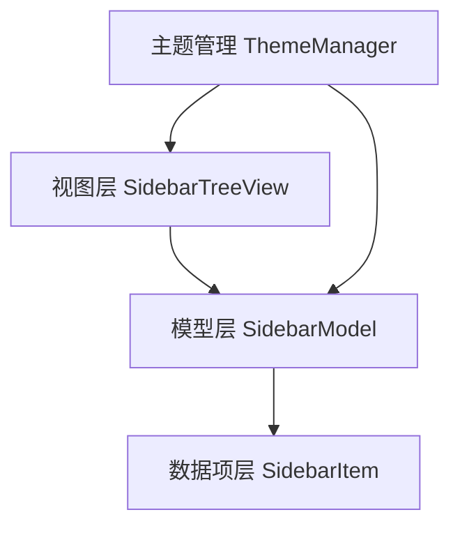
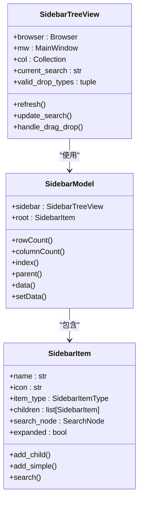
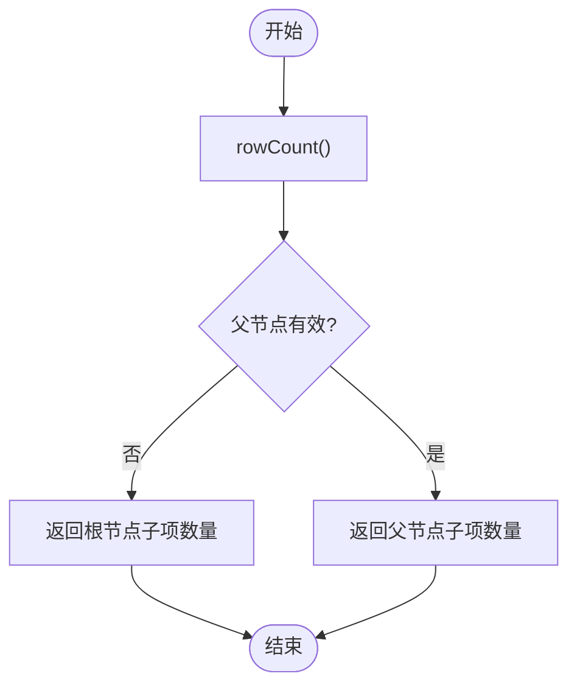
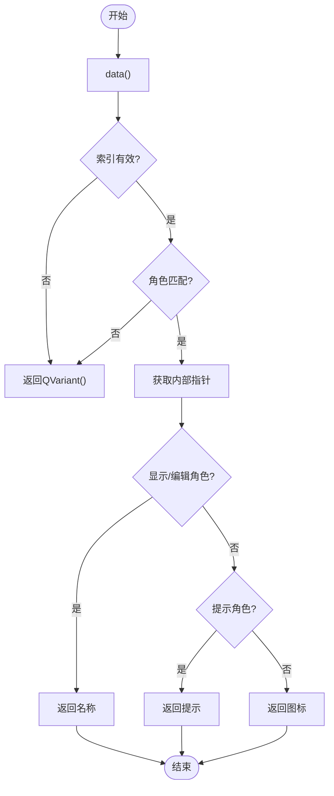
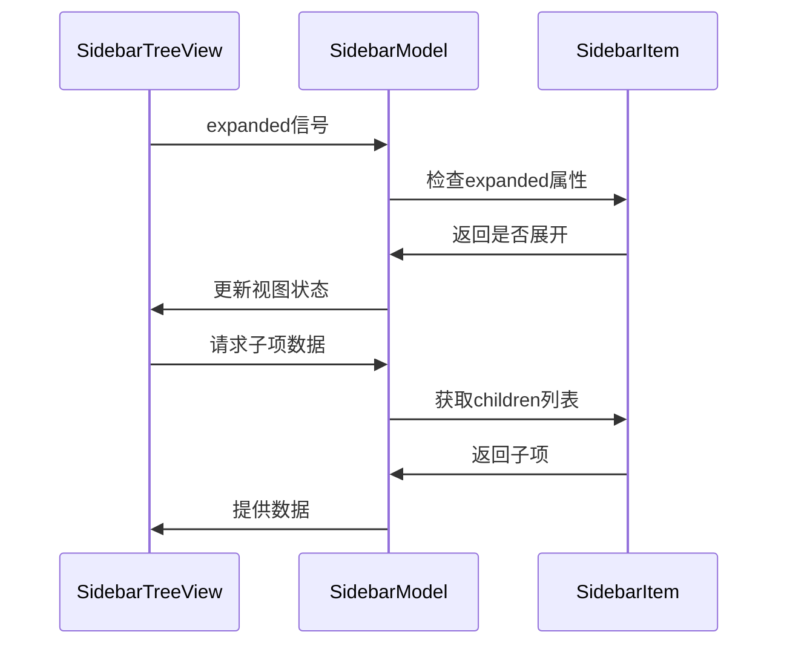
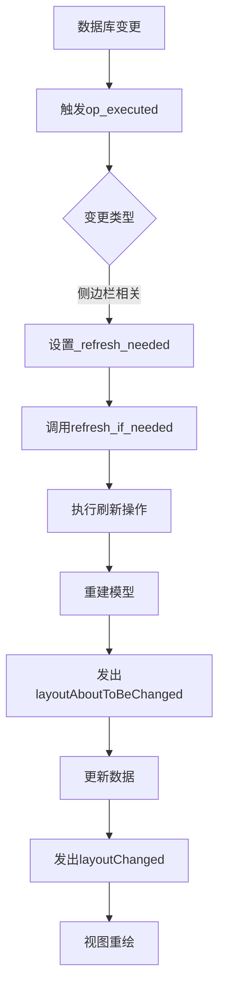
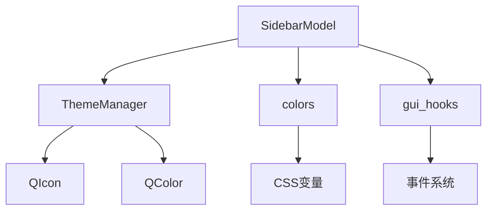

# 侧边栏数据模型

<cite>
**本文档中引用的文件**  
- [model.py](file://qt/aqt/browser/sidebar/model.py)
- [item.py](file://qt/aqt/browser/sidebar/item.py)
- [tree.py](file://qt/aqt/browser/sidebar/tree.py)
- [theme.py](file://qt/aqt/theme.py)
- [colors.py](file://qt/aqt/colors.py)
</cite>

## 目录
1. [简介](#简介)
2. [项目结构](#项目结构)
3. [核心组件](#核心组件)
4. [架构概述](#架构概述)
5. [详细组件分析](#详细组件分析)
6. [依赖分析](#依赖分析)
7. [性能考虑](#性能考虑)
8. [故障排除指南](#故障排除指南)
9. [结论](#结论)

## 简介
本文档详细解析Anki应用中侧边栏数据模型的设计与实现。该模型基于Qt的QAbstractItemModel构建，用于管理牌组、标签和保存的搜索项等层次化数据结构。文档重点分析了模型如何通过懒加载机制动态加载子项，以及如何监听数据库变更并同步视图更新。同时阐述了不同角色数据的分配策略和过滤器状态的表示方式，并提供自定义导航节点类型的扩展示例。

## 项目结构
侧边栏功能主要由三个核心模块构成：模型层（model）、视图层（tree）和数据项层（item）。这种分层设计实现了数据与界面的分离，提高了代码的可维护性和扩展性。



**图表来源**  
- [model.py](file://qt/aqt/browser/sidebar/model.py#L11-L123)
- [tree.py](file://qt/aqt/browser/sidebar/tree.py#L74-L1286)
- [item.py](file://qt/aqt/browser/sidebar/item.py#L61-L165)
- [theme.py](file://qt/aqt/theme.py#L57-L333)

**章节来源**
- [model.py](file://qt/aqt/browser/sidebar/model.py#L11-L123)
- [tree.py](file://qt/aqt/browser/sidebar/tree.py#L74-L1286)

## 核心组件
侧边栏数据模型的核心是SidebarModel类，它继承自QAbstractItemModel，负责管理层次化数据结构。模型通过SidebarItem类表示树中的各个节点，每个节点包含名称、图标、类型等属性。SidebarTreeView作为视图组件，处理用户交互并显示数据。

**章节来源**
- [model.py](file://qt/aqt/browser/sidebar/model.py#L11-L123)
- [item.py](file://qt/aqt/browser/sidebar/item.py#L61-L165)
- [tree.py](file://qt/aqt/browser/sidebar/tree.py#L74-L1286)

## 架构概述
整个侧边栏系统采用MVC（Model-View-Controller）架构模式。模型层负责数据管理，视图层负责界面展示，控制器逻辑则分散在各个组件中。这种设计使得数据变更能够自动反映到界面，同时支持复杂的用户交互操作。



**图表来源**  
- [model.py](file://qt/aqt/browser/sidebar/model.py#L11-L123)
- [item.py](file://qt/aqt/browser/sidebar/item.py#L61-L165)
- [tree.py](file://qt/aqt/browser/sidebar/tree.py#L74-L1286)

## 详细组件分析

### SidebarModel类分析
SidebarModel是侧边栏的核心数据模型，继承自QAbstractItemModel，实现了标准的树形数据接口。模型通过根节点（root）组织整个层次结构，支持动态加载和按需渲染。

#### 核心方法实现


**图表来源**  
- [model.py](file://qt/aqt/browser/sidebar/model.py#L39-L44)



**图表来源**  
- [model.py](file://qt/aqt/browser/sidebar/model.py#L79-L99)

#### 懒加载机制
模型通过递归遍历的方式实现子项的动态加载。当用户展开某个节点时，模型会检查其子项并根据需要创建新的数据项。这种懒加载机制有效减少了初始加载时间，提升了用户体验。



**图表来源**  
- [model.py](file://qt/aqt/browser/sidebar/model.py#L11-L123)
- [item.py](file://qt/aqt/browser/sidebar/item.py#L61-L165)
- [tree.py](file://qt/aqt/browser/sidebar/tree.py#L74-L1286)

#### 数据变更同步
模型通过监听数据库变更事件来维持视图同步。当数据发生变化时，会触发layoutAboutToBeChanged和layoutChanged信号，通知视图进行相应更新。



**图表来源**  
- [tree.py](file://qt/aqt/browser/sidebar/tree.py#L148-L154)
- [tree.py](file://qt/aqt/browser/sidebar/tree.py#L156-L198)

#### 角色数据分配
模型支持多种角色数据的分配，包括显示角色、装饰角色、提示角色和编辑角色。每种角色对应不同的数据内容，满足多样化的显示需求。

```mermaid
classDiagram
class Qt_ItemDataRole {
<<enumeration>>
DisplayRole
DecorationRole
ToolTipRole
EditRole
}
class SidebarModel {
+data()
+setData()
}
SidebarModel --> Qt_ItemDataRole : "使用"
note right of SidebarModel
DisplayRole : 显示名称
DecorationRole : 显示图标
ToolTipRole : 显示提示
EditRole : 支持编辑
end note
```

**图表来源**  
- [model.py](file://qt/aqt/browser/sidebar/model.py#L79-L99)

#### 过滤器状态表示
模型通过_search_matches_self和_search_matches_child两个布尔属性来表示过滤器状态。当搜索匹配当前节点或其子节点时，相应的属性会被设置为True，用于高亮显示和自动展开。

```mermaid
flowchart TD
A[开始搜索] --> B[调用search()]
B --> C[遍历所有节点]
C --> D{名称包含搜索词?}
D --> |是| E[设置_search_matches_self=True]
D --> |否| F[继续]
E --> G[递归搜索子节点]
G --> H{任何子节点匹配?}
H --> |是| I[设置_search_matches_child=True]
I --> J[返回True]
H --> |否| K[返回False]
F --> K
K --> L[返回结果]
```

**图表来源**  
- [item.py](file://qt/aqt/browser/sidebar/item.py#L132-L138)

### 自定义导航节点扩展
通过继承SidebarItem类并定义新的SidebarItemType，可以轻松扩展自定义导航节点类型。新增的节点可以包含计算字段和虚拟分组，满足特定的业务需求。

```mermaid
classDiagram
class CustomSidebarItem {
+computed_field : str
+virtual_group : list
+calculate_field()
+add_to_group()
}
class SidebarItem {
+name : str
+icon : str
+children : list
}
CustomSidebarItem --|> SidebarItem : "继承"
note right of CustomSidebarItem
计算字段 : 动态计算的属性值
虚拟分组 : 逻辑上的分组关系
end note
```

**图表来源**  
- [item.py](file://qt/aqt/browser/item.py#L61-L165)

**章节来源**
- [model.py](file://qt/aqt/browser/sidebar/model.py#L11-L123)
- [item.py](file://qt/aqt/browser/sidebar/item.py#L61-L165)

## 依赖分析
侧边栏组件依赖于多个核心模块，包括主题管理、颜色配置和GUI钩子系统。这些依赖关系确保了界面的一致性和可扩展性。



**图表来源**  
- [model.py](file://qt/aqt/browser/sidebar/model.py#L11-L123)
- [theme.py](file://qt/aqt/theme.py#L57-L333)
- [colors.py](file://qt/aqt/colors.py#L0-L4)

**章节来源**
- [model.py](file://qt/aqt/browser/sidebar/model.py#L11-L123)
- [theme.py](file://qt/aqt/theme.py#L57-L333)
- [colors.py](file://qt/aqt/colors.py#L0-L4)

## 性能考虑
模型采用了一系列优化策略来提升性能。首先，通过_cache_rows方法缓存子项的行索引，避免了重复计算。其次，使用懒加载机制减少内存占用。最后，在刷新操作时通过setUpdatesEnabled(false)临时禁用更新，防止界面闪烁。

[无来源，因为本节提供一般性性能指导]

## 故障排除指南
当遇到侧边栏显示异常时，可以检查以下几个方面：确认模型是否正确初始化，验证数据项的父子关系是否正确建立，检查信号连接是否正常，以及确保主题资源文件完整可用。

**章节来源**
- [model.py](file://qt/aqt/browser/sidebar/model.py#L11-L123)
- [tree.py](file://qt/aqt/browser/sidebar/tree.py#L74-L1286)

## 结论
SidebarModel类通过继承QAbstractItemModel实现了高效的层次化数据管理。其设计充分考虑了性能优化和用户体验，支持动态加载、实时同步和灵活扩展。通过合理的架构设计和精心的实现，为Anki应用提供了稳定可靠的侧边栏功能。

[无来源，因为本节总结而不分析特定文件]