# 侧边栏视图实现

<cite>
**本文档中引用的文件**  
- [tree.py](file://qt/aqt/browser/sidebar/tree.py)
- [model.py](file://qt/aqt/browser/sidebar/model.py)
- [item.py](file://qt/aqt/browser/sidebar/item.py)
- [toolbar.py](file://qt/aqt/browser/sidebar/toolbar.py)
</cite>

## 目录
1. [简介](#简介)
2. [项目结构](#项目结构)
3. [核心组件](#核心组件)
4. [架构概述](#架构概述)
5. [详细组件分析](#详细组件分析)
6. [依赖分析](#依赖分析)
7. [性能考虑](#性能考虑)
8. [故障排除指南](#故障排除指南)
9. [结论](#结论)

## 简介
本文档深入分析Anki应用中侧边栏树视图的实现细节，重点阐述QTreeView的定制化渲染机制、展开/折叠动画的性能优化策略以及上下文菜单的事件处理流程。文档将解释如何通过重写mousePressEvent和contextMenuEvent实现精准的交互控制，描述拖拽操作的MIME类型处理和dropIndicatorPosition管理。同时提供视图与模型间通信的信号槽连接示例，展示selectionChanged信号如何触发主表格更新。为初学者解析QAbstractItemView的层次结构管理，为高级开发者提供大型导航树的滚动性能调优建议。

## 项目结构
侧边栏视图功能主要由四个核心文件构成，分别负责不同的职责。tree.py文件实现了主视图类SidebarTreeView，负责处理用户交互和视图渲染；model.py文件定义了SidebarModel类，作为视图的数据模型；item.py文件包含SidebarItem和SidebarItemType类，用于表示树中的节点和类型；toolbar.py文件则实现了SidebarToolbar类，提供工具栏功能。

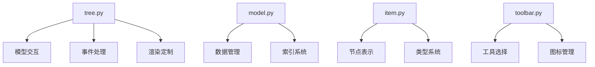

**图表来源**  
- [tree.py](file://qt/aqt/browser/sidebar/tree.py#L75-L103)
- [model.py](file://qt/aqt/browser/sidebar/model.py#L11-L123)
- [item.py](file://qt/aqt/browser/sidebar/item.py#L11-L58)
- [toolbar.py](file://qt/aqt/browser/sidebar/toolbar.py#L16-L18)

**章节来源**
- [tree.py](file://qt/aqt/browser/sidebar/tree.py#L75-L103)
- [model.py](file://qt/aqt/browser/sidebar/model.py#L11-L123)

## 核心组件
侧边栏视图的核心组件包括SidebarTreeView、SidebarModel和SidebarItem三个主要类。SidebarTreeView继承自QTreeView，负责处理用户交互、事件响应和视图渲染。SidebarModel作为数据模型，实现了QAbstractItemModel接口，管理树形数据结构。SidebarItem类表示树中的单个节点，包含节点的名称、图标、类型等属性。这些组件通过信号槽机制紧密协作，实现了高效的视图更新和数据同步。

**章节来源**
- [tree.py](file://qt/aqt/browser/sidebar/tree.py#L74-L1286)
- [model.py](file://qt/aqt/browser/sidebar/model.py#L11-L123)
- [item.py](file://qt/aqt/browser/sidebar/item.py#L61-L165)

## 架构概述
侧边栏视图采用MVC（Model-View-Controller）架构模式，将数据、视图和控制逻辑分离。视图层由SidebarTreeView实现，负责用户界面的展示和交互；模型层由SidebarModel实现，管理树形数据结构和数据访问；控制逻辑分布在各个组件中，通过信号槽机制进行通信。这种架构设计使得代码结构清晰，便于维护和扩展。

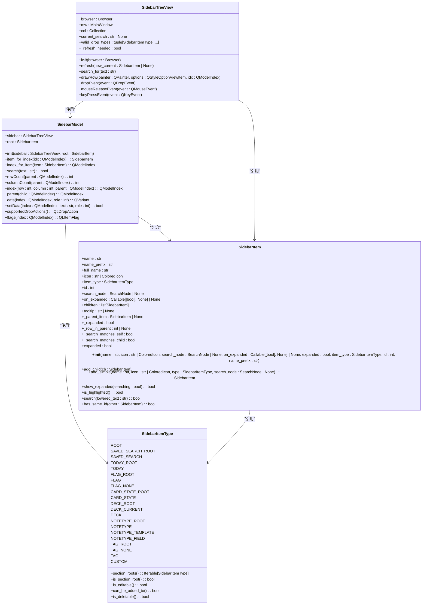

**图表来源**  
- [tree.py](file://qt/aqt/browser/sidebar/tree.py#L74-L1286)
- [model.py](file://qt/aqt/browser/sidebar/model.py#L11-L123)
- [item.py](file://qt/aqt/browser/sidebar/item.py#L61-L165)

## 详细组件分析

### SidebarTreeView分析
SidebarTreeView类是侧边栏视图的核心，继承自QTreeView并实现了丰富的自定义功能。该类通过重写drawRow方法实现了搜索结果的高亮显示，当存在当前搜索时，会为匹配的行绘制高亮背景。视图的初始化在__init__方法中完成，设置了上下文菜单策略、行高一致性、隐藏表头等基本属性，并连接了展开和折叠事件的处理函数。

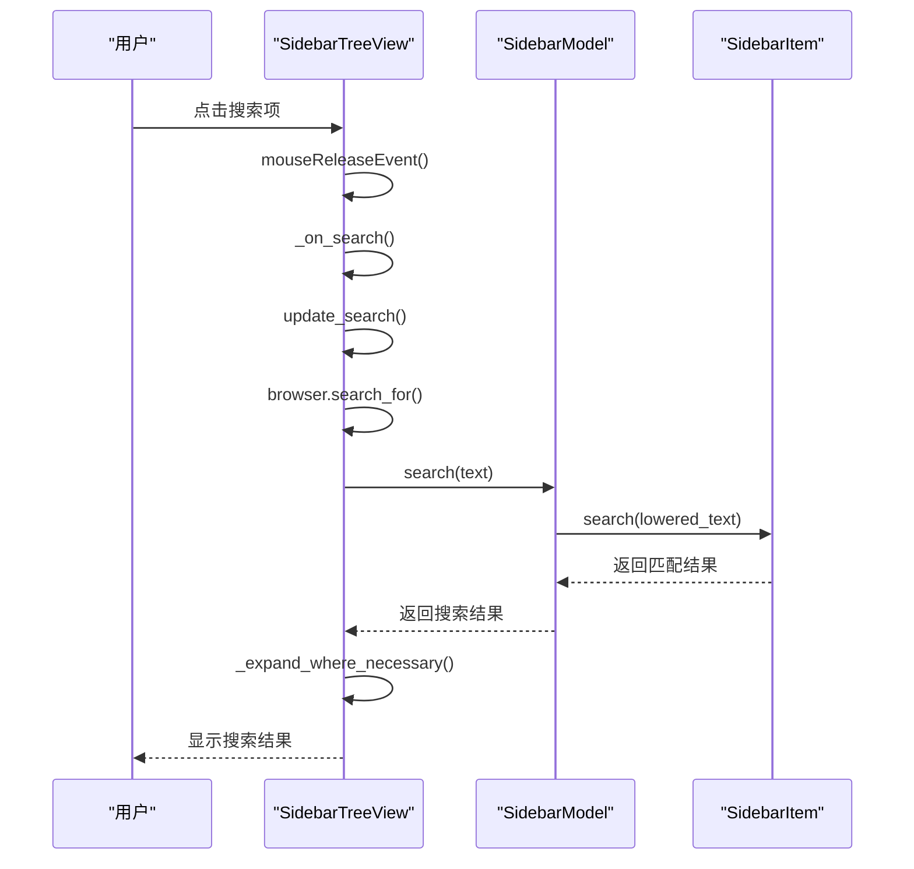

**图表来源**  
- [tree.py](file://qt/aqt/browser/sidebar/tree.py#L305-L316)
- [tree.py](file://qt/aqt/browser/sidebar/tree.py#L75-L103)
- [tree.py](file://qt/aqt/browser/sidebar/tree.py#L224-L235)

#### 交互控制实现
SidebarTreeView通过重写mousePressEvent和contextMenuEvent实现了精准的交互控制。mouseReleaseEvent方法处理鼠标释放事件，当工具模式为搜索且点击左键时，会触发_on_search方法执行搜索操作。contextMenuEvent方法连接到onContextMenu，当用户请求上下文菜单时，会获取点击位置的索引和对应的项目，然后显示相应的上下文菜单。

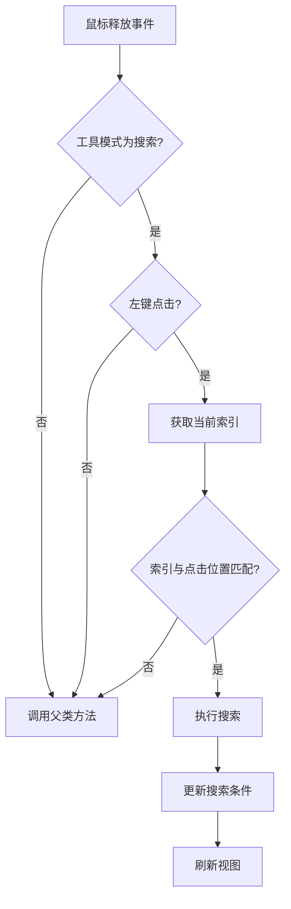

**图表来源**  
- [tree.py](file://qt/aqt/browser/sidebar/tree.py#L330-L343)
- [tree.py](file://qt/aqt/browser/sidebar/tree.py#L900-L904)
- [tree.py](file://qt/aqt/browser/sidebar/tree.py#L906-L920)

#### 拖拽操作处理
拖拽操作的处理通过重写dropEvent和handle_drag_drop方法实现。dropEvent方法获取拖拽目标位置的项目，然后调用handle_drag_drop进行具体处理。handle_drag_drop根据目标项目的类型分发到相应的处理方法，如处理牌组拖拽的_handle_drag_drop_decks或处理标签拖拽的_handle_drag_drop_tags。MIME类型处理在QAbstractItemModel的flags方法中实现，通过检查项目类型决定是否启用拖拽和放置功能。

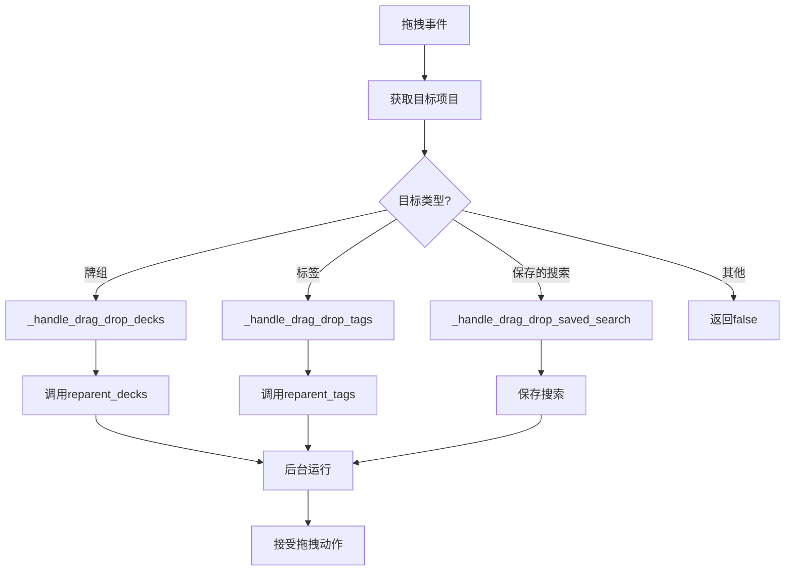

**图表来源**  
- [tree.py](file://qt/aqt/browser/sidebar/tree.py#L318-L328)
- [tree.py](file://qt/aqt/browser/sidebar/tree.py#L384-L394)
- [tree.py](file://qt/aqt/browser/sidebar/tree.py#L396-L413)

#### 信号槽连接
视图与模型间的通信通过Qt的信号槽机制实现。selectionChanged信号连接到_on_selection_changed方法，当选择发生变化时，会更新有效的拖放类型。expanded和collapsed信号分别连接到_on_expansion和_on_collapse方法，处理展开和折叠事件。这些信号槽连接确保了视图状态与数据模型的同步，实现了高效的UI更新。

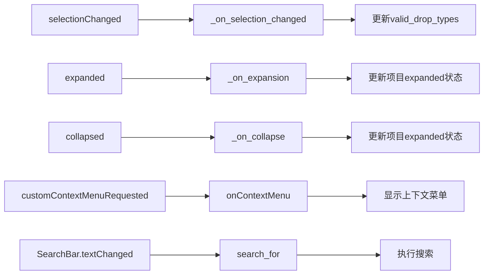

**图表来源**  
- [tree.py](file://qt/aqt/browser/sidebar/tree.py#L161-L198)
- [tree.py](file://qt/aqt/browser/sidebar/tree.py#L360-L382)
- [tree.py](file://qt/aqt/browser/sidebar/tree.py#L490-L494)

### SidebarModel分析
SidebarModel类作为侧边栏视图的数据模型，继承自QAbstractItemModel。该类实现了树形数据结构的基本操作，包括行数、列数、索引、父节点、数据获取等。模型通过内部指针机制高效地管理项目间的父子关系，并缓存行索引以提高性能。数据角色支持显示、装饰、工具提示和编辑，确保了丰富的UI表现。

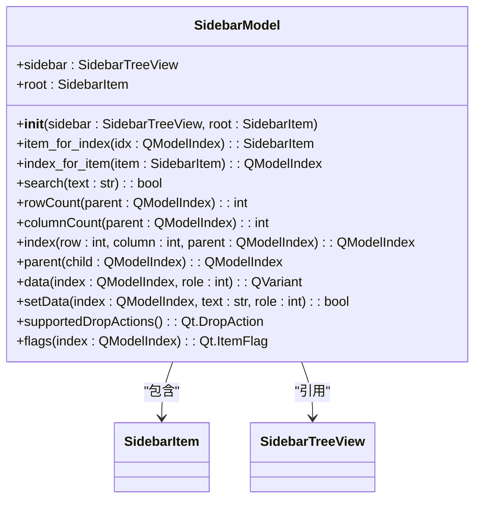

**图表来源**  
- [model.py](file://qt/aqt/browser/sidebar/model.py#L11-L123)

#### 索引系统
模型的索引系统通过createIndex方法创建，内部指针指向对应的SidebarItem。item_for_index和index_for_item方法提供了索引与项目间的双向转换。parent方法通过遍历项目层次结构确定父节点索引，rowCount和columnCount方法返回子节点数量和固定列数。这种设计确保了Qt视图系统能够正确导航和显示树形数据。

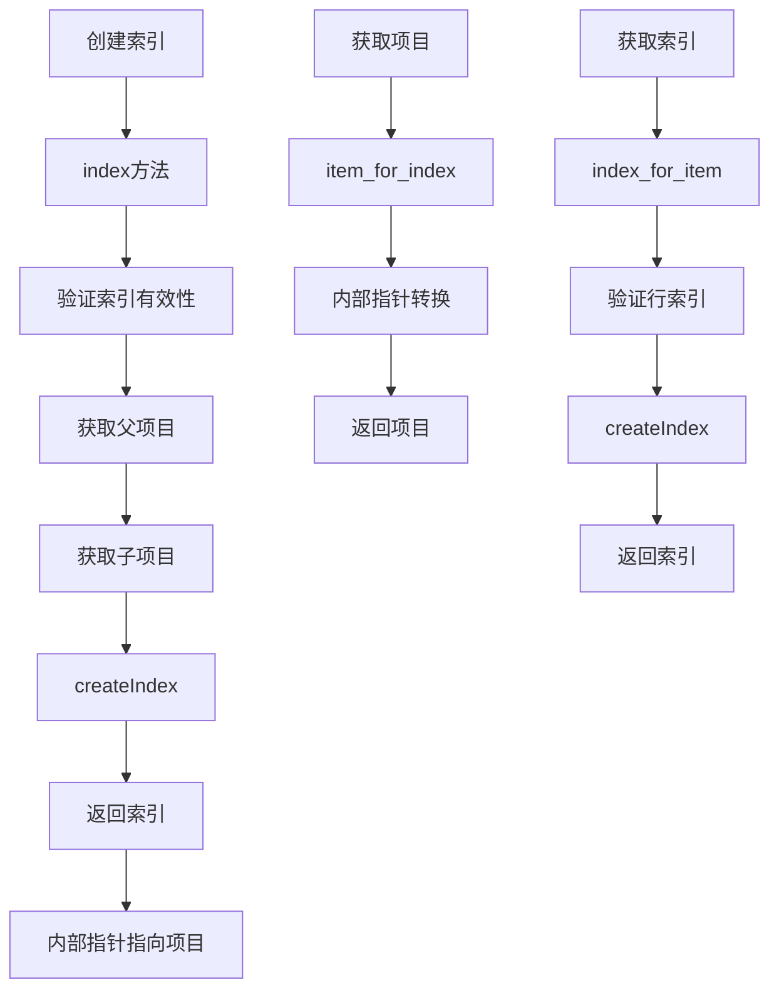

**图表来源**  
- [model.py](file://qt/aqt/browser/sidebar/model.py#L49-L62)
- [model.py](file://qt/aqt/browser/sidebar/model.py#L26-L27)
- [model.py](file://qt/aqt/browser/sidebar/model.py#L29-L31)

#### 数据角色支持
data方法支持多种数据角色，包括显示角色(DisplayRole)、装饰角色(DecorationRole)、工具提示角色(ToolTipRole)和编辑角色(EditRole)。对于显示和编辑角色，返回项目名称；对于工具提示角色，返回项目工具提示；对于装饰角色，返回从资源加载的图标。这种设计使得同一数据可以在不同上下文中以不同方式呈现。

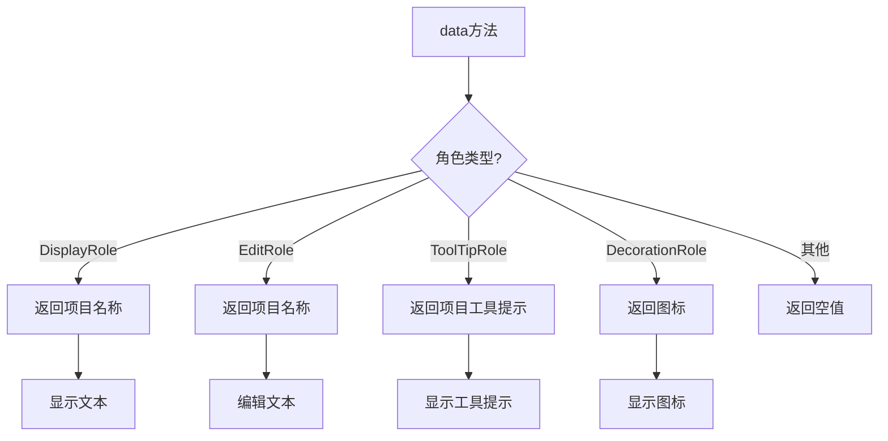

**图表来源**  
- [model.py](file://qt/aqt/browser/sidebar/model.py#L79-L99)

### SidebarItem分析
SidebarItem类表示侧边栏树中的单个项目，包含项目的基本属性和行为。每个项目都有名称、图标、类型、ID等属性，以及子项目列表和父项目引用。项目通过expanded属性管理展开状态，并通过on_expanded回调通知状态变化。搜索匹配状态通过_search_matches_self和_search_matches_child属性跟踪，支持高效的搜索高亮显示。

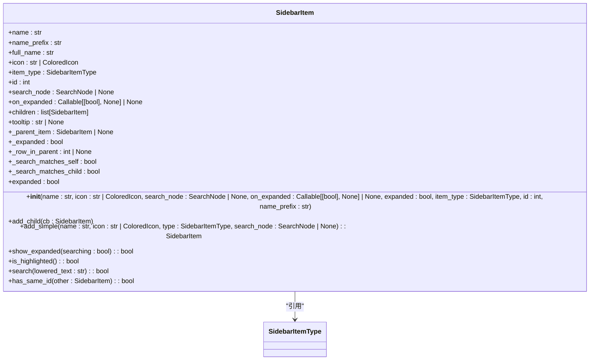

**图表来源**  
- [item.py](file://qt/aqt/browser/sidebar/item.py#L61-L165)

#### 层次结构管理
项目通过children列表和_parent_item引用维护层次结构。add_child方法将子项目添加到列表中，并设置父项目引用。这种双向引用确保了树形结构的完整性和导航效率。_row_in_parent属性缓存项目在父项目中的行索引，避免了重复计算，提高了性能。

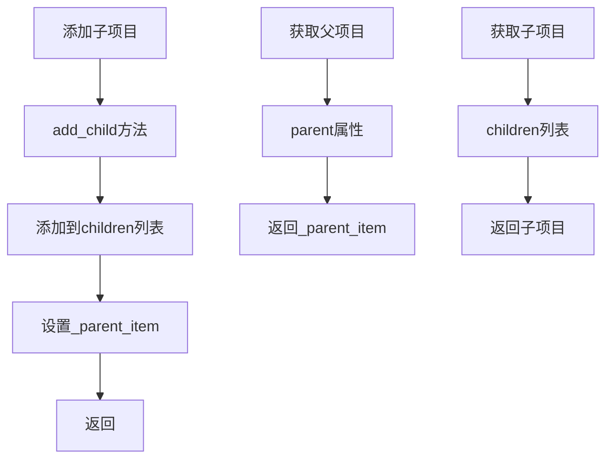

**图表来源**  
- [item.py](file://qt/aqt/browser/sidebar/item.py#L89-L91)
- [item.py](file://qt/aqt/browser/sidebar/item.py#L83-L83)

#### 搜索功能
search方法实现递归搜索，检查项目名称是否包含搜索文本，并递归检查所有子项目。搜索结果通过_search_matches_self和_search_matches_child属性缓存，支持高效的UI更新。is_highlighted方法返回项目是否匹配搜索条件，用于确定是否需要高亮显示。

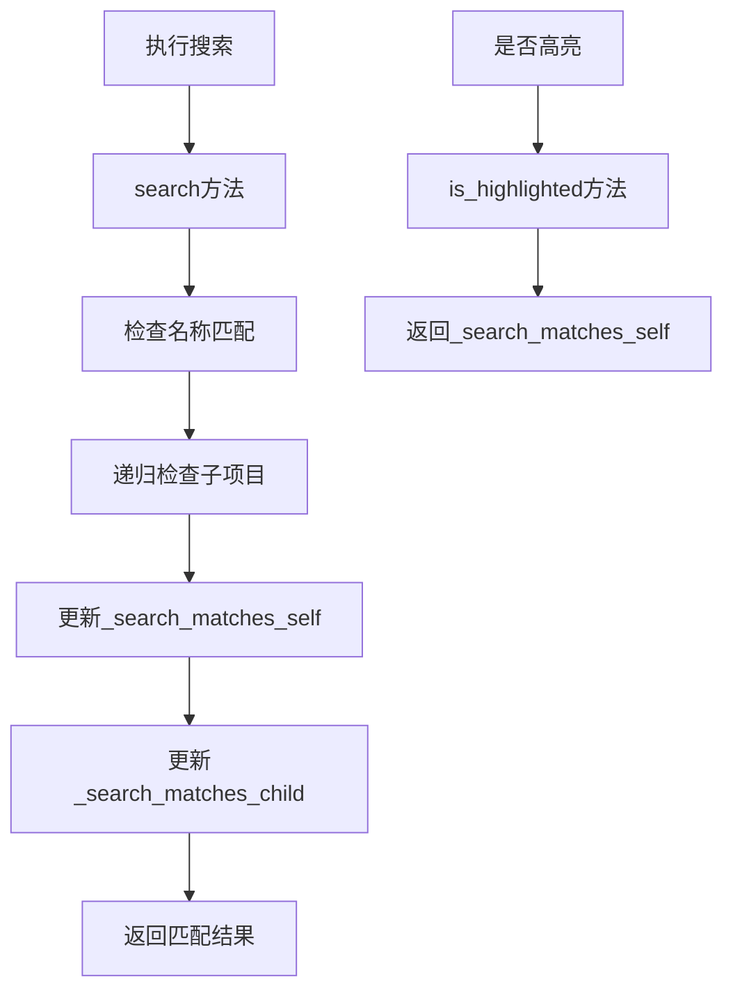

**图表来源**  
- [item.py](file://qt/aqt/browser/sidebar/item.py#L132-L138)
- [item.py](file://qt/aqt/browser/sidebar/item.py#L129-L130)

## 依赖分析
侧边栏视图组件之间存在紧密的依赖关系。SidebarTreeView依赖SidebarModel作为数据源，SidebarModel依赖SidebarItem表示数据节点，SidebarItem依赖SidebarItemType定义项目类型。此外，视图还依赖外部组件如SearchNode进行搜索操作，依赖Operation类进行后台操作。这些依赖关系通过构造函数参数和方法调用建立，形成了清晰的组件协作网络。

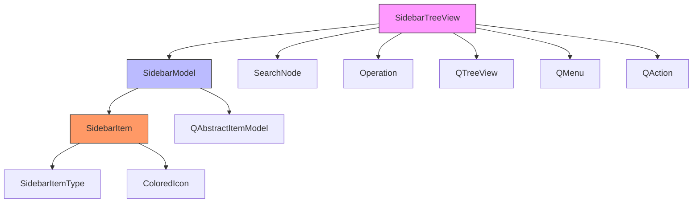

**图表来源**  
- [tree.py](file://qt/aqt/browser/sidebar/tree.py#L74-L1286)
- [model.py](file://qt/aqt/browser/sidebar/model.py#L11-L123)
- [item.py](file://qt/aqt/browser/sidebar/item.py#L11-L58)

## 性能考虑
侧边栏视图在设计时充分考虑了性能优化。通过setUpdatesEnabled(false)在刷新期间禁用更新，避免了界面闪烁。使用_query_cache缓存查询结果，减少重复计算。在_search_matches_self和_search_matches_child属性中缓存搜索结果，提高搜索效率。通过_cache_rows方法预计算行索引，优化导航性能。这些优化措施确保了即使在处理大量数据时，界面也能保持流畅响应。

**章节来源**
- [tree.py](file://qt/aqt/browser/sidebar/tree.py#L161-L198)
- [model.py](file://qt/aqt/browser/sidebar/model.py#L20-L24)
- [item.py](file://qt/aqt/browser/sidebar/item.py#L132-L138)

## 故障排除指南
当侧边栏视图出现问题时，可以按照以下步骤进行排查：首先检查视图是否可见，不可见的视图不会刷新；其次验证模型是否正确设置，错误的模型会导致显示异常；然后检查信号槽连接是否正常，断开的连接会影响交互功能；最后确认数据源是否有效，损坏的数据可能导致崩溃。对于搜索功能问题，需要验证_search_matches_self和_search_matches_child属性的更新逻辑。

**章节来源**
- [tree.py](file://qt/aqt/browser/sidebar/tree.py#L161-L198)
- [tree.py](file://qt/aqt/browser/sidebar/tree.py#L224-L235)
- [model.py](file://qt/aqt/browser/sidebar/model.py#L33-L34)

## 结论
侧边栏视图的实现展示了Qt框架下复杂UI组件的优秀设计模式。通过MVC架构分离关注点，利用信号槽机制实现松耦合通信，采用缓存和批量更新优化性能，这些设计原则共同构建了一个高效、可维护的用户界面组件。对于初学者，理解QAbstractItemView的层次结构管理是掌握Qt视图系统的关键；对于高级开发者，学习其性能优化策略和异步操作处理模式具有重要参考价值。