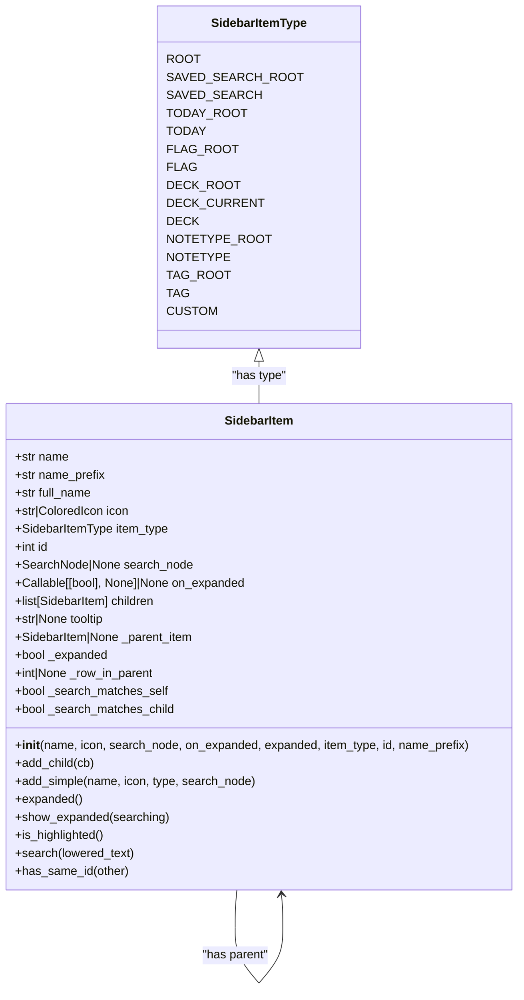
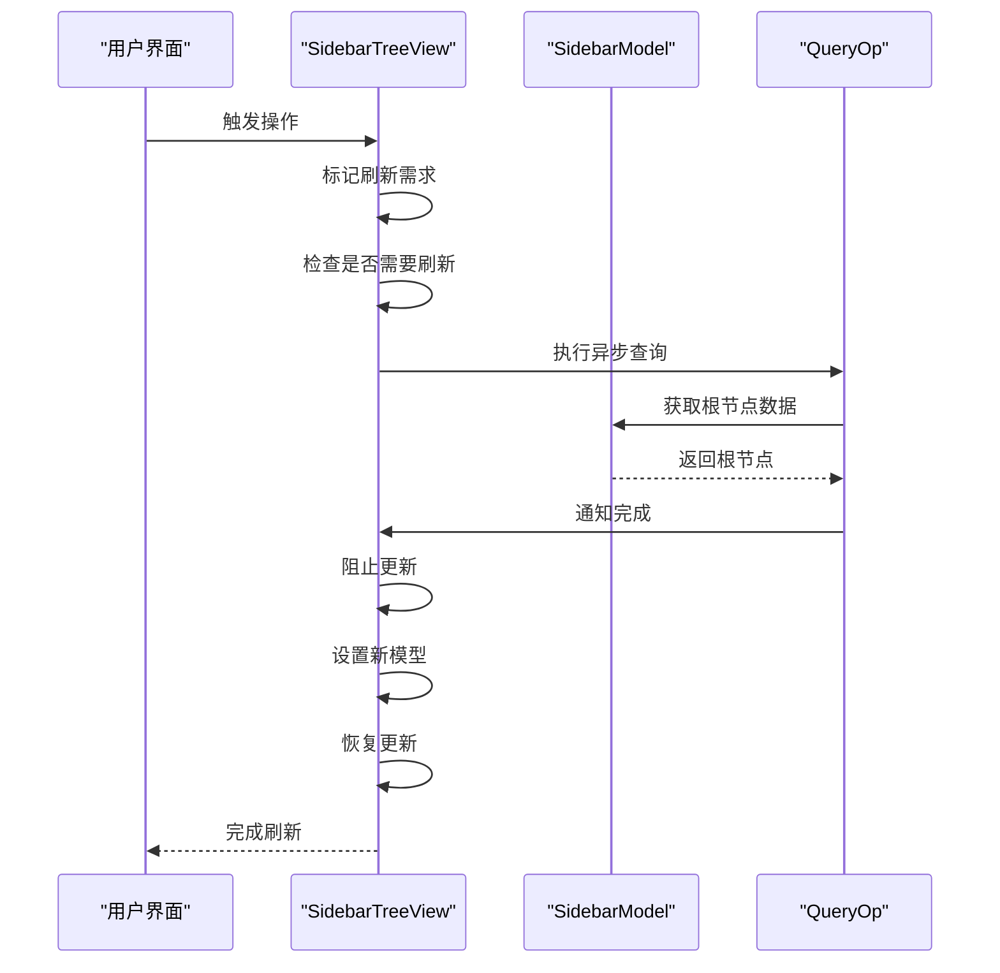
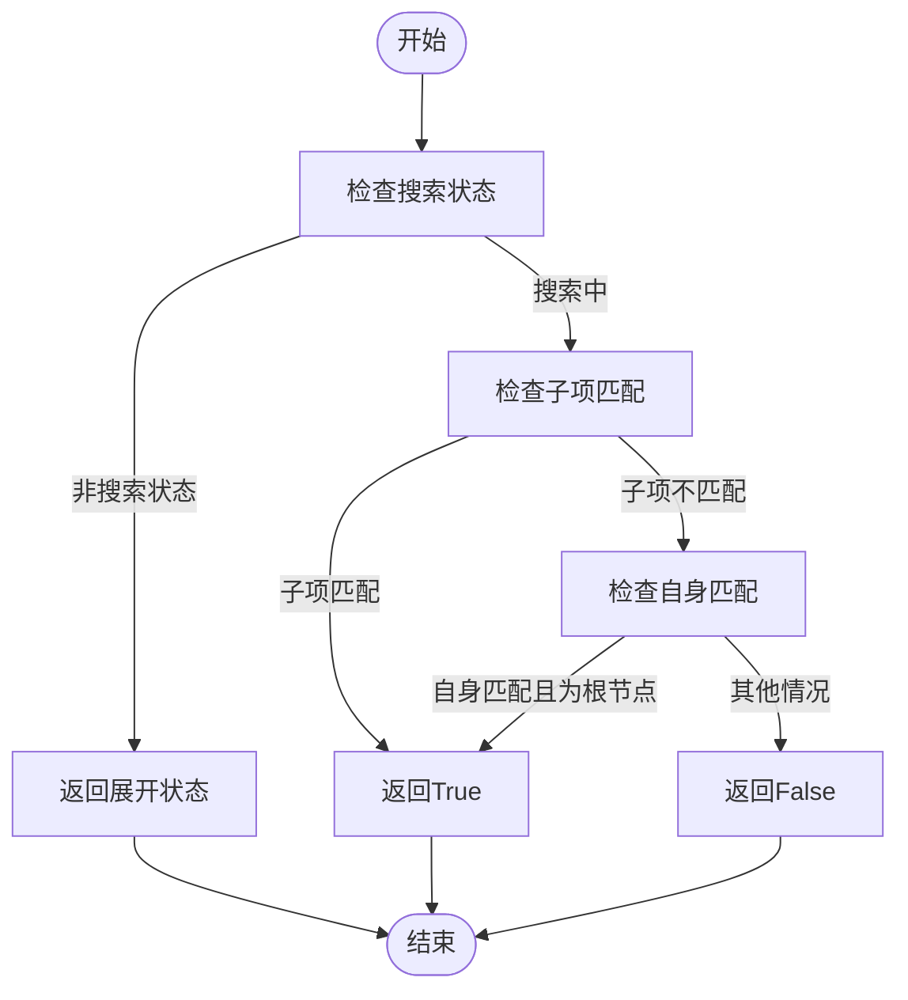
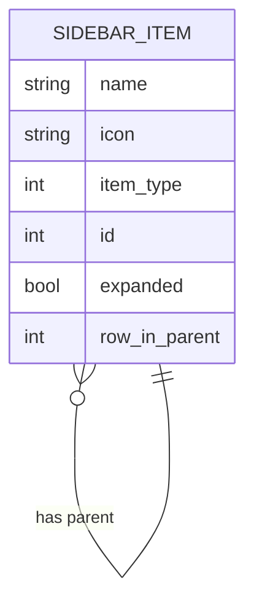

# 导航项数据结构

<cite>
**本文档中引用的文件**  
- [item.py](file://qt/aqt/browser/sidebar/item.py)
- [tree.py](file://qt/aqt/browser/sidebar/tree.py)
- [model.py](file://qt/aqt/browser/sidebar/model.py)
</cite>

## 目录
1. [简介](#简介)
2. [数据模型设计](#数据模型设计)
3. [计数统计与缓存机制](#计数统计与缓存机制)
4. [图标资源动态选择](#图标资源动态选择)
5. [状态标记变更跟踪](#状态标记变更跟踪)
6. [层级关系与有序排列](#层级关系与有序排列)
7. [自定义导航项开发指南](#自定义导航项开发指南)
8. [内存管理注意事项](#内存管理注意事项)

## 简介
本文档全面解析Anki应用中导航项的数据结构设计，重点分析`SidebarItem`类及其在侧边栏中的实现。文档详细阐述了导航项的继承关系、属性定义、状态管理以及与其他组件的交互方式，为开发者提供深入理解导航系统内部工作原理的参考。

## 数据模型设计
导航项数据模型的核心是`SidebarItem`类，该类定义了侧边栏中所有导航项的通用属性和行为。`SidebarItemType`枚举类型定义了不同类型的导航项，包括根节点、保存的搜索、今日项目、标签、牌组等。

**Diagram sources**  
- [item.py](file://qt/aqt/browser/sidebar/item.py#L1-L165)

**Section sources**  
- [item.py](file://qt/aqt/browser/sidebar/item.py#L1-L165)

## 计数统计与缓存机制
导航项的计数统计主要通过后端服务获取，前端侧边栏本身不直接维护计数数据。计数信息的更新由`op_executed`方法触发，当相关操作执行后，会标记需要刷新，并在适当时机调用`refresh`方法重新构建整个导航树。

计数数据的缓存机制体现在导航树的构建过程中。通过`QueryOp`异步操作获取最新的导航数据，避免阻塞UI线程。搜索匹配状态的缓存通过`_search_matches_self`和`_search_matches_child`两个布尔字段实现，这些字段在`search`方法执行时被更新，用于快速判断项目是否匹配搜索条件。

**Diagram sources**  
- [tree.py](file://qt/aqt/browser/sidebar/tree.py#L145-L165)
- [model.py](file://qt/aqt/browser/sidebar/model.py#L1-L124)

## 图标资源动态选择
图标资源的动态选择通过`theme_manager.icon_from_resources`方法实现。每个`SidebarItem`在初始化时指定其图标路径，这些路径通常指向SVG文件。在`model.py`的`data`方法中，当请求装饰角色数据时，会调用`theme_manager.icon_from_resources`将图标路径转换为实际的图标对象。

图标选择策略支持主题化，允许根据当前主题选择不同的图标变体。例如，旗帜、标签、牌组等都有对应的轮廓图标和填充图标，用于表示不同的状态（如选中、悬停等）。

**Section sources**  
- [model.py](file://qt/aqt/browser/sidebar/model.py#L100-L105)
- [item.py](file://qt/aqt/browser/sidebar/item.py#L76-L76)

## 状态标记变更跟踪
状态标记的变更跟踪主要通过`expanded`属性和相关的setter方法实现。`_expanded`字段存储实际的展开状态，而`on_expanded`回调函数在状态改变时被调用，用于通知外部组件状态变化。

`is_highlighted`方法用于判断项目是否被高亮显示，这通常发生在搜索匹配时。`_search_matches_self`字段在`search`方法执行时被更新，记录当前项目是否匹配搜索条件。

**Diagram sources**  
- [item.py](file://qt/aqt/browser/sidebar/item.py#L121-L127)
- [item.py](file://qt/aqt/browser/sidebar/item.py#L129-L130)

## 层级关系与有序排列
导航项的层级关系通过`children`列表和`_parent_item`指针实现。`add_child`方法用于添加子项，同时设置子项的父指针。`_row_in_parent`字段缓存了每个项目在其父项中的行号，用于快速定位。

有序排列通过`_cache_rows`方法实现，该方法递归遍历整个树结构，为每个项目设置其在父项中的行号。`index_for_item`方法利用`_row_in_parent`字段快速创建模型索引。

**Diagram sources**  
- [model.py](file://qt/aqt/browser/sidebar/model.py#L10-L15)
- [item.py](file://qt/aqt/browser/sidebar/item.py#L81-L83)

## 自定义导航项开发指南
开发自定义导航项时，应继承`SidebarItem`类或直接使用其构造函数创建新实例。新增属性字段时，应确保不会与现有字段冲突。扩展显示逻辑时，可以通过重写`data`方法或添加新的角色来实现。

最佳实践包括：
1. 使用`add_simple`方法快速创建具有标准属性的子项
2. 通过`on_expanded`回调处理展开状态变化
3. 利用`search_node`属性定义项目的搜索行为
4. 保持`full_name`与`name_prefix`和`name`的一致性

**Section sources**  
- [item.py](file://qt/aqt/browser/sidebar/item.py#L93-L108)
- [tree.py](file://qt/aqt/browser/sidebar/tree.py#L563-L601)

## 内存管理注意事项
为避免循环引用，应特别注意`_parent_item`指针的管理。当移除一个项目时，应确保将其从父项的`children`列表中移除，并将`_parent_item`设置为`None`。

在`SidebarModel`的`refresh`方法中，旧的模型会被`deleteLater`方法延迟删除，确保在所有引用释放后再进行实际的内存回收。`_cache_rows`方法在每次刷新时重新计算行号，避免了过期的缓存数据。

**Section sources**  
- [tree.py](file://qt/aqt/browser/sidebar/tree.py#L155-L157)
- [model.py](file://qt/aqt/browser/sidebar/model.py#L10-L15)