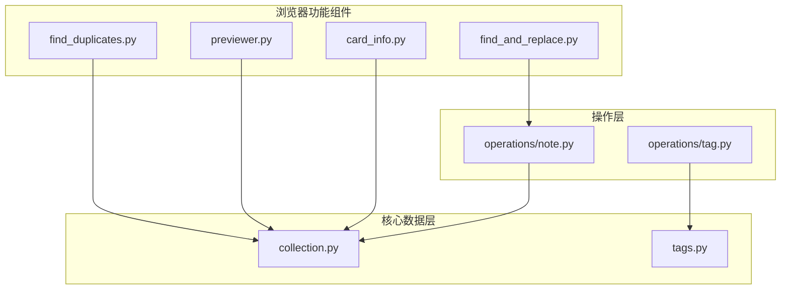
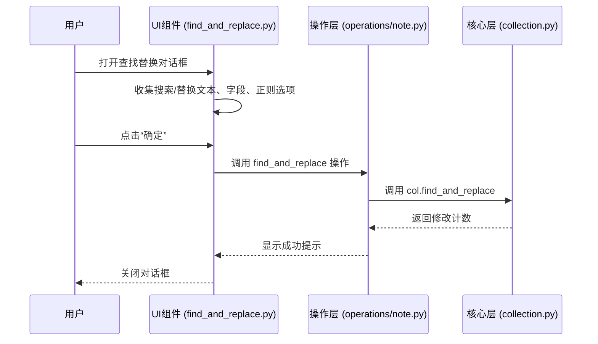
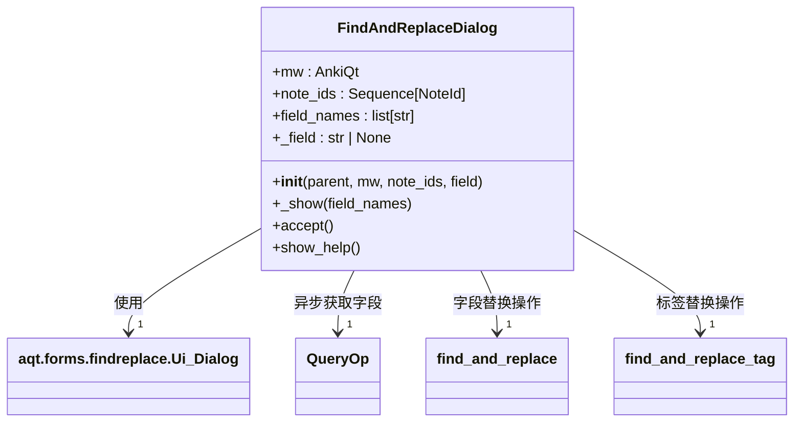
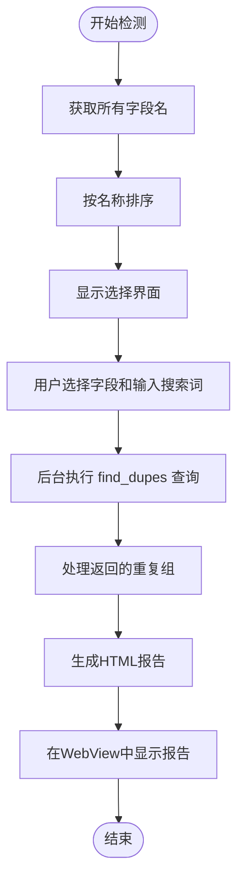
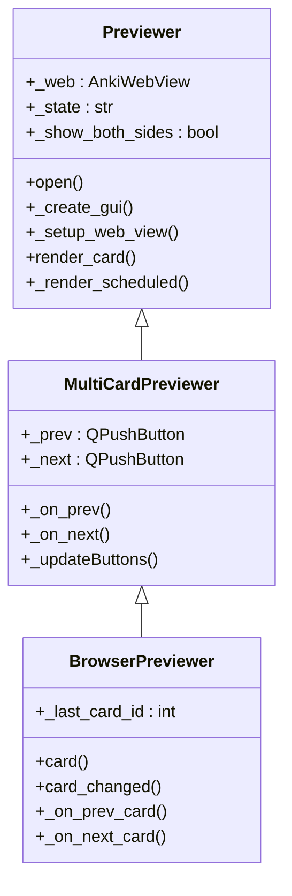
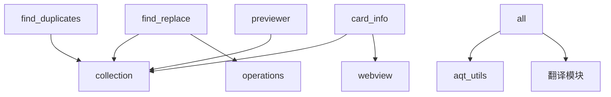

# 浏览器功能组件

<cite>
**本文档中引用的文件**  
- [find_and_replace.py](file://qt/aqt/browser/find_and_replace.py)
- [find_duplicates.py](file://qt/aqt/browser/find_duplicates.py)
- [previewer.py](file://qt/aqt/browser/previewer.py)
- [card_info.py](file://qt/aqt/browser/card_info.py)
- [note.py](file://qt/aqt/operations/note.py)
- [tags.py](file://pylib/anki/tags.py)
- [collection.py](file://pylib/anki/collection.py)
</cite>

## 目录
1. [简介](#简介)
2. [项目结构](#项目结构)
3. [核心组件](#核心组件)
4. [架构概述](#架构概述)
5. [详细组件分析](#详细组件分析)
6. [依赖分析](#依赖分析)
7. [性能考虑](#性能考虑)
8. [故障排除指南](#故障排除指南)
9. [结论](#结论)

## 简介
本文档旨在全面介绍 Anki 浏览器中的关键辅助功能组件，涵盖查找替换、重复卡片检测、卡片预览和卡片信息面板四大核心功能。文档详细阐述了各功能的技术实现机制，包括正则表达式支持、字段范围选择、批量修改、基于笔记类型与内容的匹配算法、实时渲染、样式应用、多卡片比较以及数据聚合方法。同时，文档还说明了这些功能与主浏览器的集成模式，包括对话框管理、进度指示和错误处理，并为初学者提供使用指南，为高级开发者提供扩展接口参考。

## 项目结构
Anki 浏览器功能组件主要位于 `qt/aqt/browser/` 目录下，每个功能模块以独立的 Python 文件实现，遵循清晰的模块化设计。这些组件通过 Qt 框架构建用户界面，并与后端操作（operations）和核心数据模型（collection）进行交互，形成一个分层的架构。

**图示来源**
- [find_and_replace.py](file://qt/aqt/browser/find_and_replace.py)
- [find_duplicates.py](file://qt/aqt/browser/find_duplicates.py)
- [previewer.py](file://qt/aqt/browser/previewer.py)
- [card_info.py](file://qt/aqt/browser/card_info.py)
- [note.py](file://qt/aqt/operations/note.py)
- [tags.py](file://pylib/anki/tags.py)
- [collection.py](file://pylib/anki/collection.py)

**本节来源**
- [find_and_replace.py](file://qt/aqt/browser/find_and_replace.py)
- [find_duplicates.py](file://qt/aqt/browser/find_duplicates.py)
- [previewer.py](file://qt/aqt/browser/previewer.py)
- [card_info.py](file://qt/aqt/browser/card_info.py)

## 核心组件
本文档的核心组件包括 `find_and_replace.py` 中的查找替换功能、`find_duplicates.py` 中的重复卡片检测、`previewer.py` 中的卡片预览面板以及 `card_info.py` 中的卡片信息面板。这些组件共同构成了 Anki 浏览器强大的数据管理和分析能力，为用户提供高效、直观的卡片操作与信息查看体验。

**本节来源**
- [find_and_replace.py](file://qt/aqt/browser/find_and_replace.py#L1-L179)
- [find_duplicates.py](file://qt/aqt/browser/find_duplicates.py#L1-L134)
- [previewer.py](file://qt/aqt/browser/previewer.py#L1-L428)
- [card_info.py](file://qt/aqt/browser/card_info.py#L1-L213)

## 架构概述
Anki 浏览器功能组件采用分层架构，清晰地分离了用户界面（UI）、业务逻辑（Operations）和数据访问（Backend）。用户通过浏览器界面触发操作，UI 组件（如 `FindAndReplaceDialog`）负责收集用户输入并展示结果。业务逻辑层（如 `aqt.operations.note.find_and_replace`）负责协调操作流程，确保操作的原子性和一致性。最终，请求被传递到核心数据层（如 `Collection.find_and_replace`），由后端执行实际的数据修改。

**图示来源**
- [find_and_replace.py](file://qt/aqt/browser/find_and_replace.py#L50-L179)
- [note.py](file://qt/aqt/operations/note.py#L44-L69)
- [collection.py](file://pylib/anki/collection.py#L713-L731)

## 详细组件分析

### 查找替换功能分析
`find_and_replace.py` 实现了强大的查找替换功能，支持在选定笔记的特定字段或所有字段中进行文本替换，并可选择是否使用正则表达式和区分大小写。

#### 功能实现
该功能通过 `FindAndReplaceDialog` 类实现。初始化时，它会根据选中的笔记动态获取可用的字段名，并填充到下拉菜单中。用户输入搜索和替换内容后，点击“确定”会触发后台操作。系统会根据用户选择的字段（“所有字段”、“标签”或特定字段）来决定调用不同的后端方法。

**图示来源**
- [find_and_replace.py](file://qt/aqt/browser/find_and_replace.py#L20-L179)

#### 批量修改机制
批量修改通过 `aqt.operations.note.find_and_replace` 函数实现。该函数封装了一个 `CollectionOp` 操作，确保在执行查找替换时，整个过程被视为一个原子事务。如果操作成功，会通过 `tooltip` 向用户显示修改了多少张卡片。核心的替换逻辑最终由 `pylib.anki.collection.Collection.find_and_replace` 方法执行，该方法直接操作数据库，高效地完成批量文本替换。

**本节来源**
- [find_and_replace.py](file://qt/aqt/browser/find_and_replace.py#L100-L179)
- [note.py](file://qt/aqt/operations/note.py#L44-L69)
- [collection.py](file://pylib/anki/collection.py#L713-L731)

### 重复卡片检测分析
`find_duplicates.py` 提供了基于字段内容的重复卡片检测功能，帮助用户识别和管理内容重复的笔记。

#### 匹配逻辑
`FindDuplicatesDialog` 类允许用户选择一个字段，并输入一个搜索词。其核心算法是 `col.find_dupes(field, search_text)`。该算法会遍历所有笔记，提取指定字段的内容，然后根据搜索词（可选正则）进行分组。所有内容经过搜索词处理后结果相同的笔记会被归为一组，形成“重复组”。

**图示来源**
- [find_duplicates.py](file://qt/aqt/browser/find_duplicates.py#L50-L134)

#### 结果展示与处理
检测结果以分组列表的形式在 `WebView` 中展示。每个分组显示了重复的值和包含的卡片数量。用户可以点击分组链接，浏览器会自动搜索并定位到这些卡片。此外，用户还可以点击“标记为重复”按钮，系统会调用 `add_tags_to_notes` 操作，为所有检测到的重复卡片添加“duplicate”标签，便于后续统一管理。

**本节来源**
- [find_duplicates.py](file://qt/aqt/browser/find_duplicates.py#L80-L134)

### 卡片预览面板分析
`previewer.py` 实现了功能丰富的卡片预览功能，支持单张和多张卡片的实时预览。

#### 实时渲染与样式应用
`Previewer` 类是预览功能的核心。它使用 `AnkiWebView` 来渲染卡片内容。`render_card` 方法是关键，它会根据当前卡片的状态（问题/答案）和用户设置（是否同时显示两面）来决定渲染哪一面。为了优化性能，系统使用 `_last_render` 时间戳和一个定时器来避免在短时间内频繁重复渲染。卡片的样式通过加载 `css/reviewer.css` 文件来应用，确保预览效果与实际学习时一致。

**图示来源**
- [previewer.py](file://qt/aqt/browser/previewer.py#L20-L428)

#### 多卡片比较
`MultiCardPreviewer` 和 `BrowserPreviewer` 类扩展了基础预览功能，支持在多张卡片间导航。`BrowserPreviewer` 与主浏览器紧密集成，能够响应浏览器中当前选中卡片的变化。当用户在浏览器中切换卡片时，预览面板会自动更新。导航按钮（上一张/下一张）允许用户在选中的卡片列表中移动，实现多卡片的快速比较。

**本节来源**
- [previewer.py](file://qt/aqt/browser/previewer.py#L200-L428)

### 卡片信息面板分析
`card_info.py` 提供了详细的卡片信息面板，聚合了卡片的复习历史、调度状态和媒体使用情况等关键数据。

#### 数据聚合方法
`CardInfoDialog` 类负责显示信息面板。它通过加载 SvelteKit 前端页面 `card-info/[cardId]` 来展示数据。当用户打开面板时，前端会通过 `anki.updateCard()` 调用后端 API。核心数据来源于 `aqt.mw.col.card_stats_data(card_id)`，该方法返回一个包含卡片详细信息的 Protobuf 消息。此外，面板还会直接查询 `revlog` 和 `cards` 数据库表，获取完整的复习记录和卡片元数据。

**图示来源**
- [card_info.py](file://qt/aqt/browser/card_info.py#L50-L213)

#### 信息展示
信息面板以结构化的 JSON 格式呈现所有数据，包括卡片的调度信息（间隔、难度、步骤）、笔记类型、标签、以及每一条复习记录的详细信息（时间、得分、前后间隔等）。用户可以通过快捷键 `Ctrl+C` 将这些信息复制到剪贴板，便于进行深入分析或分享。

**本节来源**
- [card_info.py](file://qt/aqt/browser/card_info.py#L100-L213)

## 依赖分析
浏览器功能组件之间相对独立，但都高度依赖于 Anki 的核心数据层和操作层。`find_and_replace` 和 `find_duplicates` 依赖于 `collection.py` 提供的搜索和查询能力。`previewer` 和 `card_info` 依赖于 `collection.py` 提供的卡片数据读取接口。所有 UI 组件都依赖于 `aqt` 框架提供的 Qt 绑定和工具函数。

**图示来源**
- [find_and_replace.py](file://qt/aqt/browser/find_and_replace.py)
- [find_duplicates.py](file://qt/aqt/browser/find_duplicates.py)
- [previewer.py](file://qt/aqt/browser/previewer.py)
- [card_info.py](file://qt/aqt/browser/card_info.py)

**本节来源**
- [find_and_replace.py](file://qt/aqt/browser/find_and_replace.py)
- [find_duplicates.py](file://qt/aqt/browser/find_duplicates.py)
- [previewer.py](file://qt/aqt/browser/previewer.py)
- [card_info.py](file://qt/aqt/browser/card_info.py)

## 性能考虑
各组件在设计时都考虑了性能优化。`find_and_replace` 和 `find_duplicates` 将耗时的数据库操作放在后台线程执行，避免阻塞 UI。`previewer` 使用定时器防抖（debounce）机制，防止在快速切换卡片时产生过多的渲染请求。`card_info` 采用按需加载的方式，只有在用户打开面板时才查询大量数据，避免了不必要的性能开销。

## 故障排除指南
*   **查找替换无反应**：检查是否选择了正确的字段，确认正则表达式语法是否正确。
*   **预览面板不更新**：尝试关闭并重新打开预览面板，或检查浏览器中是否确实选中了卡片。
*   **信息面板数据为空**：确保选中的卡片是有效的，检查数据库是否损坏。
*   **对话框无法打开**：重启 Anki，或检查是否有其他插件冲突。

**本节来源**
- [find_and_replace.py](file://qt/aqt/browser/find_and_replace.py)
- [previewer.py](file://qt/aqt/browser/previewer.py)
- [card_info.py](file://qt/aqt/browser/card_info.py)

## 结论
Anki 浏览器的辅助功能组件设计精良，通过清晰的分层架构和模块化实现，为用户提供了强大的数据操作和分析能力。从高效的批量文本替换，到智能的重复卡片检测，再到直观的预览和详尽的信息面板，这些功能极大地提升了用户管理卡片库的效率和体验。其代码结构清晰，依赖关系明确，为功能扩展和维护提供了良好的基础。