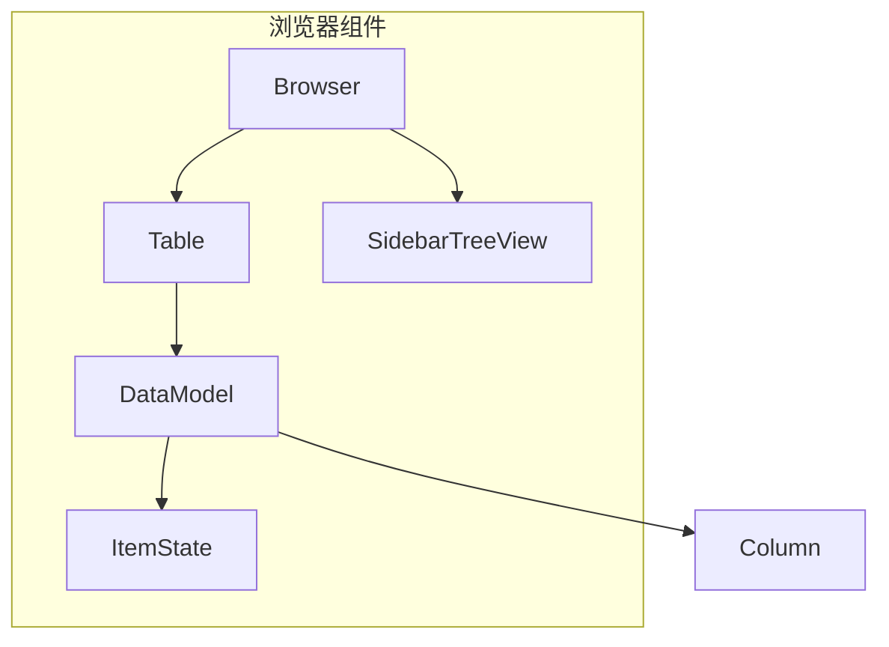
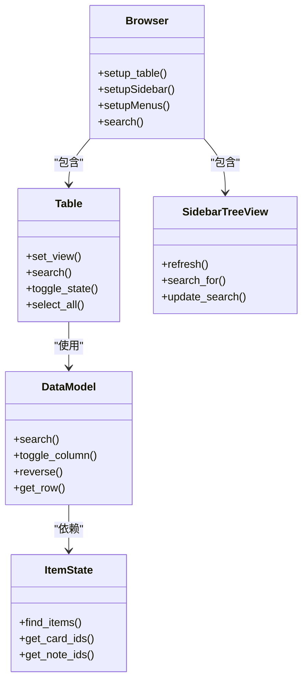
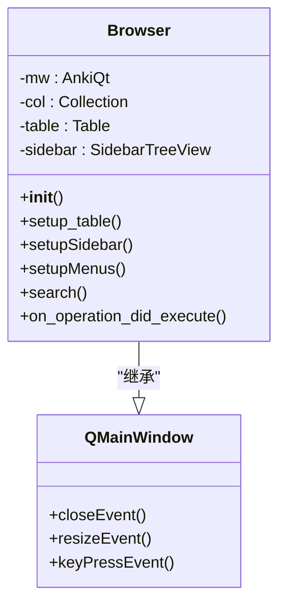
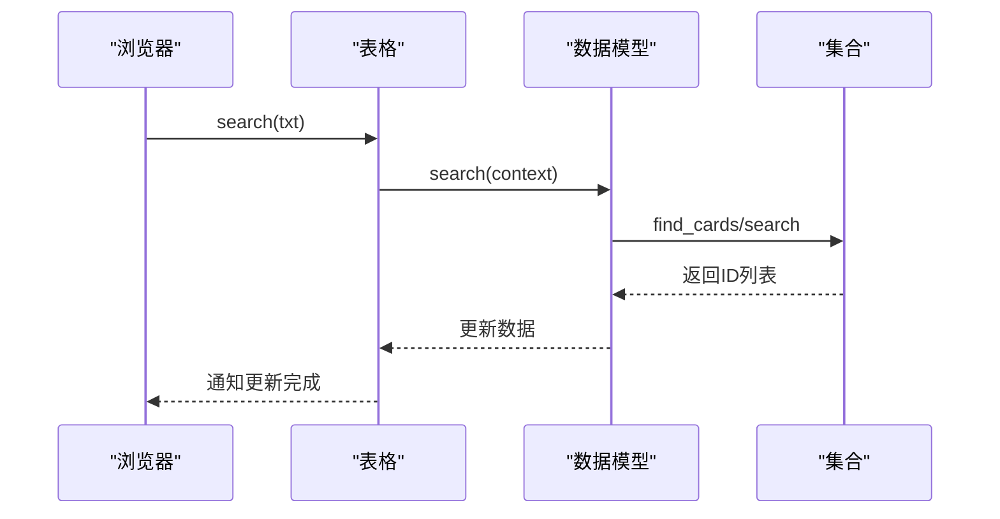
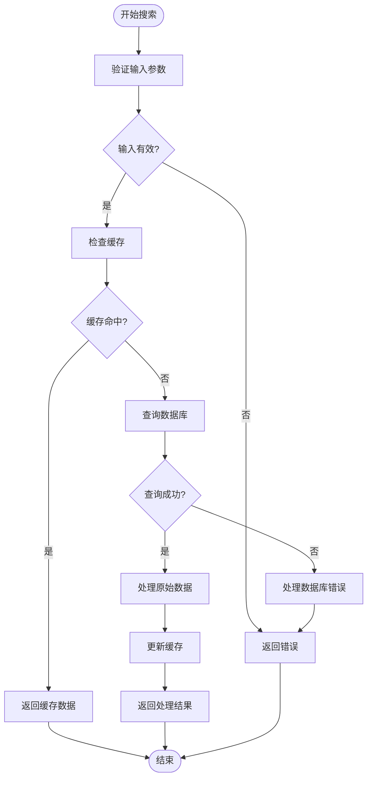
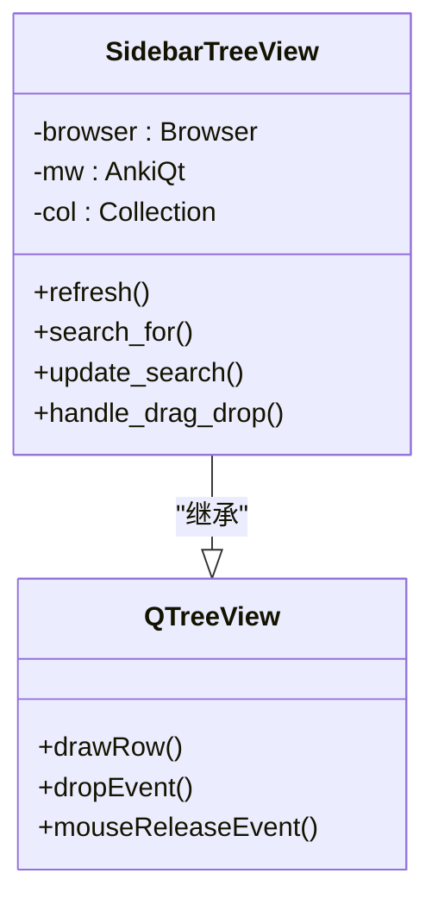
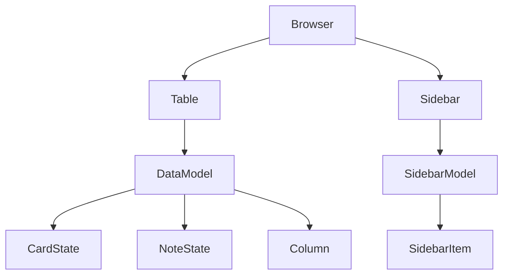

# 浏览器组件

<cite>
**本文档中引用的文件**  
- [browser.py](file://qt/aqt/browser/browser.py)
- [table.py](file://qt/aqt/browser/table/table.py)
- [model.py](file://qt/aqt/browser/table/model.py)
- [state.py](file://qt/aqt/browser/table/state.py)
- [sidebar.py](file://qt/aqt/browser/sidebar/tree.py)
- [sidebar_model.py](file://qt/aqt/browser/sidebar/model.py)
</cite>

## 目录
1. [简介](#简介)
2. [项目结构](#项目结构)
3. [核心组件](#核心组件)
4. [架构概述](#架构概述)
5. [详细组件分析](#详细组件分析)
6. [依赖分析](#依赖分析)
7. [性能考虑](#性能考虑)
8. [故障排除指南](#故障排除指南)
9. [结论](#结论)

## 简介
Anki浏览器组件是用户管理卡片和笔记的核心界面。该文档深入分析了浏览器组件的实现，包括数据展示、筛选、排序功能，以及与后端数据模型的集成。文档涵盖了Qt视图/模型编程基础，为初学者和高级开发者提供实用指导。

## 项目结构
Anki浏览器组件位于`qt/aqt/browser/`目录下，采用模块化设计，主要分为三个核心模块：浏览器主界面、表格视图和侧边栏导航。这种分层架构实现了关注点分离，提高了代码的可维护性和可扩展性。

**图表来源**  
- [browser.py](file://qt/aqt/browser/browser.py#L113-L1278)
- [table.py](file://qt/aqt/browser/table/table.py#L31-L666)
- [sidebar.py](file://qt/aqt/browser/sidebar/tree.py#L74-L1286)

**章节来源**  
- [browser.py](file://qt/aqt/browser/browser.py#L113-L1278)
- [table.py](file://qt/aqt/browser/table/table.py#L31-L666)

## 核心组件
浏览器组件由三个主要部分组成：主浏览器窗口、表格视图和侧边栏。主浏览器窗口负责整体布局和用户交互，表格视图处理数据展示和操作，侧边栏提供导航和筛选功能。这些组件通过清晰的接口进行通信，确保了系统的稳定性和可扩展性。

**章节来源**  
- [browser.py](file://qt/aqt/browser/browser.py#L113-L1278)
- [table.py](file://qt/aqt/browser/table/table.py#L31-L666)
- [sidebar.py](file://qt/aqt/browser/sidebar/tree.py#L74-L1286)

## 架构概述
Anki浏览器采用MVC（模型-视图-控制器）架构模式，将数据管理、用户界面和业务逻辑分离。这种设计模式提高了代码的可维护性，使得各个组件可以独立开发和测试。

**图表来源**  
- [browser.py](file://qt/aqt/browser/browser.py#L113-L1278)
- [table.py](file://qt/aqt/browser/table/table.py#L31-L666)
- [model.py](file://qt/aqt/browser/table/model.py#L23-L364)
- [state.py](file://qt/aqt/browser/table/state.py#L17-L222)
- [sidebar.py](file://qt/aqt/browser/sidebar/tree.py#L74-L1286)

## 详细组件分析
### 浏览器主界面分析
浏览器主界面是用户与Anki交互的主要入口，负责协调各个组件的工作。它处理用户输入、管理窗口布局，并在不同组件之间传递数据。

#### 对象导向组件

**图表来源**  
- [browser.py](file://qt/aqt/browser/browser.py#L113-L1278)

**章节来源**  
- [browser.py](file://qt/aqt/browser/browser.py#L113-L1278)

### 表格视图分析
表格视图是浏览器组件的核心，负责数据的展示和用户交互。它采用Qt的MVC架构，通过DataModel管理数据，Table负责视图展示。

#### API/服务组件

**图表来源**  
- [table.py](file://qt/aqt/browser/table/table.py#L31-L666)
- [model.py](file://qt/aqt/browser/table/model.py#L23-L364)

#### 复杂逻辑组件

**图表来源**  
- [table.py](file://qt/aqt/browser/table/table.py#L31-L666)
- [model.py](file://qt/aqt/browser/table/model.py#L23-L364)

**章节来源**  
- [table.py](file://qt/aqt/browser/table/table.py#L31-L666)
- [model.py](file://qt/aqt/browser/table/model.py#L23-L364)

### 侧边栏分析
侧边栏提供导航和筛选功能，允许用户快速访问常用搜索和分类。

#### 对象导向组件

**图表来源**  
- [sidebar.py](file://qt/aqt/browser/sidebar/tree.py#L74-L1286)

**章节来源**  
- [sidebar.py](file://qt/aqt/browser/sidebar/tree.py#L74-L1286)

## 依赖分析
浏览器组件的各个模块之间存在清晰的依赖关系，这种设计确保了代码的模块化和可维护性。

**图表来源**  
- [browser.py](file://qt/aqt/browser/browser.py#L113-L1278)
- [table.py](file://qt/aqt/browser/table/table.py#L31-L666)
- [model.py](file://qt/aqt/browser/table/model.py#L23-L364)
- [state.py](file://qt/aqt/browser/table/state.py#L17-L222)
- [sidebar.py](file://qt/aqt/browser/sidebar/tree.py#L74-L1286)
- [sidebar_model.py](file://qt/aqt/browser/sidebar/model.py#L11-L123)

**章节来源**  
- [browser.py](file://qt/aqt/browser/browser.py#L113-L1278)
- [table.py](file://qt/aqt/browser/table/table.py#L31-L666)
- [model.py](file://qt/aqt/browser/table/model.py#L23-L364)

## 性能考虑
浏览器组件在处理大量数据时采用了多种优化策略。DataModel使用缓存机制避免重复查询数据库，表格视图采用懒加载和虚拟滚动技术提高渲染性能。此外，系统在后台操作时会暂时阻塞UI更新，防止界面卡顿。

## 故障排除指南
当浏览器组件出现问题时，可以检查以下几个方面：确保数据库连接正常，验证配置文件是否正确，检查网络连接（如果涉及同步功能）。对于显示问题，可以尝试重置浏览器布局或清除缓存。

**章节来源**  
- [browser.py](file://qt/aqt/browser/browser.py#L113-L1278)
- [table.py](file://qt/aqt/browser/table/table.py#L31-L666)
- [model.py](file://qt/aqt/browser/table/model.py#L23-L364)

## 结论
Anki浏览器组件通过精心设计的架构和优化策略，实现了高效的数据管理和用户交互。其模块化设计使得功能扩展和维护变得更加容易，为用户提供了一个稳定可靠的卡片管理界面。