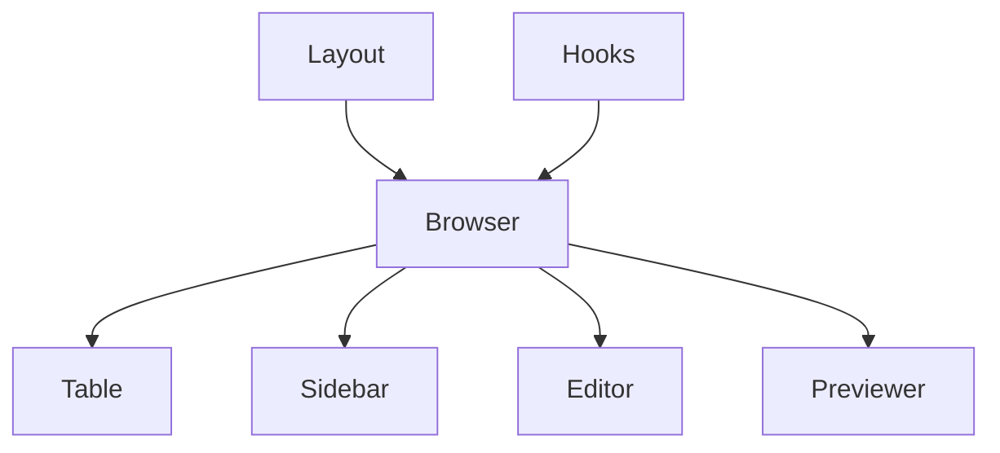
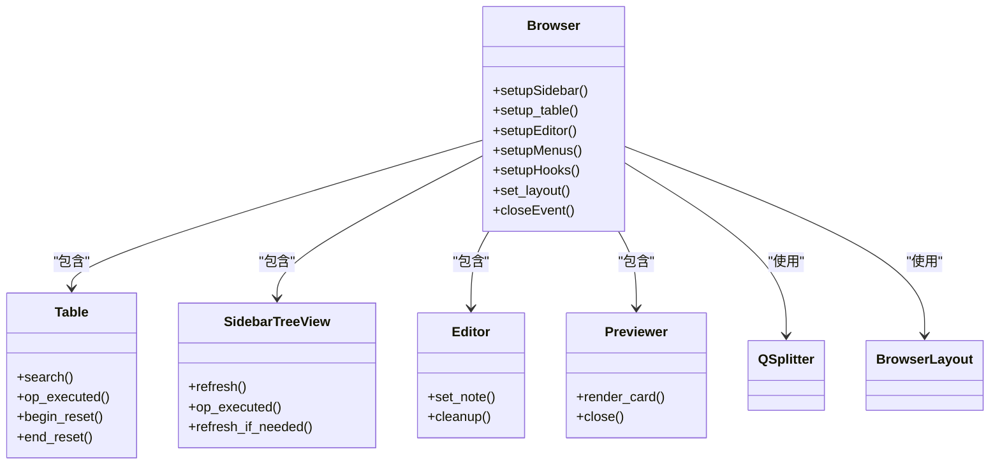
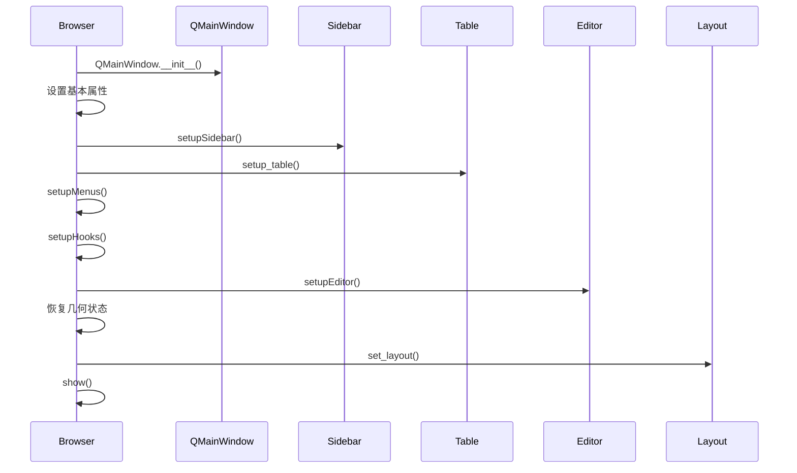
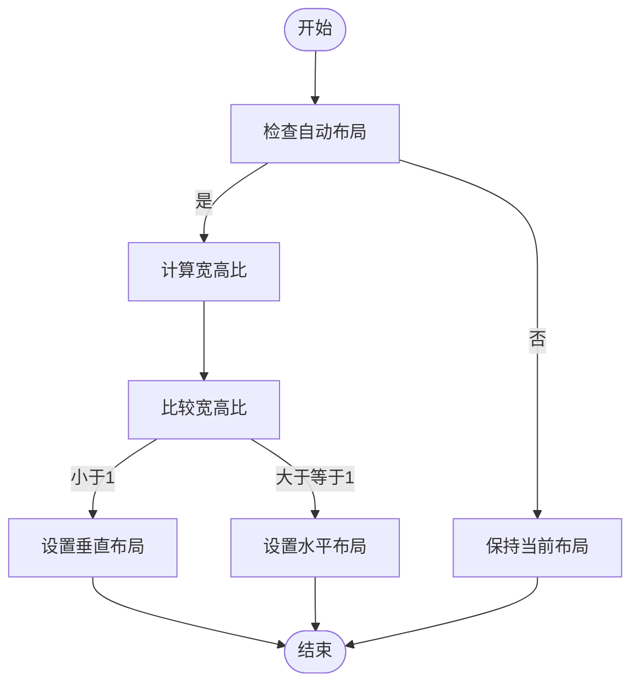
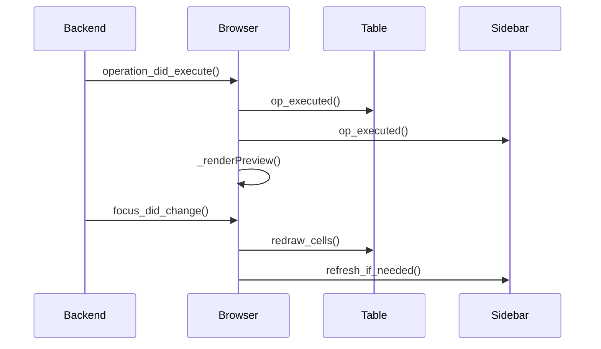
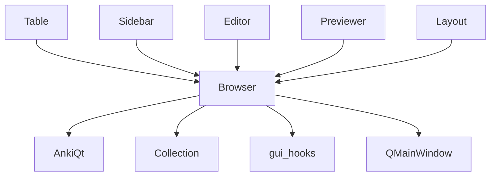

# 浏览器视图架构

<cite>
**本文档中引用的文件**  
- [browser.py](file://qt/aqt/browser/browser.py)
- [layout.py](file://qt/aqt/browser/layout.py)
- [table.py](file://qt/aqt/browser/table.py)
- [sidebar.py](file://qt/aqt/browser/sidebar.py)
- [previewer.py](file://qt/aqt/browser/previewer.py)
</cite>

## 目录
1. [简介](#简介)
2. [项目结构](#项目结构)
3. [核心组件](#核心组件)
4. [架构概述](#架构概述)
5. [详细组件分析](#详细组件分析)
6. [依赖分析](#依赖分析)
7. [性能考虑](#性能考虑)
8. [故障排除指南](#故障排除指南)
9. [结论](#结论)

## 简介
Anki浏览器主视图是用户管理卡片和笔记的核心界面，采用Qt框架实现现代化的桌面应用架构。该视图通过Browser类协调表格视图、侧边栏和工具栏的集成，实现了高效的数据展示和交互功能。本文档深入分析浏览器视图的架构设计，重点阐述其初始化流程、生命周期管理、布局实现和组件通信机制，为开发者提供全面的技术参考。

## 项目结构
Anki浏览器相关代码位于`qt/aqt/browser/`目录下，采用模块化设计分离关注点。主视图逻辑由`browser.py`中的Browser类管理，界面布局配置在`layout.py`中定义，表格视图实现在`table.py`中，侧边栏功能由`sidebar.py`处理，预览功能则在`previewer.py`中实现。这种清晰的模块划分使得各组件职责明确，便于维护和扩展。

**图示来源**  
- [browser.py](file://qt/aqt/browser/browser.py)
- [layout.py](file://qt/aqt/browser/layout.py)

**本节来源**  
- [browser.py](file://qt/aqt/browser/browser.py)
- [layout.py](file://qt/aqt/browser/layout.py)

## 核心组件
浏览器视图的核心组件包括Browser主控制器、Table数据表格、Sidebar导航侧边栏、Editor编辑器和Previewer预览窗口。Browser类作为中央协调者，负责初始化和管理这些组件的生命周期，处理用户交互，并通过信号槽机制实现组件间的通信。各组件通过清晰的接口定义实现松耦合，确保系统的可维护性和可扩展性。

**本节来源**  
- [browser.py](file://qt/aqt/browser/browser.py#L113-L1278)
- [table.py](file://qt/aqt/browser/table.py)
- [sidebar.py](file://qt/aqt/browser/sidebar.py)

## 架构概述
Anki浏览器采用基于Qt的MVC架构模式，Browser类作为视图控制器协调模型和视图的交互。系统通过gui_hooks实现事件驱动的通信机制，允许组件在特定操作执行后进行响应。布局管理采用响应式设计策略，根据窗口宽高比自动调整界面方向，提供一致的用户体验。状态保存机制确保用户设置在会话间持久化，提升使用便利性。

**图示来源**  
- [browser.py](file://qt/aqt/browser/browser.py#L113-L1278)
- [layout.py](file://qt/aqt/browser/layout.py#L1-L39)

## 详细组件分析

### Browser类初始化流程
Browser类的初始化流程遵循严格的顺序，确保各组件正确配置和连接。构造函数首先调用QMainWindow的初始化，然后设置基本属性和状态变量。接着依次调用setupSidebar、setup_table、setupMenus、setupHooks和setupEditor方法初始化各个子组件。最后恢复窗口几何状态和分割器位置，设置布局模式并显示窗口，完成整个初始化过程。

**本节来源**  
- [browser.py](file://qt/aqt/browser/browser.py#L119-L181)

#### 初始化时序图

**图示来源**  
- [browser.py](file://qt/aqt/browser/browser.py#L119-L181)
- [layout.py](file://qt/aqt/browser/layout.py#L16-L38)

### 布局管理实现
布局管理通过BrowserLayout枚举和QSplitterHandleEventFilter类实现。BrowserLayout定义了AUTO、VERTICAL和HORIZONTAL三种布局模式，允许用户根据偏好选择界面方向。QSplitterHandleEventFilter作为事件过滤器，监听分割器句柄的双击事件，实现双击平分面板的功能。响应式设计策略在resizeEvent中实现，根据窗口宽高比自动调整布局方向。

**图示来源**  
- [layout.py](file://qt/aqt/browser/layout.py#L16-L38)
- [browser.py](file://qt/aqt/browser/browser.py#L249-L254)

**本节来源**  
- [layout.py](file://qt/aqt/browser/layout.py#L1-L39)
- [browser.py](file://qt/aqt/browser/browser.py#L220-L267)

### 信号槽通信机制
浏览器视图采用Qt的信号槽机制实现组件间通信。Browser类通过setupHooks方法注册各种gui_hooks，包括undo_state_did_change、operation_did_execute和focus_did_change等。当后端操作执行时，on_operation_did_execute方法被触发，通知表格和侧边栏更新状态。焦点变化时，on_focus_change方法确保界面及时刷新，保持数据一致性。

**图示来源**  
- [browser.py](file://qt/aqt/browser/browser.py#L183-L218)
- [browser.py](file://qt/aqt/browser/browser.py#L1176-L1192)

**本节来源**  
- [browser.py](file://qt/aqt/browser/browser.py#L183-L218)
- [browser.py](file://qt/aqt/browser/browser.py#L1176-L1192)

## 依赖分析
浏览器视图依赖于Anki的核心组件，包括集合管理(col)、主窗口(mw)和各种操作服务。通过gui_hooks与系统其他部分松耦合地集成，确保了模块间的低依赖性。组件间通过明确定义的接口通信，如Table的op_executed方法和Sidebar的refresh_if_needed方法，实现了高内聚低耦合的设计目标。

**图示来源**  
- [browser.py](file://qt/aqt/browser/browser.py#L113-L1278)
- [layout.py](file://qt/aqt/browser/layout.py#L1-L39)

**本节来源**  
- [browser.py](file://qt/aqt/browser/browser.py#L113-L1278)
- [layout.py](file://qt/aqt/browser/layout.py#L1-L39)

## 性能考虑
浏览器视图在性能方面采取了多项优化措施。通过延迟加载策略，侧边栏的刷新被安排在浏览器窗口加载后的定时器中执行，提高界面响应速度。状态保存和恢复机制仅在必要时执行，减少不必要的I/O操作。事件处理中使用blockSignals等方法避免不必要的信号发射，降低CPU占用。对于大数据集，表格视图采用虚拟化技术，只渲染可见区域的单元格。

**本节来源**  
- [browser.py](file://qt/aqt/browser/browser.py#L751)
- [browser.py](file://qt/aqt/browser/browser.py#L439)

## 故障排除指南
常见问题包括布局异常、组件未更新和性能下降。布局问题通常源于状态保存失败，可通过重置窗口几何状态解决。组件未更新多因信号槽连接中断，检查setupHooks和teardownHooks的配对调用。性能问题可能与大数据集渲染有关，建议优化查询条件或启用过滤器。调试时可启用详细日志，监控gui_hooks的触发情况。

**本节来源**  
- [browser.py](file://qt/aqt/browser/browser.py#L411-L439)
- [browser.py](file://qt/aqt/browser/browser.py#L1176-L1192)

## 结论
Anki浏览器视图架构体现了良好的软件工程实践，通过模块化设计、清晰的职责划分和松耦合的通信机制，实现了功能丰富且易于维护的用户界面。其响应式布局和状态管理为用户提供了流畅的交互体验，而事件驱动的架构确保了系统的可扩展性。对于初学者，理解Qt MVC模式和信号槽机制是掌握该架构的关键；对于高级开发者，优化数据加载和事件处理是提升性能的主要方向。