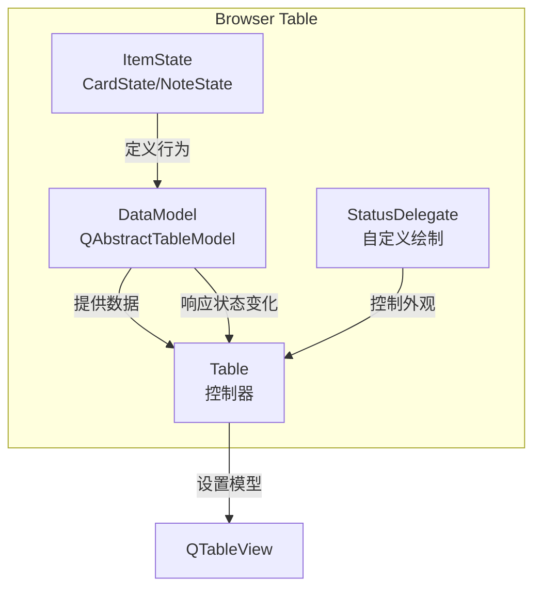
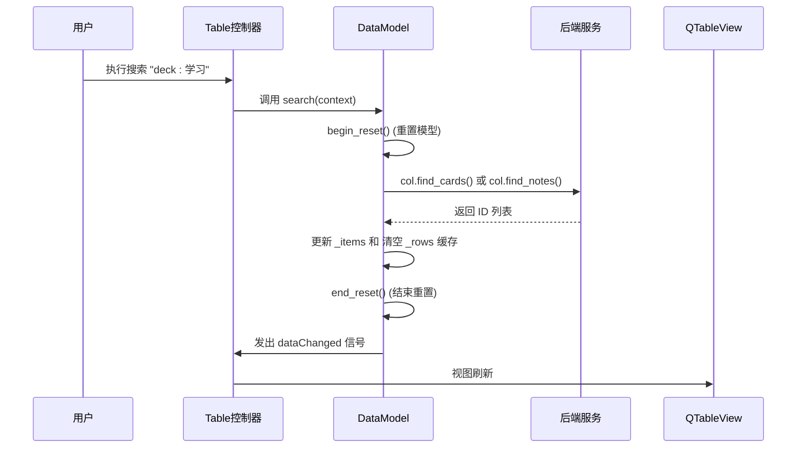
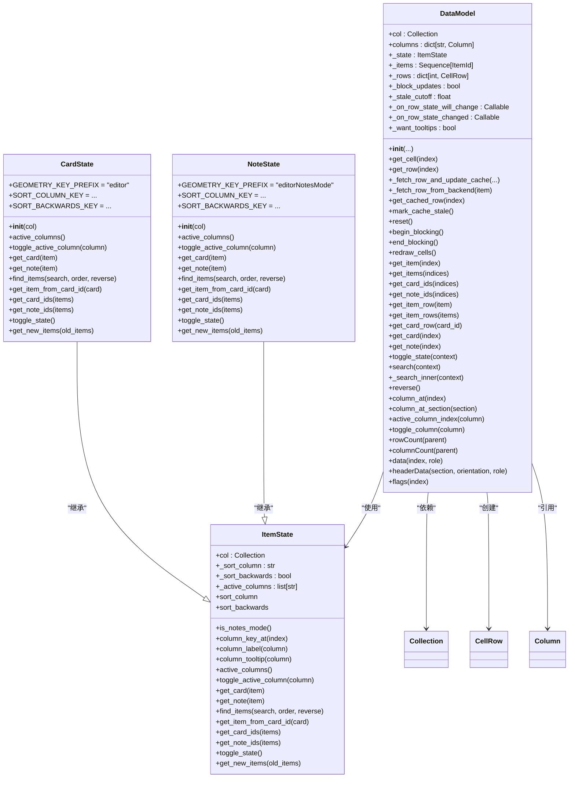

# 表格数据模型

<cite>
**本文档中引用的文件**   
- [model.py](file://qt/aqt/browser/table/model.py)
- [state.py](file://qt/aqt/browser/table/state.py)
- [table.py](file://qt/aqt/browser/table/table.py)
- [__init__.py](file://qt/aqt/browser/table/__init__.py)
</cite>

## 目录
1. [简介](#简介)
2. [项目结构](#项目结构)
3. [核心组件](#核心组件)
4. [架构概述](#架构概述)
5. [详细组件分析](#详细组件分析)
6. [依赖分析](#依赖分析)
7. [性能考虑](#性能考虑)
8. [故障排除指南](#故障排除指南)
9. [结论](#结论)

## 简介
本技术文档深入探讨了Anki应用中BrowserModel类（在代码中实现为DataModel）的核心机制。该模型作为QAbstractItemModel的实现，负责将后端笔记数据高效地映射到图形用户界面的表格视图中。文档详细阐述了其数据索引管理、角色系统支持和变更通知机制。此外，还分析了模型与后端服务的交互模式，包括异步数据获取和错误处理，并为开发者提供了优化数万行数据渲染性能的技巧。

## 项目结构
Anki的浏览器表格功能主要由`qt/aqt/browser/table/`目录下的模块构成。该结构遵循清晰的分层设计，将数据管理、状态逻辑和UI视图分离。



**图表来源**
- [model.py](file://qt/aqt/browser/table/model.py#L23-L364)
- [state.py](file://qt/aqt/browser/table/state.py#L17-L222)
- [table.py](file://qt/aqt/browser/table/table.py#L31-L666)

**章节来源**
- [model.py](file://qt/aqt/browser/table/model.py#L23-L364)
- [state.py](file://qt/aqt/browser/table/state.py#L17-L222)
- [table.py](file://qt/aqt/browser/table/table.py#L31-L666)

## 核心组件
`DataModel`类是浏览器表格的核心，它继承自`QAbstractTableModel`，负责管理表格中显示的数据。它通过`_items`列表存储当前搜索结果的卡片或笔记ID，并使用`_rows`字典缓存已获取的行数据以提高性能。`columns`字典包含了所有可用列的元数据，而`_state`对象（`CardState`或`NoteState`）则决定了模型当前是处于卡片模式还是笔记模式，从而影响数据的获取和显示方式。

**章节来源**
- [model.py](file://qt/aqt/browser/table/model.py#L23-L364)
- [state.py](file://qt/aqt/browser/table/state.py#L17-L222)

## 架构概述
整个浏览器表格的架构围绕`DataModel`、`Table`控制器和`QTableView`视图展开。`Table`类作为控制器，初始化`DataModel`并将其设置给`QTableView`。当用户执行搜索或切换模式时，`Table`会调用`DataModel`的方法，触发数据的重新加载和缓存的刷新。`DataModel`通过`data()`和`headerData()`等方法为视图提供数据，并通过`dataChanged`等信号通知视图进行更新。



**图表来源**
- [table.py](file://qt/aqt/browser/table/table.py#L187-L190)
- [model.py](file://qt/aqt/browser/table/model.py#L256-L261)
- [model.py](file://qt/aqt/browser/table/model.py#L139-L144)

## 详细组件分析

### DataModel 核心机制分析
`DataModel`的实现体现了Qt模型/视图架构的精髓，其核心在于高效的数据管理和变更通知。

#### 数据索引与缓存管理
模型通过`get_item()`和`get_row()`方法将`QModelIndex`映射到具体的数据。`get_row()`方法是性能的关键，它首先检查`_rows`缓存中是否存在该行。如果存在且未过期（通过`_stale_cutoff`时间戳判断），则直接返回；如果过期或不存在，则调用`_fetch_row_from_backend()`从后端获取数据，并更新缓存。这种延迟加载和缓存策略极大地减少了对数据库的频繁访问。

```mermaid
flowchart TD
Start([get_row(index)]) --> GetItem["item = get_item(index)"]
GetItem --> CheckCache["检查 _rows[item] 是否存在"]
CheckCache --> |存在| CheckStaleness["检查是否过期 (is_stale)"]
CheckStaleness --> |未过期| ReturnRow["返回缓存行"]
CheckStaleness --> |已过期| Fetch["调用 _fetch_row_and_update_cache"]
CheckCache --> |不存在| CheckBlocking["检查 _block_updates"]
CheckBlocking --> |True| ReturnPlaceholder["返回占位符行"]
CheckBlocking --> |False| Fetch
Fetch --> End([返回新行])
```

**图表来源**
- [model.py](file://qt/aqt/browser/table/model.py#L67-L79)
- [model.py](file://qt/aqt/browser/table/model.py#L81-L100)
- [model.py](file://qt/aqt/browser/table/model.py#L132-L133)

#### 角色系统与数据提供
`data()`方法是模型与视图通信的核心。它根据传入的`role`参数返回不同类型的数据：
- `DisplayRole`: 返回单元格的文本内容。
- `FontRole`: 返回单元格的字体（如果列配置允许）。
- `ToolTipRole`: 返回单元格的工具提示。
- `TextAlignmentRole`: 返回单元格的对齐方式。

这种角色系统使得同一个模型可以为视图提供丰富的信息，而无需创建多个数据源。

**章节来源**
- [model.py](file://qt/aqt/browser/table/model.py#L327-L347)

#### 变更通知机制
模型通过Qt的信号槽机制通知视图数据已更改。`beginResetModel()`和`endResetModel()`用于在数据结构发生根本性变化（如搜索、切换模式）时重置整个视图。`dataChanged`信号则用于通知视图特定范围内的数据已更新，例如在调用`redraw_cells()`时，会发出从第一行第一列到最后一行最后一列的`dataChanged`信号，从而刷新所有单元格的显示。

**章节来源**
- [model.py](file://qt/aqt/browser/table/model.py#L139-L144)
- [model.py](file://qt/aqt/browser/table/model.py#L155-L161)

### 状态管理与模式切换
`ItemState`及其子类`CardState`和`NoteState`负责管理模型的当前状态。它们决定了：
- **数据源**：`find_items()`方法调用`col.find_cards()`还是`col.find_notes()`。
- **列配置**：`active_columns`属性存储了用户在当前模式下启用的列。
- **排序设置**：`sort_column`和`sort_backwards`属性管理排序状态。

`toggle_state()`方法是模式切换的核心，它会创建一个相反状态的新实例，并触发模型的重置和重新搜索。

**章节来源**
- [state.py](file://qt/aqt/browser/table/state.py#L17-L126)
- [model.py](file://qt/aqt/browser/table/model.py#L241-L252)

### 自定义数据格式化与虚拟列
模型通过`StatusDelegate`类实现了自定义的单元格绘制。`paint()`方法可以访问`DataModel`，从而根据行数据（如`row.color`）来修改绘制选项（如背景色），实现了超越标准Qt样式的视觉效果。对于虚拟列（由插件添加），模型使用`addon_column_fillin()`函数动态创建一个带有通用标签的`Column`对象，确保了系统的可扩展性。

**章节来源**
- [table.py](file://qt/aqt/browser/table/table.py#L667-L672)
- [model.py](file://qt/aqt/browser/table/model.py#L365-L374)

## 依赖分析
`DataModel`的依赖关系清晰地展示了其在系统中的位置。



**图表来源**
- [model.py](file://qt/aqt/browser/table/model.py#L23-L364)
- [state.py](file://qt/aqt/browser/table/state.py#L17-L222)

## 性能考虑
为了优化性能，特别是处理大量数据时，该模型采用了多种策略：
1.  **缓存 (`_rows`)**：避免重复从后端获取相同行的数据。
2.  **延迟加载**：只有在视图需要显示某一行时才去获取其数据。
3.  **批量更新**：使用`beginResetModel()`/`endResetModel()`进行大规模变更，而不是逐个发送信号。
4.  **选择优化**：`Table`类中的`len_selection()`方法通过缓存选择数量来避免在大选区时调用缓慢的Qt方法。
5.  **阻塞更新 (`_block_updates`)**：在执行可能耗时的后端操作时，阻止模型刷新，防止UI卡顿。

## 故障排除指南
- **数据未更新**：检查是否调用了`mark_cache_stale()`或`reset()`来刷新缓存。
- **视图卡顿**：检查`_block_updates`标志是否被正确设置和清除，确保在长时间操作期间UI不会尝试刷新。
- **列显示错误**：确认`active_columns`列表是否正确，并检查`toggle_column()`方法的调用。
- **模式切换失败**：检查`toggle_state()`方法中的异常处理，确保在搜索失败时能正确回滚状态。

**章节来源**
- [model.py](file://qt/aqt/browser/table/model.py#L132-L133)
- [model.py](file://qt/aqt/browser/table/model.py#L148-L153)
- [table.py](file://qt/aqt/browser/table/table.py#L166-L172)

## 结论
`DataModel`类是一个设计精良的Qt模型实现，它通过结合缓存、延迟加载和高效的变更通知机制，成功地将复杂的后端笔记数据映射到一个响应迅速的表格视图中。其与`ItemState`模式的解耦设计，使得代码既灵活又易于维护。对于开发者而言，理解其核心机制——特别是`get_row()`的缓存逻辑和`data()`的角色系统——是进行有效开发和性能优化的关键。该模型为处理数万行数据提供了坚实的基础，是Anki应用中一个关键的高性能组件。