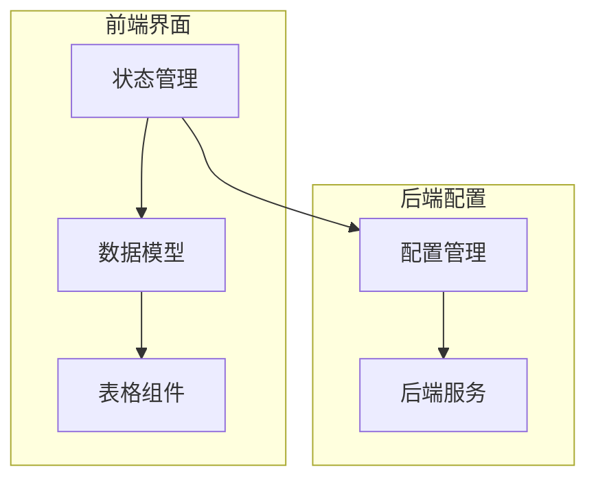
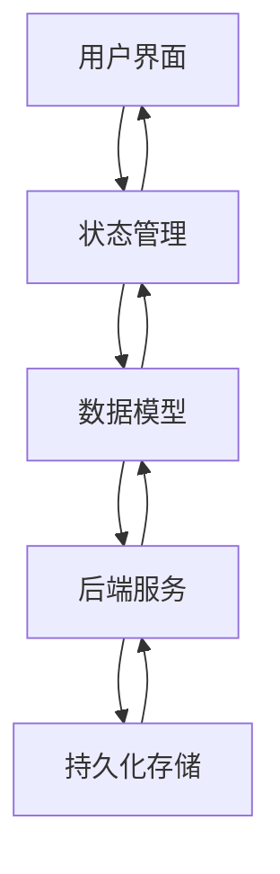

# 表格状态管理

<cite>
**本文档中引用的文件**  
- [state.py](file://qt/aqt/browser/table/state.py)
- [table.py](file://qt/aqt/browser/table/table.py)
- [model.py](file://qt/aqt/browser/table/model.py)
- [config.py](file://pylib/anki/config.py)
- [bool.rs](file://rslib/src/config/bool.rs)
- [mod.rs](file://rslib/src/config/mod.rs)
- [backend/config.rs](file://rslib/src/backend/config.rs)
</cite>

## 目录
1. [简介](#简介)
2. [项目结构](#项目结构)
3. [核心组件](#核心组件)
4. [架构概述](#架构概述)
5. [详细组件分析](#详细组件分析)
6. [依赖分析](#依赖分析)
7. [性能考虑](#性能考虑)
8. [故障排除指南](#故障排除指南)
9. [结论](#结论)

## 简介
本文档深入解析Anki应用程序中表格状态持久化系统的实现机制。系统通过State类保存和恢复表格的列顺序、列宽、可见性状态和筛选条件，确保用户在不同会话间保持一致的浏览体验。状态序列化机制采用JSON格式设计，并通过版本兼容性处理确保向后兼容。状态与用户配置文件深度集成，实现跨会话持久化。文档还详细说明了状态变更监听和同步的API使用示例，探讨了状态管理的最佳实践，包括性能优化和错误恢复策略。

## 项目结构
表格状态管理系统主要由前端界面组件和后端配置管理两大部分构成。前端组件负责用户界面的状态展示和交互，后端组件负责状态的持久化存储和检索。



**图表来源**  
- [state.py](file://qt/aqt/browser/table/state.py#L1-L223)
- [table.py](file://qt/aqt/browser/table/table.py#L1-L687)

**章节来源**  
- [state.py](file://qt/aqt/browser/table/state.py#L1-L223)
- [table.py](file://qt/aqt/browser/table/table.py#L1-L687)

## 核心组件
表格状态管理系统的核心组件包括状态类（State）、数据模型（DataModel）和配置管理器（ConfigManager）。状态类负责管理表格的列顺序、排序方式和显示模式，数据模型负责将后端数据映射到前端界面，配置管理器负责与持久化存储的交互。

**章节来源**  
- [state.py](file://qt/aqt/browser/table/state.py#L1-L223)
- [model.py](file://qt/aqt/browser/table/model.py#L1-L380)
- [config.py](file://pylib/anki/config.py#L1-L134)

## 架构概述
系统采用分层架构设计，前端界面与后端服务通过清晰的接口进行通信。状态管理在前端和后端之间建立桥梁，确保用户界面状态与持久化配置的一致性。



**图表来源**  
- [state.py](file://qt/aqt/browser/table/state.py#L1-L223)
- [table.py](file://qt/aqt/browser/table/table.py#L1-L687)
- [backend/config.rs](file://rslib/src/backend/config.rs#L1-L141)

## 详细组件分析

### 状态管理分析
状态管理组件是表格持久化系统的核心，负责维护表格的显示状态和用户偏好设置。

#### 状态类设计
```mermaid
classDiagram
    class ItemState {
        +str GEOMETRY_KEY_PREFIX
        +str SORT_COLUMN_KEY
        +str SORT_BACKWARDS_KEY
        +Collection col
        +bool is_notes_mode()
        +list[str] active_columns
        +void toggle_active_column(str column)
        +str sort_column
        +bool sort_backwards
        +Card get_card(ItemId item)
        +Note get_note(ItemId item)
        +Sequence[ItemId] find_items(str search, bool