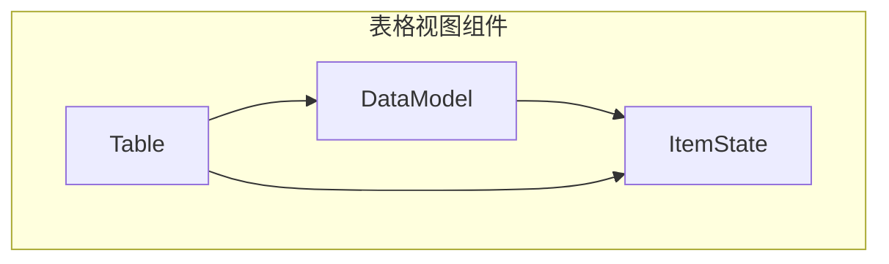
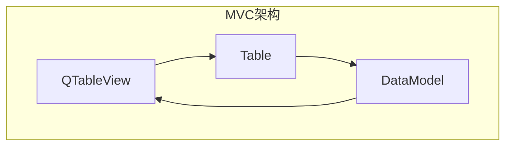
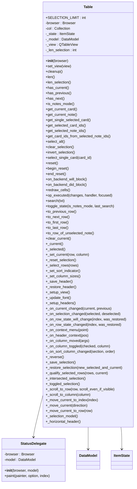
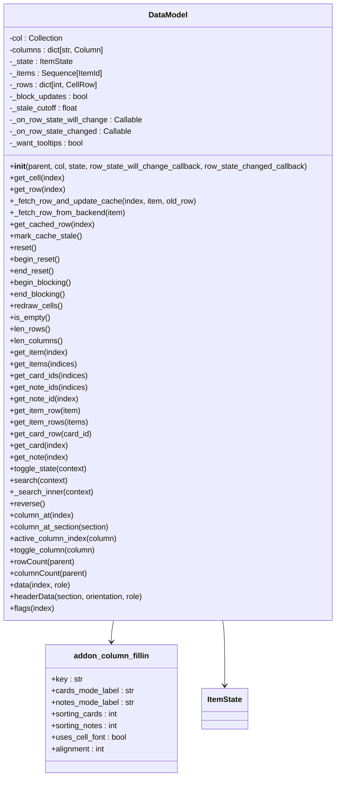
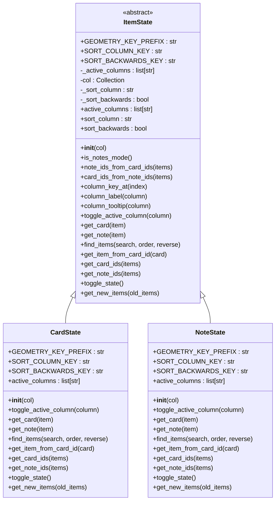
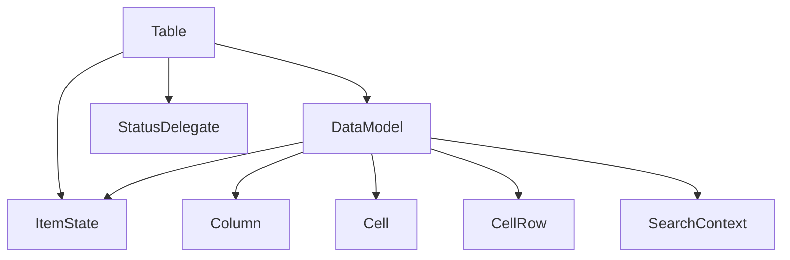

# 表格视图实现

<cite>
**本文档中引用的文件**  
- [table.py](file://qt/aqt/browser/table/table.py)
- [model.py](file://qt/aqt/browser/table/model.py)
- [state.py](file://qt/aqt/browser/table/state.py)
</cite>

## 目录
1. [简介](#简介)
2. [项目结构](#项目结构)
3. [核心组件](#核心组件)
4. [架构概述](#架构概述)
5. [详细组件分析](#详细组件分析)
6. [依赖分析](#依赖分析)
7. [性能考虑](#性能考虑)
8. [故障排除指南](#故障排除指南)
9. [结论](#结论)

## 简介
本文档深入解析Anki浏览器表格视图的实现机制，重点分析`table.py`中的`AnkiTableView`类、`model.py`中的`BrowserModel`Qt抽象模型实现，以及`state.py`中的表格状态持久化机制。文档涵盖自定义排序、列宽管理、行高计算、选择模式等核心功能，并提供大规模数据渲染的性能优化策略。

## 项目结构
Anki浏览器表格视图的实现主要位于`qt/aqt/browser/table`目录下，包含三个核心文件：`table.py`、`model.py`和`state.py`，分别负责视图控制、数据模型和状态管理。

**图表来源**  
- [table.py](file://qt/aqt/browser/table/table.py)
- [model.py](file://qt/aqt/browser/table/model.py)
- [state.py](file://qt/aqt/browser/table/state.py)

## 核心组件
表格视图的核心组件包括`Table`类（视图控制器）、`DataModel`类（数据模型）和`ItemState`类（状态管理器），它们共同实现了浏览器表格的完整功能。

**章节来源**  
- [table.py](file://qt/aqt/browser/table/table.py#L1-L50)
- [model.py](file://qt/aqt/browser/table/model.py#L1-L50)
- [state.py](file://qt/aqt/browser/table/state.py#L1-L50)

## 架构概述
Anki浏览器表格视图采用经典的MVC（Model-View-Controller）架构模式，其中`DataModel`作为模型层，`Table`作为控制器，而Qt的`QTableView`作为视图层。

**图表来源**  
- [table.py](file://qt/aqt/browser/table/table.py#L1-L20)
- [model.py](file://qt/aqt/browser/table/model.py#L1-L20)

## 详细组件分析

### Table类分析
`Table`类是浏览器表格的主控制器，负责管理视图、处理用户交互和协调数据模型。

#### 类图

**图表来源**  
- [table.py](file://qt/aqt/browser/table/table.py#L1-L688)

**章节来源**  
- [table.py](file://qt/aqt/browser/table/table.py#L1-L688)

### DataModel类分析
`DataModel`类是表格视图的数据模型，继承自`QAbstractTableModel`，负责管理表格数据的获取、缓存和更新。

#### 类图

**图表来源**  
- [model.py](file://qt/aqt/browser/table/model.py#L1-L381)

**章节来源**  
- [model.py](file://qt/aqt/browser/table/model.py#L1-L381)

### ItemState类分析
`ItemState`类是表格状态的抽象基类，定义了卡片模式和笔记模式之间的状态切换和数据映射。

#### 类图

**图表来源**  
- [state.py](file://qt/aqt/browser/table/state.py#L1-L224)

**章节来源**  
- [state.py](file://qt/aqt/browser/table/state.py#L1-L224)

## 依赖分析
表格视图组件之间存在紧密的依赖关系，`Table`类依赖`DataModel`和`ItemState`，而`DataModel`又依赖`ItemState`。

**图表来源**  
- [table.py](file://qt/aqt/browser/table/table.py)
- [model.py](file://qt/aqt/browser/table/model.py)
- [state.py](file://qt/aqt/browser/table/state.py)

**章节来源**  
- [table.py](file://qt/aqt/browser/table/table.py#L1-L688)
- [model.py](file://qt/aqt/browser/table/model.py#L1-L381)
- [state.py](file://qt/aqt/browser/table/state.py#L1-L224)

## 性能考虑
表格视图在处理大规模数据时采用了多种性能优化策略，包括数据缓存、增量更新和选择计数优化。

### 数据缓存机制
`DataModel`类通过`_rows`字典缓存已获取的行数据，避免重复查询数据库。当后端数据可能发生变化时，通过`mark_cache_stale()`方法标记缓存过期。

### 选择计数优化
对于大规模选择，`len_selection()`方法通过维护`_len_selection`变量来避免调用`QItemSelectionModel.selectedRows()`，后者在大规模选择时性能较差。

### 增量更新
当后端操作可能影响表格数据时，`op_executed()`方法会调用`mark_cache_stale()`标记缓存过期，并在必要时触发`redraw_cells()`进行增量更新。

**章节来源**  
- [model.py](file://qt/aqt/browser/table/model.py#L1-L381)
- [table.py](file://qt/aqt/browser/table/table.py#L1-L688)

## 故障排除指南
### 常见问题
1. **表格数据未更新**：检查是否调用了`op_executed()`方法，确保`mark_cache_stale()`被正确调用。
2. **列宽设置不保存**：检查`_save_header()`和`_restore_header()`方法是否正常工作。
3. **排序指示器不显示**：检查`_set_sort_indicator()`方法中的逻辑是否正确。

### 调试技巧
1. 使用`gui_hooks`调试钩子监控数据获取过程。
2. 检查`_block_updates`标志的状态，确保在后端阻塞时正确处理。
3. 验证`_stale_cutoff`时间戳是否正确更新。

**章节来源**  
- [table.py](file://qt/aqt/browser/table/table.py#L1-L688)
- [model.py](file://qt/aqt/browser/table/model.py#L1-L381)

## 结论
Anki浏览器表格视图通过精心设计的MVC架构实现了高效的数据展示和交互功能。`Table`、`DataModel`和`ItemState`三个核心组件各司其职，通过清晰的接口和依赖关系协同工作。系统采用了多种性能优化策略，确保在处理大规模数据时仍能保持良好的响应速度。状态持久化机制使得用户自定义的列设置、排序方式等能够跨会话保存，提升了用户体验。