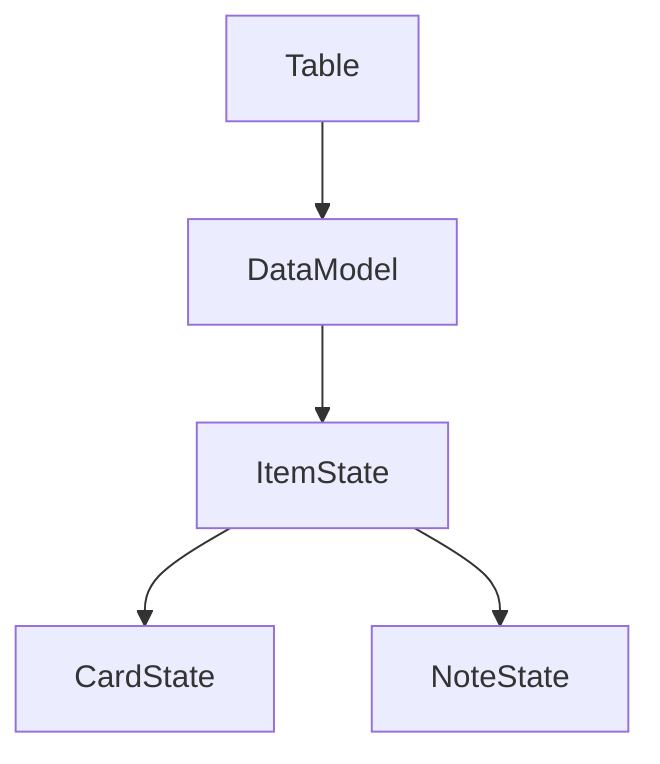
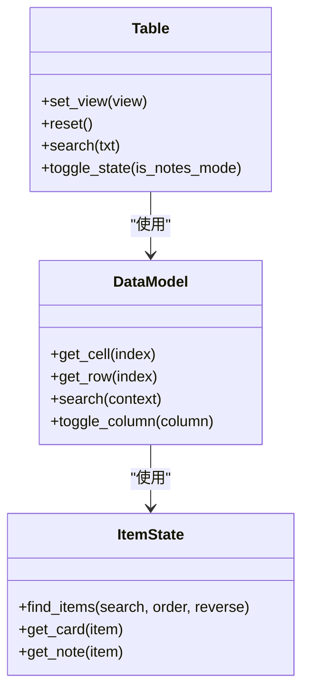
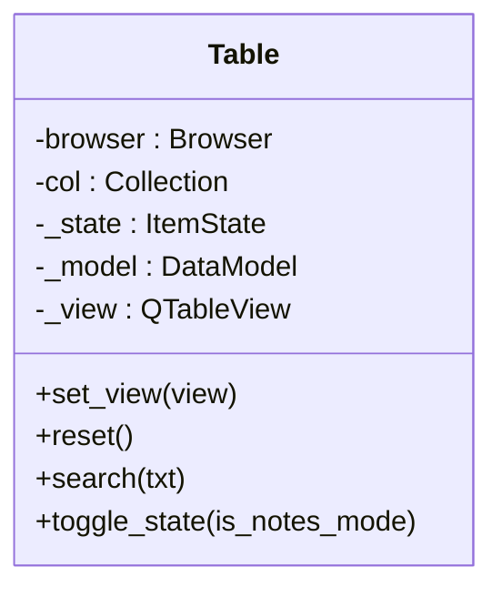
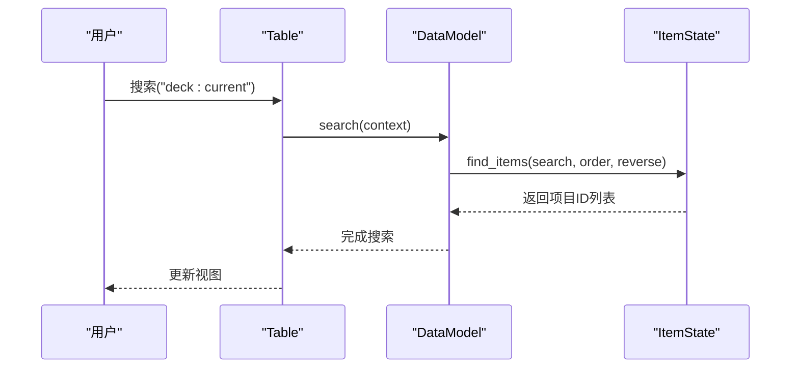
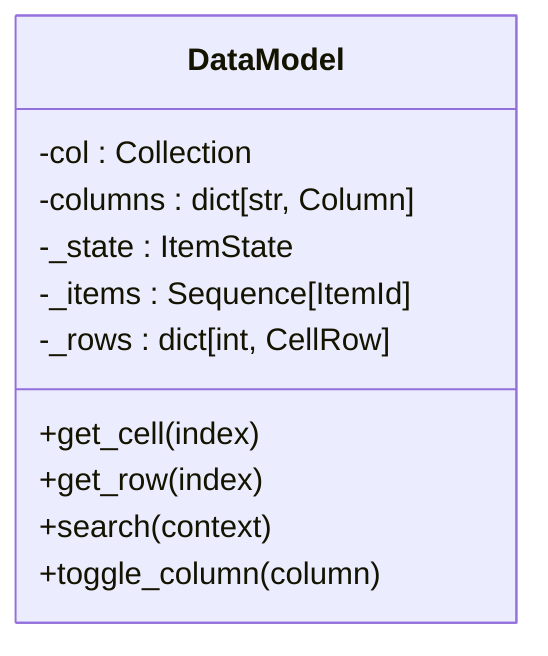
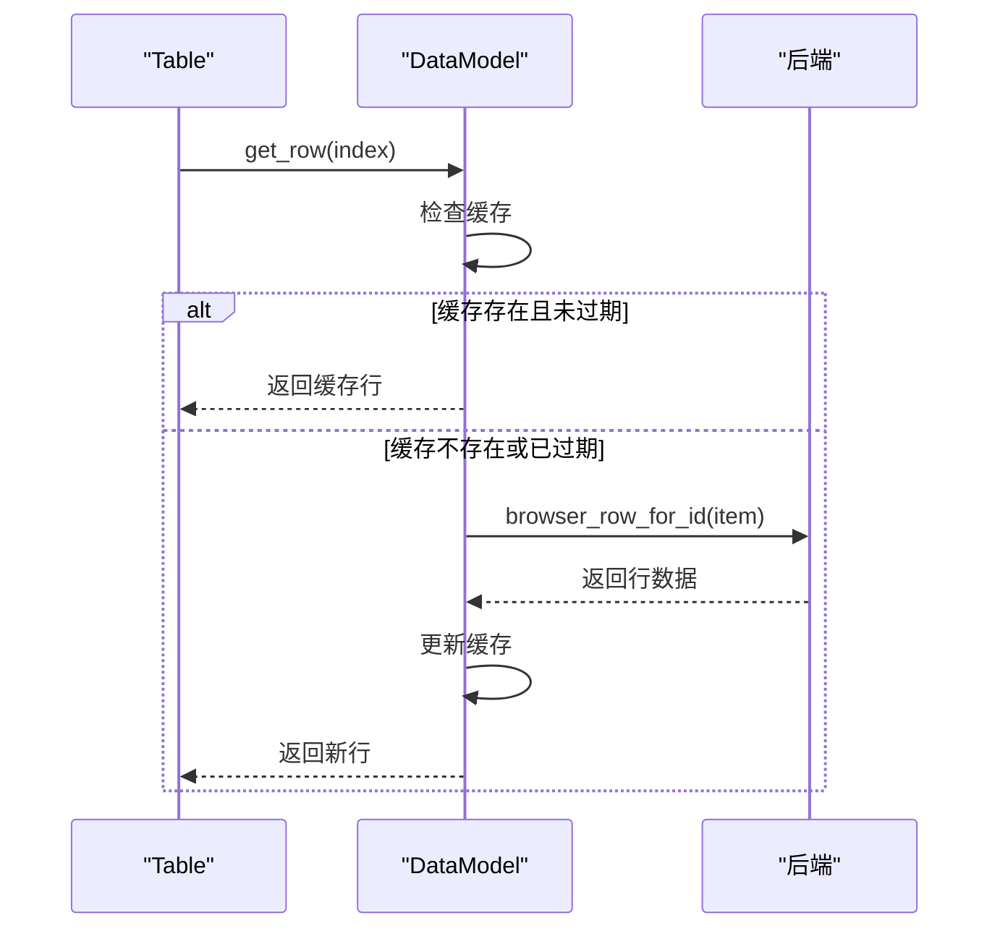
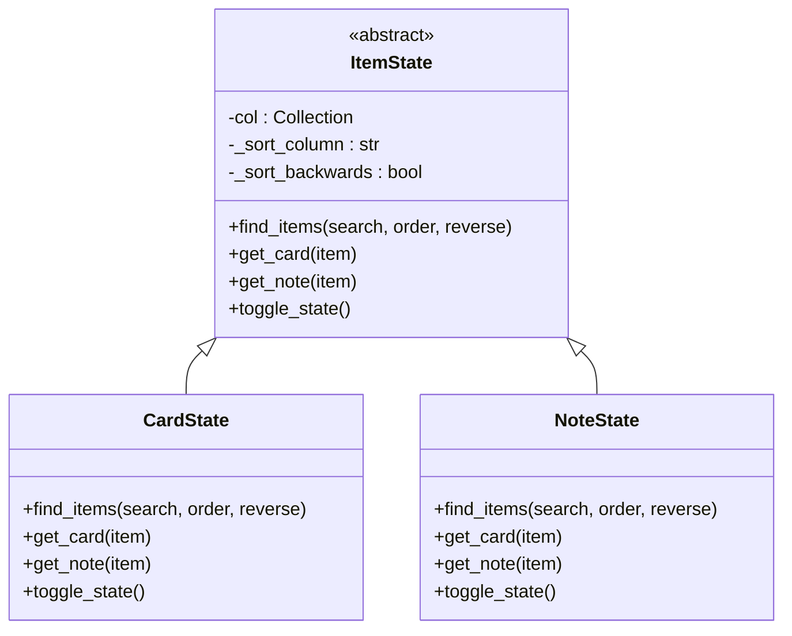
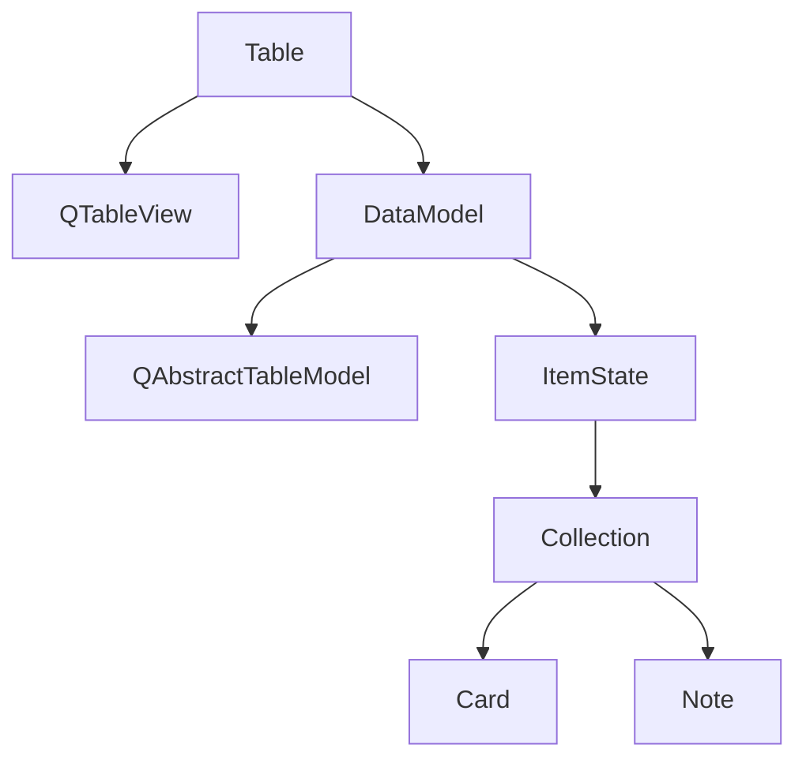

# 表格视图组件

<cite>
**本文档中引用的文件**  
- [table.py](file://qt/aqt/browser/table/table.py)
- [model.py](file://qt/aqt/browser/table/model.py)
- [state.py](file://qt/aqt/browser/table/state.py)
</cite>

## 目录
1. [简介](#简介)
2. [项目结构](#项目结构)
3. [核心组件](#核心组件)
4. [架构概述](#架构概述)
5. [详细组件分析](#详细组件分析)
6. [依赖分析](#依赖分析)
7. [性能考虑](#性能考虑)
8. [故障排除指南](#故障排除指南)
9. [结论](#结论)

## 简介
AnkiTableView 类是 Anki 应用程序中用于显示卡片和笔记数据的核心表格组件。该组件基于 Qt 的 QTableView 实现，提供了丰富的功能，包括自定义排序、列宽自适应、行高计算和选择模式配置。本文档深入解析了该组件的实现细节，包括键盘导航、鼠标交互和上下文菜单的事件处理流程。同时，文档还提供了性能优化策略和扩展功能的示例。

## 项目结构
AnkiTableView 组件位于 qt/aqt/browser/table 目录下，由三个主要文件组成：table.py、model.py 和 state.py。这些文件共同实现了表格视图的功能。

**Diagram sources**
- [table.py](file://qt/aqt/browser/table/table.py)
- [model.py](file://qt/aqt/browser/table/model.py)
- [state.py](file://qt/aqt/browser/table/state.py)

**Section sources**
- [table.py](file://qt/aqt/browser/table/table.py)
- [model.py](file://qt/aqt/browser/table/model.py)
- [state.py](file://qt/aqt/browser/table/state.py)

## 核心组件
AnkiTableView 组件的核心由 Table、DataModel 和 ItemState 三个类组成。Table 类负责管理视图和用户交互，DataModel 类负责数据管理和缓存，ItemState 类负责状态管理和数据查找。

**Section sources**
- [table.py](file://qt/aqt/browser/table/table.py#L31-L687)
- [model.py](file://qt/aqt/browser/table/model.py#L23-L364)
- [state.py](file://qt/aqt/browser/table/state.py#L15-L223)

## 架构概述
AnkiTableView 组件采用 MVC（Model-View-Controller）架构模式。Table 类作为控制器，负责协调视图和模型之间的交互。DataModel 类作为模型，负责从后端获取数据并提供给视图。ItemState 类作为状态管理器，负责管理当前是卡片模式还是笔记模式。

**Diagram sources**
- [table.py](file://qt/aqt/browser/table/table.py#L31-L687)
- [model.py](file://qt/aqt/browser/table/model.py#L23-L364)
- [state.py](file://qt/aqt/browser/table/state.py#L15-L223)

## 详细组件分析

### Table 类分析
Table 类是 AnkiTableView 组件的主要控制器，负责管理视图和用户交互。它提供了搜索、排序、选择和状态切换等功能。

#### 类图

**Diagram sources**
- [table.py](file://qt/aqt/browser/table/table.py#L31-L687)

#### 序列图

**Diagram sources**
- [table.py](file://qt/aqt/browser/table/table.py#L31-L687)
- [model.py](file://qt/aqt/browser/table/model.py#L23-L364)
- [state.py](file://qt/aqt/browser/table/state.py#L15-L223)

**Section sources**
- [table.py](file://qt/aqt/browser/table/table.py#L31-L687)

### DataModel 类分析
DataModel 类是 AnkiTableView 组件的数据模型，负责从后端获取数据并提供给视图。它实现了数据缓存和状态管理功能。

#### 类图

**Diagram sources**
- [model.py](file://qt/aqt/browser/table/model.py#L23-L364)

#### 序列图

**Diagram sources**
- [model.py](file://qt/aqt/browser/table/model.py#L23-L364)

**Section sources**
- [model.py](file://qt/aqt/browser/table/model.py#L23-L364)

### ItemState 类分析
ItemState 类是 AnkiTableView 组件的状态管理器，负责管理当前是卡片模式还是笔记模式。它提供了在两种模式之间切换的功能。

#### 类图

**Diagram sources**
- [state.py](file://qt/aqt/browser/table/state.py#L15-L223)

**Section sources**
- [state.py](file://qt/aqt/browser/table/state.py#L15-L223)

## 依赖分析
AnkiTableView 组件依赖于多个外部模块和类，包括 Qt 的 QTableView、QAbstractTableModel 和 QItemSelectionModel，以及 Anki 的 Collection、Card 和 Note 类。

**Diagram sources**
- [table.py](file://qt/aqt/browser/table/table.py)
- [model.py](file://qt/aqt/browser/table/model.py)
- [state.py](file://qt/aqt/browser/table/state.py)

**Section sources**
- [table.py](file://qt/aqt/browser/table/table.py)
- [model.py](file://qt/aqt/browser/table/model.py)
- [state.py](file://qt/aqt/browser/table/state.py)

## 性能考虑
AnkiTableView 组件采用了多种性能优化策略，包括数据缓存、批量更新和延迟加载。DataModel 类使用 _rows 字典缓存已获取的行数据，避免重复查询数据库。Table 类使用 _len_selection 变量缓存选择数量，避免频繁调用 Qt 的 selectionModel().selectedRows() 方法。

## 故障排除指南
当 AnkiTableView 组件出现问题时，可以检查以下几个方面：
1. 确认后端服务是否正常运行
2. 检查数据库连接是否正常
3. 验证配置文件中的排序列是否有效
4. 确认用户权限是否足够

**Section sources**
- [table.py](file://qt/aqt/browser/table/table.py)
- [model.py](file://qt/aqt/browser/table/model.py)
- [state.py](file://qt/aqt/browser/table/state.py)

## 结论
AnkiTableView 组件是一个功能丰富、性能优良的表格视图组件。它采用 MVC 架构模式，将视图、模型和控制器分离，提高了代码的可维护性和可扩展性。通过数据缓存和批量更新等优化策略，该组件能够高效地处理大量数据。未来可以考虑增加更多自定义列类型和单元格渲染器，以满足用户的个性化需求。